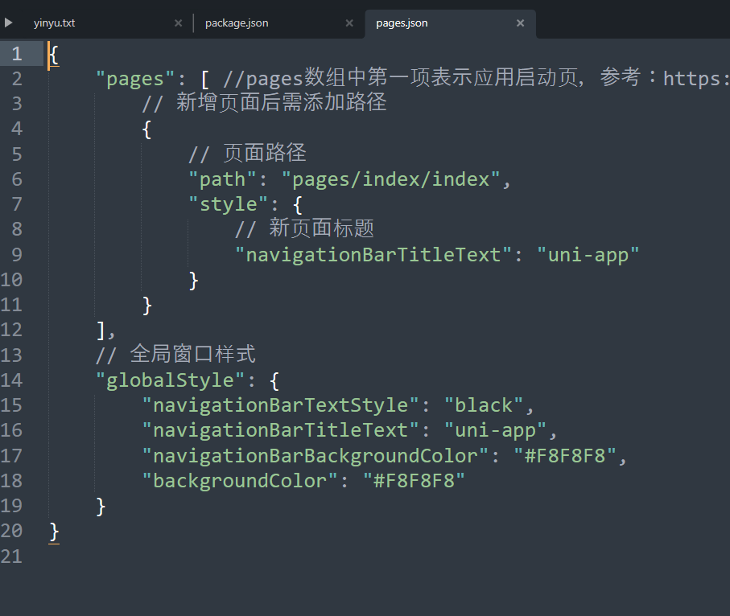
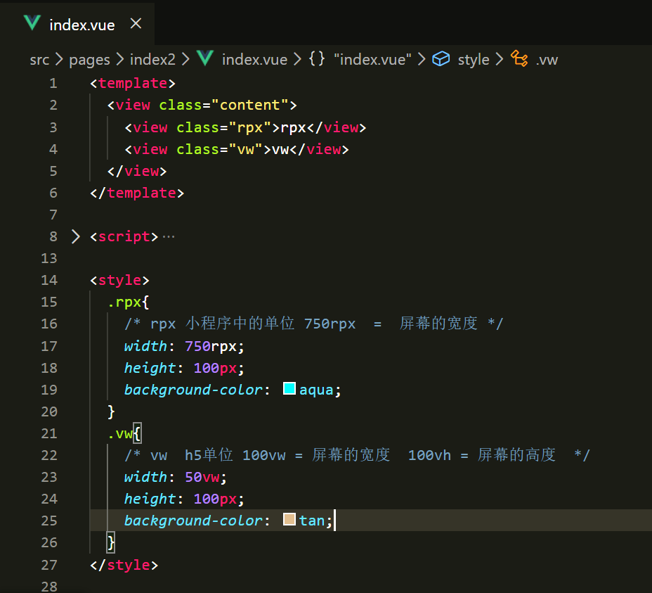

### 微信小程序一些常用标签与html的对应关系

| HTML                                                         | 微信小程序                                                   |
| ------------------------------------------------------------ | ------------------------------------------------------------ |
| `

`                                                | `<view></view>`                                              |
| `<h1></h1>...<h6></h6>` `

`               | `<view></view>`                                              |
| `<i class="icon">`                                           | `<icon></icon>`                                              |
| `<iput type="text">` `<iput type="checkbox">` `<iput type="radio">` `<iput type="file">` | `<input/>` `<checkbox/>` `<radio/>` `<view bindtab="chooseImage">` |
| ``                                           | `<navigator url="#" redirect></navigator >`                  |
| ``                                               | `<image src="" ></image >`                                   |

## 指令

>   -   **安装sass**
>       -   npm install sass-loader node-sass
>   -   **通过 CLI 创建 uni-app 项目**
>       -   vue create -p dcloudio/uni-preset-vue [ 项目名称 ]
>   -   

## 项目结构介绍

### 1、目录

>   static：存放静态文件，不会读取样式文件

### 2、App.vue文件

### 3、pages.josn文件

>   pages参数中：谁放在最前面谁就是首页

### 4、

### 5、

### 7、组件参数传递

