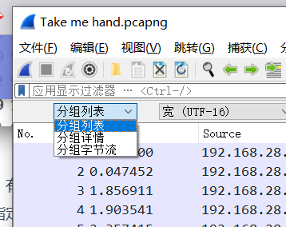

## 一些编码

### tapcode

- **敲击码，记录键盘输入的位置字符**
- 可通过网站反查字母：http://www.hiencode.com/tapcode.html


## 流量分析

### ==数据包筛选==

#### 筛选源ip

```nginx

ip.src == 源ip地址

# 或者
选中【Internet Protocol Version4】 列表中的 【Source】字段
右键【作为过滤器应用】-> 【选中】
```


#### 筛选目标ip

```nginx
ip.dst == 目的ip地址

# 或者
选中一个源IP是筛选条件的数据包，找到【Internet Protocol Version 4】下的【Destination】字段
右击Destination字段，再选择【作为过滤器应用】 –> 【选中】
```

#### mac地址筛选

```nginx
eth.dst ==A0:00:00:04:C5:84 	# 筛选【目标】mac地址

eth.addr==A0:00:00:04:C5:84 	# 筛选MAC地址
```

#### 端口筛选

```nginx
tcp.dstport == 80  	# 筛选tcp协议的【目标】端口为80的流量包

tcp.srcport == 80  	# 筛选tcp协议的【源】端口为80的流量包

udp.srcport == 80  	# 筛选udp协议的【源】端口为80的流量包
```

#### 协议筛选

```nginx
tcp  											# 筛选协议为tcp的流量包

udp 											# 筛选协议为udp的流量包

arp/icmp/http/ftp/dns/ip  # 筛选协议为arp/icmp/http/ftp/dns/ip的流量包
```

#### 包长度筛选

```nginx
udp.length ==20   	# 筛选长度为20的udp流量包

tcp.len >=20  			# 筛选长度大于20的tcp流量包

ip.len ==20  				# 筛选长度为20的IP流量包

frame.len ==20 			# 筛选长度为20的整个流量包
```

#### http请求筛选

```nginx
请求方法为GET：http.request.method=="GET"        # 筛选HTTP请求方法为GET的 流量包

请求方法为POST：http.request.method=="POST"      # 筛选HTTP请求方法为POST的流量包

指定URI：http.request.uri=="/img/logo-edu.gif"  # 筛选HTTP请求的URL为/img/logo-edu.gif的流量包

请求或相应中包含特定内容：http contains "FLAG"    	# 筛选HTTP内容为/FLAG的流量包

```


### ==数据包搜索==

#### 关键字搜索

>  **在wireshark界面按`Ctrl+F`，可以进行关键字搜索：**
>
> - **Wireshark的搜索功能支持正则表达式、字符串、十六进制等方式进行搜索**，
> - **通常**情况下**直接使用字符串方式**进行搜索。


> **搜索栏的左边下拉，有分组列表、分组详情、分组字节流三个选项，**
>
> **分别对应wireshark界面的三个部分，搜索时选择不同的选项以指定搜索区域**




### 数据包还原

> 在wireshark中，存在一个**追踪流**的功能，
>
> 可以将HTTP或TCP流量集合在一起并还原成原始数据，具体操作方式如下：
>
> **选中想要还原的流量包，右键选中，选择追踪流 – TCP流/UPD流/SSL流/HTTP流**


> **可在弹出的窗口中看到被还原的流量信息**


### 数据提取

> - Wireshark支持提取通过http传输（上传/下载）的文件内容，方法如下：
> - **自动提取通过http传输的文件内容**
> - **文件->导出对象->HTTP**


> 在打开的对象列表中找到有价值的文件，
>
> 如**压缩文件、文本文件、音频文件、图片**等，点击`Save`进行保存，
>
> 或者`Save All`保存所有对象再进入文件夹进行分析。


#### **手动提取通过http传输的文件内容**

- 选中http文件传输流量包，
- 在分组详情中找到`data`,`Line-based text`, `JPEG File Interchange Format`, `data:text/html`层，
- **鼠标右键点击 – 选中 导出分组字节流。**
  


> 如果是菜刀下载文件的流量，需要删除分组字节流前开头和结尾的X@Y字符，
>
> 否则下载的文件会出错。
>
> **鼠标右键点击 – 选中 显示分组字节**


> **在弹出的窗口中设置开始和结束的字节（原字节数开头加3，结尾减3）**


## 流量分析经典题型

- CTF题型主要分为
  - 流量包修复、
  - 数据提取、
  - WEB流量包分析、
  - USB流量包分析、
  - 无线密码破解
  - 工控流量包分析。


## 常见隐写总结

https://3gstudent.github.io/%E9%9A%90%E5%86%99%E6%8A%80%E5%B7%A7-%E5%88%A9%E7%94%A8PNG%E6%96%87%E4%BB%B6%E6%A0%BC%E5%BC%8F%E9%9A%90%E8%97%8FPayload

### 常见文件头hex

https://blog.csdn.net/weixin_44604541/article/details/110082054

####图片

```nginx
JPEG
  文件头：FF D8 FF　　　　　
  文件尾：FF D9

PNG
  文件头：89 50 4E 47 0D 0A 1A 0A　　　　
  文件尾：AE 42 60 82

ico
  文件头：00 00 01 00

GIF
  文件头：47 49 46 38 39(37) 61　　　　
  文件尾：00 3B

Adobe Photoshop (psd)
  文件头：38 42 50 53

TGA
  未压缩的前4字节： 00 00 02 00
  RLE压缩的前5字节: 00 00 10 00 00

BMP
  文件头：42 4D
  文件头标识(2 bytes) 42(B) 4D(M)

TIFF (tif)
  文件头：49 49 2A 00
```

#### office文件

```nginx
MS Word/Excel (xls.or.doc)
  文件头：D0 CF 11 E0

MS Access (mdb)
  文件头：53 74 61 6E 64 61 72 64 20 4A

WordPerfect (wpd)
  文件头：FF 57 50 43

Adobe Acrobat (pdf)
  文件头：25 50 44 46 2D 31 2E

application/vnd.visio(vsd)
  文件头：D0 CF 11 E0 A1 B1 1A E1

Email [thorough only] (eml)
  文件头：44 65 6C 69 76 65 72 79 2D 64 61 74 65 3A

Outlook Express (dbx)
  文件头：CF AD 12 FE C5 FD 74 6F

Outlook (pst)
  文件头：21 42 44 4E

Rich Text Format (rtf)
  文件头：7B 5C 72 74 66

txt 文件(txt)
  文件头：Unicode：FE FF / Unicode big endian：FF FE / UTF-8：EF BB BF /ANSI编码是没有文件头的

```

#### 压缩包文件

```nginx
ZIP Archive (zip)
  文件头：50 4B 03 04
  文件尾：50 4B

RAR Archive (rar)
  文件头：52 61 72 21
```

#### 音频文件

```nginx
Wave (wav)
  文件头：57 41 56 45

audio(Audio)
  文件头： 4D 54 68 64

audio/x-aac（aac）
  文件头：FF F1(9)
```

#### 视频文件

```nginx
AVI (avi)
  文件头：41 56 49 20

Real Audio (ram)
  文件头：2E 72 61 FD

Real Media (rm)
  文件头：2E 52 4D 46

MPEG (mpg)
  文件头：00 00 01 BA(3)

Quicktime (mov)
  文件头：6D 6F 6F 76

Windows Media (asf)
  文件头：30 26 B2 75 8E 66 CF 11

MIDI (mid)
  文件头：4D 54 68 64
```

#### 代码文件

```nginx
XML (xml)
  文件头：3C 3F 78 6D 6C

HTML (html)
  文件头：68 74 6D 6C 3E

Quicken (qdf)
  文件头：AC 9E BD 8F

Windows Password (pwl)
  文件头：E3 82 85 96
```

#### 其他类型

```nginx
windows证书文件(der)
  文件头：30 82 03 C9

CAD (dwg)
  文件头：41 43 31 30

Windows Shortcut (lnk)
  文件头：4C 00 00 00

Windows reg(reg)
  文件头：52 45 47 45 44 49 54 34
```


### 图片隐写

==附加式图片隐写原理==

> - **操作系统识别，从文件头标志，到文件的结束标志位**
> - **当系统识别到图片的结束标志位后，默认是不再继续识别**
> - **所以可以在文件尾后面加东西**

#### 附加字符串

```nginx
# 附加方法
winhex直接附加再保存

# windows命令
copy /b a.jpg+b.txt c.jpg，# 在a图片里加b的内容，得到c图片

# Linux命令
[10:22:50] ❱❱❱ cat test.jpg 1.txt > 2.jpg
```

**识别方法**

```nginx
winhex			# 直接看
notepad			# 也可以看
linux				# strings指令
	# 例如
	strings 2.jpg		# 可以在末尾看到我们添加的字符串
```

**使用途径**

==制作图片木马，将恶意代码放置图片末尾==

**练习题目**

- [Aesop_secret](https://fishpond.blog.csdn.net/article/details/109072046)

- [Training-Stegano-1](https://fishpond.blog.csdn.net/article/details/109072046)


#### 隐藏压缩文件

==原理==

> **可以把压缩文件藏在图片文件尾后，看起来还是图片**

==**附加方法**==

> - **winhex直接附加再保存**

==识别方法==

> - **有些直接改扩展名就可以用**
> - **==linux的binwalk指令==**
> - **stegsolve分离**
> - **winhex复制压缩文件内容重新保存**

**练习题目**

- [a_good_idea](https://fishpond.blog.csdn.net/article/details/109072046)
- [攻防世界 Misc高手进阶区 2分题 Ditf](https://fishpond.blog.csdn.net/article/details/109134244)
- [攻防世界 Misc高手进阶区 2分题 再见李华](https://fishpond.blog.csdn.net/article/details/109314033)
- [攻防世界 Misc高手进阶区 3分题 miscmisc](https://fishpond.blog.csdn.net/article/details/109641236)
- [攻防世界 Misc高手进阶区 3分题 3-11](https://fishpond.blog.csdn.net/article/details/109702839)


#### 基于文件结构的图片隐写

**介绍**

> 主要是针对PNG图片
>
> 标准的PNG文件结构应包括：
>
> - **PNG文件标志**
> - **PNG数据块**：关键数据块和辅助数据块，其中正常的**关键数据块有长度、数据块类型码、数据块数据和CRC**这4种

##### png图片文件头数据块（IHDR）

**PNG图片的第一个数据块**

- **一张PNG图片仅有一个IHDR数据块**
- **包括了图片的宽，高，图像深度，颜色类型，压缩方法等信息**


- 其中**蓝色部分为IHDR**

==可进行的操作==

- **可以修改高度值或宽度值对部分信息进行隐藏**
  - 如果图片原本是`800(宽)* 600(高)`，修改图片的**高度从600变成500**
  - 这样**下面800×100区域的信息就无法从图片中显示出来**，
  - 我们**可见的只有上方800*500的区域**，
  - 这样就达成了图片隐写的目的
  - 同理可知图片的**宽度也可以**进行类似的**修改**以达到隐藏信息的目的


==识别方法==

- 用**winhex**或者**010Editor**等编辑器打开图片
- **修改长度或宽度值**
- 在修改文件后，**需要利用CRC Calculator对CRC校验码进行重新计算赋值**，
- 以防图片被修改后，自身的CRC校验报错，导致图片不能正常打开


==练习题目==

- [攻防世界 Misc高手进阶区 2分题 Ditf](https://fishpond.blog.csdn.net/article/details/109134244)
- [攻防世界 Misc高手进阶区 3分题 2-1](https://fishpond.blog.csdn.net/article/details/109689926)


##### IDAT 数据块

==介绍==

- 存储实际的数据
- 在数据流中可包含多个连续顺序的图像数据块
- 写入一个多余的IDAT**也不会多大影响肉眼对图片的观察**

**识别方法**

```nginx
# 用pngcheck对图片进行检测
pngcheck -v hidden.png

# 可能会出现一个size为0的异常块
```

**提取内容脚本**

```nginx
#!/usr/bin/python

from struct import unpack
from binascii import hexlify, unhexlify
import sys, zlib

# Returns [Position, Chunk Size, Chunk Type, Chunk Data, Chunk CRC]
def getChunk(buf, pos):
    a = []
    a.append(pos)
    size = unpack('!I', buf[pos:pos+4])[0]
    # Chunk Size
    a.append(buf[pos:pos+4])
    # Chunk Type
    a.append(buf[pos+4:pos+8])
    # Chunk Data
    a.append(buf[pos+8:pos+8+size])
    # Chunk CRC
    a.append(buf[pos+8+size:pos+12+size])
    return a

def printChunk(buf, pos):
    print 'Pos : '+str(pos)+''
    print 'Type: ' + str(buf[pos+4:pos+8])
    size = unpack('!I', buf[pos:pos+4])[0]
    print 'Size: ' + str(size)
    #print 'Cont: ' + str(hexlify(buf[pos+8:pos+8+size]))
    print 'CRC : ' + str(hexlify(buf[pos+size+8:pos+size+12]).upper())
    print

if len(sys.argv)!=2:
    print 'Usage: ./this Stegano_PNG'
    sys.exit(2)

buf = open(sys.argv[1]).read()
pos=0

print "PNG Signature: " + str(unpack('cccccccc', buf[pos:pos+8]))
pos+=8

chunks = []
for i in range(3):
    chunks.append(getChunk(buf, pos))
    printChunk(buf, pos)
    pos+=unpack('!I',chunks[i][1])[0]+12


decompressed = zlib.decompress(chunks[1][3])
# Decompressed data length = height x (width * 3 + 1)
print "Data length in PNG file : ", len(chunks[1][3])
print "Decompressed data length: ", len(decompressed)

height = unpack('!I',(chunks[0][3][4:8]))[0]
width = unpack('!I',(chunks[0][3][:4]))[0]
blocksize = width * 3 + 1
filterbits = ''
for i in range(0,len(decompressed),blocksize):
    bit = unpack('2401c', decompressed[i:i+blocksize])[0]
    if bit == '\x00': filterbits+='0'
    elif bit == '\x01': filterbits+='1'
    else:
        print 'Bit is not 0 or 1... Default is 0 - MAGIC!'
        sys.exit(3)

s = filterbits
endianess_filterbits = [filterbits[i:i+8][::-1] for i in xrange(0, len(filterbits), 8)]

flag = ''
for x in endianess_filterbits:
    if x=='00000000': break
    flag += unhexlify('%x' % int('0b'+str(x), 2))

print 'Flag: ' + flag

```


##### LSB隐写

**介绍**

LSB，最低有效位，英文是Least Significant Bit

- **容量大、嵌入速度快、对载体图像质量影响小**
- **在PNG和BMP上可以实现**

==原理==

- 图片中的像素一般是由三种颜色组成，即**三原色(红绿蓝)**，由这三种原色可以组成其他各种颜色
- 在png图片的存储中,**每个颜色占有8bit,即有256种颜色**，一共包含**256的三次方颜色，即16777216种颜色**
- 人类的眼睛**可以区分约1,000万种**不同的颜色，剩下**无法区分**的颜色就有**6777216**
- **LSB隐写就是修改了像素中的最低位，把一些信息隐藏起来**

==嵌入脚本==

```nginx
from PIL import Image
import math
 
class LSB:
	def __init__(self):
		self.im=None
 
	def load_bmp(self,bmp_file):
		self.im=Image.open(bmp_file)
		self.w,self.h=self.im.size
		self.available_info_len=self.w*self.h # 不是绝对可靠的
		print ("Load>> 可嵌入",self.available_info_len,"bits的信息")
 
	def write(self,info):
		"""先嵌入信息的长度，然后嵌入信息"""
		info=self._set_info_len(info)
		info_len=len(info)
		info_index=0
		im_index=0
		while True:
			if info_index>=info_len:
				break
			data=info[info_index]
			x,y=self._get_xy(im_index)
			self._write(x,y,data)
			info_index+=1
			im_index+=1
 
	def save(self,filename):
		self.im.save(filename)
 
	def read(self):
		"""先读出信息的长度，然后读出信息"""
		_len,im_index=self._get_info_len()
		info=[]
		for i in range(im_index,im_index+_len):
			x,y=self._get_xy(i)
			data=self._read(x,y)
			info.append(data)
		return info
 
	#===============================================================#
	def _get_xy(self,l):
		return l%self.w,int(l/self.w)
 
	def _set_info_len(self,info):
		l=int(math.log(self.available_info_len,2))+1
		info_len=[0]*l
		_len=len(info)
		info_len[-len(bin(_len))+2:]=[int(i) for i in bin(_len)[2:]]
		return info_len+info
 
	def _get_info_len(self):
		l=int(math.log(self.w*self.h,2))+1
		len_list=[]
		for i in range(l):
			x,y=self._get_xy(i)
			_d=self._read(x,y)
			len_list.append(str(_d))
		_len=''.join(len_list)
		_len=int(_len,2)
		return _len,l
 
	def _write(self,x,y,data):
		origin=self.im.getpixel((x,y))
		lower_bit=origin%2
		if lower_bit==data:
			pass
		elif (lower_bit,data) == (0,1):
			self.im.putpixel((x,y),origin+1)
		elif (lower_bit,data) == (1,0):
			self.im.putpixel((x,y),origin-1)
 
	def _read(self,x,y):
		data=self.im.getpixel((x,y))
		return data%2
 
if __name__=="__main__":
	lsb=LSB()
	# 写
	lsb.load_bmp('test.bmp')
	info1=[0,1,0,1,1,0,1,0]
	lsb.write(info1)
	lsb.save('lsb.bmp')
	# 读
	lsb.load_bmp('lsb.bmp')
	info2=lsb.read()
	print (info2)

```

==识别方法==

- **stegsolve，调通道**
- ==**zsteg**==

==提取脚本==

```nginx
from PIL import Image

im = Image.open("extracted.bmp")
pix = im.load()
width, height = im.size

extracted_bits = []
for y in range(height):
    for x in range(width):
        r, g, b = pix[(x,y)]
        extracted_bits.append(r & 1)
        extracted_bits.append(g & 1)
        extracted_bits.append(b & 1)

extracted_byte_bits = [extracted_bits[i:i+8] for i in range(0, len(extracted_bits), 8)]
with open("extracted2.bmp", "wb") as out:
    for byte_bits in extracted_byte_bits:
                byte_str = ''.join(str(x) for x in byte_bits)
        byte = chr(int(byte_str, 2))
        out.write(byte)

```

==练习题目==

- [pure_color](https://fishpond.blog.csdn.net/article/details/109072046)
- [攻防世界 Misc高手进阶区 2分题 stage1](https://fishpond.blog.csdn.net/article/details/109253022)
- [攻防世界 Misc高手进阶区 2分题 打野](https://fishpond.blog.csdn.net/article/details/109403775)
- [攻防世界 Misc高手进阶区 2分题 倒立屋](https://fishpond.blog.csdn.net/article/details/109404163)
- [攻防世界 Misc高手进阶区 2分题 Erik-Baleog-and-Olaf](https://fishpond.blog.csdn.net/article/details/109434190)
- [攻防世界 Misc高手进阶区 3分题 flag_universe](https://fishpond.blog.csdn.net/article/details/109570910)
- [攻防世界 Misc高手进阶区 3分题 Excaliflag](https://fishpond.blog.csdn.net/article/details/109964193)


#### 基于DCT域的JPG图片隐写

**介绍**

> JPEG图像格式使用离散余弦变换（Discrete Cosine Transform，DCT）函数来压缩图像

- 通过识别每个8×8像素块中相邻像素中的重复像素来减少显示图像所需的位数
- 使用近似估算法降低其冗余度
- 有损压缩（Loss Compression）技术
- **常见的隐写方法有JSteg、JPHide、Outguess、F5**


- **Jsteg隐写**
  
    - 将秘密信息嵌入在量化后的DCT系数的LSB上
    - 原始值为-1,0，+1的DCT系数除外
    - 量化后的DCT系数中有负数
    
- **实现**


    - ```nginx
        import math
        import cv2
        import numpy as np
         
        def dct(m):
            m = np.float32(m)/255.0
            return cv2.dct(m)*255
        
        class Jsteg:
        	def __init__(self):
        		self.sequence_after_dct=None
         
        	def set_sequence_after_dct(self,sequence_after_dct):
        		self.sequence_after_dct=sequence_after_dct
        		self.available_info_len=len([i for i in self.sequence_after_dct if i not in (-1,1,0)]) # 不是绝对可靠的
        		print ("Load>> 可嵌入",self.available_info_len,'bits')
        	
        	def get_sequence_after_dct(self):
        		return self.sequence_after_dct
         
        	def write(self,info):
        		"""先嵌入信息的长度，然后嵌入信息"""
        		info=self._set_info_len(info)
        		info_len=len(info)
        		info_index=0
        		im_index=0
        		while True:
        			if info_index>=info_len:
        				break
        			data=info[info_index]
        			if self._write(im_index,data):
        				info_index+=1
        			im_index+=1


​         
        	def read(self):
        		"""先读出信息的长度，然后读出信息"""
        		_len,sequence_index=self._get_info_len()
        		info=[]
        		info_index=0
         
        		while True:
        			if info_index>=_len:
        				break
        			data=self._read(sequence_index)
        			if data!=None:
        				info.append(data)
        				info_index+=1
        			sequence_index+=1
         
        		return info
         
        	#===============================================================#
         
        	def _set_info_len(self,info):
        		l=int(math.log(self.available_info_len,2))+1
        		info_len=[0]*l
        		_len=len(info)
        		info_len[-len(bin(_len))+2:]=[int(i) for i in bin(_len)[2:]]
        		return info_len+info
         
        	def _get_info_len(self):
        		l=int(math.log(self.available_info_len,2))+1
        		len_list=[]
        		_l_index=0
        		_seq_index=0
        		while True:
        			if _l_index>=l:
        				break
        			_d=self._read(_seq_index)
        			if _d!=None:
        				len_list.append(str(_d))
        				_l_index+=1
        			_seq_index+=1
        		_len=''.join(len_list)
        		_len=int(_len,2)
        		return _len,_seq_index
         
        	def _write(self,index,data):
        		origin=self.sequence_after_dct[index]
        		if origin in (-1,1,0):
        			return False
         
        		lower_bit=origin%2
        		if lower_bit==data:
        			pass
        		elif origin>0:
        			if (lower_bit,data) == (0,1):
        				self.sequence_after_dct[index]=origin+1
        			elif (lower_bit,data) == (1,0):
        				self.sequence_after_dct[index]=origin-1
        		elif origin<0:
        			if (lower_bit,data) == (0,1):
        				self.sequence_after_dct[index]=origin-1
        			elif (lower_bit,data) == (1,0):
        				self.sequence_after_dct[index]=origin+1
         
        		return True
         
        	def _read(self,index):
        		if self.sequence_after_dct[index] not in (-1,1,0):
        			return self.sequence_after_dct[index]%2
        		else:
        			return None
         
        if __name__=="__main__":
        	jsteg=Jsteg()
        	# 写
        	sequence_after_dct=[-1,0,1]*100+[i for i in range(-7,500)]
        	jsteg.set_sequence_after_dct(sequence_after_dct)
        	info1=[0,1,0,1,1,0,1,0]
        	jsteg.write(info1)
        	sequence_after_dct2=jsteg.get_sequence_after_dct()
        	# 读
        	jsteg.set_sequence_after_dct(sequence_after_dct2)
        	info2=jsteg.read()
        	print (info2)
        
        ```


- **Outgusee算法**
  - 针对Jsteg算法的缺陷提出的一种方法
  - 嵌入过程不修改ECT系数值为0，1的DCT系数
  - 利用为随机数发生器产生间隔以决定下一个要嵌入的DCT系数的位置
  - 纠正过程消除对效应的出现
  - 

==**识别方法**==

- Stegdetect：检测到通过JSteg、JPHide、OutGuess、Invisible Secrets、F5、appendX和
  - Camouflage等这些隐写工具隐藏的信息
- JPHS：针对JPHide
- Outguess：针对OutGuess


#### 数字水印隐写

- **数字水印（digital watermark）**
  - 在数字化的数据内容中嵌入不明显的记号
  - 被嵌入的记号通常是不可见或不可察的
  - 可以通过计算操作检测或者提取
- **盲水印**
  - 对图像进行傅里叶变换，起始是一个二维离散傅里叶变换，图像的频率是指图像灰度变换的强烈程度
  - 将二维图像由空间域变为频域后，图像上的每个点的值都变成了复数，也就是所谓的复频域，通过复数的实部和虚部，可以计算出幅值和相位，计算幅值即对复数取模值，将取模值后的矩阵显示出来，即为其频谱图
  - 对模值再取对数，在在0~255的范围内进行归一化，这样才能够准确的反映到图像上，发现数据之间的差别，区分高频和低频分量
    

==识别方法==

- [bwm](https://github.com/chishaxie/BlindWaterMark)

==练习题目==

- [攻防世界 Misc高手进阶区 3分题 warmup](https://fishpond.blog.csdn.net/article/details/109566704)
- [攻防世界 Misc高手进阶区 3分题 信号不好先挂了](https://fishpond.blog.csdn.net/article/details/110062566)


#### 图片容差隐写

**介绍**

- **容差**

  - 在选取颜色时所设置的选取范围
  - 容差越大，选取的范围也越大
  - 其数值是在0-255之间

- **容差比较的隐写**

  - 若是有两张图片，则对两张图片的每一个像素点进行对比，设置一个容差的阈值α，超出这个阈值的像素点RGB值设置为(255,255,255),若是没超过阈值，则设置该像素点的RGB值为(0,0,0)。
    - 因此，通过调整不同的α值，可以使对比生成的图片呈现不同的画面。
    - 比如两张图完全一样，设置阈值α为任何值，最后得到的对比图都只会是全黑。
    - 若两张图每一个像素点都不同，阈值α设置为1，则对比图将是全白。
    - 如果将隐藏信息附加到某些像素点上，这时调整阈值α即可看到隐藏信息。

  - 如果是一张图片，则根据每一像素点周围像素的值进行判断，同样设置一个阈值，
    - 若当前像素点超过周围像素点的均值，或者其它的某种规则，
    - 则将该像素点RGB值置为(255,255,255)，反之则不进行处理，
    - 或者设置为全0.这样也可以获得隐藏的信息。

**识别方法**

- beyond compare比较图片


#### 打乱进制

**介绍**

> **比如把整个二进制都逆序得到一堆乱码**

**识别方法**

- **winhex，看文件头尾是不是互换且逆序**

==练习题目==

- [攻防世界 Misc高手进阶区 2分题 Reverse-it](https://fishpond.blog.csdn.net/article/details/109390872)


#### GIF的组合

**介绍**

> **gif每帧是某个图的一部分**
> **提取每帧再拼接**


工具

- ps

==练习题目==

- [攻防世界 Misc高手进阶区 2分题 glance-50](https://fishpond.blog.csdn.net/article/details/109451101)
- [攻防世界 Misc高手进阶区 3分题 双色块](https://fishpond.blog.csdn.net/article/details/109489680)

### 音频隐写

[CTF中音频隐写的一些整理总结](https://www.sqlsec.com/2018/01/ctfwav.html)


==练习题目==

- [攻防世界 Misc高手进阶区 2分题 Hear-with-your-Eyes](https://fishpond.blog.csdn.net/article/details/109287359)
- [攻防世界 Misc高手进阶区 3分题 很普通的Disco](https://fishpond.blog.csdn.net/article/details/109534557)
- [攻防世界 Misc高手进阶区 4分题 intoU](https://fishpond.blog.csdn.net/article/details/111059531)


### 电子文档隐写

**隐藏文字**


**文件隐藏**

==练习题目==

- [攻防世界 Misc高手进阶区 3分题 小小的PDF](https://fishpond.blog.csdn.net/article/details/109840744)

## 刷题

查看文件信息

```nginx
# 使用file命令，可疑查看图片基本信息，无法查看隐写信息
[09:51:32] ❱❱❱ file 12我怎么什么都看不见.png
12我怎么什么都看不见.png: PNG image data, 341 x 302, 8-bit/color RGB, non-interlaced

# 查看隐写信息
[09:53:18] ❱❱❱ zsteg 12我怎么什么都看不见.png

# 使用binwalk查看信息
[09:59:14] ❱❱❱ binwalk 12我怎么什么都看不见.png
```


### [SWPU 2019]神奇的二维码

### 查看文件成分

``` nginx
[09:23:13] [/tmp/misc] ❱❱❱ binwalk MISC-神奇的二维码-BitcoinPay.png

DECIMAL       HEXADECIMAL     DESCRIPTION
--------------------------------------------------------------------------------
0             0x0             PNG image, 400 x 400, 8-bit/color RGBA, non-interlaced
28932         0x7104          RAR archive data, version 5.x
29034         0x716A          RAR archive data, version 5.x
94226         0x17012         RAR archive data, version 5.x
99220         0x18394         RAR archive data, version 5.x
```
> **可以发现存在几个压缩包**

### 分离出压缩包

``` NGINX
binwalk -e MISC-神奇的二维码-BitcoinPay.png

[09:25:12] [/tmp/misc] ❱❱❱ ls
1  MISC-神奇的二维码-BitcoinPay.png  _MISC-神奇的二维码-BitcoinPay.png.extracted

[09:25:15] [/tmp/misc] ❱❱❱ cd _MISC-神奇的二维码-BitcoinPay.png.extracted

[09:25:17] [/tmp/misc/_MISC-神奇的二维码-BitcoinPay.png.extracted] ❱❱❱ ls
17012.rar  18394.rar  7104.rar  716A.rar

```

### 解压

```nginx
# 使用 unrar命令解压，没有使用下面命令安装
	sudo apt-get update
	sudo apt-get install unrar

# 
unrar e 17012.rar
unrar e 18394.rar		# 解不开，需要密码
unrar e 7104.rar
unrar e 716A.rar
```

### 分析

```nginx
[09:36:30] ❱❱❱ cat encode.txt
YXNkZmdoamtsMTIzNDU2Nzg5MA==%

# 解码
asdfghjkl1234567890

# 解压文件 看看flag在不在里面^_^.rar 密码为上面的

# 解码flag.doc内容
一直base64解码，直到解不动为止

# 获取解压18394.rar的密码
comEON_YOuAreSOSoS0great
```

### 解码MP3

```nginx
# 使用Audacity打开mp3文件

# 其中会展现音频波长,根据蓝色的音频宽度判断是否长波还是短波
点（·）：表示一个短脉冲信号，持续时间较短。	# 对应短波
划（-）：表示一个长脉冲信号，持续时间较长。	# 对应长波
间隔：用于分隔各个字母和单词之间的信号。		 # 对应空白一条横篮线

# 得到摩斯电码
-- --- .-. ... . .. ... ...- . .-. -.-- ...- . .-. -.-- . .- ... -.--

# 转码后得到（使用在线网站或者BerylEnigma）
MORSEISVERYVERYEASY

# flag要转换为小写
morseisveryveryeasy
```

BerylEnigma下载地址：https://github.com/ffffffff0x/BerylEnigma/releases/tag/1.14.1


### [NISACTF 2022]huaji？

### 查看文件成分

> **拿到题目不知道是什么类型的文件，使用binwalk查看成分试试**

```nginx
[13:48:19] ❱❱❱ binwalk huaji？

DECIMAL       HEXADECIMAL     DESCRIPTION
--------------------------------------------------------------------------------
0             0x0             JPEG image data, JFIF standard 1.01
30            0x1E            TIFF image data, big-endian, offset of first image directory: 8
43484         0xA9DC          Zip archive data, encrypted at least v2.0 to extract, compressed size: 51, uncompressed size: 21, name: flag.txt
43701         0xAAB5          End of Zip archive, footer length: 22
```

### 分离文件

```nginx
[13:49:36] ❱❱❱ binwalk -e huaji？
[13:49:46] ❱❱❱ cd _huaji？.extracted
[13:49:48] ❱❱❱ ls
A9DC.zip  flag.txt

[13:49:53] ❱❱❱ unrar e A9DC.zip
[13:50:01] ❱❱❱ ls
A9DC.zip  # 打不开
flag.txt	# 空的

```

**使用foremost进行文件分离**

```nginx
[13:55:14] ❱❱❱ foremost -i huaji？ -o ./2
[13:55:30] ❱❱❱ ls
audit.txt  jpg  zip

# 发现分离出了一个jpg文件夹，里面有一个图片
# 打开图片详细信息在【照相机型号】上发现可疑的数字
6374665f4e4953415f32303232

# 使用WinHex工具打开图片发现这一串（前半部分和上面的那串类似）
6374665f4e4953415f32303232	6e6973615f32303232

# 对【照相机型号】的数字进行16进制解码得到
ctf_NISA_2022

# 解开压缩包得到flag
flag{Nls@_FumYEnnOjy}
```


### [SWPU 2020]套娃

### 查看文件成分

```nginx
[14:22:19] ❱❱❱ binwalk 套娃.xlsx
DECIMAL       HEXADECIMAL     DESCRIPTION
--------------------------------------------------------------------------------
0             0x0             Zip archive data, at least v2.0 to extract, compressed size: 66, uncompressed size: 64, name: RC4data.txt
107           0x6B            Zip archive data, at least v2.0 to extract, compressed size: 6093, uncompressed size: 6153, name: swpu.xls
6421          0x1915          End of Zip archive, footer length: 22

```

> **发现有zip文件**

### 分离文件

```nginx
[14:22:33] ❱❱❱ binwalk -e 套娃.xlsx
[14:22:48] ❱❱❱ ls
0.zip  RC4data.txt  swpu.xls

[14:22:53] ❱❱❱ cat RC4data.txt
U2FsdGVkX19uI2lzmxYrQ9mc16y7la7qc7VTS8gLaUKa49gzXPclxRXVsRJxWz/p	# RC4加密


[14:22:33] ❱❱❱ binwalk -e swpu.xls
[14:25:42] ❱❱❱ ls
0.zip  esayrc4.xlsx  RC4key.zip

# hex打开esayrc4.xlsx文件在末尾出发现
password:6e4c834d77cba03af41e1562a5bce84e

# 解压RC4key.zip，获得
ABCDEFGHIJKLMNOPQRSTUVWXYZ

# 再解密上面的密文得到
ef1a73d40977a49b99b871980f355757
```

### 其他

- **也可以直接改后缀为`.zip`，然后直接解压文件，然后使用hex工具找到末尾解压密码**，


### [SWPUCTF 2021 新生赛]gif好像有点大

> 开局给了一个特别大的gif

> **使用工具：`stegsolve`打开，然后点击`Analyse`下的`Frame Browser`可以慢慢翻**

**或者使用在线工具识别然后打包静态文件：https://uutool.cn/gif2img/**

**最终那个图片在565帧处**


### [NISACTF 2022]为什么我什么都看不见

**下载附件修改文件头，使用HxD工具插入2个字节的位置，然后将插入位置的值修改为【.】和【P】**

**然后保存**

> ==使用`zsteg`命令检测图片隐写，然后得到flag==

```nginx
[16:31:47] ❱❱❱ zsteg 12我怎么什么都看不见.png
[?] 140 bytes of extra data after image end (IEND), offset = 0x156d
extradata:0         .. file: RAR archive data, v5
    00000000: 52 61 72 21 1a 07 01 00  33 92 b5 e5 0a 01 05 06  |Rar!....3.......|
    00000010: 00 05 01 01 80 80 00 15  7b 01 f7 29 02 03 0b 9c  |........{..)....|
    00000020: 00 04 9c 00 20 7c 57 b2  14 80 00 00 0d 66 6c 61  |.... |W......fla|
    00000030: 67 2f 66 6c 61 67 2e 74  78 74 0a 03 02 28 ca 4c  |g/flag.txt...(.L|
    00000040: 96 b6 15 d8 01 79 6f 75  20 77 61 6e 74 20 74 6f  |.....you want to|
    00000050: 20 6f 62 74 61 69 6e 20  74 68 65 20 66 6c 61 67  | obtain the flag|
    00000060: 3f 52 e3 c5 94 1e 02 03  0b 00 05 00 10 00 00 00  |?R..............|
    00000070: 00 80 00 00 04 66 6c 61  67 0a 03 02 75 7a 10 80  |.....flag...uz..|
    00000080: b6 15 d8 01 1d 77 56 51  03 05 04 00              |.....wVQ....    |
imagedata           .. text: "IIIIII:::"
b1,rgb,lsb,xy       .. text: "NISA{Wlec0me_to_NiSa2022}"
b3,g,lsb,xy         .. file: very old 16-bit-int big-endian archive
```

