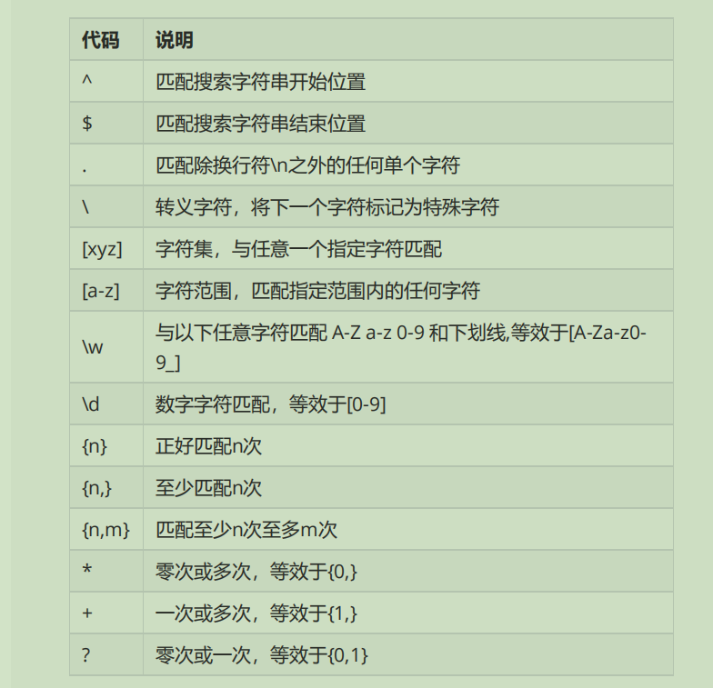

 正则表达式




> ###**1.单个字符（数量：1）**

- [ ] 字符：表示由一位字符所组成

- [ ] \\\：表示转义字符"\\"

- [ ] \\t：表示一个"\\t"

- [ ] \\n：匹配换行"\\n"

- [ ] 

  

> ###**2.字符集（数量：1）**

- [ ] [abc]：表示可能是a或者是字符b或者字符c中的任意一位

- [ ] [^abc]：表示不是a、b、c中的任意一位

- [ ] [a - z]：所有的小写字母

- [ ] [a - zA - Z]：表示任意的一位字母，不区分大小写

- [ ] [0 - 9]：表示任意的一位数字

  

> ###**3.简化的字符集表达式(数量：1)**

- [ ] . ：表示任意的一个字符

- [ ] \\d：等价于**"[0 - 9]"** ,属于简化写法

- [ ] \\D：等价于**不是[0 - 9]内**,属于简化写法

- [ ] \\s：表示任意的**空白字符**，例如："\\t"、"\\n"

- [ ] \\S：表示任意的**非空白字符**;

- [ ] \\w：等价于**"[a - zA -Z_0 - 9]"**,表示由任意的字母、数字、_所组成

- [ ] \\W：等价于**^"[a - zA-Z_0 - 9]"**，表示不是由任意字母、数字、_所组成

  

> ###**4.边界匹配(不要再java中使用，在JavaScript中使用)**

- [ ] **^**：正则的开始
- [ ] **$**：正则的结束


> ###**5.数量表达**

- [ ] **正则？**：表示此正则可以**出现0次或者1次**
- [ ] **正则+**：表示此正则可以**出现1次或者1次以上**
- [ ] **正则**：表示此正则可以**出现0次或者1次或者多次**
- [ ] **正则{n}**：表示此正则**正好出现n次**
- [ ] **正则{n,}**：表示此正则正好**出现n次以上（包含n次）**
- [ ] **正则{n,m}**：表示此正则**出现n~m次**
- [ ] **正则*：**表示此正则出现**0次或多次**


> ###**6.逻辑运算**

- [ ] **正则1正则2**：**正则1判断完成之后继续判断正则2**
- [ ] **正则1 | 正则2**：**正则1或者是正则2有一组满足即可**
- [ ] **(正则)**：**将多个正则作为一组，可以为这一组单独设置出现次数**


> ###**7.String类里面增加的新的操作方法**

```java
public boolean matches(String regex); 正则验证，使用指定字符串判断其是否符合正则的结构
public String replaceAll(String regex):全部替换
  
public String replaceFirst(Sting regex,);替换首个
public String[] split(String regex); 全部拆分
public String[] split(String regex,int limit);部分拆分
```


> ####8.验证一个字符串是否是数字，如果是则将其变为double型

```java
正则表达式为：'\\d+(\\.\\d+)?'
```


> ####9.判断给定的字符串是否是一个IP(IPV4)

```java
正则表达式为：'(\\d{1,3}\\.){3}\\d{1,3}'
```


> ####10.给定一个字符串，要去判断其是否是日期格式

```java
正则表达为：'\\d{4}-\\d{2}-\\d{2}'
```


> #### 11.判断电话号码
>
> 格式一：51283346
>
> 格式二：010-51283346
>
> 格式三：(010)-51283346

```java
正则表达式为："((\\d{3,4}) | (\\(\\d{3,4}\\)-))?\\d{7,8}"
```


> #### 12判断邮箱地址
>
> 要求由字母、数字、下划线组成，其中必须以字母开头和结尾用户名长度不超过30和结果
>
> 最后的根域名只能是com,cn,net,com.cn

```java
正则：[a-zA-Z][a-zA-Z0-9_\\.]{0,28}[a-zA-Z0-9]@\\w+\\.(net|cn|com)
```


> #### 使用java util.regex中的pattern类

####1.拆分字符串

```java
String regex= "\\d+";
Pattern pattern = Pattern.compile(regex);//编译正则
String result[] = pattern.split(str);//拆分字符
```

##### 2.验证字符串

```java
String regex = "\\d+"；
Pattern pattern = Pattern.complie(regex); //编译正则
Matcher mat = pattern.matcher(str);  //进行正则匹配
System.out.println(mat.matches()); //输出匹配结果，布尔值
```


1.windows系统命令行中存在的最简单的正则表达式

```
*   表示任意长度字符串
？  表示长度为1的任意字符
\s  表示空格
```

2.元字符概念以及元字符的反义


